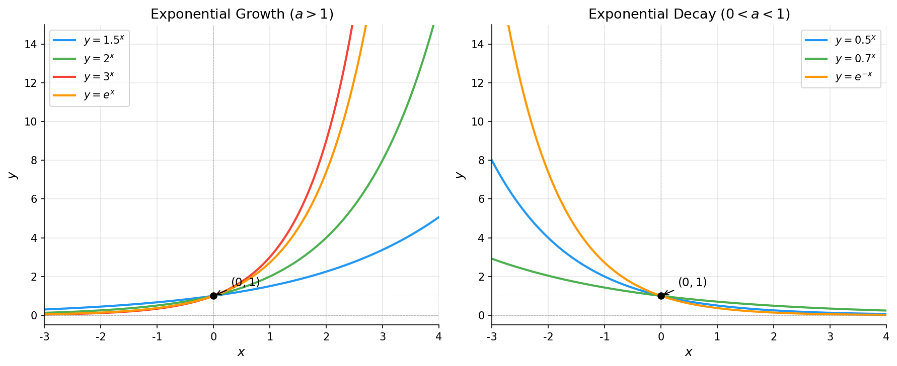
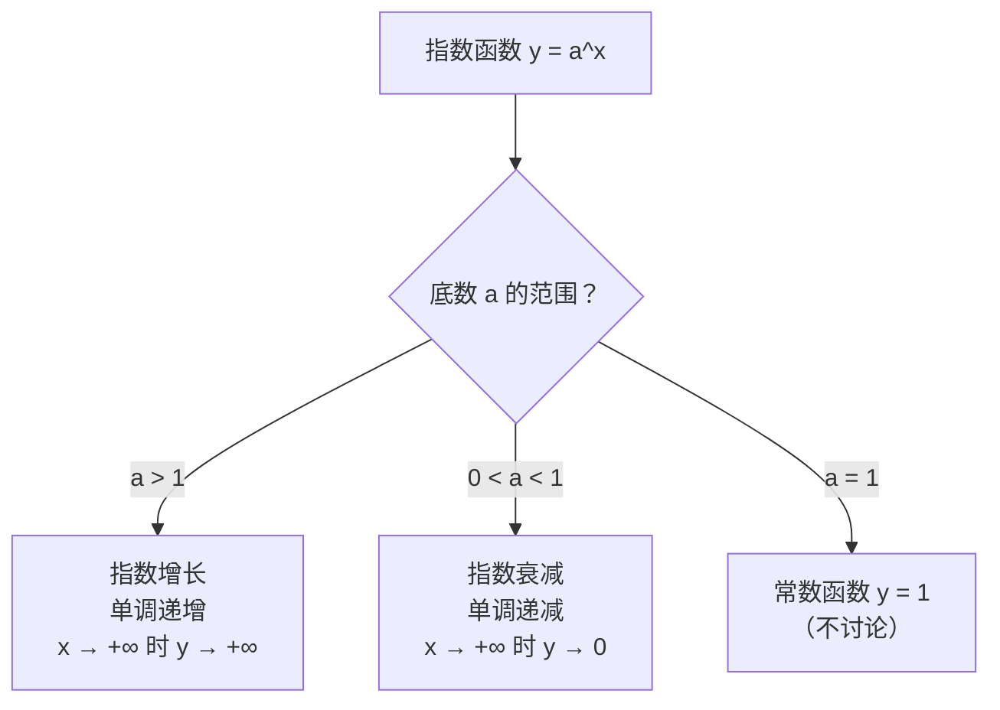

# 指数函数

> **所属路径**：`00_高中复习/01_数学基础/03_指数与对数/04_指数函数`
> **预计学习时间**：50 分钟
> **难度等级**：⭐⭐

---

## 前置知识

- [指数运算律](../01_指数运算律/01_指数运算律.md) — 指数的运算法则
- [指数对数互化](../03_指数对数互化/03_指数对数互化.md) — 指数形式与对数形式的互化
- [单调性与奇偶性](../../02_函数与图像/02_单调性与奇偶性/02_单调性与奇偶性.md) — 函数的单调性概念
- [图像平移与变换](../../02_函数与图像/04_图像平移与变换/04_图像平移与变换.md) — 图像的平移、伸缩与翻转

> 如果以上内容还不熟悉，建议先完成对应课程再继续。

---

## 学习目标

完成本节后，你将能够：

1. 写出指数函数 $y = a^x$ 的定义，说明底数 $a$ 的取值条件及其对图像的影响
2. 画出指数函数的图像，准确描述其定义域、值域、单调性和渐近线
3. 区分指数增长与指数衰减，并用图像直观解释
4. 说明自然指数函数 $y = e^x$ 在人工智能中的核心地位

---

## 正文讲解

### 1. 从指数运算到指数函数

在前面的课程中，我们已经熟悉了 $a^n$ 的含义——底数 $a$ 自乘 $n$ 次。当时 $n$ 是一个固定的数。但如果我们让指数**变成变量**，让它从负无穷到正无穷连续变化，会得到什么？

比如，让 $y = 2^x$ ，随着 $x$ 的变化， $y$ 也跟着变化。我们来列个表感受一下：

| $x$ | $-3$ | $-2$ | $-1$ | $0$ | $1$ | $2$ | $3$ | $10$ |
| --- | ---- | ---- | ---- | --- | --- | --- | --- | ---- |
| $y = 2^x$ | $\dfrac{1}{8}$ | $\dfrac{1}{4}$ | $\dfrac{1}{2}$ | $1$ | $2$ | $4$ | $8$ | $1024$ |

观察规律：当 $x$ 增大时， $y$ 增长越来越快；当 $x$ 减小时， $y$ 趋近于 0 但永远不会等于 0。这种"越来越快"的增长模式，就是我们常说的 **指数增长（Exponential Growth）**。

把这种对应关系抽象出来，就得到了 **指数函数（Exponential Function）** 的定义：

$$
y = a^x \quad (a > 0, \; a \neq 1)
$$

> **直觉解读**：指数函数就是"让指数成为自变量"的函数。底数 $a$ 是一个固定的正数（且不等于 1），自变量 $x$ 可以取任何实数值。

为什么要求 $a > 0$ ？因为如果 $a < 0$ ，在 $x = \dfrac{1}{2}$ 时就变成了对负数开平方根，无法定义。为什么要求 $a \neq 1$ ？因为 $1^x = 1$ 永远是常数，没有"变化"可言，不值得单独研究。

### 2. 指数函数的图像：一幅画胜千言

理解指数函数最好的方式，是看它的图像。下面这张图展示了几种不同底数的指数函数：



> 📌 **图解说明**：左侧三条曲线（ $a > 1$ ）呈现指数增长，底数越大增长越陡；右侧的曲线（ $0 < a < 1$ ）呈现指数衰减。所有曲线都过点 $(0, 1)$ ，且永远不触碰 $x$ 轴。你可以运行 `code/plot_exponential.py` 自行生成这张图。

从图像中，我们可以总结出指数函数的关键性质：

| 性质 | $a > 1$ （增长型） | $0 < a < 1$ （衰减型） |
| ---- | ------------------- | ---------------------- |
| 定义域 | $(-\infty, +\infty)$ | $(-\infty, +\infty)$ |
| 值域 | $(0, +\infty)$ | $(0, +\infty)$ |
| 单调性 | 单调递增 | 单调递减 |
| 过定点 | $(0, 1)$ | $(0, 1)$ |
| 渐近线 | $y = 0$ （当 $x \to -\infty$ ） | $y = 0$ （当 $x \to +\infty$ ） |

> **值域恒为正**是指数函数最重要的特征之一。无论 $x$ 取什么值， $a^x$ 永远大于 0。这个性质在人工智能中极其有用——softmax 函数之所以用 $e^x$ ，就是因为它能保证输出全为正数，方便解释为概率。

### 3. 底数 $a$ 的影响：增长还是衰减

指数函数的"性格"完全由底数 $a$ 决定：

- **当 $a > 1$ 时**：函数单调递增。 $x$ 每增加 1， $y$ 就乘以 $a$ 。底数越大，增长越猛烈。比如 $2^{10} = 1024$ ，但 $10^{10} = 10\,000\,000\,000$ ——底数从 2 变到 10，结果天差地别。

- **当 $0 < a < 1$ 时**：函数单调递减。这其实就是 $a > 1$ 时的"镜像"——因为 $\left(\dfrac{1}{a}\right)^x = a^{-x}$ ，相当于把图像关于 $y$ 轴翻转。在人工智能中，**指数衰减（Exponential Decay）** 随处可见：学习率衰减 $\alpha_t = \alpha_0 \cdot 0.95^t$ 、遗忘因子、信号衰减等。



> 📌 **图解说明**：底数 $a$ 决定了指数函数是"增长型"还是"衰减型"。 $a = 1$ 退化为常数，没有研究价值。

### 4. 自然指数函数 $y = e^x$ ：为什么 $e$ 这么特殊

在所有指数函数中，有一个底数格外特殊——**自然常数（Euler's Number）** $e \approx 2.71828\ldots$ 。以 $e$ 为底的指数函数 $y = e^x$ 有一个独一无二的性质：

$$
\frac{d}{dx} e^x = e^x
$$

> **直觉解读**：这个公式的含义是—— $e^x$ 的**变化速率**等于它自身。换句话说， $e^x$ 是唯一一个"增长速度和自己一样快"的函数。这在自然界中对应着一种完美的增长模式：增长速度与当前规模成正比。

这个性质使得 $e^x$ 在微积分和人工智能中处于核心地位：

- **反向传播**：神经网络训练需要对激活函数求导， $e^x$ 的导数最简单
- **Softmax 函数**：将模型输出转化为概率分布，核心就是 $e^{x_i}$
- **概率分布**：正态分布、指数分布等重要分布的公式中都包含 $e$
- **学习率衰减**：常用 $\alpha_0 \cdot e^{-\lambda t}$ 控制学习率的平滑衰减

在后续学习 **[导数初步](../../12_导数初步/)** 时，你会更深入地理解为什么 $e$ 是"最自然"的底数。

### 5. 指数函数的图像变换

利用在 **[图像平移与变换](../../02_函数与图像/04_图像平移与变换/04_图像平移与变换.md)** 中学到的知识，我们可以从基本的 $y = a^x$ 出发，快速推导出各种变形的图像：

| 变换 | 函数 | 效果 |
| ---- | ---- | ---- |
| 上移 $k$ 个单位 | $y = a^x + k$ | 图像整体上移，渐近线变为 $y = k$ |
| 左移 $h$ 个单位 | $y = a^{x+h}$ | 图像整体左移 |
| 关于 $y$ 轴对称 | $y = a^{-x}$ | 增长变衰减，衰减变增长 |
| 纵向伸缩 | $y = c \cdot a^x$ | 过定点变为 $(0, c)$ |

特别值得注意的是 $y = e^{-x}$ ——它是 $e^x$ 关于 $y$ 轴的镜像，是一条经典的衰减曲线，在 **[概率分布](../../../01_基础能力/02_数学基础/03_概率论与统计/01_概率分布/)** 中描述指数分布时会再次遇到。

---

## 动手实践

让我们用 Python 和 matplotlib 画出指数函数的图像，直观感受不同底数的差异。

```python
# 文件：code/plot_exponential.py
# 绘制不同底数的指数函数图像
# 环境要求：Python 3.10+, matplotlib, numpy

import os
import numpy as np
import matplotlib.pyplot as plt

# 字体设置
plt.rcParams['font.sans-serif'] = ['DejaVu Sans']
plt.rcParams['axes.unicode_minus'] = False

# 生成 x 值
x = np.linspace(-3, 4, 300)

# 创建图形
fig, axes = plt.subplots(1, 2, figsize=(12, 5))

# 左图：a > 1（指数增长）
ax1 = axes[0]
for a, color, label in [(1.5, '#2196f3', '$y = 1.5^x$'),
                          (2, '#4caf50', '$y = 2^x$'),
                          (3, '#f44336', '$y = 3^x$'),
                          (np.e, '#ff9800', '$y = e^x$')]:
    ax1.plot(x, a**x, color=color, linewidth=2, label=label)

ax1.axhline(y=0, color='gray', linewidth=0.5, linestyle='--', alpha=0.5)
ax1.axhline(y=1, color='gray', linewidth=0.5, linestyle=':', alpha=0.3)
ax1.axvline(x=0, color='gray', linewidth=0.5, linestyle='--', alpha=0.5)
ax1.plot(0, 1, 'ko', markersize=6, zorder=5)
ax1.annotate('$(0, 1)$', xy=(0, 1), xytext=(0.3, 1.5),
            fontsize=11, arrowprops=dict(arrowstyle='->', color='black'))
ax1.set_xlim(-3, 4)
ax1.set_ylim(-0.5, 15)
ax1.set_xlabel('$x$', fontsize=12)
ax1.set_ylabel('$y$', fontsize=12)
ax1.set_title('Exponential Growth ($a > 1$)', fontsize=13)
ax1.legend(fontsize=10, loc='upper left')
ax1.grid(alpha=0.3)
ax1.spines['top'].set_visible(False)
ax1.spines['right'].set_visible(False)

# 右图：0 < a < 1（指数衰减）
ax2 = axes[1]
for a, color, label in [(0.5, '#2196f3', '$y = 0.5^x$'),
                          (0.7, '#4caf50', '$y = 0.7^x$'),
                          (1/np.e, '#ff9800', '$y = e^{-x}$')]:
    ax2.plot(x, a**x, color=color, linewidth=2, label=label)

ax2.axhline(y=0, color='gray', linewidth=0.5, linestyle='--', alpha=0.5)
ax2.axhline(y=1, color='gray', linewidth=0.5, linestyle=':', alpha=0.3)
ax2.axvline(x=0, color='gray', linewidth=0.5, linestyle='--', alpha=0.5)
ax2.plot(0, 1, 'ko', markersize=6, zorder=5)
ax2.annotate('$(0, 1)$', xy=(0, 1), xytext=(0.3, 1.5),
            fontsize=11, arrowprops=dict(arrowstyle='->', color='black'))
ax2.set_xlim(-3, 4)
ax2.set_ylim(-0.5, 15)
ax2.set_xlabel('$x$', fontsize=12)
ax2.set_ylabel('$y$', fontsize=12)
ax2.set_title('Exponential Decay ($0 < a < 1$)', fontsize=13)
ax2.legend(fontsize=10, loc='upper right')
ax2.grid(alpha=0.3)
ax2.spines['top'].set_visible(False)
ax2.spines['right'].set_visible(False)

plt.tight_layout()

# 保存图片
script_dir = os.path.dirname(os.path.abspath(__file__))
output_path = os.path.join(script_dir, '..', 'assets', 'exponential_functions.png')
os.makedirs(os.path.dirname(output_path), exist_ok=True)
plt.savefig(output_path, dpi=150, bbox_inches='tight', facecolor='white')
plt.close()
print(f"图片已保存到 {output_path}")
```

**运行说明**：
- 环境要求：Python 3.10+，matplotlib，numpy
- 运行命令：`python code/plot_exponential.py`

运行后，在 `assets/` 目录下会生成 `exponential_functions.png` ，与正文中引用的图像对应。

---

## 典型误区

| 误区 | 正确理解 |
| ---- | -------- |
| 认为指数函数可以取负值 | 指数函数 $y = a^x$ 的值域是 $(0, +\infty)$ ，永远为正。 $y = 0$ 是渐近线，不可达 |
| 混淆 $2^x$ 与 $x^2$ | $2^x$ 是指数函数（底数固定，指数变化）， $x^2$ 是幂函数（指数固定，底数变化）。两者增长速度差别巨大 |
| 认为 $e$ 只是一个"约等于 2.718 的数" | $e$ 之所以特殊，是因为 $e^x$ 的导数等于它自身，这使它成为微积分和概率论中最核心的常数 |
| 认为指数增长会一直持续 | 现实中的指数增长通常受资源限制，最终会趋于平缓（逻辑增长模型）。纯指数增长是数学理想化的结果 |

---

## 练习题

### 练习 1：基础性质（难度：⭐）

判断以下函数的单调性，并指出图像过哪个定点：

1. $y = 5^x$
2. $y = \left(\dfrac{1}{3}\right)^x$
3. $y = e^{-x}$

<details>
<summary>💡 提示</summary>

底数 $a > 1$ 时单调递增， $0 < a < 1$ 时单调递减。所有 $y = a^x$ 形式的函数都过点 $(0, 1)$ 。 $e^{-x} = (e^{-1})^x = \left(\dfrac{1}{e}\right)^x$ 。

</details>

<details>
<summary>✅ 参考答案</summary>

1. $a = 5 > 1$ ，单调递增，过定点 $(0, 1)$
2. $a = \dfrac{1}{3} < 1$ ，单调递减，过定点 $(0, 1)$
3. $y = e^{-x} = \left(\dfrac{1}{e}\right)^x$ ，底数 $\dfrac{1}{e} \approx 0.368 < 1$ ，单调递减，过定点 $(0, 1)$

</details>

### 练习 2：比较大小（难度：⭐⭐）

不使用计算器，比较以下各组数的大小：

1. $2^{0.3}$ 与 $2^{0.5}$
2. $0.7^{1.5}$ 与 $0.7^{0.8}$
3. $3^{0.2}$ 与 $0.3^2$

<details>
<summary>💡 提示</summary>

利用指数函数的单调性：底数 $a > 1$ 时指数越大函数值越大；底数 $0 < a < 1$ 时指数越大函数值越小。第 3 题可以分别估算：任何 $a > 1$ 的正指数幂 $> 1$ ；而 $0.3^2 < 1$ 。

</details>

<details>
<summary>✅ 参考答案</summary>

1. $y = 2^x$ 底数 $2 > 1$ ，单调递增。 ∵ $0.3 < 0.5$ ∴ $2^{0.3} < 2^{0.5}$

2. $y = 0.7^x$ 底数 $0.7 < 1$ ，单调递减。 ∵ $1.5 > 0.8$ ∴ $0.7^{1.5} < 0.7^{0.8}$

3. $3^{0.2} = \sqrt[5]{3} > 1$ （因为 $3 > 1$ ）；而 $0.3^2 = 0.09 < 1$ 。 ∴ $3^{0.2} > 0.3^2$

</details>

### 练习 3：图像变换（难度：⭐⭐）

已知 $y = 2^x$ 的图像，画出 $y = 2^{x-1} + 3$ 的图像，并写出：

1. 图像经过了哪些变换？
2. 渐近线方程是什么？
3. 图像过哪个特殊点？

<details>
<summary>💡 提示</summary>

$y = 2^{x-1} + 3$ 可以看作先右移 1 个单位，再上移 3 个单位。渐近线也跟着上移。把 $x = 1$ 代入看看经过哪个点。

</details>

<details>
<summary>✅ 参考答案</summary>

1. $y = 2^x$ → 右移 1 个单位 → $y = 2^{x-1}$ → 上移 3 个单位 → $y = 2^{x-1} + 3$

2. 原来的渐近线 $y = 0$ 上移 3 个单位，变为 $y = 3$

3. 原来过 $(0, 1)$ ，右移 1 变为 $(1, 1)$ ，再上移 3 变为 $(1, 4)$ 。验证： $2^{1-1} + 3 = 1 + 3 = 4$ ✓

</details>

---

## 下一步学习

- 📖 下一个知识点：[对数函数](../05_对数函数/) — 指数函数的反函数，图像关于 $y = x$ 对称
- 🔗 相关知识点：[导数初步](../../12_导数初步/) — 深入理解 $e^x$ 的导数性质
- 📚 拓展阅读：[反函数与复合函数](../../02_函数与图像/05_反函数与复合函数/) — 理解指数函数与对数函数的反函数关系

---

## 参考资料

> 只引用确定开源或公开可访问的资源，注明其开放获取性质。

1. [维基百科：指数函数](https://zh.wikipedia.org/wiki/指数函数) — 指数函数的定义、性质和应用（公共知识库，CC BY-SA 许可）
2. [Khan Academy: Exponential functions](https://www.khanacademy.org/math/algebra2/x2ec2f6f830c9fb89:exp/x2ec2f6f830c9fb89:exp-growth/v/exponential-growth-functions) — 可汗学院的指数函数课程（免费公开课程）
3. [3Blue1Brown: What is e?](https://www.youtube.com/watch?v=m2MIpDrF7Es) — 可视化解释自然常数 $e$ 的直觉含义（YouTube 公开视频）
