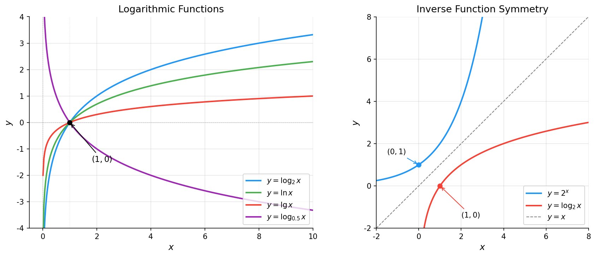

# 对数函数

> **所属路径**：`00_高中复习/01_数学基础/03_指数与对数/05_对数函数`
> **预计学习时间**：50 分钟
> **难度等级**：⭐⭐

---

## 前置知识

- [对数运算律](../02_对数运算律/02_对数运算律.md) — 对数的定义与运算法则
- [指数函数](../04_指数函数/04_指数函数.md) — 指数函数的图像与性质
- [反函数与复合函数](../../02_函数与图像/05_反函数与复合函数/05_反函数与复合函数.md) — 反函数的概念

> 如果以上内容还不熟悉，建议先完成对应课程再继续。

---

## 学习目标

完成本节后，你将能够：

1. 写出对数函数 $y = \log_a x$ 的定义，理解底数 $a$ 对图像的影响
2. 画出对数函数的图像，准确描述其定义域、值域、单调性和渐近线
3. 解释对数函数与指数函数互为反函数的关系，并在图像上验证
4. 说明对数函数在信息论和机器学习中的应用场景

---

## 正文讲解

### 1. 从指数函数的"反问题"出发

在 **[指数函数](../04_指数函数/04_指数函数.md)** 中，我们研究的是"给定底数和指数，求结果"：

$$
y = a^x \quad \Longrightarrow \quad \text{已知 } a \text{ 和 } x \text{，求 } y
$$

现在我们把问题反过来："给定底数和结果，求指数"：

$$
a^y = x \quad \Longrightarrow \quad \text{已知 } a \text{ 和 } x \text{，求 } y
$$

根据 **[指数对数互化](../03_指数对数互化/03_指数对数互化.md)** 中学到的知识，这个反问题的答案就是 $y = \log_a x$ 。当我们让 $x$ 在正实数范围内连续变化时，就得到了 **对数函数（Logarithmic Function）**：

$$
y = \log_a x \quad (a > 0, \; a \neq 1, \; x > 0)
$$

> **直觉解读**：对数函数回答的问题是——"底数 $a$ 要乘多少次才能得到 $x$ ？"当 $x$ 越大，需要乘的次数越多，所以函数值越大；当 $x$ 接近 0 时，需要的次数趋向负无穷。

在人工智能领域，对数函数无处不在：

- **交叉熵损失**：分类模型的损失函数 $L = -\log p$ ，当预测概率 $p$ 越小，损失越大
- **信息熵**： $H = -\sum p_i \log p_i$ ，用对数度量不确定性
- **对数似然**：最大化 $\log P(D|\theta)$ 比直接最大化 $P(D|\theta)$ 更方便计算

### 2. 对数函数的图像

理解对数函数的最佳方式是看图。下面同时展示了指数函数和对数函数的图像，以及它们之间的对称关系：



> 📌 **图解说明**：左图展示了不同底数的对数函数。所有曲线都过点 $(1, 0)$ ，且只在 $x > 0$ 区域有定义。右图展示了 $y = 2^x$ 和 $y = \log_2 x$ 关于直线 $y = x$ 的对称关系——这正是反函数的几何特征。你可以运行 `code/plot_logarithmic.py` 自行生成这张图。

### 3. 对数函数的关键性质

从图像中，我们可以总结出对数函数的关键性质：

| 性质 | $a > 1$ | $0 < a < 1$ |
| ---- | ------- | ------------ |
| 定义域 | $(0, +\infty)$ | $(0, +\infty)$ |
| 值域 | $(-\infty, +\infty)$ | $(-\infty, +\infty)$ |
| 单调性 | 单调递增 | 单调递减 |
| 过定点 | $(1, 0)$ | $(1, 0)$ |
| 渐近线 | $x = 0$ （当 $x \to 0^+$ 时 $y \to -\infty$ ） | $x = 0$ （当 $x \to 0^+$ 时 $y \to +\infty$ ） |

把这些性质和指数函数对比，你会发现一个优美的"对偶"关系：

| | 指数函数 $y = a^x$ | 对数函数 $y = \log_a x$ |
| --- | ------------------- | ---------------------- |
| 定义域 | $(-\infty, +\infty)$ | $(0, +\infty)$ |
| 值域 | $(0, +\infty)$ | $(-\infty, +\infty)$ |
| 过定点 | $(0, 1)$ | $(1, 0)$ |
| 渐近线 | $y = 0$ | $x = 0$ |

> 定义域和值域恰好"互换"了！这正是反函数的本质特征——输入变输出，输出变输入。

### 4. 对数函数与指数函数互为反函数

在 **[反函数与复合函数](../../02_函数与图像/05_反函数与复合函数/05_反函数与复合函数.md)** 中，我们学过：如果 $f$ 和 $g$ 互为反函数，那么：

$$
f(g(x)) = x \quad \text{且} \quad g(f(x)) = x
$$

对于指数函数 $f(x) = a^x$ 和对数函数 $g(x) = \log_a x$ ，确实有：

$$
a^{\log_a x} = x \quad \text{且} \quad \log_a(a^x) = x
$$

在图像上，反函数的关系体现为**关于直线 $y = x$ 对称**。这意味着：

- 指数函数图像上的任意一点 $(p, q)$ ，在对数函数图像上对应点 $(q, p)$
- 指数函数过点 $(0, 1)$ ，对数函数过点 $(1, 0)$
- 指数函数的水平渐近线 $y = 0$ ，对应对数函数的垂直渐近线 $x = 0$

### 5. 三种常用对数函数

虽然底数 $a$ 可以是任何符合条件的正数，但在实际应用中，最常用的只有三种：

#### 常用对数 $y = \lg x$ （底数为 10）

在日常生活中最直观——因为我们用十进制。地震的里氏震级、声音的分贝、溶液的 pH 值，都使用以 10 为底的对数。

#### 自然对数 $y = \ln x$ （底数为 $e$ ）

在数学和人工智能中最核心。原因和 $e^x$ 一样—— $\ln x$ 的导数是 $\dfrac{1}{x}$ ，形式最简洁。

$$
\frac{d}{dx} \ln x = \frac{1}{x}
$$

交叉熵损失、KL 散度、信息熵——这些 AI 核心公式中的 $\log$ ，指的几乎都是 $\ln$ 。

#### 以 2 为底的对数 $y = \log_2 x$

在计算机科学和信息论中最常见。因为计算机用二进制，一个比特的信息量就定义为 $\log_2$ 。

### 6. 对数增长的直觉：增长越来越慢

对数函数有一个非常重要的特征——**增长越来越慢**。当 $x$ 从 1 增长到 10 时， $\log_{10} x$ 从 0 增长到 1；但当 $x$ 从 10 增长到 100 时， $\log_{10} x$ 只从 1 增长到 2。输入翻了 10 倍，输出只增加了 1。

这种"先快后慢"的增长模式有一个深远的影响：**对数可以"压缩"差异巨大的数值**。

- 音量从耳语（ $10^{-10}$ W/m²）到摇滚演唱会（ $1$ W/m²），差了 100 亿倍。但用分贝表示只是从 20 dB 到 120 dB，差 100 dB。
- 模型预测概率从 $0.9$ 下降到 $0.01$ ，交叉熵损失 $-\log p$ 从 $0.105$ 上升到 $4.605$ ——对数自动把"接近零的小概率"惩罚得更重。

这就是为什么 AI 中的损失函数偏爱对数——它天然地对"严重错误"更敏感。

---

## 动手实践

让我们用 Python 画出对数函数的图像，并演示对数函数在交叉熵损失中的应用。

```python
# 文件：code/plot_logarithmic.py
# 绘制对数函数图像及其与指数函数的反函数关系
# 环境要求：Python 3.10+, matplotlib, numpy

import os
import numpy as np
import matplotlib.pyplot as plt

plt.rcParams['font.sans-serif'] = ['DejaVu Sans']
plt.rcParams['axes.unicode_minus'] = False

fig, axes = plt.subplots(1, 2, figsize=(12, 5))

# 左图：不同底数的对数函数
ax1 = axes[0]
x = np.linspace(0.01, 10, 300)

for a, color, label in [(2, '#2196f3', '$y = \\log_2 x$'),
                          (np.e, '#4caf50', '$y = \\ln x$'),
                          (10, '#f44336', '$y = \\lg x$'),
                          (0.5, '#9c27b0', '$y = \\log_{0.5} x$')]:
    y = np.log(x) / np.log(a)
    ax1.plot(x, y, color=color, linewidth=2, label=label)

ax1.axhline(y=0, color='gray', linewidth=0.5, linestyle='--', alpha=0.5)
ax1.axvline(x=0, color='gray', linewidth=0.5, linestyle='--', alpha=0.5)
ax1.axvline(x=1, color='gray', linewidth=0.5, linestyle=':', alpha=0.3)
ax1.plot(1, 0, 'ko', markersize=6, zorder=5)
ax1.annotate('$(1, 0)$', xy=(1, 0), xytext=(1.8, -1.5),
            fontsize=11, arrowprops=dict(arrowstyle='->', color='black'))
ax1.set_xlim(-0.5, 10)
ax1.set_ylim(-4, 4)
ax1.set_xlabel('$x$', fontsize=12)
ax1.set_ylabel('$y$', fontsize=12)
ax1.set_title('Logarithmic Functions', fontsize=13)
ax1.legend(fontsize=10, loc='lower right')
ax1.grid(alpha=0.3)
ax1.spines['top'].set_visible(False)
ax1.spines['right'].set_visible(False)

# 右图：指数函数与对数函数的反函数关系
ax2 = axes[1]
x1 = np.linspace(-2, 3.5, 300)
x2 = np.linspace(0.01, 10, 300)
x_sym = np.linspace(-2, 10, 300)

ax2.plot(x1, 2**x1, color='#2196f3', linewidth=2, label='$y = 2^x$')
ax2.plot(x2, np.log2(x2), color='#f44336', linewidth=2, label='$y = \\log_2 x$')
ax2.plot(x_sym, x_sym, color='gray', linewidth=1, linestyle='--', label='$y = x$')

# 标注对称点
ax2.plot(0, 1, 'o', color='#2196f3', markersize=6, zorder=5)
ax2.plot(1, 0, 'o', color='#f44336', markersize=6, zorder=5)
ax2.annotate('$(0, 1)$', xy=(0, 1), xytext=(-1.5, 1.5), fontsize=10,
            arrowprops=dict(arrowstyle='->', color='#2196f3'))
ax2.annotate('$(1, 0)$', xy=(1, 0), xytext=(2, -1.5), fontsize=10,
            arrowprops=dict(arrowstyle='->', color='#f44336'))

ax2.set_xlim(-2, 8)
ax2.set_ylim(-2, 8)
ax2.set_xlabel('$x$', fontsize=12)
ax2.set_ylabel('$y$', fontsize=12)
ax2.set_title('Inverse Function Symmetry', fontsize=13)
ax2.legend(fontsize=10, loc='lower right')
ax2.set_aspect('equal')
ax2.grid(alpha=0.3)
ax2.spines['top'].set_visible(False)
ax2.spines['right'].set_visible(False)

plt.tight_layout()

script_dir = os.path.dirname(os.path.abspath(__file__))
output_path = os.path.join(script_dir, '..', 'assets', 'logarithmic_functions.png')
os.makedirs(os.path.dirname(output_path), exist_ok=True)
plt.savefig(output_path, dpi=150, bbox_inches='tight', facecolor='white')
plt.close()
print(f"图片已保存到 {output_path}")
```

**运行说明**：
- 环境要求：Python 3.10+，matplotlib，numpy
- 运行命令：`python code/plot_logarithmic.py`

下面再用一段代码来演示对数在交叉熵损失中的直觉：

```python
# 文件：code/cross_entropy_demo.py
# 交叉熵损失的对数直觉
# 环境要求：Python 3.10+（仅使用标准库 math）

import math

print("=" * 50)
print("交叉熵损失 L = -log(p) 随预测概率 p 的变化")
print("=" * 50)
print(f"{'预测概率 p':>12} | {'损失 -ln(p)':>12} | {'判断':>10}")
print("-" * 42)

for p in [0.99, 0.9, 0.7, 0.5, 0.3, 0.1, 0.01, 0.001]:
    loss = -math.log(p)
    if loss < 0.5:
        judge = "低损失 ✓"
    elif loss < 2:
        judge = "中等损失"
    else:
        judge = "高损失 ✗"
    print(f"{p:>12.3f} | {loss:>12.4f} | {judge:>10}")

print("\n观察：当预测概率接近 1 时损失很小，接近 0 时损失急剧增大。")
print("这就是对数函数的'压缩'特性在损失函数中的体现。")
```

**预期输出**：
```
==================================================
交叉熵损失 L = -log(p) 随预测概率 p 的变化
==================================================
    预测概率 p |    损失 -ln(p) |       判断
------------------------------------------
       0.990 |       0.0101 |     低损失 ✓
       0.900 |       0.1054 |     低损失 ✓
       0.700 |       0.3567 |     低损失 ✓
       0.500 |       0.6931 |     中等损失
       0.300 |       1.2040 |     中等损失
       0.100 |       2.3026 |     高损失 ✗
       0.010 |       4.6052 |     高损失 ✗
       0.001 |       6.9078 |     高损失 ✗

观察：当预测概率接近 1 时损失很小，接近 0 时损失急剧增大。
这就是对数函数的'压缩'特性在损失函数中的体现。
```

---

## 典型误区

| 误区 | 正确理解 |
| ---- | -------- |
| 认为对数函数可以对负数或零取值 | $\log_a x$ 要求 $x > 0$ ，这是定义域的硬性限制。对数的真数必须为正 |
| 混淆 $\log_a x$ 的底数条件 | 底数 $a$ 必须满足 $a > 0$ 且 $a \neq 1$ ，缺一不可 |
| 认为 $\log x$ 在不同领域含义相同 | 数学中 $\log$ 通常指 $\ln$ （自然对数），工程中可能指 $\lg$ （常用对数），信息论中可能指 $\log_2$ 。看到 $\log$ 要注意上下文 |
| 认为对数函数有最大值 | 对数函数的值域是 $(-\infty, +\infty)$ ，虽然增长越来越慢，但没有上限 |

---

## 练习题

### 练习 1：基础性质（难度：⭐）

写出以下对数函数的定义域、值域和单调性：

1. $y = \log_3 x$
2. $y = \log_{0.5} x$
3. $y = \ln(x - 1)$

<details>
<summary>💡 提示</summary>

前两题是标准的对数函数，直接套用性质表。第 3 题需要先确定真数 $x - 1 > 0$ ，再分析 $\ln$ 的单调性。

</details>

<details>
<summary>✅ 参考答案</summary>

1. 定义域 $(0, +\infty)$ ，值域 $(-\infty, +\infty)$ ，底数 $3 > 1$ ，单调递增

2. 定义域 $(0, +\infty)$ ，值域 $(-\infty, +\infty)$ ，底数 $0.5 < 1$ ，单调递减

3. 真数 $x - 1 > 0$ ，所以定义域 $(1, +\infty)$ ；值域 $(-\infty, +\infty)$ ；底数 $e > 1$ ，单调递增

</details>

### 练习 2：反函数关系（难度：⭐⭐）

已知 $f(x) = 3^x$ ：

1. 求 $f$ 的反函数 $f^{-1}(x)$
2. 验证 $f(f^{-1}(9)) = 9$
3. 指出 $f$ 和 $f^{-1}$ 的图像关于哪条直线对称

<details>
<summary>💡 提示</summary>

将 $y = 3^x$ 互化为 $x = \log_3 y$ ，然后交换 $x, y$ 得到反函数表达式。

</details>

<details>
<summary>✅ 参考答案</summary>

1. $y = 3^x$ → $x = \log_3 y$ → 交换 $x, y$ ：反函数为 $f^{-1}(x) = \log_3 x$

2. $f^{-1}(9) = \log_3 9 = 2$ ， $f(2) = 3^2 = 9$ ✓

3. 关于直线 $y = x$ 对称

</details>

### 练习 3：比较大小（难度：⭐⭐）

不使用计算器，比较以下各组数的大小：

1. $\log_2 5$ 与 $\log_2 3$
2. $\log_3 2$ 与 $\log_5 2$
3. $\ln 0.5$ 与 $0$

<details>
<summary>💡 提示</summary>

利用对数函数的单调性。第 2 题可以考虑：底数越大的对数函数增长越慢，同一个真数取对数时结果越小。

</details>

<details>
<summary>✅ 参考答案</summary>

1. $y = \log_2 x$ 底数 $2 > 1$ ，单调递增。 ∵ $5 > 3$ ∴ $\log_2 5 > \log_2 3$

2. $\log_3 2 = \dfrac{\ln 2}{\ln 3} \approx \dfrac{0.693}{1.099} \approx 0.631$ ；
   $\log_5 2 = \dfrac{\ln 2}{\ln 5} \approx \dfrac{0.693}{1.609} \approx 0.431$ 。
   ∴ $\log_3 2 > \log_5 2$

3. $\ln 1 = 0$ 且 $\ln x$ 单调递增。 ∵ $0.5 < 1$ ∴ $\ln 0.5 < \ln 1 = 0$

</details>

### 练习 4：交叉熵直觉（难度：⭐⭐⭐）

在一个二分类任务中，模型对正样本的预测概率分别为 $p_1 = 0.95$ 和 $p_2 = 0.6$ 。

1. 分别计算两个样本的交叉熵损失 $L = -\ln p$
2. 哪个样本的损失更大？大多少倍？
3. 解释为什么使用对数损失比使用线性损失 $L = 1 - p$ 更合理

<details>
<summary>💡 提示</summary>

直接代入计算。思考第 3 题时，考虑当 $p$ 非常接近 0 时两种损失的差异。

</details>

<details>
<summary>✅ 参考答案</summary>

1. $L_1 = -\ln 0.95 \approx 0.051$ ， $L_2 = -\ln 0.6 \approx 0.511$

2. $L_2$ 更大， $L_2 / L_1 \approx 10$ 倍。预测概率从 0.95 下降到 0.6，损失增大了约 10 倍

3. 如果使用线性损失 $L = 1 - p$ ，则 $L_1 = 0.05$ ， $L_2 = 0.4$ ，比值只有 8 倍。而对数损失在 $p$ 接近 0 时趋向正无穷，能更强烈地惩罚"极度自信但完全错误"的预测（如 $p = 0.01$ 时 $-\ln p \approx 4.6$ ，远大于 $1 - p = 0.99$ ）。这种"对严重错误更敏感"的特性使得对数损失更适合训练分类模型

</details>

---

## 下一步学习

- 📖 下一个知识主题：[数列](../../04_数列/) — 从数列的角度重新审视指数增长与等比数列
- 🔗 相关知识点：[导数初步](../../12_导数初步/) — 深入理解 $\ln x$ 的导数 $\dfrac{1}{x}$ 及其意义
- 📚 拓展阅读：[信息论基础](../../../01_基础能力/02_数学基础/05_信息论/) — 对数函数在信息论中的核心作用

---

## 参考资料


1. [维基百科：对数](https://zh.wikipedia.org/wiki/对数) — 对数函数的定义、性质和历史（公共知识库，CC BY-SA 许可）
2. [Khan Academy: Logarithmic functions](https://www.khanacademy.org/math/algebra2/x2ec2f6f830c9fb89:logs/x2ec2f6f830c9fb89:log-func/v/graphing-logarithmic-functions) — 可汗学院的对数函数课程（免费公开课程）
3. [3Blue1Brown: e and natural logarithm](https://www.youtube.com/watch?v=m2MIpDrF7Es) — 可视化解释 $e$ 和自然对数的直觉含义（YouTube 公开视频）
