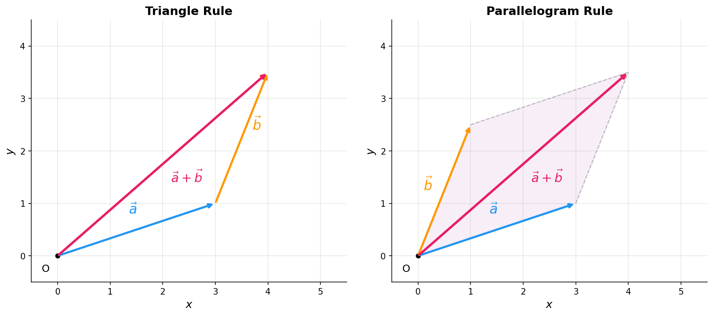

# 向量表示与运算

> **所属路径**：`00_高中复习/01_数学基础/06_向量/01_向量表示与运算`
> **预计学习时间**：30 分钟
> **难度等级**：⭐

---

## 前置知识

- [代数与方程](../../../01_数学基础/01_代数与方程/)——需要熟悉基本的代数运算
- [函数与图像](../../../01_数学基础/02_函数与图像/)——理解坐标平面的基本概念

> 如果以上内容还不熟悉，建议先完成对应课程再继续。

---

## 学习目标

完成本节后，你将能够：

1. 区分向量与标量，正确使用向量的几何表示和符号记法
2. 运用三角形法则和平行四边形法则进行向量加法
3. 理解向量减法的几何意义，并能画图表示
4. 计算向量的数乘运算，判断向量的共线关系
5. 识别零向量和单位向量的特殊性质

---

## 正文讲解

### 1. 从"位移"说起——什么是向量

在日常生活中，我们经常遇到这样的情况：你告诉朋友"我在你北边 500 米的地方"，这句话同时包含了两个信息——**距离**（500 米）和**方向**（北方）。仅仅说"我在 500 米外"是不够的，因为你可能在任何方向上。

数学中，只有大小的量叫做 **标量（Scalar）** ，比如温度、质量、时间。而既有大小又有方向的量，我们称之为 **向量（Vector）** ，也叫矢量。位移、速度、力都是典型的向量。

> 💡 在人工智能领域，数据被编码为高维向量。一张图片可以是一个几万维的向量，一个词可以用几百维的向量表示。虽然我们无法在纸上画出这么多维度，但向量加法、数乘这些基本运算的规则完全相同。

**向量的表示方法**有两种常见形式：

- **几何表示**：用一条有方向的线段（箭头）表示，箭头的起点叫始点，终点叫终点。从点 $A$ 到点 $B$ 的向量记作 $\overrightarrow{AB}$ 。
- **字母表示**：用一个加粗的小写字母或带箭头的字母表示，如 $\vec{a}$ 或 $\boldsymbol{a}$ 。

向量的**大小**称为向量的 **模（Magnitude）** ，记作 $|\vec{a}|$ 或 $|\overrightarrow{AB}|$ 。模是一个非负实数。

### 2. 两个特殊的向量

在深入运算之前，我们需要认识两个特殊的向量：

**零向量（Zero Vector）** ：模为 0 的向量，记作 $\vec{0}$ 。零向量的方向是不确定的——你可以把它想象成"原地不动的位移"，站在原地，任何方向都行。零向量在向量运算中的地位类似于数字 0 在加法中的地位：任何向量加上零向量都等于它自身，即 $\vec{a} + \vec{0} = \vec{a}$ 。

**单位向量（Unit Vector）** ：模等于 1 的向量。单位向量只表示方向，不表示大小。对于任意非零向量 $\vec{a}$ ，都可以找到与它同向的单位向量：

$$
\hat{a} = \frac{\vec{a}}{|\vec{a}|}
$$

> **直觉解读**：把向量除以它的长度，就像把一根绳子"拉到"标准长度 1，方向不变。

### 3. 向量的加法——两种法则

假设你先向东走了 3 步（向量 $\vec{a}$ ），再向北走了 4 步（向量 $\vec{b}$ ），那你相对于起点的总位移是什么？这就是向量加法要回答的问题。

**三角形法则**：把第二个向量的始点接到第一个向量的终点，从第一个向量的始点指向第二个向量的终点的向量就是它们的和。用一句话概括就是：**首尾相接，首连尾**。

**平行四边形法则**：把两个向量的始点放在同一点，以这两个向量为邻边构成平行四边形，从共同始点指向对角顶点的向量就是它们的和。

下面这张图直观地展示了这两种加法法则：



> 📌 **图解说明**：左图为三角形法则—— $\vec{a}$ 和 $\vec{b}$ 首尾相接，粉色箭头为它们的和；右图为平行四边形法则——两个向量共起点，对角线即为向量和。两种法则的结果完全相同。你可以运行 `code/plot_vector_addition.py` 自行生成这张图。

向量加法满足以下重要性质：

- **交换律**： $\vec{a} + \vec{b} = \vec{b} + \vec{a}$
- **结合律**： $(\vec{a} + \vec{b}) + \vec{c} = \vec{a} + (\vec{b} + \vec{c})$

### 4. 向量的减法——反向再相加

向量减法 $\vec{a} - \vec{b}$ 可以理解为 $\vec{a} + (-\vec{b})$ ，其中 $-\vec{b}$ 是 $\vec{b}$ 的 **相反向量（Opposite Vector）** ——大小相同、方向相反。

几何上有一个更直观的理解：如果把 $\vec{a}$ 和 $\vec{b}$ 的始点放在同一点，那么 $\vec{a} - \vec{b}$ 就是**从 $\vec{b}$ 的终点指向 $\vec{a}$ 的终点**的向量。记住这个口诀：**共起点，指向被减**。

这个性质非常实用。比如已知平面上两点 $A$ 和 $B$ 的位置向量分别是 $\overrightarrow{OA}$ 和 $\overrightarrow{OB}$ ，那么：

$$
\overrightarrow{AB} = \overrightarrow{OB} - \overrightarrow{OA}
$$

> **直觉解读**：这个公式说的是——要从 $A$ 到 $B$ ，可以先回到原点（减去 $\overrightarrow{OA}$ ），再从原点走到 $B$ （加上 $\overrightarrow{OB}$ ）。

### 5. 数乘向量——拉伸与缩短

**数乘（Scalar Multiplication）** 是用一个实数 $\lambda$ 去乘一个向量 $\vec{a}$ ，得到新向量 $\lambda \vec{a}$ ：

- 当 $\lambda > 0$ 时， $\lambda \vec{a}$ 与 $\vec{a}$ 同向，模为 $|\lambda| \cdot |\vec{a}|$
- 当 $\lambda < 0$ 时， $\lambda \vec{a}$ 与 $\vec{a}$ 反向
- 当 $\lambda = 0$ 时， $\lambda \vec{a} = \vec{0}$

数乘满足以下运算律：

- $\lambda(\mu \vec{a}) = (\lambda \mu) \vec{a}$
- $(\lambda + \mu) \vec{a} = \lambda \vec{a} + \mu \vec{a}$
- $\lambda(\vec{a} + \vec{b}) = \lambda \vec{a} + \lambda \vec{b}$

一个非常重要的推论：**两个非零向量 $\vec{a}$ 和 $\vec{b}$ 共线（平行）的充要条件是存在实数 $\lambda$ ，使得 $\vec{b} = \lambda \vec{a}$** 。这个条件在几何证明中会反复使用。

### 6. 向量与人工智能的初步联系

在人工智能中，向量是最基本的数据载体。当我们说一个神经网络的某一层有 256 个神经元时，这一层的输出其实就是一个 256 维向量。本节学到的加法和数乘——在 AI 中被频繁使用：

- **加法**：在残差网络中，跳跃连接就是把输入向量直接加到输出向量上
- **数乘**：学习率乘以梯度向量，决定参数更新的步长

这些操作虽然发生在更高的维度中，但数学本质与我们在二维平面上学到的完全一样。

---

## 动手实践

学完了向量的基本运算规则，我们用 Python 来亲手验证一下：

```python
# 文件：code/vector_ops.py
# 用 NumPy 演示向量的基本运算
# 环境要求：Python 3.10+, numpy

import numpy as np

# 定义两个二维向量
a = np.array([3, 1])
b = np.array([1, 2.5])

# 向量加法
print("向量 a:", a)
print("向量 b:", b)
print("a + b =", a + b)

# 向量减法
print("a - b =", a - b)

# 数乘
print("2 * a =", 2 * a)
print("-1.5 * b =", -1.5 * b)

# 模（长度）
print("|a| =", np.linalg.norm(a))
print("|b| =", np.linalg.norm(b))

# 单位向量
a_hat = a / np.linalg.norm(a)
print("a 的单位向量:", a_hat)
print("单位向量的模:", np.linalg.norm(a_hat))
```

**运行说明**：
- 环境要求：Python 3.10+, numpy
- 运行命令：`python code/vector_ops.py`

**预期输出**：
```
向量 a: [3 1]
向量 b: [1.  2.5]
a + b = [4.  3.5]
a - b = [ 2.  -1.5]
2 * a = [6 2]
-1.5 * b = [-1.5  -3.75]
|a| = 3.1622776601683795
|b| = 2.692582403567252
a 的单位向量: [0.9486833  0.31622777]
单位向量的模: 0.9999999999999999
```

可以看到，NumPy 中向量的加减和数乘就是直接用 `+` 、 `-` 、 `*` 运算符。 `np.linalg.norm()` 用于求模。单位向量的模约为 1（浮点数精度造成的微小误差）。

---

## 典型误区

| 误区 | 正确理解 |
| --- | --- |
| 向量相等意味着起点相同 | 向量只看大小和方向，与起点位置无关。两个平行且等长、同向的向量就是相等的 |
| 零向量没有方向，所以不能参与运算 | 零向量可以正常参与所有运算，且规定它与任何向量平行 |
| $\|\vec{a} + \vec{b}\| = \|\vec{a}\| + \|\vec{b}\|$ 总是成立 | 只有当 $\vec{a}$ 和 $\vec{b}$ 同向时才取等号。一般情况下 $\|\vec{a} + \vec{b}\| \leq \|\vec{a}\| + \|\vec{b}\|$ （三角不等式） |
| 数乘只能乘正整数 | 数乘中的 $\lambda$ 可以是任意实数，包括负数、零和小数 |

---

## 练习题

### 练习 1：向量加法的几何意义（难度：⭐）

已知向量 $\vec{a} = (2, 3)$ ， $\vec{b} = (-1, 4)$ 。计算 $\vec{a} + \vec{b}$ 和 $\vec{a} - \vec{b}$ ，并求 $|\vec{a} + \vec{b}|$ 。

<details>
<summary>💡 提示</summary>

向量加法就是对应坐标分别相加。模的计算使用勾股定理： $|\vec{v}| = \sqrt{x^2 + y^2}$ 。

</details>

<details>
<summary>✅ 参考答案</summary>

$\vec{a} + \vec{b} = (2 + (-1),\ 3 + 4) = (1, 7)$

$\vec{a} - \vec{b} = (2 - (-1),\ 3 - 4) = (3, -1)$

$$|\vec{a} + \vec{b}| = \sqrt{1^2 + 7^2} = \sqrt{50} = 5\sqrt{2}$$

</details>

### 练习 2：数乘与共线（难度：⭐）

已知 $\vec{a} = (2, -1)$ ， $\vec{b} = (-6, 3)$ 。判断 $\vec{a}$ 和 $\vec{b}$ 是否共线，并说明理由。

<details>
<summary>💡 提示</summary>

检查是否存在实数 $\lambda$ 使得 $\vec{b} = \lambda \vec{a}$ 。

</details>

<details>
<summary>✅ 参考答案</summary>

$\vec{b} = (-6, 3) = -3 \times (2, -1) = -3\vec{a}$

∵ 存在实数 $\lambda = -3$ 使得 $\vec{b} = \lambda \vec{a}$

∴ $\vec{a}$ 和 $\vec{b}$ 共线（方向相反）。

</details>

### 练习 3：单位向量（难度：⭐⭐）

求与向量 $\vec{v} = (3, 4)$ 同向的单位向量和反向的单位向量。

<details>
<summary>💡 提示</summary>

先求模 $|\vec{v}|$ ，再用公式 $\hat{v} = \dfrac{\vec{v}}{|\vec{v}|}$ 。反向单位向量就是取负。

</details>

<details>
<summary>✅ 参考答案</summary>

$$|\vec{v}| = \sqrt{3^2 + 4^2} = \sqrt{25} = 5$$

同向单位向量： $\hat{v} = \dfrac{1}{5}(3, 4) = (0.6, 0.8)$

反向单位向量： $-\hat{v} = (-0.6, -0.8)$

验证： $|\hat{v}| = \sqrt{0.6^2 + 0.8^2} = \sqrt{0.36 + 0.64} = 1$ ✓

</details>

---

## 下一步学习

- 📖 下一个知识点：[数量积](../02_数量积/02_数量积.md)——学习两个向量如何"相乘"
- 🔗 相关知识点：[三角函数](../../../01_数学基础/05_三角函数/)——向量夹角需要用到三角函数
- 📚 拓展阅读：[线性代数](../../../../01_基础能力/02_数学基础/01_线性代数/)——向量在更高维度的推广

---

## 参考资料

1. [3Blue1Brown - Vectors, what even are they?](https://www.youtube.com/watch?v=fNk_zzaMoSs) — 线性代数系列第 1 集，用动画直观展示向量的本质（公开视频）
2. [Khan Academy - Vectors](https://www.khanacademy.org/math/precalculus/x9e81a4f98389efdf:vectors) — 从零开始讲解向量，含交互练习（免费公开课程）
3. [数学乐 - 向量](https://www.shuxuele.com/algebra/vectors.html) — 中文向量基础教程，配有动态图解（公开教育资源）
