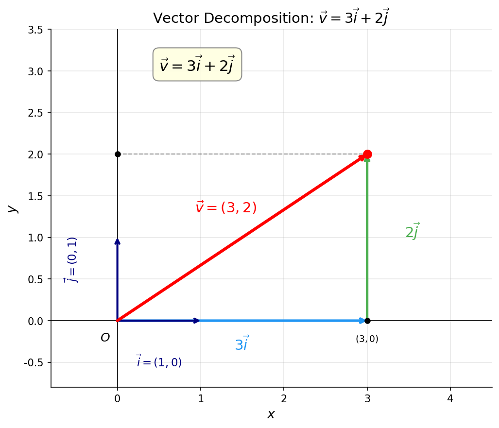

# 向量坐标化

> **所属路径**：`00_高中复习/01_数学基础/06_向量/03_向量坐标化`
> **预计学习时间**：30 分钟
> **难度等级**：⭐

---

## 前置知识

- [向量表示与运算](../01_向量表示与运算/01_向量表示与运算.md)——需要掌握向量的加法、减法和数乘
- [数量积](../02_数量积/02_数量积.md)——需要了解数量积的坐标公式
- [代数与方程](../../../01_数学基础/01_代数与方程/)——需要熟悉基本的代数运算

> 如果以上内容还不熟悉，建议先完成对应课程再继续。

---

## 学习目标

完成本节后，你将能够：

1. 理解基底向量的概念，知道标准基底 $\vec{i}$ 和 $\vec{j}$ 的含义
2. 用坐标表示向量并进行加法、减法、数乘和数量积的坐标运算
3. 运用定比分点公式（截面公式）求线段上的分点坐标
4. 用向量方法计算两点之间的距离

---

## 正文讲解

### 1. 为什么需要坐标——从图形到数字

在之前的学习中，我们用箭头来表示向量，用几何法则来做运算。这种方式直观，但有一个问题：**画图不够精确，而且难以推广到三维甚至更高维度**。

想象一下，如果你要处理 100 维的向量（在人工智能中这很常见），你无法画出 100 维的箭头。但如果用 100 个数字组成的列表来表示它——比如 $(0.3, -1.2, 0.7, \ldots)$ ——那么所有运算都可以通过数字计算完成。

这就是向量坐标化的意义：**把几何对象转化为数字，让计算机能够处理**。

### 2. 基底向量——坐标系的"砖块"

在平面直角坐标系中，我们定义两个特殊的单位向量：

- $\vec{i} = (1, 0)$ ：沿 $x$ 轴正方向的单位向量
- $\vec{j} = (0, 1)$ ：沿 $y$ 轴正方向的单位向量

这两个向量被称为 **基底向量（Basis Vectors）** 。它们有两个重要性质：

1. **长度为 1**： $|\vec{i}| = |\vec{j}| = 1$
2. **互相垂直**： $\vec{i} \cdot \vec{j} = 0$

满足这两个条件的基底叫做 **标准正交基（Standard Orthonormal Basis）** 。

> ⚠️ **超纲提示**："标准正交基"是大学线性代数中的正式术语。在高中阶段，你只需要理解 $\vec{i}$ 和 $\vec{j}$ 是两个互相垂直、长度为 1 的基底向量即可。这里提前介绍这个名称，是因为它在后续的线性代数和人工智能课程中会频繁出现。如果觉得陌生，可以先跳过术语名称，只记住 $\vec{i}$ 和 $\vec{j}$ 的性质。

为什么基底向量如此重要？因为平面上的 **任何向量** 都可以唯一地表示为 $\vec{i}$ 和 $\vec{j}$ 的 **[线性组合（Linear Combination）](../04_线性组合与线性相关初步/)** ：

$$
\vec{a} = a_1 \vec{i} + a_2 \vec{j}
$$

其中 $a_1$ 和 $a_2$ 就是向量 $\vec{a}$ 在 $x$ 轴和 $y$ 轴方向上的分量。我们用有序数对 $(a_1, a_2)$ 来表示这个向量，这就是向量的 **坐标表示（Coordinate Representation）** 。

> 💡 在 AI 中，选择什么样的"基底"至关重要。主成分分析（PCA）的核心思想就是找到一组新的基底，使得数据在新基底下的表示更简洁、更有意义。

下面这张图展示了向量 $\vec{v} = (3, 2)$ 如何分解为标准基底 $\vec{i}$ 和 $\vec{j}$ 的线性组合：



> 📌 **图解说明**：红色箭头是向量 $\vec{v} = (3, 2)$ ，蓝色箭头是沿 $x$ 轴的分量 $3\vec{i}$ ，绿色箭头是沿 $y$ 轴的分量 $2\vec{j}$ ，虚线为投影辅助线。任何平面向量都可以唯一地表示为 $\vec{i}$ 和 $\vec{j}$ 的线性组合。你可以运行 `code/plot_vector_decomposition.py` 自行生成这张图。

### 3. 坐标运算——一切变得简单

有了坐标表示，之前学的所有向量运算都变成了简单的数字计算。设 $\vec{a} = (a_1, a_2)$ ， $\vec{b} = (b_1, b_2)$ ：

**加法**：

$$
\vec{a} + \vec{b} = (a_1 + b_1,\ a_2 + b_2)
$$

**减法**：

$$
\vec{a} - \vec{b} = (a_1 - b_1,\ a_2 - b_2)
$$

**数乘**：

$$
\lambda \vec{a} = (\lambda a_1,\ \lambda a_2)
$$

**数量积**：

$$
\vec{a} \cdot \vec{b} = a_1 b_1 + a_2 b_2
$$

**模**：

$$
|\vec{a}| = \sqrt{a_1^2 + a_2^2}
$$

这些公式的共同特点是：**对应坐标分别运算**。这种"逐坐标操作"的思想，在计算机科学中叫做 **逐元素运算（Element-wise Operation）** ，是 NumPy、PyTorch 等科学计算库的核心设计理念。

### 4. 用坐标表示两点之间的向量

如果已知两点 $A(x_1, y_1)$ 和 $B(x_2, y_2)$ ，那么从 $A$ 到 $B$ 的向量为：

$$
\overrightarrow{AB} = (x_2 - x_1,\ y_2 - y_1)
$$

> **直觉解读**：终点坐标减去起点坐标——对应坐标分别相减。这和向量减法 $\overrightarrow{OB} - \overrightarrow{OA}$ 是一致的。

由此立刻得到 **两点间距离公式**：

$$
|AB| = |\overrightarrow{AB}| = \sqrt{(x_2 - x_1)^2 + (y_2 - y_1)^2}
$$

这个公式你可能早已熟悉，现在你知道它的向量本质了——就是向量 $\overrightarrow{AB}$ 的模。

### 5. 定比分点公式——精确定位线段上的点

在几何问题中，我们经常需要找线段上的某个特定点。**定比分点公式（Section Formula）** 解决的就是这个问题。

设点 $P$ 在线段 $AB$ 上（或延长线上），使得 $\overrightarrow{AP} = \lambda \overrightarrow{PB}$ ，其中 $\lambda$ 是一个实数。如果 $A(x_1, y_1)$ ， $B(x_2, y_2)$ ，那么 $P$ 的坐标为：

$$
P = \left(\frac{x_1 + \lambda x_2}{1 + \lambda},\ \frac{y_1 + \lambda y_2}{1 + \lambda}\right)
$$

一个最常用的特殊情况是 **中点公式**（ $\lambda = 1$ ，即 $P$ 恰好在 $AB$ 的中点）：

$$
M = \left(\frac{x_1 + x_2}{2},\ \frac{y_1 + y_2}{2}\right)
$$

> **直觉解读**：中点的每个坐标都是两个端点对应坐标的平均值。这就是"取平均"的几何意义。

还有一个实用推广——**重心公式**。三角形三个顶点 $A(x_1, y_1)$ 、 $B(x_2, y_2)$ 、 $C(x_3, y_3)$ 的重心 $G$ 的坐标为：

$$
G = \left(\frac{x_1 + x_2 + x_3}{3},\ \frac{y_1 + y_2 + y_3}{3}\right)
$$

### 6. 从二维到高维——坐标化的力量

本节的所有公式都可以直接推广到三维乃至 $n$ 维空间。例如三维向量 $\vec{a} = (a_1, a_2, a_3)$ 的模为 $\sqrt{a_1^2 + a_2^2 + a_3^2}$ ，加法仍然是对应坐标相加。

在人工智能中，我们常常处理数百甚至数千维的向量，但运算规则完全相同。坐标化让我们能够用统一的数学语言描述任意维度的数据，这正是计算机处理大规模数据的基础。

---

## 动手实践

让我们用 Python 来验证坐标运算和距离公式：

```python
# 文件：code/coordinates.py
# 演示向量坐标运算、距离公式和中点公式
# 环境要求：Python 3.10+, numpy

import numpy as np

# 基底向量
i = np.array([1, 0])
j = np.array([0, 1])

# 用基底表示向量 a = 3i + 4j
a = 3 * i + 4 * j
print(f"a = 3i + 4j = {a}")

# 两点之间的向量和距离
A = np.array([1, 2])
B = np.array([4, 6])
AB = B - A
distance = np.linalg.norm(AB)
print(f"\nA = {A}, B = {B}")
print(f"向量 AB = {AB}")
print(f"|AB| = {distance:.4f}")

# 中点公式
M = (A + B) / 2
print(f"AB 中点 M = {M}")

# 定比分点（AP = 2 * PB，即 λ=2）
lam = 2
P = (A + lam * B) / (1 + lam)
print(f"\nAP:PB = 2:1 时，P = {P}")

# 重心
C = np.array([7, 1])
G = (A + B + C) / 3
print(f"三角形 ABC 的重心 G = {G}")

# 验证：重心到三个顶点的向量之和为零向量
GA = A - G
GB = B - G
GC = C - G
print(f"GA + GB + GC = {GA + GB + GC}")
```

**运行说明**：
- 环境要求：Python 3.10+, numpy
- 运行命令：`python code/coordinates.py`

**预期输出**：
```
a = 3i + 4j = [3 4]

A = [1 2], B = [4 6]
向量 AB = [3 4]
|AB| = 5.0000
AB 中点 M = [2.5 4. ]

AP:PB = 2:1 时，P = [3.         4.66666667]
三角形 ABC 的重心 G = [4. 3.]
GA + GB + GC = [0. 0.]
```

最后一行验证了一个重要性质：**重心到三顶点的向量之和恰好是零向量**。

---

## 典型误区

| 误区 | 正确理解 |
| --- | --- |
| 向量 $(3, 4)$ 就是点 $(3, 4)$ | 向量表示"从原点到该点的位移"，向量和点是不同的概念，虽然坐标形式相同 |
| $\overrightarrow{AB} = A - B$ | 正确的是 $\overrightarrow{AB} = B - A$ ，即终点减起点 |
| 中点坐标是两点坐标相加 | 中点坐标是两点坐标之和的一半，不要忘记除以 2 |
| 坐标公式只适用于二维 | 所有坐标公式都可以推广到任意维度，形式完全相同 |

---

## 练习题

### 练习 1：坐标运算（难度：⭐）

已知 $\vec{a} = (2, -1)$ ， $\vec{b} = (3, 5)$ 。计算 $2\vec{a} - 3\vec{b}$ 以及 $|2\vec{a} - 3\vec{b}|$ 。

<details>
<summary>💡 提示</summary>

先分别做数乘，再做减法。模的计算用 $\sqrt{x^2 + y^2}$ 。

</details>

<details>
<summary>✅ 参考答案</summary>

$2\vec{a} = (4, -2)$ ， $3\vec{b} = (9, 15)$

$2\vec{a} - 3\vec{b} = (4 - 9,\ -2 - 15) = (-5, -17)$

$$|2\vec{a} - 3\vec{b}| = \sqrt{(-5)^2 + (-17)^2} = \sqrt{25 + 289} = \sqrt{314}$$

</details>

### 练习 2：距离与中点（难度：⭐）

已知 $A(3, -1)$ ， $B(-1, 7)$ 。求 $|AB|$ 和 $AB$ 的中点坐标。

<details>
<summary>💡 提示</summary>

距离公式 $|AB| = \sqrt{(x_2 - x_1)^2 + (y_2 - y_1)^2}$ ，中点公式取两个坐标的平均值。

</details>

<details>
<summary>✅ 参考答案</summary>

$$|AB| = \sqrt{(-1-3)^2 + (7-(-1))^2} = \sqrt{16 + 64} = \sqrt{80} = 4\sqrt{5}$$

中点 $M = \left(\dfrac{3 + (-1)}{2},\ \dfrac{-1 + 7}{2}\right) = (1, 3)$

</details>

### 练习 3：定比分点（难度：⭐⭐）

已知 $A(2, 1)$ ， $B(8, 4)$ ，点 $P$ 在线段 $AB$ 上使得 $AP:PB = 1:2$ 。求 $P$ 的坐标。

<details>
<summary>💡 提示</summary>

$AP:PB = 1:2$ 意味着 $\overrightarrow{AP} = \dfrac{1}{2} \overrightarrow{PB}$ ，即 $\lambda = \dfrac{1}{2}$ 。代入定比分点公式。

</details>

<details>
<summary>✅ 参考答案</summary>

$\lambda = \dfrac{1}{2}$

$$P = \left(\dfrac{2 + \dfrac{1}{2} \times 8}{1 + \dfrac{1}{2}},\ \dfrac{1 + \dfrac{1}{2} \times 4}{1 + \dfrac{1}{2}}\right) = \left(\dfrac{6}{\dfrac{3}{2}},\ \dfrac{3}{\dfrac{3}{2}}\right) = (4, 2)$$

验证： $\overrightarrow{AP} = (2, 1)$ ， $\overrightarrow{PB} = (4, 2) = 2 \times (2, 1)$ ，所以 $AP:PB = 1:2$ ✓

</details>

---

## 下一步学习

- 📖 下一个知识点：[线性组合与线性相关初步](../04_线性组合与线性相关初步/04_线性组合与线性相关初步.md)——理解向量之间的"表示"关系
- 🔗 相关知识点：[解析几何](../../../01_数学基础/07_解析几何/)——坐标方法在几何中的系统应用
- 📚 拓展阅读：[NumPy 基础](../../../../01_基础能力/04_数值计算与科学计算/01_NumPy基础/)——向量坐标运算的编程实现

---

## 参考资料

1. [3Blue1Brown - Linear combinations, span, and basis vectors](https://www.youtube.com/watch?v=k7RM-ot2NWY) — 用动画解释基底与线性组合（公开视频）
2. [Khan Academy - Vectors in the coordinate plane](https://www.khanacademy.org/math/precalculus/x9e81a4f98389efdf:vectors/x9e81a4f98389efdf:component-form/v/vector-components-from-magnitude-and-direction) — 向量坐标表示的基础练习（免费公开课程）
3. [NumPy 官方文档 - Array basics](https://numpy.org/doc/stable/user/basics.html) — NumPy 数组的基础操作（官方文档）
