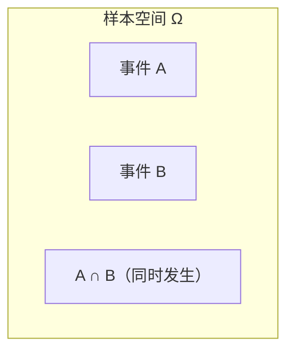

# 古典概率

> **所属路径**：`00_高中复习/01_数学基础/09_概率基础/01_古典概率`
> **预计学习时间**：40 分钟
> **难度等级**：⭐

---

## 前置知识

- [排列组合](../../../08_排列组合/) — 加法原理、乘法原理、排列组合公式是计算概率的核心计数工具

> 如果以上内容还不熟悉，建议先完成对应课程再继续。

---

## 学习目标

完成本节后，你将能够：

1. 解释样本空间、样本点和事件的含义，并能用集合语言描述随机试验
2. 运用古典概型公式 $P(A) = \dfrac{|A|}{|\Omega|}$ 计算等可能事件的概率
3. 理解概率在人工智能中随机采样、数据划分等场景的基础作用

---

## 正文讲解

### 1. 从"猜硬币"说起

想象你和朋友玩一个简单的游戏：抛一枚硬币，正面你赢、反面你输。你心里可能会觉得"赢的可能性是一半"。但为什么是"一半"？这种对"可能性大小"的直觉，正是概率要精确回答的问题。

在人工智能领域，同样充满了"不确定性"——一张照片里的动物是猫还是狗？一封邮件是正常邮件还是垃圾邮件？模型对每种可能的结果都要给出一个"信心程度"，这正是概率的用武之地。要理解这些高级应用，第一步就是掌握最简单的概率计算方法——**古典概率（Classical Probability）**。

### 2. 随机试验与样本空间

在讨论概率之前，我们需要明确几个基本概念。

**随机试验（Random Experiment）** 是指满足以下三个条件的试验：
- 可以在相同条件下重复进行
- 每次试验的所有可能结果是已知的
- 每次试验前无法确定具体会出现哪个结果

例如，抛一枚硬币就是一个随机试验——你知道结果不是正面就是反面，但每次抛之前你无法确定。

一次随机试验中所有可能结果的集合，叫做 **样本空间（Sample Space）**，通常用 $\Omega$ 表示。样本空间中的每一个元素叫做 **样本点（Sample Point）**。

例如，掷一枚骰子的样本空间是：

$$
\Omega = \{1, 2, 3, 4, 5, 6\}
$$

这里有 6 个样本点，每个面朝上就是一个样本点。

### 3. 事件的集合描述

我们感兴趣的"某件事发生"在数学上叫做 **事件（Event）**，它是样本空间的一个子集。

比如"掷骰子点数为偶数"这个事件可以写成：

$$
A = \{2, 4, 6\}
$$

这里 $A$ 是 $\Omega$ 的一个子集。当某次试验的结果落在 $A$ 中时，我们就说"事件 $A$ 发生了"。

有两个特殊事件值得注意：
- **必然事件**： $\Omega$ 本身，它一定发生
- **不可能事件**：空集 $\varnothing$ ，它不可能发生

事件之间的关系可以用集合运算表达：



> 📌 **图解说明**：事件 $A$ 和事件 $B$ 都是样本空间 $\Omega$ 的子集。 $A \cap B$ 表示两个事件同时发生的部分，对应集合的交集。

- $A \cup B$ ：事件 $A$ 或事件 $B$ 至少有一个发生（并事件）
- $A \cap B$ ：事件 $A$ 和事件 $B$ 同时发生（积事件）
- $\bar{A}$ ：事件 $A$ 不发生（对立事件/补事件）

### 4. 古典概型与概率公式

现在，我们可以给出古典概率的精确定义了。如果一个随机试验满足：
1. 样本空间 $\Omega$ 中的样本点个数 **有限**
2. 每个样本点出现的可能性 **相等**（等可能性）

那么这个试验就称为 **古典概型（Classical Probability Model）**。在古典概型下，事件 $A$ 的概率定义为：

$$
P(A) = \frac{|A|}{|\Omega|} = \frac{\text{事件 } A \text{ 包含的样本点数}}{\text{样本空间中的样本点总数}}
$$

> **直觉解读**：概率就是"有利结果数"占"全部可能结果数"的比例。抛硬币得到正面的概率是 $\dfrac{1}{2}$ ，掷骰子得到偶数的概率是 $\dfrac{3}{6} = \dfrac{1}{2}$ 。

这就是为什么之前你觉得"赢的可能性是一半"——你的直觉和数学定义完全吻合！

### 5. 概率的基本性质

从定义出发，可以推导出概率的几条基本性质：

1. **非负性**：对任意事件 $A$ ，有 $P(A) \geq 0$
2. **规范性**： $P(\Omega) = 1$
3. **可加性**：如果事件 $A$ 和 $B$ 互斥（即 $A \cap B = \varnothing$ ），则 $P(A \cup B) = P(A) + P(B)$

由此可以推导出几个实用的公式：

- 对立事件公式： $P(\bar{A}) = 1 - P(A)$
- 加法公式（一般情况）： $P(A \cup B) = P(A) + P(B) - P(A \cap B)$

对立事件公式在实际解题中非常好用——当"正面计算"比较复杂时，可以先算"反面"再用 $1$ 去减。

### 6. 用排列组合计数

古典概率的难点通常不在公式本身，而在于准确地数出 $|A|$ 和 $|\Omega|$ 。这正是 **[排列组合（Permutation and Combination）](../../../08_排列组合/)** 知识的用武之地。

**例题**：从一副标准扑克牌（52 张，不含大小王）中随机抽取 5 张，恰好是同花（5 张花色相同）的概率是多少？

- 样本空间大小：从 52 张中选 5 张的组合数 $|\Omega| = \binom{52}{5}$
- 事件 $A$ ：先选一种花色（4 种），再从该花色 13 张中选 5 张，所以 $|A| = 4 \times \binom{13}{5}$

$$
P(A) = \frac{4 \times \binom{13}{5}}{\binom{52}{5}} = \frac{4 \times 1287}{2598960} \approx 0.00198
$$

> **直觉解读**：同花在扑克中是相当罕见的牌型，概率不到 0.2%，这与我们打牌时的经验一致。

### 7. 古典概率与人工智能

在人工智能中，古典概率的思想无处不在。例如：

- **随机采样**：训练机器学习模型时，需要将数据集随机划分为训练集和测试集。"随机"的含义就是每个样本被选中的可能性相等——这正是古典概型的假设。
- **随机初始化**：神经网络的权重在训练开始前会被随机初始化，等概率地从某个范围中取值。
- **蒙特卡洛方法**：通过大量随机采样来估计概率，其数学基础就是我们这里学到的概率定义。

虽然实际的 AI 系统远比掷骰子复杂，但万变不离其宗——理解了古典概率，你就握住了通向概率世界的第一把钥匙。

---

## 动手实践

学完了古典概率的定义和公式，我们用 Python 来验证一下理论计算。下面的代码模拟掷两枚骰子，计算点数之和为 7 的概率。

```python
# 文件：code/classical_probability.py
# 用途：验证古典概率 —— 掷两枚骰子点数之和为 7
# 环境：Python 3.10+（无需额外库）

import random

def theoretical_probability():
    """理论计算：枚举样本空间"""
    omega = [(i, j) for i in range(1, 7) for j in range(1, 7)]
    event_a = [(i, j) for (i, j) in omega if i + j == 7]
    return len(event_a) / len(omega)

def simulate_probability(n_trials=100_000):
    """模拟实验：大量重复试验估计概率"""
    count = 0
    for _ in range(n_trials):
        d1 = random.randint(1, 6)
        d2 = random.randint(1, 6)
        if d1 + d2 == 7:
            count += 1
    return count / n_trials

# 对比理论值和模拟值
p_theory = theoretical_probability()
p_sim = simulate_probability()

print(f"理论概率: {p_theory:.4f}  ({p_theory} = 6/36)")
print(f"模拟概率: {p_sim:.4f}  (100000 次试验)")
print(f"误差:     {abs(p_theory - p_sim):.4f}")
```

**运行说明**：
- 环境要求：Python 3.10+，仅使用标准库
- 运行命令：`python code/classical_probability.py`

**预期输出**：
```
理论概率: 0.1667  (0.16666666666666666 = 6/36)
模拟概率: 0.1671  (100000 次试验)
误差:     0.0004
```

从输出可以看到，模拟 10 万次的结果与理论值 $\dfrac{6}{36} = \dfrac{1}{6}$ 非常接近。这说明古典概率的计算是可靠的，而且试验次数越多，模拟值就越接近理论值——这其实就是大数定律的直觉预告。

---

## 典型误区

| 误区 | 正确理解 |
| --- | --- |
| "概率为 0 的事件不可能发生" | 在古典概型中确实如此，但在连续概率中概率为 0 的事件仍可能发生（后续课程会涉及） |
| "样本空间可以随便列" | 样本空间必须保证等可能性。例如掷两枚骰子，样本空间应该是 36 个有序对，而不是"和为 2、和为 3、…、和为 12"这 11 种结果 |
| "互斥和对立是一回事" | 互斥是 $A \cap B = \varnothing$ ，对立还要求 $A \cup B = \Omega$ 。对立一定互斥，互斥不一定对立 |
| "概率大就一定会发生" | 概率描述的是长期频率趋势，单次试验结果仍是不确定的 |

---

## 练习题

### 练习 1：基础计算（难度：⭐）

从 1 到 20 的整数中随机取一个数，求取到的数能被 3 整除的概率。

<details>
<summary>💡 提示</summary>

先列出 1 到 20 中能被 3 整除的数：3, 6, 9, 12, 15, 18，共 6 个。样本空间大小为 20。

</details>

<details>
<summary>✅ 参考答案</summary>

样本空间 $|\Omega| = 20$ ，事件 $A = \{3, 6, 9, 12, 15, 18\}$ ，所以 $|A| = 6$ 。

$$P(A) = \dfrac{6}{20} = \dfrac{3}{10} = 0.3$$

</details>

### 练习 2：对立事件的应用（难度：⭐）

同时掷两枚骰子，求至少有一枚点数为 6 的概率。

<details>
<summary>💡 提示</summary>

"至少有一枚为 6"的对立事件是"两枚都不是 6"，先算对立事件的概率再用 $1$ 去减会更简单。

</details>

<details>
<summary>✅ 参考答案</summary>

样本空间 $|\Omega| = 36$ 。设事件 $A$ 为"至少一枚为 6"。

对立事件 $\bar{A}$ 为"两枚都不是 6"，每枚有 5 种可能，所以 $|\bar{A}| = 5 \times 5 = 25$ 。

$$P(A) = 1 - P(\bar{A}) = 1 - \dfrac{25}{36} = \dfrac{11}{36} \approx 0.306$$

</details>

### 练习 3：组合计数（难度：⭐⭐）

一个袋子里有 5 个红球和 3 个白球。从中随机取出 3 个球，求恰好取到 2 个红球 1 个白球的概率。

<details>
<summary>💡 提示</summary>

使用组合计数：从 5 个红球中选 2 个，从 3 个白球中选 1 个，再除以从 8 个球中选 3 个的总数。

</details>

<details>
<summary>✅ 参考答案</summary>

$$P = \dfrac{\binom{5}{2} \times \binom{3}{1}}{\binom{8}{3}} = \dfrac{10 \times 3}{56} = \dfrac{30}{56} = \dfrac{15}{28} \approx 0.536$$

</details>

---

## 下一步学习

- 📖 下一个知识点：[条件概率](../02_条件概率/02_条件概率.md) — 已知部分信息后，概率如何更新？
- 🔗 相关知识点：[排列组合公式](../../../08_排列组合/02_排列组合公式/02_排列组合公式.md) — 古典概率计算中最常用的计数工具
- 🔗 相关知识点：[集合运算](../../../11_集合与逻辑/01_集合运算/) — 事件的集合语言描述

---

## 参考资料

1. [Khan Academy — Basic Probability](https://www.khanacademy.org/math/statistics-probability/probability-library) — 可汗学院概率基础课程，免费公开教育资源
2. [3Blue1Brown — But what is probability?](https://www.youtube.com/watch?v=HZGCoVF3YvM) — 直觉化视频讲解概率本质，YouTube 公开视频
3. [Wikipedia — Classical definition of probability](https://en.wikipedia.org/wiki/Classical_definition_of_probability) — 古典概率的定义与历史，公共知识库
