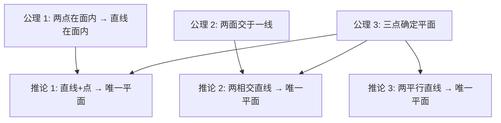
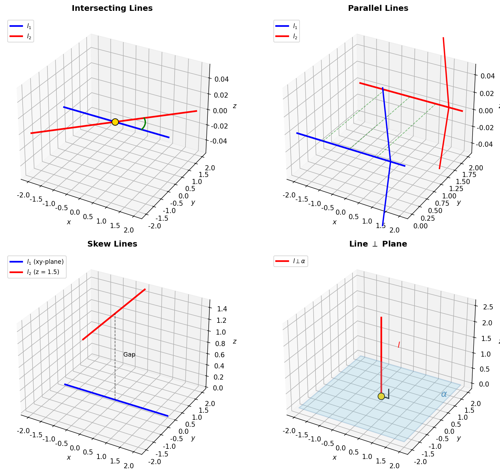
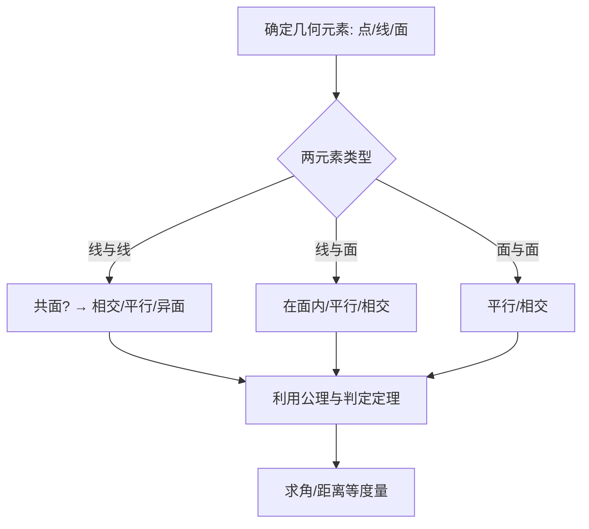

# 空间点线面关系

> **所属路径**：`00_高中复习/01_数学基础/13_立体几何与空间想象/01_空间点线面关系`
> **预计学习时间**：40 分钟
> **难度等级**：⭐

---

## 前置知识

- [向量表示与运算](../../../01_数学基础/06_向量/01_向量表示与运算/01_向量表示与运算.md)
- [直线方程](../../../01_数学基础/07_解析几何/01_直线方程/01_直线方程.md)

> 如果以上内容还不熟悉，建议先完成对应课程再继续。

---

## 学习目标

完成本节后，你将能够：

1. 陈述空间几何的四条基本公理及其推论
2. 判断空间中线与线、线与面、面与面的位置关系
3. 运用平行与垂直的判定定理和性质定理解决基本问题
4. 理解空间位置关系在人工智能三维数据处理中的意义

---

## 正文讲解

### 1. 从二维到三维：为什么需要空间几何

在平面几何中，两条直线只有相交和平行两种位置关系。但如果你拿起两支铅笔，一支水平放在桌面上，另一支竖直举在空中——它们既不相交，也不平行。这种在平面中不可能出现的关系，就是 **异面直线（Skew Lines）** 。三维空间比二维平面复杂得多，我们需要一套新的公理体系来描述它。

在人工智能领域，三维空间理解至关重要。自动驾驶中的 **激光雷达（LiDAR）** 会生成数百万个三维点构成的 **[点云（Point Cloud）](../02_几何体与截面/)** ，机器人需要判断物体表面的朝向和障碍物之间的空间关系——这些都建立在空间几何的基本概念之上。

### 2. 空间几何的四条基本公理

空间几何建立在以下四条公理之上，它们是一切推理的出发点：

**公理 1**：如果一条直线上的两个点在一个平面内，那么这条直线上所有的点都在这个平面内。

> 📌 这意味着直线要么完全在平面内，要么与平面最多只有一个交点。

**公理 2**：如果两个平面有一个公共点，那么它们有且仅有一条通过该点的公共直线（称为交线）。

**公理 3**：过不在同一条直线上的三个点，有且仅有一个平面。

> 📌 这就是为什么三脚架总是稳定的——三个点确定一个平面。在三维重建中，三个不共线的点就足以确定一个平面。

**公理 4**（平行公理的空间推广）：过直线外一点，有且仅有一条直线与已知直线平行。

由这些公理可以推出三条重要推论：

- **推论 1**：过一条直线和直线外一点，有且仅有一个平面。
- **推论 2**：过两条相交直线，有且仅有一个平面。
- **推论 3**：过两条平行直线，有且仅有一个平面。



> 📌 **图解说明**：四条公理是根基，三条推论是直接推导的结果。后续所有空间关系的判定都以此为基础。

### 3. 空间中直线与直线的位置关系

空间中两条直线的位置关系有三种：

| 位置关系 | 特征 | 公共点数 |
| -------- | ---- | -------- |
| 相交 | 在同一平面内，有一个公共点 | 1 |
| 平行 | 在同一平面内，没有公共点 | 0 |
| 异面 | 不在任何同一平面内 | 0 |

判断两条直线是否异面的关键：如果它们既不相交也不平行，那么它们就是异面直线。

下面这张图展示了空间中两条直线可能出现的三种位置关系，以及直线与平面垂直的典型情形：



> 📌 **图解说明**：左上为相交直线（共面、有一个交点），右上为平行直线（共面、等距），左下为异面直线（分别在不同平面内，既不相交也不平行），右下为直线垂直于平面（线面垂直是立体几何的核心判定之一）。你可以运行 `code/plot_spatial_relations.py` 自行生成这张图。

**异面直线所成的角**：分别过空间中一点作两条异面直线的平行线，这两条平行线所成的锐角（或直角）就是异面直线所成的角，取值范围为 $(0°, 90°]$ 。

### 4. 空间中直线与平面的位置关系

直线与平面的位置关系有三种：

- **直线在平面内**：直线上所有点都在平面上。
- **直线与平面平行**：直线与平面没有公共点。
- **直线与平面相交**：直线与平面有且仅有一个公共点。

**线面平行判定定理**：如果平面外一条直线与平面内一条直线平行，则该直线与此平面平行。

用符号表示：若 $a \not\subset \alpha$ ， $b \subset \alpha$ ，且 $a \parallel b$ ，则 $a \parallel \alpha$ 。

**线面垂直判定定理**：如果一条直线与平面内的两条相交直线都垂直，则该直线与此平面垂直。

用符号表示：若 $m \subset \alpha$ ， $n \subset \alpha$ ， $m \cap n = P$ ，且 $l \perp m$ ， $l \perp n$ ，则 $l \perp \alpha$ 。

> 📌 线面垂直是立体几何中最核心的概念之一。在计算机图形学中，平面的 **[法向量（Normal Vector）](../03_空间向量直觉/)** 就是垂直于该平面的向量，它决定了表面的朝向和光照效果。

### 5. 空间中平面与平面的位置关系

两个平面的位置关系只有两种：**平行** 或 **相交** 。

**面面平行判定定理**：如果一个平面内的两条相交直线分别与另一个平面平行，则这两个平面平行。

**面面垂直判定定理**：如果一个平面经过另一个平面的一条垂线，则这两个平面互相垂直。

**二面角**：从一条直线出发的两个半平面所组成的图形叫做二面角。二面角的大小用其平面角来度量——在棱上取一点，分别在两个半平面内作棱的垂线，这两条垂线所成的角即为二面角的平面角。

### 6. 空间关系的综合判断框架

面对空间位置关系问题，可以按照以下思路分析：



> 📌 **图解说明**：解题的第一步是识别几何元素的类型，然后运用对应的判定定理来确定位置关系，最后进行度量计算。

---

## 动手实践

理解了空间位置关系后，让我们用 Python 来验证一些基本的空间几何概念。下面的代码用向量方法判断两条直线在空间中的位置关系。

```python
# 文件：code/line_relations.py
# 判断空间中两条直线的位置关系
# 环境要求：Python 3.10+, numpy

import numpy as np

def classify_lines(p1, d1, p2, d2):
    """
    判断两条直线的位置关系。
    直线1: 过点 p1，方向向量 d1
    直线2: 过点 p2，方向向量 d2
    """
    # 检查方向向量是否平行（叉积为零向量）
    cross = np.cross(d1, d2)
    is_parallel = np.allclose(cross, 0)

    if is_parallel:
        # 平行时，检查是否共线（p2-p1 也与 d1 平行）
        diff = np.array(p2) - np.array(p1)
        if np.allclose(np.cross(d1, diff), 0):
            return "重合"
        else:
            return "平行"
    else:
        # 不平行时，检查是否相交（混合积为 0 则共面）
        diff = np.array(p2) - np.array(p1)
        mixed_product = np.dot(diff, cross)
        if np.isclose(mixed_product, 0):
            return "相交"
        else:
            return "异面"

# 示例 1：相交的两条直线
print(classify_lines([0,0,0], [1,0,0], [0,0,0], [0,1,0]))

# 示例 2：平行的两条直线
print(classify_lines([0,0,0], [1,1,0], [0,0,1], [2,2,0]))

# 示例 3：异面直线
print(classify_lines([0,0,0], [1,0,0], [0,1,1], [0,0,1]))
```

**运行说明**：
- 环境要求：Python 3.10+, numpy
- 运行命令：`python code/line_relations.py`

**预期输出**：
```
相交
平行
异面
```

这段代码的核心思想是：先用叉积判断方向向量是否平行，再用混合积（标量三重积）判断两条直线是否共面。混合积 $\vec{d_1} \times \vec{d_2} \cdot (\vec{p_2} - \vec{p_1})$ 等于零说明三个向量共面，即两直线相交；不等于零则为异面。

---

## 典型误区

| 误区 | 正确理解 |
| ---- | -------- |
| 不相交的两条直线一定平行 | 在空间中还可能是异面直线，不相交不等于平行 |
| 垂直于同一条直线的两条直线互相平行 | 在空间中它们可能相交、平行或异面 |
| 平行于同一平面的两条直线互相平行 | 它们可能平行、相交或异面 |
| 线面垂直只需要垂直于面内一条直线 | 必须垂直于面内两条**相交**直线才能判定线面垂直 |

---

## 练习题

### 练习 1：位置关系判断（难度：⭐）

正方体 $ABCD$-$A'B'C'D'$ 中，判断以下直线对的位置关系：
(a) $AB$ 与 $C'D'$
(b) $AC$ 与 $B'D'$
(c) $AB'$ 与 $CD'$

<details>
<summary>💡 提示</summary>

利用正方体的对称性。两条线段如果各自所在的直线能被放到同一个平面内，则它们共面（平行或相交）；否则异面。

</details>

<details>
<summary>✅ 参考答案</summary>

(a) $AB \parallel C'D'$ （平行），因为 $ABCD$ 是正方形所以 $AB \parallel DC$ ，而 $DC \parallel D'C'$ 。

(b) 异面。 $AC$ 是底面对角线， $B'D'$ 是顶面对角线，它们既不平行也不相交。

(c) $AB' \parallel CD'$ （平行）。可以验证 $AB'$ 和 $CD'$ 都是侧面对角线，方向向量相同。

</details>

### 练习 2：线面垂直证明（难度：⭐⭐）

已知正三棱锥 $P$-$ABC$ 中， $PA = PB = PC$ ，底面 $ABC$ 是等边三角形。设 $M$ 是 $BC$ 的中点。证明 $PM \perp BC$ 。

<details>
<summary>💡 提示</summary>

利用等腰三角形的性质：在 $\triangle PBC$ 中， $PB = PC$ ， $M$ 是 $BC$ 中点。

</details>

<details>
<summary>✅ 参考答案</summary>

∵ $PB = PC$ ， $M$ 是 $BC$ 中点

∴ $PM \perp BC$ （等腰三角形的顶角平分线即底边的垂直平分线）

这一步不需要空间几何的判定定理，因为 $P$ 、 $B$ 、 $C$ 、 $M$ 四点共面（都在平面 $PBC$ 内），在平面 $PBC$ 中直接利用等腰三角形的性质即可。

</details>

### 练习 3：编程验证（难度：⭐⭐）

修改动手实践中的代码，新增一个函数计算两条异面直线所成的角（单位：度）。用直线 $l_1$ 过点 $(0,0,0)$ 方向 $(1,0,0)$ 和直线 $l_2$ 过点 $(0,1,0)$ 方向 $(0,0,1)$ 验证，结果应为 $90°$ 。

<details>
<summary>💡 提示</summary>

异面直线所成的角等于两方向向量夹角的较小值，公式为 $\theta = \arccos\dfrac{|\vec{d_1} \cdot \vec{d_2}|}{|\vec{d_1}||\vec{d_2}|}$ ，注意分子取绝对值。

</details>

<details>
<summary>✅ 参考答案</summary>

```python
import numpy as np

def skew_angle(d1, d2):
    d1, d2 = np.array(d1, float), np.array(d2, float)
    cos_val = abs(np.dot(d1, d2)) / (np.linalg.norm(d1) * np.linalg.norm(d2))
    return np.degrees(np.arccos(np.clip(cos_val, -1, 1)))

print(skew_angle([1,0,0], [0,0,1]))  # 输出: 90.0
```

</details>

---

## 下一步学习

- 📖 下一个知识点：[几何体与截面](../02_几何体与截面/02_几何体与截面.md)
- 🔗 相关知识点：[向量表示与运算](../../06_向量/01_向量表示与运算/)
- 🔗 相关知识点：[空间向量直觉](../03_空间向量直觉/03_空间向量直觉.md)

---

## 参考资料

1. [人教版高中数学必修第二册](https://bp.pep.com.cn/) — 空间点线面位置关系章节（人民教育出版社官方教材）
2. [3Blue1Brown - Essence of Linear Algebra](https://www.3blue1brown.com/topics/linear-algebra) — 向量与空间直觉的可视化讲解（公开视频系列，CC BY 许可）
3. [GeoGebra 3D Calculator](https://www.geogebra.org/3d) — 免费在线三维几何可视化工具（开源工具）
