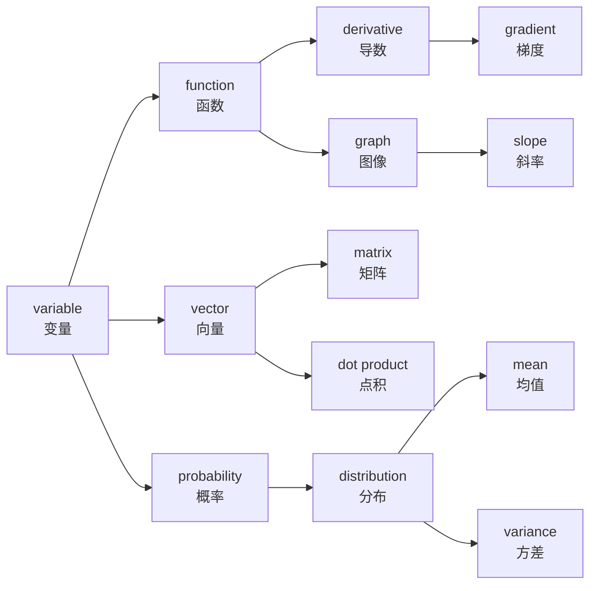

# 数学英文词汇

> **所属路径**：`00_高中复习/02_英语基础/01_技术词汇/01_数学英文词汇`
> **预计学习时间**：40 分钟
> **难度等级**：⭐

---

## 前置知识

- [代数与方程](../../../01_数学基础/01_代数与方程/)
- [函数与图像](../../../01_数学基础/02_函数与图像/)
- [向量](../../../01_数学基础/06_向量/)
- [概率基础](../../../01_数学基础/09_概率基础/)
- [导数初步](../../../01_数学基础/12_导数初步/)

> 如果以上数学概念的中文含义还不熟悉，建议先完成对应课程再继续。本节的目标不是重新学数学，而是学会用英文"叫出"这些你已经认识的概念。

---

## 学习目标

完成本节后，你将能够：

1. 识别并说出 35 个以上高中数学核心概念的英文名称
2. 在英文数学资料中快速定位关键术语的含义
3. 理解包含这些术语的简单英文数学描述

---

## 正文讲解

### 1. 为什么要学数学英文词汇？

想象一下，你打开一篇介绍机器学习的英文文章，第一句话就是：

> *"A linear function maps an input variable to an output through a coefficient and a constant."*

如果你不认识 variable（变量）、coefficient（系数）、constant（常数）这些词，这句话就像一堵墙挡在你面前。但如果你知道这些词的意思，你会发现这句话不过是在说："一个线性函数通过系数和常数，把输入变量映射到输出"——这不就是你在高中学过的 $y = ax + b$ 吗？

数学是人工智能的语言，而英语是这门语言的"国际通用字母表"。接下来，我们按照高中数学的知识模块，逐组学习核心词汇。

### 2. 代数与方程类词汇

这一组词汇是你在 **[代数与方程](../../../01_数学基础/01_代数与方程/)** 中学过的概念的英文对照。它们是最基础的数学术语，几乎在每一篇技术文档中都会出现。

| 英文 | 音标提示 | 中文 | 例句 |
| ---- | -------- | ---- | ---- |
| variable | /ˈveriəbl/ | 变量 | Let $x$ be a variable. |
| constant | /ˈkɒnstənt/ | 常数 | The constant $c$ equals 5. |
| coefficient | /ˌkoʊɪˈfɪʃənt/ | 系数 | The coefficient of $x$ is 3. |
| equation | /ɪˈkweɪʒən/ | 方程 | Solve the equation $2x + 1 = 0$ . |
| expression | /ɪkˈspreʃən/ | 表达式 | Simplify the expression $3x + 2y$ . |
| inequality | /ˌɪnɪˈkwɒləti/ | 不等式 | The inequality $x > 0$ holds. |
| absolute value | /ˈæbsəluːt ˈvæljuː/ | 绝对值 | The absolute value of $-3$ is $3$ . |
| polynomial | /ˌpɒlɪˈnoʊmiəl/ | 多项式 | A polynomial of degree 2. |
| exponent | /ɪkˈspoʊnənt/ | 指数 | The exponent is 3 in $x^3$ . |
| logarithm | /ˈlɒɡərɪðəm/ | 对数 | Take the logarithm of both sides. |

> 💡 **记忆技巧**：variable 来自 vary（变化），"会变化的量"就是变量；constant 来自 const（不变），"不变的量"就是常数。编程中你会频繁见到 `var` 和 `const` 这两个缩写，它们正是来源于此。

### 3. 函数与图像类词汇

学习 **[函数与图像](../../../01_数学基础/02_函数与图像/)** 时你已经掌握了这些概念的中文表述。在英文技术文档中，它们出现的频率极高。

| 英文 | 音标提示 | 中文 | 例句 |
| ---- | -------- | ---- | ---- |
| function | /ˈfʌŋkʃən/ | 函数 | Define a function $f(x) = x^2$ . |
| domain | /doʊˈmeɪn/ | 定义域 | The domain of $f$ is all real numbers. |
| range | /reɪndʒ/ | 值域 | The range of $f(x) = x^2$ is $[0, +\infty)$ . |
| graph | /ɡræf/ | 图像 | Plot the graph of $y = \sin x$ . |
| slope | /sloʊp/ | 斜率 | The slope of the line is 2. |
| intercept | /ˈɪntərsept/ | 截距 | The y-intercept is 3. |
| monotonic | /ˌmɒnəˈtɒnɪk/ | 单调的 | $f(x) = e^x$ is monotonic increasing. |
| inverse | /ɪnˈvɜːrs/ | 反函数；逆 | The inverse function of $f$ . |

> 💡 **记忆技巧**：domain 在日常英语中有"领地、领域"的意思——函数的"领地"就是它接受哪些输入值；range 有"范围"的意思——函数输出的"范围"就是值域。

### 4. 向量与矩阵类词汇

**[向量](../../../01_数学基础/06_向量/)** 是从高中数学通往人工智能的关键桥梁。进入 AI 领域后，你每天都会和向量、矩阵打交道。

| 英文 | 音标提示 | 中文 | 例句 |
| ---- | -------- | ---- | ---- |
| vector | /ˈvektər/ | 向量 | A vector $\mathbf{v} = (1, 2, 3)$ . |
| matrix | /ˈmeɪtrɪks/ | 矩阵 | A $3 \times 3$ matrix. |
| scalar | /ˈskeɪlər/ | 标量 | Multiply the vector by a scalar. |
| dimension | /dɪˈmenʃən/ | 维度 | A vector of dimension 3. |
| dot product | /dɒt ˈprɒdʌkt/ | 点积（数量积） | Compute the dot product of two vectors. |
| norm | /nɔːrm/ | 范数；模 | The norm of vector $\mathbf{v}$ . |
| transpose | /trænˈspoʊz/ | 转置 | Take the transpose of the matrix. |

> 💡 **记忆技巧**：matrix 的复数形式是 matrices（不是 matrixs），这是拉丁语的复数规则。类似的还有 vertex → vertices（顶点）。scalar 来自 scale（尺度），标量只有"大小"没有方向，就像尺子上的刻度。

### 5. 概率与统计类词汇

**[概率基础](../../../01_数学基础/09_概率基础/)** 和 **[统计基础](../../../01_数学基础/10_统计基础/)** 中的概念在机器学习中无处不在，这组词汇的使用频率非常高。

| 英文 | 音标提示 | 中文 | 例句 |
| ---- | -------- | ---- | ---- |
| probability | /ˌprɒbəˈbɪləti/ | 概率 | The probability of event $A$ is 0.5. |
| statistics | /stəˈtɪstɪks/ | 统计学 | Statistics is essential for data science. |
| mean | /miːn/ | 均值（平均数） | The mean of the dataset is 42. |
| variance | /ˈveriəns/ | 方差 | Compute the variance of $X$ . |
| standard deviation | /ˈstændərd ˌdiːviˈeɪʃən/ | 标准差 | The standard deviation is 3.2. |
| distribution | /ˌdɪstrɪˈbjuːʃən/ | 分布 | A normal distribution. |
| sample | /ˈsæmpl/ | 样本 | Draw a sample from the population. |
| random | /ˈrændəm/ | 随机的 | Generate a random number. |
| correlation | /ˌkɒrəˈleɪʃən/ | 相关性 | The correlation between $X$ and $Y$ . |

> 💡 **记忆技巧**：mean 在日常英语中是"意思是"的意思，但在数学中特指"均值"。variance 来自 vary（变化），"数据变化的程度"就是方差。deviation 来自 deviate（偏离），"偏离均值的标准程度"就是标准差。

### 6. 微积分类词汇

**[导数初步](../../../01_数学基础/12_导数初步/)** 是你在高中接触的微积分入门。这些词汇在深度学习中极为核心——训练神经网络的核心操作就是求导数（derivative）和计算梯度（gradient）。

| 英文 | 音标提示 | 中文 | 例句 |
| ---- | -------- | ---- | ---- |
| derivative | /dɪˈrɪvətɪv/ | 导数 | The derivative of $x^2$ is $2x$ . |
| gradient | /ˈɡreɪdiənt/ | 梯度 | Compute the gradient of the loss function. |
| limit | /ˈlɪmɪt/ | 极限 | The limit of $f(x)$ as $x$ approaches 0. |
| integral | /ˈɪntɪɡrəl/ | 积分 | Evaluate the integral of $f(x)$ . |
| continuous | /kənˈtɪnjuəs/ | 连续的 | The function is continuous at $x = 0$ . |
| converge | /kənˈvɜːrdʒ/ | 收敛 | The sequence converges to 0. |
| diverge | /daɪˈvɜːrdʒ/ | 发散 | The series diverges. |
| maximum / minimum | /ˈmæksɪməm/ /ˈmɪnɪməm/ | 最大值 / 最小值 | Find the maximum of $f(x)$ . |

> 💡 **记忆技巧**：derivative 来自 derive（推导、派生），导数就是从原函数"派生"出来的新函数。gradient 来自 grade（等级、坡度），梯度就是"最陡的坡度方向"。converge（汇聚到一点）和 diverge（四散分开）是一对反义词，con- 表示"一起"，di- 表示"分开"。

### 7. 综合记忆地图

学完以上 35 个词汇后，让我们用一张关系图把它们串联起来。在 AI 学习中，这些词汇并不是孤立的，它们之间有密切的联系：

> 📌 **图解说明**：这张图展示了数学英文词汇之间的关联——变量是一切的起点：变量组成函数，函数有导数和梯度；变量组成向量，向量构成矩阵；变量有概率分布，分布有均值和方差。这些关系在 AI 学习中会反复出现。

---

## 动手实践

学习词汇最有效的方法就是"看到英文→脑中浮现含义"，而不是靠死记硬背。下面这个小练习可以帮助你测试自己的掌握程度。

**快速联想练习**：看到左边的英文，在 3 秒内说出中文含义。如果超过 3 秒还想不起来，就在旁边做个标记，稍后重点复习。

| 英文 | 你的回答 | ✓ / ✗ |
| ---- | -------- | ------ |
| derivative | | |
| coefficient | | |
| probability | | |
| vector | | |
| matrix | | |
| variance | | |
| gradient | | |
| logarithm | | |
| domain | | |
| converge | | |

> 💡 **建议**：把这个表格打印出来或抄在纸上，隔一天再测一次，看看记忆保持情况。

---

## 典型误区

| 误区 | 正确理解 |
| ---- | -------- |
| 把 function 只理解为"功能" | 在数学和编程中，function 主要指"函数"，虽然日常英语中确实有"功能"的意思 |
| 混淆 exponent 和 index | exponent 特指"指数"（幂运算中的上标），index 通常指"索引"（数组中的位置编号） |
| 认为 mean 只是"意思" | 在数学和统计中，mean 特指"均值/平均数" |
| 将 derivative 与 derivation 混用 | derivative 是导数（名词），derivation 是推导过程 |
| 把 matrix 的复数写成 matrixs | matrix 的复数是 matrices，这是拉丁语复数规则 |

---

## 练习题

### 练习 1：英译中匹配（难度：⭐）

将下列英文术语与对应的中文含义连线：

| 编号 | 英文 | | 中文 |
| ---- | ---- | -- | ---- |
| A | variance | | ① 导数 |
| B | scalar | | ② 不等式 |
| C | derivative | | ③ 方差 |
| D | inequality | | ④ 标量 |
| E | intercept | | ⑤ 截距 |

💡 提示

回忆每个词的词根：variance 来自 vary（变化），scalar 来自 scale（尺度），derivative 来自 derive（派生），inequality 的前缀 in- 表示"不"，intercept 中的 inter- 表示"之间"。

✅ 参考答案

A — ③（variance = 方差）

B — ④（scalar = 标量）

C — ①（derivative = 导数）

D — ②（inequality = 不等式）

E — ⑤（intercept = 截距）

### 练习 2：填空题（难度：⭐）

用合适的英文术语填入空白处：

1. The ______ of a dataset tells you the average value.（数据集的 ______ 告诉你平均值。）
2. A ______ has both magnitude and direction.（______ 同时有大小和方向。）
3. When a sequence gets closer and closer to a value, we say it ______s.（当数列越来越接近某个值时，我们说它 ______。）
4. $f'(x)$ is called the ______ of $f(x)$ .（ $f'(x)$ 被称为 $f(x)$ 的 ______。）

💡 提示

1. 描述"平均"的统计术语
2. 既有大小又有方向的量
3. "汇聚"的含义，con- 开头
4. 导数的英文名称，derive 的名词形式

✅ 参考答案

1. mean（均值）
2. vector（向量）
3. converge（收敛）
4. derivative（导数）

### 练习 3：阅读理解（难度：⭐⭐）

阅读以下英文段落，回答问题：

> *"Given a function $f(x) = 3x^2 + 2x + 1$ , we can compute its derivative $f'(x) = 6x + 2$ . The coefficient of $x^2$ in the original equation is 3, and the constant term is 1. This polynomial has no real roots because its discriminant is negative."*

问题：
1. 原函数中 $x^2$ 的 coefficient 是多少？
2. constant term（常数项）是多少？
3. 文中说这个 polynomial（多项式）没有实数根，原因是什么？

💡 提示

- coefficient = 系数
- constant term = 常数项
- polynomial = 多项式
- discriminant = 判别式（ $\Delta = b^2 - 4ac$ ）
- root = 根

✅ 参考答案

1. $x^2$ 的 coefficient（系数）是 3
2. constant term（常数项）是 1
3. 因为它的 discriminant（判别式）是负数，即 $\Delta = 2^2 - 4 \times 3 \times 1 = 4 - 12 = -8 < 0$ ，所以没有实数根

---

## 下一步学习

- 📖 下一个知识点：[编程英文词汇](../02_编程英文词汇/02_编程英文词汇.md)
- 🔗 相关知识点：[代数与方程](../../../01_数学基础/01_代数与方程/)、[函数与图像](../../../01_数学基础/02_函数与图像/)
- 📚 拓展阅读：[阅读英文文档与技术资料](../../../../01_基础能力/01_开发环境与技术英语/08_阅读英文文档与技术资料/)

---

## 参考资料

1. [Mathematics Vocabulary - Wikipedia](https://en.wikipedia.org/wiki/Glossary_of_mathematical_symbols) — 数学符号与术语汇总（公共知识库）
2. [Khan Academy](https://www.khanacademy.org/math) — 免费在线数学课程，可对照学习英文数学术语（CC BY-NC-SA 许可）
3. [3Blue1Brown - Essence of Linear Algebra](https://www.youtube.com/playlist?list=PLZHQObOWTQDPD3MizzM2xVFitgF8hE_ab) — 线性代数直觉可视化系列（YouTube 公开课程）
4. [Paul's Online Math Notes](https://tutorial.math.lamar.edu/) — 免费在线数学笔记，涵盖代数到微积分（公开教育资源）
