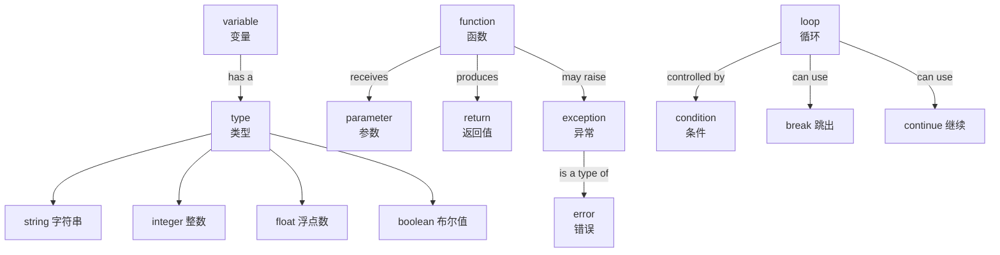

# 编程英文词汇

> **所属路径**：`00_高中复习/02_英语基础/01_技术词汇/02_编程英文词汇`
> **预计学习时间**：40 分钟
> **难度等级**：⭐

---

## 前置知识

- [数学英文词汇](../01_数学英文词汇/01_数学英文词汇.md)（部分术语在数学和编程中共用，如 variable、function）
- [逻辑与问题拆解](../../../03_信息素养/04_逻辑与问题拆解/)（理解编程的基本思维方式）

> 如果你已经完成了数学英文词汇的学习，这里很多词会让你有似曾相识的感觉——因为编程和数学共享了不少术语。本节的重点是那些编程特有的词汇。

---

## 学习目标

完成本节后，你将能够：

1. 识别并理解 35 个以上编程核心术语的英文含义
2. 读懂简单的 Python 代码注释和变量命名
3. 理解编程教程和文档中出现的基础技术词汇

---

## 正文讲解

### 1. 编程英文词汇的特殊之处

编程世界有一个有趣的特点：**代码本身就是英文写的**。当你写下 `if`、`for`、`return` 这些关键字时，你其实已经在使用英文了。而且，优秀的程序员会用有意义的英文单词给变量和函数命名，比如 `total_score`（总分）、`is_valid`（是否有效）。

这意味着学会编程英文词汇有双重收益：既能帮你读懂技术文档，又能帮你写出更好的代码。让我们从最基础的概念开始。

### 2. 基础概念词汇

这些词汇是编程世界的"砖瓦"，几乎每一行代码都会涉及它们。

| 英文 | 音标提示 | 中文 | 例句 / 代码示例 |
| ---- | -------- | ---- | --------------- |
| variable | /ˈveriəbl/ | 变量 | `x = 10` — x is a variable |
| value | /ˈvæljuː/ | 值 | The value of x is 10. |
| assign | /əˈsaɪn/ | 赋值 | Assign 10 to the variable x. |
| type | /taɪp/ | 类型 | The type of x is integer. |
| string | /strɪŋ/ | 字符串 | `"hello"` is a string. |
| integer | /ˈɪntɪdʒər/ | 整数 | `42` is an integer. |
| float | /floʊt/ | 浮点数 | `3.14` is a float. |
| boolean | /ˈbuːliən/ | 布尔值 | A boolean is either True or False. |
| array | /əˈreɪ/ | 数组 | An array of numbers: `[1, 2, 3]` |
| list | /lɪst/ | 列表 | Create a list in Python: `my_list = []` |

> 💡 **记忆技巧**：string（字符串）这个词的本意是"线、绳子"——可以想象字符像珠子一样穿在一根绳子上，形成一串。boolean 得名于英国数学家 George Boole，他发明了布尔代数（只有真和假两个值）。float 的本意是"漂浮"——浮点数中的小数点可以在数字间"漂移"。

### 3. 控制流词汇

**控制流（Control Flow）** 决定了代码的执行顺序。这些词汇是你在 [逻辑与问题拆解](../../../03_信息素养/04_逻辑与问题拆解/) 中学到的流程图概念的代码实现。

| 英文 | 音标提示 | 中文 | 代码示例 |
| ---- | -------- | ---- | -------- |
| condition | /kənˈdɪʃən/ | 条件 | Check a condition before executing. |
| if / else | /ɪf/ /els/ | 如果 / 否则 | `if x > 0: ... else: ...` |
| loop | /luːp/ | 循环 | Use a loop to repeat actions. |
| for | /fɔːr/ | 用于 for 循环 | `for i in range(10):` |
| while | /waɪl/ | 用于 while 循环 | `while x > 0:` |
| break | /breɪk/ | 跳出循环 | `break` exits the loop. |
| continue | /kənˈtɪnjuː/ | 继续下一次循环 | `continue` skips to next iteration. |
| return | /rɪˈtɜːrn/ | 返回 | `return result` |
| iterate | /ˈɪtəreɪt/ | 迭代 | Iterate over each element. |

> 💡 **记忆技巧**：loop（循环）的本意就是"环"——代码像跑圈一样反复执行。iterate 来自拉丁语 iter（路程），"走一遍又一遍"就是迭代。break 就是"打断"循环。

### 4. 函数与结构词汇

在编程中，**函数（Function）** 和数学中的函数概念有紧密联系：给定输入，产生输出。但编程中的函数功能更强大，还可以执行操作、修改状态。

| 英文 | 音标提示 | 中文 | 代码示例 |
| ---- | -------- | ---- | -------- |
| function | /ˈfʌŋkʃən/ | 函数 | `def my_function():` |
| parameter | /pəˈræmɪtər/ | 参数（定义时） | `def add(a, b):` — a, b are parameters |
| argument | /ˈɑːrɡjumənt/ | 参数（调用时） | `add(3, 5)` — 3, 5 are arguments |
| define | /dɪˈfaɪn/ | 定义 | Define a function using `def`. |
| call | /kɔːl/ | 调用 | Call the function: `add(3, 5)` |
| class | /klæs/ | 类 | `class Dog:` defines a class. |
| object | /ˈɒbdʒekt/ | 对象 | An object is an instance of a class. |
| method | /ˈmeθəd/ | 方法 | `my_list.append(5)` — append is a method. |
| module | /ˈmɒdjuːl/ | 模块 | `import math` — math is a module. |
| library | /ˈlaɪbreri/ | 库 | NumPy is a popular library. |

> 💡 **易混辨析**：parameter 和 argument 经常被混用，但严格来说有区别。parameter（形参）是定义函数时的占位符，argument（实参）是调用函数时传入的具体值。就像数学中 $f(x) = x + 1$ 里的 $x$ 是参数定义，而 $f(3)$ 中的 $3$ 是具体的参数值。

### 5. 操作与调试词汇

在编写和调试代码的过程中，你会频繁遇到这些术语。

| 英文 | 音标提示 | 中文 | 例句 |
| ---- | -------- | ---- | ---- |
| compile | /kəmˈpaɪl/ | 编译 | Compile the source code. |
| execute / run | /ˈeksɪkjuːt/ /rʌn/ | 执行 / 运行 | Execute the program. |
| debug | /diːˈbʌɡ/ | 调试 | Debug the code to find errors. |
| error | /ˈerər/ | 错误 | A syntax error was found. |
| bug | /bʌɡ/ | 程序缺陷 | Fix the bug in the code. |
| exception | /ɪkˈsepʃən/ | 异常 | An exception was raised. |
| syntax | /ˈsɪntæks/ | 语法 | Check the syntax of your code. |
| output | /ˈaʊtpʊt/ | 输出 | The output is `Hello World`. |
| input | /ˈɪnpʊt/ | 输入 | Get input from the user. |
| print | /prɪnt/ | 打印（输出到屏幕） | `print("Hello")` |
| import | /ˈɪmpɔːrt/ | 导入 | `import numpy as np` |
| install | /ɪnˈstɔːl/ | 安装 | Install the package using pip. |

> 💡 **趣味小知识**：bug（虫子）这个词在编程中表示"程序缺陷"，据说起源于 1947 年哈佛大学的一台计算机里真的飞进了一只飞蛾（moth），导致机器故障。从此，debug（除虫）就成了"调试"的代名词。

### 6. 词汇关联图

下面这张图展示了编程词汇之间的逻辑关系，帮助你在脑中建立结构化的记忆网络：



> 📌 **图解说明**：变量有类型（字符串、整数、浮点数、布尔值）；函数接收参数并返回结果，可能抛出异常；循环由条件控制，可以用 break 和 continue 控制流程。这些关系构成了编程的基本骨架。

---

## 动手实践

下面这段简短的 Python 代码包含了本节学到的许多术语。尝试找出代码中对应的英文词汇，并在注释中写出它们的中文含义。

```python
# 定义一个函数（function），接收一个参数（parameter）
def calculate_mean(numbers):
    total = 0                    # 变量（variable）赋值（assign）为 0
    for num in numbers:          # 循环（loop）遍历（iterate）列表（list）
        total = total + num
    mean = total / len(numbers)  # 计算均值（mean）
    return mean                  # 返回（return）结果

# 调用（call）函数，传入参数（argument）
scores = [85, 92, 78, 90, 88]   # 列表（list）
result = calculate_mean(scores)
print(result)                    # 打印（print）输出（output）
```

**任务**：运行这段代码（如果你已经安装了 Python），验证输出结果是否为 `86.6`。然后尝试修改代码，让函数同时返回均值和最大值（maximum）。

---

## 典型误区

| 误区 | 正确理解 |
| ---- | -------- |
| parameter 和 argument 完全相同 | parameter 是定义函数时的形式参数，argument 是调用时传入的实际值 |
| 认为 array 和 list 完全相同 | 在 Python 中，list 是内置类型；array 通常指 NumPy 的数组，两者功能不同 |
| debug 就是"修复 bug" | debug 的准确含义是"调试"，即找到并定位问题的过程，修复只是其中一步 |
| type 只是"打字"的意思 | 在编程中，type 主要指"数据类型"（如 int、str、float） |
| compile 和 execute 是一回事 | compile 是将源代码转换为机器码，execute 是运行这些代码。Python 是解释型语言，通常直接 execute |

---

## 练习题

### 练习 1：术语分类（难度：⭐）

将下列术语分为"数据类型"和"控制流"两组：

`string` · `for` · `integer` · `while` · `boolean` · `break` · `float` · `if` · `continue` · `array`

<details>
<summary>💡 提示</summary>

数据类型描述的是"数据是什么形式"，控制流描述的是"代码按什么顺序执行"。

</details>

<details>
<summary>✅ 参考答案</summary>

**数据类型**：string（字符串）、integer（整数）、boolean（布尔值）、float（浮点数）、array（数组）

**控制流**：for（for 循环）、while（while 循环）、break（跳出循环）、if（条件判断）、continue（继续下一次循环）

</details>

### 练习 2：代码阅读（难度：⭐）

阅读下面的 Python 代码片段，回答问题：

```python
def is_even(number):
    if number % 2 == 0:
        return True
    else:
        return False
```

1. 这个 function 的名字是什么？它的含义是什么？
2. `number` 是 parameter 还是 argument？
3. 这个函数的 return value（返回值）的 type（类型）是什么？

<details>
<summary>💡 提示</summary>

- 函数名 `is_even` 可以拆分为 is + even（偶数的）
- 思考 parameter 和 argument 的区别
- 函数返回 True 或 False，想想这是什么类型

</details>

<details>
<summary>✅ 参考答案</summary>

1. 函数名是 `is_even`，含义是"是否为偶数"（is = 是否，even = 偶数）
2. `number` 是 parameter（形参），因为它出现在函数定义中
3. 返回值类型是 boolean（布尔值），因为只返回 True 或 False

</details>

### 练习 3：英文填空（难度：⭐⭐）

用合适的编程英文术语补全下面的句子：

1. To use a package in Python, you need to ______ it first using `pip`.
2. When something goes wrong in your code, Python raises an ______.
3. A ______ repeats a block of code multiple times.
4. `def greet(name):` — here, `name` is a ______ of the function.
5. The ______ of `"hello"` is string.

<details>
<summary>💡 提示</summary>

1. 安装软件包的动作
2. 程序运行出错时产生的是什么
3. 重复执行代码块的结构
4. 函数定义中的占位符叫什么
5. 描述数据形式的词

</details>

<details>
<summary>✅ 参考答案</summary>

1. install（安装）
2. exception（异常）或 error（错误）
3. loop（循环）
4. parameter（参数/形参）
5. type（类型）

</details>

---

## 下一步学习

- 📖 下一个知识点：[人工智能英文词汇](../03_人工智能英文词汇/03_人工智能英文词汇.md)
- 🔗 相关知识点：[数学英文词汇](../01_数学英文词汇/01_数学英文词汇.md)、[编程语言基础](../../../../01_基础能力/01_开发环境与技术英语/01_编程语言基础/)
- 📚 拓展阅读：[阅读报错信息](../../02_阅读报错信息/)

---

## 参考资料

1. [Python 官方文档 — 术语表](https://docs.python.org/3/glossary.html) — Python 核心术语的官方定义（官方文档）
2. [MDN Web Docs — JavaScript Glossary](https://developer.mozilla.org/en-US/docs/Glossary) — 编程术语通用参考（CC BY-SA 许可）
3. [freeCodeCamp](https://www.freecodecamp.org/) — 免费编程学习平台，可在实践中巩固术语（公开课程）
4. [Real Python — Python Terms Beginners Should Know](https://realpython.com/python-keywords/) — Python 关键字详解（公开技术博客）
