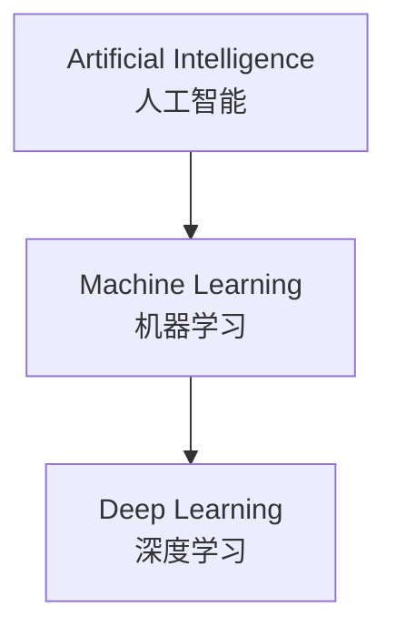
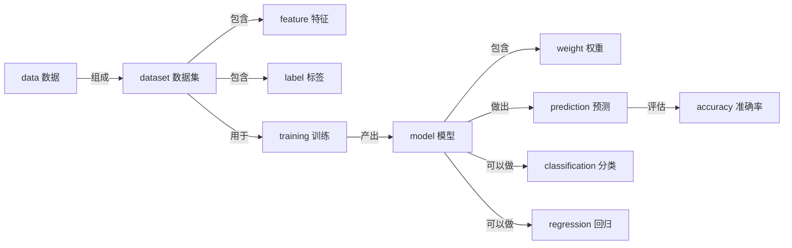

# 人工智能英文词汇

> **所属路径**：`00_高中复习/02_英语基础/01_技术词汇/03_人工智能英文词汇`
> **预计学习时间**：40 分钟
> **难度等级**：⭐⭐

---

## 前置知识

- [数学英文词汇](../01_数学英文词汇/01_数学英文词汇.md)（许多 AI 术语建立在数学词汇之上）
- [编程英文词汇](../02_编程英文词汇/02_编程英文词汇.md)（AI 系统需要通过代码实现）

> 如果以上两个知识点还没有完成，建议先行学习。AI 词汇很多是数学词汇和编程词汇的"组合升级"——例如 neural（神经的）+ network（网络）= neural network（神经网络）。有了前两节的基础，你会发现很多 AI 术语其实并不陌生。

---

## 学习目标

完成本节后，你将能够：

1. 识别并理解 30 个以上人工智能领域的核心英文术语
2. 读懂 AI 入门文章的标题和摘要中的关键词
3. 区分容易混淆的 AI 术语（如 AI vs. ML vs. DL）

---

## 正文讲解

### 1. 从一段新闻开始

你可能在新闻里见过这样的句子：

> *"OpenAI released a new large language model that uses deep learning and neural networks to generate human-like text through natural language processing."*

这短短一句话里就包含了 6 个 AI 专业术语。如果你不认识它们，这句话就像天书；但学完本节之后，你会发现它在说："OpenAI 发布了一个新的大语言模型，它使用深度学习和神经网络，通过自然语言处理来生成类似人类的文本。"

让我们从最宏观的概念开始，逐层深入。

### 2. AI 核心概念词汇

这组词汇定义了整个领域的基本框架。理解它们之间的包含关系是入门 AI 的第一步。

| 英文 | 音标提示 | 中文 | 说明 |
| ---- | -------- | ---- | ---- |
| Artificial Intelligence | /ˌɑːrtɪˈfɪʃəl ɪnˈtelɪdʒəns/ | 人工智能 | 简称 AI，让机器模拟人类智能的学科 |
| Machine Learning | /məˈʃiːn ˈlɜːrnɪŋ/ | 机器学习 | 简称 ML，AI 的子领域，让机器从数据中学习 |
| Deep Learning | /diːp ˈlɜːrnɪŋ/ | 深度学习 | 简称 DL，ML 的子领域，使用多层神经网络 |
| algorithm | /ˈælɡərɪðəm/ | 算法 | 解决问题的步骤化方法 |
| model | /ˈmɒdl/ | 模型 | 从数据中学到的规律的数学表示 |
| data | /ˈdeɪtə/ | 数据 | AI 系统学习的原料 |
| intelligence | /ɪnˈtelɪdʒəns/ | 智能 | 理解、推理和学习的能力 |

它们之间的关系可以用下面这张图来理解：

> 📌 **图解说明**：人工智能（AI）是最大的概念，机器学习（ML）是 AI 的一个子领域，深度学习（DL）又是 ML 的一个子领域。这个层级关系是 AI 入门必须理清的第一件事。

> 💡 **记忆技巧**：Artificial 的意思是"人造的"，对比 natural（自然的）——人工智能就是"人造的智能"。algorithm（算法）这个词来自 9 世纪波斯数学家 al-Khwarizmi 的名字，他被称为"算法之父"。

### 3. 神经网络与深度学习词汇

**神经网络（Neural Network）** 是深度学习的核心结构。以下词汇你在进入核心原理阶段后会反复遇到。

| 英文 | 音标提示 | 中文 | 说明 |
| ---- | -------- | ---- | ---- |
| neural network | /ˈnjʊərəl ˈnetwɜːrk/ | 神经网络 | 模仿大脑神经元连接的计算模型 |
| neuron | /ˈnjʊərɒn/ | 神经元 | 神经网络的基本计算单元 |
| layer | /ˈleɪər/ | 层 | 神经网络由多层组成 |
| weight | /weɪt/ | 权重 | 连接强度，模型学习的核心参数 |
| bias | /ˈbaɪəs/ | 偏置；偏差 | 神经元的额外调节参数 |
| activation | /ˌæktɪˈveɪʃən/ | 激活 | 神经元是否"激活"（产生输出） |
| input | /ˈɪnpʊt/ | 输入 | 送入模型的数据 |
| output | /ˈaʊtpʊt/ | 输出 | 模型产生的结果 |
| hidden layer | /ˈhɪdn ˈleɪər/ | 隐藏层 | 位于输入层和输出层之间的层 |

> 💡 **记忆技巧**：neural 来自 nerve（神经），"像神经一样的网络"就是 neural network。weight（权重）就像天平上的砝码——每个输入的"分量"不同。bias（偏置）就像调零旋钮——即使所有输入为零，输出也不一定为零。

### 4. 数据相关词汇

**数据（Data）** 是 AI 的燃料。无论用什么算法，没有高质量的数据就无法训练出好模型。

| 英文 | 音标提示 | 中文 | 说明 |
| ---- | -------- | ---- | ---- |
| dataset | /ˈdeɪtəset/ | 数据集 | 一组用于训练或测试的数据 |
| feature | /ˈfiːtʃər/ | 特征 | 描述数据的属性（如身高、体重） |
| label | /ˈleɪbl/ | 标签 | 数据的正确答案（如"猫"或"狗"） |
| training | /ˈtreɪnɪŋ/ | 训练 | 让模型从数据中学习的过程 |
| testing | /ˈtestɪŋ/ | 测试 | 检验模型效果的过程 |
| prediction | /prɪˈdɪkʃən/ | 预测 | 模型对新数据给出的答案 |
| annotation | /ˌænəˈteɪʃən/ | 标注 | 给数据添加标签的过程 |
| preprocessing | /priːˈprɒsesɪŋ/ | 预处理 | 对原始数据进行清洗和转换 |

> 💡 **记忆技巧**：feature 在日常英语中是"特点、特征"——就像你描述一个人的特征（高矮胖瘦），AI 也用特征来描述数据。label 就是"标签"——就像给物品贴标签告诉别人这是什么。

### 5. 模型与任务词汇

这组词汇描述了 AI 能做什么以及如何评价做得好不好。

| 英文 | 音标提示 | 中文 | 说明 |
| ---- | -------- | ---- | ---- |
| classification | /ˌklæsɪfɪˈkeɪʃən/ | 分类 | 把数据分到不同类别 |
| regression | /rɪˈɡreʃən/ | 回归 | 预测一个连续的数值 |
| recognition | /ˌrekəɡˈnɪʃən/ | 识别 | 识别图像、语音中的内容 |
| generation | /ˌdʒenəˈreɪʃən/ | 生成 | 创造新的文本、图像等内容 |
| Natural Language Processing | /ˈnætʃrəl ˈlæŋɡwɪdʒ ˈprɒsesɪŋ/ | 自然语言处理 | 简称 NLP，让机器理解人类语言 |
| Computer Vision | /kəmˈpjuːtər ˈvɪʒən/ | 计算机视觉 | 简称 CV，让机器"看懂"图像 |
| accuracy | /ˈækjərəsi/ | 准确率 | 模型预测正确的比例 |
| parameter | /pəˈræmɪtər/ | 参数 | 模型内部可学习的数值 |
| Large Language Model | /lɑːrdʒ ˈlæŋɡwɪdʒ ˈmɒdl/ | 大语言模型 | 简称 LLM，大规模语言模型（如 GPT） |

> 💡 **记忆技巧**：classification 来自 class（类别）+ ify（使成为）+ ation（名词后缀），"把东西归类的动作"就是分类。regression 在日常英语中有"回归、退步"的意思——统计学家 Galton 发现子女身高会"回归"到均值，因此得名。

### 6. 词汇层级全景图

让我们把本节学到的核心词汇按照它们的逻辑关系组织起来：

> 📌 **图解说明**：数据组成数据集，数据集包含特征和标签；数据集用于训练，训练产出模型；模型包含权重，做出预测；预测结果用准确率来评估。模型可以执行分类或回归等任务。

---

## 动手实践

现在让我们用一段真实的 AI 文章摘要来检验你的词汇量。阅读下面这段文字，尝试理解每个句子的含义：

> *"We trained a deep neural network for image classification on a large dataset of 1 million labeled images. The model consists of 12 hidden layers with millions of parameters. During training, the model learned features automatically from the input data. On the testing set, our model achieved 95% accuracy."*

**逐句翻译练习**（先自己尝试，再对照答案）：

| 原文 | 你的翻译 |
| ---- | -------- |
| We trained a deep neural network for image classification | |
| on a large dataset of 1 million labeled images | |
| The model consists of 12 hidden layers with millions of parameters | |
| During training, the model learned features automatically from the input data | |
| On the testing set, our model achieved 95% accuracy | |

✅ 参考翻译

1. 我们训练了一个深度神经网络来做图像分类
2. 使用了一个包含 100 万张已标注图片的大型数据集
3. 该模型由 12 个隐藏层组成，包含数百万个参数
4. 在训练过程中，模型自动从输入数据中学习特征
5. 在测试集上，我们的模型达到了 95% 的准确率

---

## 典型误区

| 误区 | 正确理解 |
| ---- | -------- |
| AI、ML、DL 是同一个东西 | 它们是层级包含关系：AI ⊃ ML ⊃ DL |
| bias 只有"偏见"一个意思 | 在神经网络中，bias 主要指"偏置"（一个数学参数）；在数据分析中才更多指"偏差/偏见" |
| parameter 在所有场景下含义相同 | 在函数调用中指"传入参数"，在模型中指"可学习的内部参数"（如权重），含义不同 |
| accuracy 越高模型一定越好 | accuracy 只是评估指标之一，还需要考虑数据是否平衡、是否过拟合等因素 |
| feature 就是"功能" | 在 AI 中，feature 主要指"特征"（数据的属性），而非产品功能 |

---

## 练习题

### 练习 1：术语层级排序（难度：⭐）

请将以下三个术语按"从大到小"的包含关系排序：

`Deep Learning` · `Artificial Intelligence` · `Machine Learning`

💡 提示

想想哪个概念最广泛，哪个最具体。回顾正文中的层级图。

✅ 参考答案

Artificial Intelligence（人工智能） ⊃ Machine Learning（机器学习） ⊃ Deep Learning（深度学习）

AI 是最大的概念，ML 是 AI 的子领域，DL 是 ML 的子领域。

### 练习 2：英译中匹配（难度：⭐）

将下列英文术语与对应的中文含义连线：

| 编号 | 英文 | | 中文 |
| ---- | ---- | -- | ---- |
| A | feature | | ① 准确率 |
| B | label | | ② 权重 |
| C | weight | | ③ 标签 |
| D | accuracy | | ④ 预处理 |
| E | preprocessing | | ⑤ 特征 |

💡 提示

- feature 描述数据的"什么特点"
- label 告诉你数据的"正确答案"
- weight 是模型内部的"连接强度"
- accuracy 衡量模型"对了多少"
- preprocessing 发生在训练"之前"

✅ 参考答案

A — ⑤（feature = 特征）

B — ③（label = 标签）

C — ②（weight = 权重）

D — ①（accuracy = 准确率）

E — ④（preprocessing = 预处理）

### 练习 3：缩写还原（难度：⭐⭐）

写出以下缩写的英文全称和中文含义：

1. AI = ______ （______）
2. ML = ______ （______）
3. DL = ______ （______）
4. NLP = ______ （______）
5. CV = ______ （______）
6. LLM = ______ （______）

💡 提示

这些缩写都在正文的词汇表中出现过。AI 是最大的概念，ML 和 DL 是它的子领域，NLP 和 CV 是两种主要的应用方向，LLM 是当前最热门的模型类型。

✅ 参考答案

1. AI = Artificial Intelligence（人工智能）
2. ML = Machine Learning（机器学习）
3. DL = Deep Learning（深度学习）
4. NLP = Natural Language Processing（自然语言处理）
5. CV = Computer Vision（计算机视觉）
6. LLM = Large Language Model（大语言模型）

---

## 下一步学习

- 📖 下一个知识点：[机器学习常用术语](../04_机器学习常用术语/04_机器学习常用术语.md)
- 🔗 相关知识点：[数学英文词汇](../01_数学英文词汇/01_数学英文词汇.md)、[人工智能概述](../../../../02_核心原理/01_经典人工智能/01_人工智能概述/)
- 📚 拓展阅读：[阅读文档](../../03_阅读文档/)

---

## 参考资料

1. [Google Machine Learning Glossary](https://developers.google.com/machine-learning/glossary) — Google 机器学习术语表，覆盖 AI/ML/DL 核心词汇（官方文档）
2. [Wikipedia — Artificial Intelligence](https://en.wikipedia.org/wiki/Artificial_intelligence) — AI 综述页面，含核心概念解释（公共知识库）
3. [Stanford CS229 — Machine Learning](https://cs229.stanford.edu/) — 斯坦福机器学习课程主页，术语使用的权威参考（公开课程）
4. [3Blue1Brown — But what is a neural network?](https://www.youtube.com/watch?v=aircAruvnKk) — 神经网络直觉可视化讲解（YouTube 公开课程）
