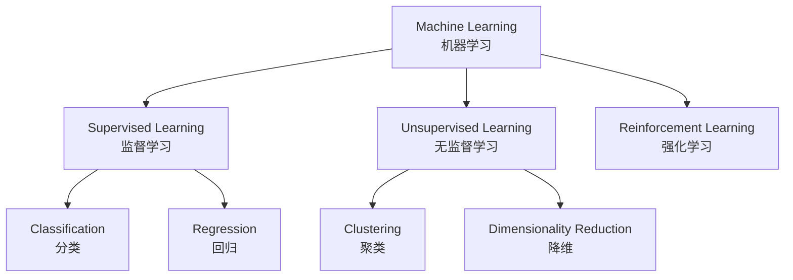
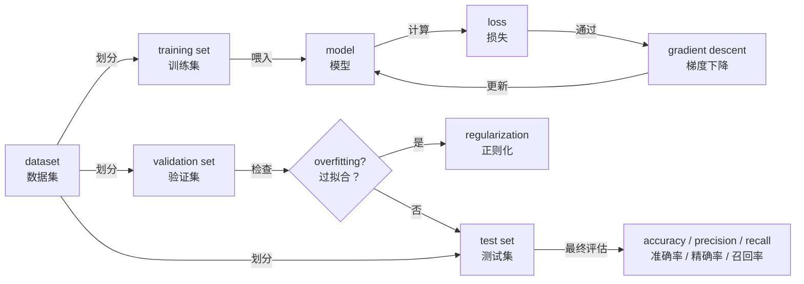

# 机器学习常用术语

> **所属路径**：`00_高中复习/02_英语基础/01_技术词汇/04_机器学习常用术语`
> **预计学习时间**：45 分钟
> **难度等级**：⭐⭐

---

## 前置知识

- [数学英文词汇](../01_数学英文词汇/01_数学英文词汇.md)（ML 术语大量建立在数学概念之上）
- [编程英文词汇](../02_编程英文词汇/02_编程英文词汇.md)（ML 实践离不开编程）
- [人工智能英文词汇](../03_人工智能英文词汇/03_人工智能英文词汇.md)（ML 是 AI 的子领域，需要先了解上层概念）

> 如果你已经完成了前三个知识点的学习，恭喜你！本节是技术词汇系列的最后一站。这里的术语更加具体和专业，是你未来深入学习机器学习时的"高频词汇表"。不需要现在就完全理解每个概念的数学原理——重点是建立"英文术语 ↔ 中文含义"的映射。

---

## 学习目标

完成本节后，你将能够：

1. 识别并理解 30 个以上机器学习方法论中的核心英文术语
2. 区分机器学习的三大学习范式（监督学习、无监督学习、强化学习）
3. 读懂机器学习入门教程中关于模型训练和评估的基本描述

---

## 正文讲解

### 1. 从一个比喻开始

想象你在教一个小朋友认识水果。你拿出一个苹果说"这是苹果"，拿出一个橙子说"这是橙子"——重复很多次之后，小朋友能自己区分苹果和橙子了。这就是 **监督学习（Supervised Learning）** 的基本思路：用带有标签的数据来教会模型。

但如果你只是把一堆水果放在桌上，让小朋友自己按照颜色、形状分类——没有告诉他"正确答案"——这就是 **无监督学习（Unsupervised Learning）** 。

还有一种情况：小朋友在玩游戏，做对了得奖励，做错了扣分，慢慢学会了最优策略——这就是 **强化学习（Reinforcement Learning）** 。

让我们正式进入机器学习的术语世界。

### 2. 学习范式词汇

这组词汇定义了机器学习的基本分类方式，是整个领域的"大框架"。

| 英文 | 音标提示 | 中文 | 说明 |
| ---- | -------- | ---- | ---- |
| Supervised Learning | /ˈsuːpərvaɪzd ˈlɜːrnɪŋ/ | 监督学习 | 用带标签的数据训练模型 |
| Unsupervised Learning | /ˌʌnˈsuːpərvaɪzd ˈlɜːrnɪŋ/ | 无监督学习 | 用无标签的数据发现模式 |
| Reinforcement Learning | /ˌriːɪnˈfɔːrsmənt ˈlɜːrnɪŋ/ | 强化学习 | 通过奖励和惩罚学习策略 |
| Semi-supervised Learning | /ˌsemi ˈsuːpərvaɪzd/ | 半监督学习 | 结合少量标签数据和大量无标签数据 |
| Self-supervised Learning | /self ˈsuːpərvaɪzd/ | 自监督学习 | 从数据本身构造学习信号 |
| Transfer Learning | /ˈtrænsfɜːr ˈlɜːrnɪŋ/ | 迁移学习 | 将一个任务上学到的知识应用到另一个任务 |

> 💡 **记忆技巧**：supervised 来自 supervise（监督），"有人监督的学习"意味着有正确答案（标签）。un- 是否定前缀，"没人监督"意味着没有标签。reinforcement 的意思是"强化"——通过奖惩来"强化"好的行为。

> 📌 **图解说明**：机器学习分为三大范式。监督学习的典型任务是分类和回归；无监督学习的典型任务是聚类和降维；强化学习通过与环境交互来学习最优策略。

### 3. 模型训练词汇

模型训练是机器学习的核心环节。以下术语描述了训练过程中会遇到的关键概念。

| 英文 | 音标提示 | 中文 | 说明 |
| ---- | -------- | ---- | ---- |
| training set | /ˈtreɪnɪŋ set/ | 训练集 | 用于训练模型的数据子集 |
| validation set | /ˌvælɪˈdeɪʃən set/ | 验证集 | 训练过程中用于调优的数据子集 |
| test set | /test set/ | 测试集 | 最终评估模型性能的数据子集 |
| epoch | /ˈiːpɒk/ | 轮次 | 模型遍历整个训练集一次 |
| batch | /bætʃ/ | 批次 | 一次训练使用的数据小组 |
| learning rate | /ˈlɜːrnɪŋ reɪt/ | 学习率 | 控制模型每一步更新幅度的参数 |
| loss | /lɒs/ | 损失 | 模型预测与真实值之间的差距 |
| loss function | /lɒs ˈfʌŋkʃən/ | 损失函数 | 计算损失的数学函数 |
| optimization | /ˌɒptɪmaɪˈzeɪʃən/ | 优化 | 调整模型参数以减小损失的过程 |
| convergence | /kənˈvɜːrdʒəns/ | 收敛 | 损失不再显著下降，训练趋于稳定 |

> 💡 **记忆技巧**：epoch 在日常英语中是"纪元、时代"的意思——训练一个 epoch 就是让模型经历一个完整的"时代"（遍历全部数据）。batch 是"一批"的意思——把数据分成小批次，每次喂一小批给模型。loss 就是"损失"——模型猜错了就有"损失"，训练的目标就是让损失尽量小。

### 4. 模型评估词汇

训练完模型后，我们需要评估它表现如何。这组词汇是评估模型好坏的"标尺"。

| 英文 | 音标提示 | 中文 | 说明 |
| ---- | -------- | ---- | ---- |
| overfitting | /ˈoʊvərfɪtɪŋ/ | 过拟合 | 模型在训练集上很好但在新数据上表现差 |
| underfitting | /ˈʌndərfɪtɪŋ/ | 欠拟合 | 模型连训练集都学不好 |
| generalization | /ˌdʒenərəlaɪˈzeɪʃən/ | 泛化 | 模型在从未见过的数据上的表现能力 |
| precision | /prɪˈsɪʒən/ | 精确率 | 预测为正的样本中实际为正的比例 |
| recall | /rɪˈkɔːl/ | 召回率 | 实际为正的样本中被正确预测的比例 |
| cross-validation | /krɒs ˌvælɪˈdeɪʃən/ | 交叉验证 | 将数据多次划分来更可靠地评估模型 |
| bias | /ˈbaɪəs/ | 偏差 | 模型预测值与真实值的系统性偏离 |
| variance | /ˈveriəns/ | 方差 | 模型对不同训练数据的敏感程度 |
| regularization | /ˌreɡjələrɪˈzeɪʃən/ | 正则化 | 防止过拟合的技术手段 |
| hyperparameter | /ˈhaɪpərpəˌræmɪtər/ | 超参数 | 训练前需要人为设定的参数 |

> 💡 **记忆技巧**：overfitting 可以理解为"过度贴合"——模型把训练数据的噪声都记住了，就像考试只背答案不理解原理，换个题就不会了。underfitting 是"贴合不足"——连基本规律都没学到。generalization 来自 general（通用的），泛化能力就是"通用能力"。

想一想：你准备考试时，如果只刷原题不思考（overfitting），换一套卷就考不好；如果连课本都没看完（underfitting），那原题也做不对。好的学习方式是**理解原理，举一反三**——这就是好的 generalization！

### 5. 常见算法与方法词汇

这组词汇涉及你在后续学习中会遇到的一些经典算法名称。现在只需认识它们的英文名和大致含义即可。

| 英文 | 音标提示 | 中文 | 说明 |
| ---- | -------- | ---- | ---- |
| Linear Regression | /ˈlɪniər rɪˈɡreʃən/ | 线性回归 | 用直线拟合数据的回归方法 |
| Logistic Regression | /ləˈdʒɪstɪk rɪˈɡreʃən/ | 逻辑回归 | 用于分类的回归方法 |
| Decision Tree | /dɪˈsɪʒən triː/ | 决策树 | 基于条件分支的树状模型 |
| Random Forest | /ˈrændəm ˈfɒrɪst/ | 随机森林 | 多棵决策树组合的集成模型 |
| clustering | /ˈklʌstərɪŋ/ | 聚类 | 把相似数据分到同一组 |
| dimensionality reduction | /ˌdɪmenʃəˈnæləti rɪˈdʌkʃən/ | 降维 | 减少数据特征维度 |
| gradient descent | /ˈɡreɪdiənt dɪˈsent/ | 梯度下降 | 通过梯度方向更新参数的优化方法 |
| ensemble | /ɒnˈsɒmbl/ | 集成 | 组合多个模型以提升性能 |
| fine-tuning | /faɪn ˈtjuːnɪŋ/ | 微调 | 在预训练模型基础上针对特定任务调整 |

> 💡 **记忆技巧**：Decision Tree（决策树）就像一棵倒过来的树——每个分支是一个"决策"（比如"年龄 > 30？"），沿着分支走到叶子就得到答案。Random Forest（随机森林）就是很多棵决策树的"森林"——众树成林，集思广益。gradient descent 中 descent 是"下降"的意思——沿着梯度方向一步步"走下坡"，找到损失最小的点。

### 6. 术语关联全景

让我们用一个完整的场景串联所有术语。假设你要训练一个模型来预测房价：

> 📌 **图解说明**：机器学习的典型工作流——将数据集划分为训练集、验证集和测试集；用训练集训练模型，通过损失函数和梯度下降不断优化；用验证集检查是否过拟合，必要时使用正则化；最终在测试集上评估模型性能。

---

## 动手实践

让我们用一段典型的机器学习论文摘要来综合检验你的词汇掌握情况。阅读下面这段文字，尝试理解每个术语的含义：

> *"We propose a supervised learning approach for sentiment classification. Our model is trained using gradient descent with a learning rate of 0.001 for 50 epochs. We split the dataset into training, validation, and test sets with a ratio of 80:10:10. To prevent overfitting, we apply regularization and use cross-validation. The model achieves a precision of 92% and a recall of 89% on the test set, demonstrating strong generalization ability."*

**词汇标注练习**：找出上面段落中所有你在本节学过的术语，写出它们的中文含义。

✅ 参考答案

- supervised learning — 监督学习
- classification — 分类
- model — 模型
- trained — 训练（train 的过去式）
- gradient descent — 梯度下降
- learning rate — 学习率
- epochs — 轮次
- dataset — 数据集
- training, validation, test sets — 训练集、验证集、测试集
- overfitting — 过拟合
- regularization — 正则化
- cross-validation — 交叉验证
- precision — 精确率
- recall — 召回率
- generalization — 泛化

---

## 典型误区

| 误区 | 正确理解 |
| ---- | -------- |
| Logistic Regression 是回归算法 | 虽然名字里有 Regression，但逻辑回归实际上用于**分类**任务 |
| parameter 和 hyperparameter 一样 | parameter（参数）是模型自动学习的，hyperparameter（超参数）是人为设定的 |
| precision 和 accuracy 意思相同 | accuracy 是整体正确率，precision 是"预测为正的里面对了多少"，含义不同 |
| 过拟合意味着模型太差 | 过拟合的模型在训练集上表现很好，只是在新数据上表现差——它不是"笨"，而是"死记硬背" |
| epoch 和 batch 是同一个概念 | 一个 epoch 是遍历整个训练集一次，一个 batch 是训练集中的一小部分 |

---

## 练习题

### 练习 1：学习范式判断（难度：⭐）

判断以下场景分别属于哪种学习范式（Supervised / Unsupervised / Reinforcement）：

1. 给机器看 1000 张标注了"猫"或"狗"的图片，让它学会区分猫狗
2. 给机器一堆客户消费数据（无标签），让它自动把客户分成几个群体
3. 训练一个 AI 下围棋，赢了加分输了扣分

💡 提示

关键区别：有标签 → Supervised；无标签 → Unsupervised；有奖惩 → Reinforcement。

✅ 参考答案

1. Supervised Learning（监督学习）— 有标签（"猫"或"狗"）
2. Unsupervised Learning（无监督学习）— 无标签，自动发现模式
3. Reinforcement Learning（强化学习）— 通过奖惩信号学习

### 练习 2：术语填空（难度：⭐）

用合适的英文术语填入空白处：

1. When a model performs well on training data but poorly on new data, it is called ______.
2. The ______ controls how much the model updates in each step during training.
3. One complete pass through the entire training dataset is called one ______.
4. ______ combines multiple models to achieve better performance.
5. The difference between the model's prediction and the true value is measured by the ______.

💡 提示

1. 训练好但泛化差的现象
2. 控制更新步长的参数
3. 遍历完整数据集一次
4. 组合多个模型的方法
5. 衡量预测差距的函数

✅ 参考答案

1. overfitting（过拟合）
2. learning rate（学习率）
3. epoch（轮次）
4. Ensemble（集成）
5. loss function（损失函数）

### 练习 3：概念辨析（难度：⭐⭐）

请用中文简要说明以下每组术语的区别：

1. training set vs. test set
2. parameter vs. hyperparameter
3. overfitting vs. underfitting
4. precision vs. recall

💡 提示

1. 两者在模型工作流中的角色不同
2. 一个是模型自动学的，一个是人为设定的
3. 一个是"学太多"，一个是"学太少"
4. 两者关注的"正确"角度不同

✅ 参考答案

1. **training set（训练集）** 用于训练模型，让模型从中学习规律；**test set（测试集）** 用于最终评估模型的性能，模型在训练时从未见过这些数据。

2. **parameter（参数）** 是模型在训练过程中自动学习和调整的内部数值（如权重）；**hyperparameter（超参数）** 是训练前由人为设定的外部配置（如学习率、epoch 数量）。

3. **overfitting（过拟合）** 是模型把训练数据记得太好（包括噪声），导致在新数据上表现差；**underfitting（欠拟合）** 是模型连训练数据的基本规律都没学到，在训练集和新数据上表现都差。

4. **precision（精确率）** 关注的是"我预测为正的里面有多少是真正的"；**recall（召回率）** 关注的是"所有真正为正的里面我找到了多少"。

---

## 下一步学习

- 📖 下一个主题：[阅读报错信息](../../02_阅读报错信息/)
- 🔗 相关知识点：[人工智能英文词汇](../03_人工智能英文词汇/03_人工智能英文词汇.md)、[回归](../../../../02_核心原理/02_经典机器学习/01_回归/)、[分类](../../../../02_核心原理/02_经典机器学习/02_分类/)
- 📚 拓展阅读：[阅读英文文档与技术资料](../../../../01_基础能力/01_开发环境与技术英语/08_阅读英文文档与技术资料/)

---

## 参考资料

1. [Google Machine Learning Glossary](https://developers.google.com/machine-learning/glossary) — 最全面的 ML 术语表之一（官方文档）
2. [scikit-learn User Guide — Glossary](https://scikit-learn.org/stable/glossary.html) — scikit-learn 官方术语表，配有代码示例（官方文档，BSD 许可）
3. [Stanford CS229 Lecture Notes](https://cs229.stanford.edu/main_notes.pdf) — 斯坦福机器学习课程讲义，术语使用的权威参考（公开课程资料）
4. [Machine Learning Mastery — Glossary](https://machinelearningmastery.com/glossary-of-deep-learning-terms/) — 面向初学者的 ML/DL 术语解释（公开技术博客）
