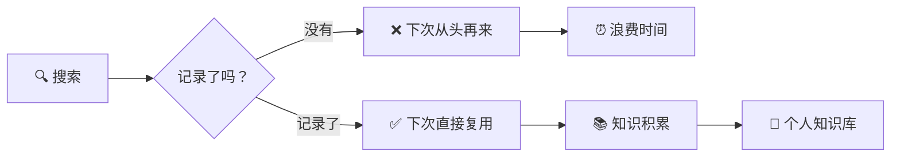
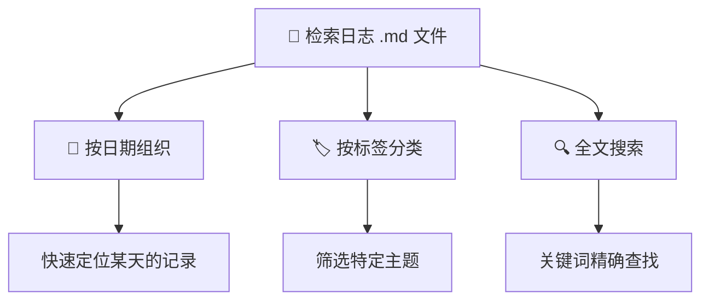
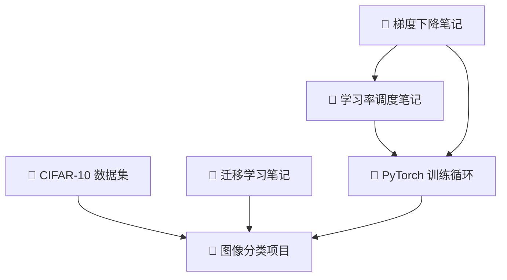
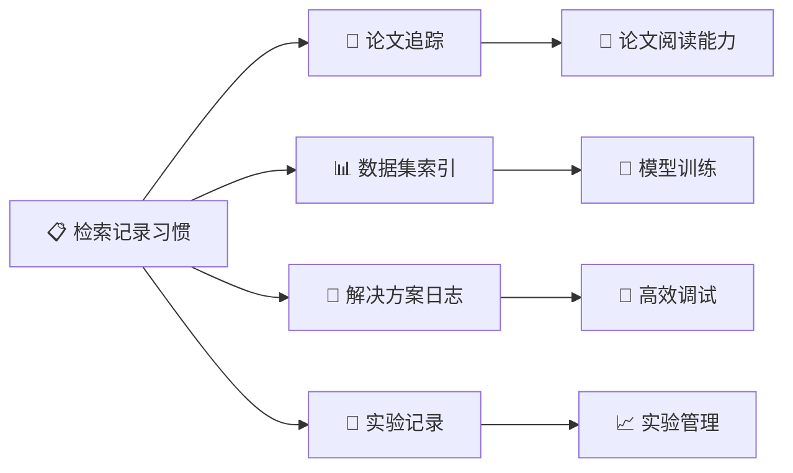

# 检索记录

> **所属路径**：`00_高中复习/03_信息素养/02_搜索与资料检索/03_检索记录`
> **预计学习时间**：25 分钟
> **难度等级**：⭐

---

## 前置知识

- [可信来源判断](../02_可信来源判断/02_可信来源判断.md) — 学会了判断信息是否可信后，下一步就是把有价值的检索过程和结果记录下来

> 如果以上内容还不熟悉，建议先完成对应课程再继续。

---

## 学习目标

完成本节后，你将能够：

1. 解释为什么系统记录检索过程对长期学习至关重要
2. 设计一条包含关键词、来源、发现和日期的完整检索记录
3. 使用 Markdown 模板建立结构化的检索日志
4. 运用书签分类和标签系统组织收藏的资源
5. 使用 Python 脚本管理检索记录（读写 JSON 文件）
6. 了解常用的知识管理工具，并选择适合自己的方案

---

## 正文讲解

### 1. 为什么要记录检索过程

想象这样一个场景：两周前你在学习 PyTorch 时，搜到了一篇特别好的博客文章，详细解释了 `DataLoader` 的多进程数据加载原理。当时你看了觉得"懂了"，就关掉了页面。今天你在写代码时遇到了 `num_workers` 参数导致的死锁问题，你记得之前看过相关内容——但那篇文章叫什么名字？在哪个网站？你用的什么关键词搜到的？全都想不起来了。于是你又花了半小时重新搜索，这次运气没那么好，搜到的文章质量参差不齐，又浪费了一个小时筛选。

这种经历几乎每个学习者都有过。问题的根源不在于搜索能力不行——前两节课我们已经学会了 [关键词设计](../01_关键词设计/01_关键词设计.md) 和 [可信来源判断](../02_可信来源判断/02_可信来源判断.md)——而在于你没有把搜索的成果保存下来。

**检索记录（Search Logging）** 就是解决这个问题的方法。它的核心理念很简单：**每次有价值的搜索都是一次"微型研究"，值得被记录下来**。养成记录习惯，你的每一次搜索都会变成可复用的知识资产，而不是用过即忘的一次性行为。



> 📌 **图解说明**：检索记录是把一次性的搜索行为变成可复用的知识资产的关键步骤。不记录就只能重复搜索；记录了就能不断积累。

具体来说，检索记录有三大好处：

- **避免重复搜索**：每次找到的好资源都有据可查，下次直接翻记录，不用重新搜索
- **跟踪学习进度**：记录本身就是一份学习轨迹——你可以回看自己一个月前在学什么、搜了哪些问题、找到了哪些答案
- **构建个人知识库**：随着记录的积累，你会拥有一个按主题组织的、经过你亲自筛选验证的资源库，这比任何"收藏夹吃灰"都有价值

对于学习人工智能的人来说，这一点尤其重要：你需要追踪读过哪些论文、找到了哪些数据集、尝试了哪些解决方案、哪些方法有效哪些无效。这些信息如果不记录，一两周后就会忘得一干二净。

### 2. 一条好的检索记录包含什么

那么，一条检索记录到底应该包含哪些信息呢？并不是简单地保存一个网址就够了。一条有用的检索记录需要回答四个核心问题：

| 核心问题 | 对应记录内容 | 为什么重要 |
| -------- | ------------ | ---------- |
| 我搜了什么？ | **使用的关键词** | 下次遇到类似问题时可以直接复用有效的关键词 |
| 我找到了什么？ | **来源信息**（标题、URL、作者） | 能快速回到原始资料，无需重新搜索 |
| 我学到了什么？ | **关键发现**（一两句话总结） | 不用重新阅读全文就能回忆核心内容 |
| 什么时候找到的？ | **日期** | 判断信息的时效性，尤其在技术领域 |

除了这四个核心要素，根据实际需要还可以添加一些辅助信息：

- **可信度评估**：用上一节学到的 CRAAP 框架给来源打个简单的等级（如 ⭐⭐⭐⭐）
- **标签分类**：给记录加上主题标签（如 `#PyTorch`、`#数据预处理`），方便后续检索
- **后续行动**：记录下一步计划（如"需要实际测试这个方法""回头看这篇论文的第 3 节"）

下面是一条完整的检索记录示例：

> **日期**：2024-03-15
> **关键词**：`PyTorch DataLoader num_workers deadlock`
> **来源**：[PyTorch 官方文档 — Data Loading](https://pytorch.org/docs/stable/data.html)
> **可信度**：⭐⭐⭐⭐⭐（官方文档）
> **关键发现**：`num_workers > 0` 时使用多进程加载数据，在 Windows 上需要把代码放在 `if __name__ == '__main__':` 块中，否则会导致死锁。推荐在调试时先用 `num_workers=0`。
> **标签**：`#PyTorch` `#数据加载` `#调试`
> **后续行动**：在项目代码中添加 `__main__` 保护

### 3. 用 Markdown 模板建立检索日志

知道了该记什么之后，下一个问题是：**记在哪里、用什么格式？** 最简单也最灵活的方式是使用 **Markdown（.md）文件** 作为检索日志。Markdown 是纯文本格式，可以用任何文本编辑器打开和编辑，同时也支持标题、表格、链接等丰富的排版功能——你正在阅读的这份教程就是用 Markdown 写的。

下面是一个实用的检索日志 Markdown 模板：

```markdown
# 检索日志

## 2024-03-15

### PyTorch DataLoader 死锁问题

- **关键词**：`PyTorch DataLoader num_workers deadlock`
- **来源**：[PyTorch Data Loading 文档](https://pytorch.org/docs/stable/data.html)
- **可信度**：⭐⭐⭐⭐⭐
- **发现**：num_workers > 0 在 Windows 需要 __main__ 保护
- **标签**：#PyTorch #数据加载 #调试
- **行动**：修改项目代码

---

## 2024-03-14

### Transformer 注意力机制入门

- **关键词**：`attention mechanism transformer 图解`
- **来源**：[The Illustrated Transformer (Jay Alammar)](https://jalammar.github.io/illustrated-transformer/)
- **可信度**：⭐⭐⭐⭐
- **发现**：自注意力通过 Query-Key-Value 计算加权和，多头注意力在不同子空间并行
- **标签**：#Transformer #注意力机制 #深度学习
- **行动**：阅读原论文 "Attention Is All You Need"
```

> 💡 **小技巧**：按日期倒序排列（最新的在最上面），这样打开文件就能看到最近的记录。每天如果搜了多个主题，每个主题用一个 `###` 三级标题分隔。

这个模板的好处在于：

1. **结构统一**：每条记录的格式一致，写起来快、查起来方便
2. **纯文本**：可以用 Git 进行版本控制，也可以直接用 `grep` 命令全文搜索
3. **可扩展**：需要时可以随时添加新字段，不受工具限制



> 📌 **图解说明**：Markdown 检索日志支持三种查找方式——按日期浏览、按标签筛选、全文搜索——满足不同场景下的查阅需求。

### 4. 书签组织策略

除了检索日志，**浏览器书签（Bookmarks）** 也是保存有价值网页的重要手段。但大多数人的书签栏都是一片混乱——几百个书签堆在一起，根本找不到想要的那个。这是因为只"收藏"了但没有"组织"。

有效的书签组织需要一个清晰的文件夹层级结构。对于学习人工智能的人来说，可以参考下面这个分类方案：

```
📂 AI 学习
├── 📂 官方文档
│   ├── PyTorch Docs
│   ├── TensorFlow Docs
│   └── scikit-learn Docs
├── 📂 教程与课程
│   ├── 📂 数学基础
│   ├── 📂 机器学习
│   └── 📂 深度学习
├── 📂 论文与研究
│   ├── 📂 已读
│   └── 📂 待读
├── 📂 工具与数据集
│   ├── 📂 数据集
│   ├── 📂 开发工具
│   └── 📂 可视化工具
└── 📂 问答与调试
    ├── Stack Overflow 精选
    └── GitHub Issues 参考
```

几个实用的书签管理原则：

- **最多三层文件夹**：层级太深反而不方便查找。大类 → 子类 → 具体书签，三层足够
- **定期清理**：每月花 10 分钟检查一遍，删除过时或重复的书签
- **配合标签使用**：一些浏览器扩展（如 Raindrop.io）支持给书签打标签，一个书签可以同时归入多个分类
- **书签 ≠ 检索记录**：书签只是保存了链接，检索记录还包含关键词、发现和评价。两者配合使用效果最好

### 5. 构建个人知识库

检索日志和书签解决了"保存"的问题，但随着积累的资源越来越多，你需要一个更系统的方案来组织和关联这些知识——这就是 **个人知识库（Personal Knowledge Base, PKB）** 的概念。

个人知识库不只是一个"笔记本"，它的核心特征是 **知识之间有关联**。比如你读了一篇关于"学习率调度"的文章，它和你之前记录的"梯度下降"笔记是相关的；你找到的一个数据集可能同时被"图像分类"和"迁移学习"两个主题用到。通过建立这些关联，零散的笔记就变成了一张有机的知识网络。



> 📌 **图解说明**：个人知识库中的笔记不是孤立的——它们通过主题关联形成一张网络。当你学习新内容时，把它和已有笔记建立联系，知识就会越来越牢固。

构建个人知识库有几种常见的工具选择：

| 工具类型 | 代表工具 | 特点 | 适合人群 |
| -------- | -------- | ---- | -------- |
| 纯文本 / Markdown | VS Code + 文件夹 | 简单灵活，可用 Git 版本控制 | 喜欢纯文本、熟悉命令行的人 |
| 笔记软件 | Notion、Obsidian | 支持双向链接、数据库视图 | 需要可视化管理的人 |
| 参考文献管理器 | Zotero | 专为学术文献设计，可存储 PDF 和标注 | 经常阅读论文的人 |
| 浏览器扩展 | Raindrop.io | 书签增强，支持标签和全文搜索 | 以网页资源为主的人 |

> 💡 **特别推荐**：**Zotero** 是一款免费、开源的参考文献管理工具。它可以一键从浏览器保存论文的元数据（标题、作者、摘要、DOI），自动下载 PDF 附件，支持分组和标签管理，还能生成引用格式。对于学习人工智能、需要大量阅读论文的人来说，Zotero 是最值得尽早使用的工具之一。

### 6. 与人工智能学习的连接

前面的内容适用于任何领域的学习者。但对于专门学习人工智能的你来说，检索记录还有一些特别的用途：

**论文追踪**：当你开始阅读学术论文时，记录每篇论文的标题、作者、发表年份、核心方法和你的理解。这将在后续 [论文阅读](../../../../04_持续研究/01_研究与持续学习/01_论文阅读/) 课程中成为核心技能。

**数据集索引**：记录你找到的每个数据集的名称、来源链接、大小、用途和许可证。训练模型时能快速找到合适的数据集，而不用每次都重新搜索。

**解决方案日志**：每次解决一个技术问题（如"GPU 显存不足"、"模型不收敛"），记录问题描述、最终解决方案和参考来源。这些记录在遇到类似问题时价值极高。

**实验记录**：记录不同模型配置的实验结果——超参数设置、训练时长、验证指标。这与后续 [实验管理](../../../../03_工程落地/01_人工智能工程化与部署/02_实验管理/) 课程的内容直接对接。



> 📌 **图解说明**：检索记录习惯在人工智能学习的各个阶段都有直接应用——从论文阅读到模型训练、从调试到实验管理。

---

## 动手实践

前面我们学习了检索记录的理论框架，现在来写一段 Python 代码，实现一个简单的检索记录管理器。这个程序可以添加新的检索记录、查看所有记录、按关键词搜索历史记录，并把数据持久化存储到 JSON 文件中。

```python
# 文件：code/search_log_manager.py
# 用途：演示如何用 Python 管理检索记录（读写 JSON 文件）
# 环境要求：Python 3.10+（无需额外库）

import json
import os
from datetime import date


def get_log_path():
    """获取检索日志文件的路径（与脚本同目录）。"""
    script_dir = os.path.dirname(os.path.abspath(__file__))
    return os.path.join(script_dir, "search_log.json")


def load_logs(filepath):
    """从 JSON 文件加载检索记录。如果文件不存在则返回空列表。"""
    if os.path.exists(filepath):
        with open(filepath, "r", encoding="utf-8") as f:
            return json.load(f)
    return []


def save_logs(filepath, logs):
    """将检索记录保存到 JSON 文件，使用缩进格式便于阅读。"""
    with open(filepath, "w", encoding="utf-8") as f:
        json.dump(logs, f, ensure_ascii=False, indent=2)


def add_log(logs, keywords, source_title, source_url, finding, tags=None):
    """
    添加一条新的检索记录。

    参数：
        logs: list - 现有的记录列表
        keywords: str - 使用的搜索关键词
        source_title: str - 来源标题
        source_url: str - 来源链接
        finding: str - 关键发现（一两句话总结）
        tags: list[str] | None - 标签列表
    返回：
        dict - 新添加的记录
    """
    entry = {
        "date": str(date.today()),
        "keywords": keywords,
        "source_title": source_title,
        "source_url": source_url,
        "finding": finding,
        "tags": tags or [],
    }
    logs.append(entry)
    return entry


def search_logs(logs, query):
    """
    在检索记录中搜索包含指定关键词的条目。
    搜索范围包括：关键词、来源标题、关键发现和标签。
    """
    query_lower = query.lower()
    results = []
    for entry in logs:
        searchable = " ".join([
            entry["keywords"],
            entry["source_title"],
            entry["finding"],
            " ".join(entry["tags"]),
        ]).lower()
        if query_lower in searchable:
            results.append(entry)
    return results


def display_log(entry):
    """格式化显示一条检索记录。"""
    print(f"  📅 日期：{entry['date']}")
    print(f"  🔑 关键词：{entry['keywords']}")
    print(f"  📄 来源：{entry['source_title']}")
    print(f"  🔗 链接：{entry['source_url']}")
    print(f"  💡 发现：{entry['finding']}")
    if entry["tags"]:
        print(f"  🏷️  标签：{', '.join(entry['tags'])}")
    print()


# ===== 演示：添加几条检索记录 =====
print("=" * 55)
print("检索记录管理器 — 演示")
print("=" * 55)

filepath = get_log_path()
logs = load_logs(filepath)

# 添加三条示例记录
add_log(
    logs,
    keywords="PyTorch DataLoader num_workers deadlock",
    source_title="PyTorch Data Loading 官方文档",
    source_url="https://pytorch.org/docs/stable/data.html",
    finding="num_workers > 0 在 Windows 需要 __main__ 保护",
    tags=["PyTorch", "数据加载", "调试"],
)

add_log(
    logs,
    keywords="attention mechanism transformer 图解",
    source_title="The Illustrated Transformer (Jay Alammar)",
    source_url="https://jalammar.github.io/illustrated-transformer/",
    finding="自注意力通过 Q-K-V 计算加权和，多头注意力并行",
    tags=["Transformer", "注意力机制", "深度学习"],
)

add_log(
    logs,
    keywords="CIFAR-10 dataset download Python",
    source_title="CIFAR-10 数据集主页",
    source_url="https://www.cs.toronto.edu/~kriz/cifar.html",
    finding="60000 张 32x32 彩色图像，10 个类别，可用 torchvision 直接加载",
    tags=["数据集", "图像分类", "PyTorch"],
)

# 保存到文件
save_logs(filepath, logs)
print(f"\n✅ 已保存 {len(logs)} 条记录到 {os.path.basename(filepath)}\n")

# ===== 演示：查看所有记录 =====
print("-" * 55)
print("📋 所有检索记录：")
print("-" * 55)
for i, entry in enumerate(logs, 1):
    print(f"\n【记录 {i}】")
    display_log(entry)

# ===== 演示：搜索记录 =====
search_term = "PyTorch"
print("-" * 55)
print(f"🔍 搜索包含 '{search_term}' 的记录：")
print("-" * 55)
results = search_logs(logs, search_term)
print(f"\n找到 {len(results)} 条匹配记录：\n")
for entry in results:
    display_log(entry)

# 清理演示文件
os.remove(filepath)
print(f"🧹 演示结束，已清理临时文件 {os.path.basename(filepath)}")
```

**运行说明**：
- 环境要求：Python 3.10+，无需安装额外库
- 运行命令：`python code/search_log_manager.py`

**预期输出**：
```
=======================================================
检索记录管理器 — 演示
=======================================================

✅ 已保存 3 条记录到 search_log.json

-------------------------------------------------------
📋 所有检索记录：
-------------------------------------------------------

【记录 1】
  📅 日期：2024-03-15
  🔑 关键词：PyTorch DataLoader num_workers deadlock
  📄 来源：PyTorch Data Loading 官方文档
  🔗 链接：https://pytorch.org/docs/stable/data.html
  💡 发现：num_workers > 0 在 Windows 需要 __main__ 保护
  🏷️  标签：PyTorch, 数据加载, 调试

【记录 2】
  📅 日期：2024-03-15
  🔑 关键词：attention mechanism transformer 图解
  📄 来源：The Illustrated Transformer (Jay Alammar)
  🔗 链接：https://jalammar.github.io/illustrated-transformer/
  💡 发现：自注意力通过 Q-K-V 计算加权和，多头注意力并行
  🏷️  标签：Transformer, 注意力机制, 深度学习

【记录 3】
  📅 日期：2024-03-15
  🔑 关键词：CIFAR-10 dataset download Python
  📄 来源：CIFAR-10 数据集主页
  🔗 链接：https://www.cs.toronto.edu/~kriz/cifar.html
  💡 发现：60000 张 32x32 彩色图像，10 个类别，可用 torchvision 直接加载
  🏷️  标签：数据集, 图像分类, PyTorch

-------------------------------------------------------
🔍 搜索包含 'PyTorch' 的记录：
-------------------------------------------------------

找到 2 条匹配记录：

  📅 日期：2024-03-15
  🔑 关键词：PyTorch DataLoader num_workers deadlock
  📄 来源：PyTorch Data Loading 官方文档
  🔗 链接：https://pytorch.org/docs/stable/data.html
  💡 发现：num_workers > 0 在 Windows 需要 __main__ 保护
  🏷️  标签：PyTorch, 数据加载, 调试

  📅 日期：2024-03-15
  🔑 关键词：CIFAR-10 dataset download Python
  📄 来源：CIFAR-10 数据集主页
  🔗 链接：https://www.cs.toronto.edu/~kriz/cifar.html
  💡 发现：60000 张 32x32 彩色图像，10 个类别，可用 torchvision 直接加载
  🏷️  标签：数据集, 图像分类, PyTorch

🧹 演示结束，已清理临时文件 search_log.json
```

从输出可以看到，通过 `add_log` 函数添加的每条记录都包含了日期、关键词、来源、发现和标签五个要素。`search_logs` 函数可以在所有字段中进行全文搜索——搜索 "PyTorch" 就同时命中了关键词中含 "PyTorch" 的记录和标签中含 "PyTorch" 的记录。所有数据以 JSON 格式存储，方便后续扩展和与其他工具集成。

---

## 典型误区

| 误区 | 正确理解 |
| ---- | -------- |
| 收藏了就等于记住了 | 浏览器书签只保存了链接，没有记录你的搜索过程和关键发现。收藏 100 个链接不如写 10 条有总结的检索记录 |
| 记录越详细越好 | 检索记录的目的是快速回顾和检索，每条记录保持简洁（关键发现一两句话即可）。过于冗长的记录反而降低查阅效率 |
| 等我找到完美的工具再开始记录 | 工具不重要，习惯才重要。用一个最简单的文本文件开始记录，比花一周时间研究笔记软件更有效。先养成习惯，再优化工具 |
| 只记录成功的搜索 | 失败的搜索同样有价值——记录"用了什么关键词但没找到有用结果"可以避免下次重蹈覆辙，也能帮你反思关键词设计策略 |

---

## 练习题

### 练习 1：编写一条检索记录（难度：⭐）

假设你今天搜索了"如何用 Python 读取 CSV 文件"，找到了 Pandas 官方文档中 `read_csv` 函数的说明页面。请按照本课学到的模板，写出一条完整的检索记录（包含日期、关键词、来源、关键发现和标签）。

<details>
<summary>💡 提示</summary>

回顾"一条好的检索记录包含什么"部分。关键发现应该是一两句话的总结，不需要复制整个文档内容。标签可以从技术栈和用途两个角度选择。

</details>

<details>
<summary>✅ 参考答案</summary>

一条可能的检索记录：

- **日期**：2024-03-15
- **关键词**：`Python 读取 CSV pandas read_csv`
- **来源**：[pandas.read_csv 官方文档](https://pandas.pydata.org/docs/reference/api/pandas.read_csv.html)
- **可信度**：⭐⭐⭐⭐⭐（官方文档）
- **关键发现**：`pd.read_csv("file.csv")` 可直接读取 CSV 文件为 DataFrame；常用参数包括 `encoding`（指定编码）、`sep`（指定分隔符）、`header`（指定表头行）
- **标签**：`#Pandas` `#数据处理` `#Python`
- **后续行动**：在项目中替换手动的文件读取代码

关键是包含了完整的五要素（日期、关键词、来源、发现、标签），且关键发现是简洁的总结而非大段复制。

</details>

### 练习 2：书签文件夹设计（难度：⭐）

你正在系统学习人工智能。请为以下 6 个书签设计一个两层的文件夹分类结构，并说明每个书签归入哪个文件夹：

1. PyTorch 官方教程
2. 一篇关于 CNN 原理的博客文章
3. Kaggle 上的泰坦尼克号数据集
4. Stack Overflow 上一个关于 CUDA 报错的问答
5. arXiv 上的 "Attention Is All You Need" 论文
6. NumPy 官方文档

<details>
<summary>💡 提示</summary>

思考这些资源的"类型"——有些是官方文档，有些是教程，有些是论文，有些是数据集，有些是调试参考。先确定大类，再把每个书签归类。

</details>

<details>
<summary>✅ 参考答案</summary>

一个合理的两层分类方案：

```
📂 AI 学习
├── 📂 官方文档
│   ├── 1. PyTorch 官方教程
│   └── 6. NumPy 官方文档
├── 📂 教程与博客
│   └── 2. CNN 原理博客
├── 📂 论文
│   └── 5. Attention Is All You Need
├── 📂 数据集
│   └── 3. Kaggle 泰坦尼克号数据集
└── 📂 问答与调试
    └── 4. CUDA 报错问答
```

分类依据：按"资源类型"作为第一层大类（官方文档、教程、论文、数据集、调试），每种类型内部的资源直接平铺。层级不超过两层，保持简洁。

</details>

### 练习 3：扩展搜索日志管理器（难度：⭐⭐）

在"动手实践"部分的 Python 代码基础上，请添加一个 `filter_by_tag` 函数，实现按标签筛选检索记录。函数签名如下：

```python
def filter_by_tag(logs, tag):
    """返回所有包含指定标签的记录。"""
```

例如，调用 `filter_by_tag(logs, "PyTorch")` 应返回所有标签中包含 "PyTorch" 的记录。

<details>
<summary>💡 提示</summary>

每条记录的 `tags` 字段是一个列表（如 `["PyTorch", "数据加载"]`）。你需要检查传入的 `tag` 是否在这个列表中。可以用列表推导式快速实现。

</details>

<details>
<summary>✅ 参考答案</summary>

```python
def filter_by_tag(logs, tag):
    """返回所有包含指定标签的记录。"""
    return [entry for entry in logs if tag in entry["tags"]]
```

使用示例：

```python
pytorch_logs = filter_by_tag(logs, "PyTorch")
print(f"标签为 'PyTorch' 的记录有 {len(pytorch_logs)} 条")
for entry in pytorch_logs:
    print(f"  - {entry['source_title']}")
```

预期输出：

```
标签为 'PyTorch' 的记录有 2 条
  - PyTorch Data Loading 官方文档
  - CIFAR-10 数据集主页
```

核心思路：用列表推导式遍历所有记录，检查 `tag` 是否在 `entry["tags"]` 列表中。这是 Python 中 `in` 运算符的典型用法——它会逐一检查列表中的每个元素是否与目标值相等。

</details>

---

## 下一步学习

- 📖 下一个知识点：[学术搜索与论文获取](../04_学术搜索与论文获取/04_学术搜索与论文获取.md) — 学会了记录检索过程之后，我们来学习如何搜索和获取学术论文
- 🔗 相关知识点：[双语术语卡片](../../../02_英语基础/04_总结与记笔记/01_双语术语卡片/01_双语术语卡片.md) — 将检索记录与术语卡片结合，提升知识管理效率
- 🔗 相关知识点：[版本备份](../../01_文件与文件夹管理/03_版本备份/03_版本备份.md) — 用 Git 等工具对检索日志进行版本控制

---

## 参考资料

1. [Zotero — Your personal research assistant](https://www.zotero.org/) — Zotero 官方网站，免费开源的参考文献管理工具，支持一键保存论文元数据和 PDF（开源工具）
2. [Personal Knowledge Management (Wikipedia)](https://en.wikipedia.org/wiki/Personal_knowledge_management) — 维基百科关于个人知识管理的综合介绍，涵盖概念、方法和工具（公共知识库）
3. [Markdown Guide — Getting Started](https://www.markdownguide.org/getting-started/) — Markdown 语法入门指南，帮助你快速上手用 Markdown 编写检索日志（CC BY-SA 许可）
