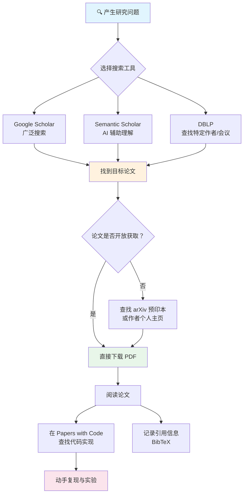

# 学术搜索与论文获取

> **所属路径**：`00_高中复习/03_信息素养/02_搜索与资料检索/04_学术搜索与论文获取`
> **预计学习时间**：40 分钟
> **难度等级**：⭐⭐

---

## 前置知识

- [检索记录](../03_检索记录/03_检索记录.md)

> 如果以上内容还不熟悉，建议先完成对应课程再继续。

---

## 学习目标

完成本节后，你将能够：

1. 解释学术论文在人工智能学习中的核心价值
2. 使用 Google Scholar、Semantic Scholar、arXiv 等学术搜索引擎查找论文
3. 识别论文的基本结构，并快速提取摘要中的关键信息
4. 区分开放获取与付费论文，通过合法途径获取论文全文
5. 了解引用指标（h-index、引用次数）的含义及局限性
6. 使用 BibTeX 格式管理参考文献
7. 通过 Papers with Code 查找论文对应的代码实现

---

## 正文讲解

### 1. 为什么要学会查找学术论文

在前面几节课中，我们学会了 **[关键词设计](../01_关键词设计/01_关键词设计.md)** 、 **[可信来源判断](../02_可信来源判断/02_可信来源判断.md)** 和 **[检索记录](../03_检索记录/03_检索记录.md)** ——这些技能帮助我们在日常学习中高效地搜索信息。但你可能会问：日常搜索已经够用了，为什么还要学查论文？

答案藏在人工智能这个领域的特殊性中。

想象一下：2017 年，Google 的研究团队发表了一篇名为《Attention Is All You Need》的论文，提出了 **Transformer** 架构。短短几年后，这个架构成为了 ChatGPT、GPT-4 等大语言模型的核心基础。如果你只靠搜索博客和教程，可能要等上一两年才能了解到这些前沿知识；但如果你会查论文，发表当天就能读到原始思想。

学术论文的价值可以用三个关键词概括：

- **前沿性（Cutting-edge）**：论文是新知识的"源头活水"，几乎所有 AI 突破都首先以论文形式发布
- **可复现性（Reproducibility）**：好的论文会详细描述方法和实验，让你能够重现结果、验证真伪
- **权威性（Authority）**：经过同行评审的论文，比博客文章有更高的可信度

> 💡 **小贴士**：你不需要现在就能完全读懂一篇论文——这是 [04_持续研究/01_研究与持续学习/01_论文阅读](../../../../04_持续研究/01_研究与持续学习/01_论文阅读/) 阶段会深入学习的内容。本节课的目标是让你"找得到"论文，为将来"读得懂"打下基础。

### 2. 学术搜索引擎全景

日常搜索用百度或 Google，学术搜索则有一套专门的工具。下面我们逐一认识它们：

#### Google Scholar（谷歌学术）

**[Google Scholar](https://scholar.google.com/)** 是目前覆盖面最广的学术搜索引擎，几乎索引了所有学科的学术文献——期刊论文、会议论文、学位论文、技术报告、书籍章节等。

它的核心优势是：

- 搜索语法与普通 Google 搜索类似，上手容易
- 提供"被引用次数"，帮助你快速判断一篇论文的影响力
- 提供"相关文章"链接，方便你顺藤摸瓜找到更多相关研究
- 可以直接导出 BibTeX 格式的引用信息

#### Semantic Scholar（语义学术）

**[Semantic Scholar](https://www.semanticscholar.org/)** 由 AI 研究机构 Allen Institute for AI 开发，它的特色是利用 AI 技术帮你理解论文：

- 自动提取论文的关键信息（如研究主题、方法、数据集）
- 提供 **TLDR（Too Long; Didn't Read）** 功能——用一句话概括论文内容
- 展示论文之间的引用关系图，帮助你理解研究脉络
- 对计算机科学和 AI 领域的覆盖尤其全面

#### arXiv（预印本平台）

**[arXiv](https://arxiv.org/)**（读作"archive"，X 代表希腊字母 χ）是一个免费的 **预印本（Preprint）** 平台。所谓预印本，就是论文在正式发表之前的版本。在 AI 领域，几乎所有重要论文都会先发布在 arXiv 上，有时甚至比正式发表早好几个月。

arXiv 的关键特点：

- **完全免费**：所有论文全文开放下载
- **更新极快**：研究者今天投稿，明天就可能上线
- **覆盖广泛**：涵盖物理、数学、计算机科学、统计学等多个领域

#### DBLP（计算机科学文献库）

**[DBLP](https://dblp.org/)** 专注于计算机科学领域，是查找特定作者、特定会议/期刊论文的利器。如果你想查某位 AI 研究者发表过哪些论文，DBLP 是最佳选择。

#### Papers with Code（论文带代码）

**[Papers with Code](https://paperswithcode.com/)** 是 AI 学习者的宝藏网站。它不仅收录论文，还链接了论文对应的 **开源代码实现** 和 **基准测试排行榜（Leaderboard）**。当你读完一篇论文想动手实践时，这个网站能帮你快速找到可运行的代码。

下面这张图展示了这些工具之间的关系和典型使用场景：



> 📌 **图解说明**：这张流程图展示了一个完整的"论文发现工作流"——从产生研究问题开始，经过搜索、获取、阅读，到最终的代码复现。不同的搜索工具适合不同的场景，你可以根据需要灵活选择。

### 3. 理解论文的基本结构

在学会搜索之前，我们先来了解一篇学术论文长什么样。几乎所有 AI 领域的论文都遵循类似的结构：

| 部分 | 英文名称 | 核心问题 | 阅读优先级 |
| ---- | -------- | -------- | ---------- |
| 标题 | Title | 这篇论文研究什么？ | ⭐⭐⭐ |
| 摘要 | Abstract | 做了什么、怎么做的、结果如何？ | ⭐⭐⭐ |
| 引言 | Introduction | 为什么要做这个研究？ | ⭐⭐ |
| 方法 | Method / Approach | 具体怎么实现的？ | ⭐⭐ |
| 实验 | Experiments | 效果好不好？和别人比怎么样？ | ⭐⭐ |
| 结论 | Conclusion | 主要贡献和未来方向是什么？ | ⭐ |
| 参考文献 | References | 基于哪些前人工作？ | ⭐ |

> 💡 **高效阅读策略**：对于初学者，建议按"标题 → 摘要 → 结论 → 引言 → 实验 → 方法"的顺序阅读，而不是从头到尾线性阅读。先抓住全局，再深入细节。

### 4. 如何快速阅读论文摘要

**摘要（Abstract）** 是一篇论文最浓缩的精华，通常只有 150–300 个英文单词，但包含了你判断"这篇论文是否值得细读"所需的全部信息。

一个典型的摘要通常包含四个要素，我们可以用一个简单的公式来记忆：

$$
\text{摘要} = \text{问题（Problem）} + \text{方法（Method）} + \text{结果（Result）} + \text{意义（Significance）}
$$

让我们用一个真实的例子来练习。以下是《Attention Is All You Need》论文摘要的简化版（原文为英文，这里给出中英对照）：

> **问题**：当前主流的序列转换模型基于复杂的循环或卷积神经网络。
> **方法**：我们提出了一种新的简单网络架构——Transformer，完全基于注意力机制。
> **结果**：在机器翻译任务上，Transformer 模型在质量上更优，同时训练时间大幅缩短。
> **意义**：这种架构具有更好的并行性，为后续研究奠定了基础。

读摘要时，试着在脑中提取这四个要素，你就能在 1–2 分钟内判断这篇论文是否与你的需求相关。

### 5. 深入了解 arXiv

arXiv 是 AI 学习者最常用的论文来源，值得我们多花一些时间了解它。

#### arXiv ID 的含义

每篇 arXiv 论文都有一个唯一的 **arXiv ID**，格式为 `YYMM.NNNNN`，其中：

- `YY` 是年份后两位
- `MM` 是月份
- `NNNNN` 是该月的流水号

例如，`2306.12420` 表示这是 2023 年 6 月上传的第 12420 篇论文。

知道了 arXiv ID，你就可以直接拼接 URL 来访问论文：

- 论文页面：`https://arxiv.org/abs/2306.12420`
- PDF 下载：`https://arxiv.org/pdf/2306.12420`

#### arXiv 的分类体系

arXiv 按学科领域分类，AI 相关论文主要分布在以下类别：

| 分类代码 | 领域 | 说明 |
| -------- | ---- | ---- |
| `cs.AI` | 人工智能 | 通用 AI 研究 |
| `cs.LG` | 机器学习 | 机器学习理论与方法 |
| `cs.CL` | 计算与语言 | 自然语言处理 |
| `cs.CV` | 计算机视觉 | 图像、视频处理 |
| `cs.RO` | 机器人学 | 机器人相关研究 |
| `stat.ML` | 机器学习（统计） | 侧重统计学习理论 |

### 6. 引用指标：如何评估论文影响力

当你搜索到大量论文时，如何快速判断哪些值得优先阅读？引用指标可以提供参考。

#### 引用次数（Citation Count）

一篇论文被其他论文引用的次数。引用次数越高，通常说明这篇论文越有影响力。例如：

- 《Attention Is All You Need》的引用次数超过 100,000 次——这是划时代级别的工作
- 一篇引用次数达到 1,000 的论文，通常是该细分领域的重要工作

#### h-index（h 指数）

**h 指数（h-index）** 是衡量一位研究者学术影响力的指标。定义如下：

$$
\text{一位研究者的 h-index} = h \iff \text{该研究者有至少 } h \text{ 篇论文，每篇被引用至少 } h \text{ 次}
$$

例如，如果某位研究者的 h-index 为 30，意味着他/她至少有 30 篇论文，每篇至少被引用了 30 次。

#### ⚠️ 引用指标的局限性

引用指标虽然有用，但有明显的局限性，使用时需要注意：

- **时间偏差**：新论文还没来得及被引用，引用次数自然低，但不代表质量差
- **领域偏差**：热门领域（如大语言模型）的论文引用次数天然高于冷门领域
- **自引与互引**：部分引用来自作者自己或合作伙伴的论文
- **马太效应**：已经被大量引用的论文更容易被发现和继续引用

> 💡 **正确态度**：引用指标是一个有用的参考信号，但绝不是论文质量的唯一标准。不要因为一篇论文引用次数低就忽视它，也不要因为引用次数高就盲目信任它。

### 7. 开放获取与论文的合法获取

不是所有论文都能免费下载。根据访问方式的不同，论文大致分为两类：

| 类型 | 英文 | 说明 | 示例 |
| ---- | ---- | ---- | ---- |
| 开放获取 | Open Access (OA) | 任何人都可以免费阅读和下载 | arXiv 预印本、部分期刊 |
| 付费获取 | Paywalled | 需要付费或通过机构订阅访问 | 大部分传统期刊 |

好消息是，在 AI 领域，绝大多数重要论文都有免费的获取途径：

**合法获取论文的方式：**

1. **arXiv 预印本**：大多数 AI 论文都会上传 arXiv 预印本版本
2. **作者个人主页**：许多研究者会在自己的个人网站上提供论文 PDF
3. **机构访问**：如果你所在的学校或单位订阅了相关数据库，可以通过校园网直接下载
4. **开放获取期刊**：部分期刊（如 JMLR）本身就是完全开放获取的
5. **论文作者邮件请求**：直接给作者发邮件请求论文副本，这在学术界是被广泛接受的做法

> ⚠️ **注意**：请勿使用未经授权的方式获取付费论文——这不仅涉及法律风险，也不利于学术出版生态的健康发展。

### 8. 参考文献管理与 BibTeX

当你开始积累阅读过的论文，就需要一种系统的方式来管理它们。**BibTeX** 是学术界最常用的参考文献格式，几乎所有学术搜索引擎都支持导出 BibTeX。

一条 BibTeX 记录长这样：

```bibtex
@article{vaswani2017attention,
  title   = {Attention Is All You Need},
  author  = {Vaswani, Ashish and Shazeer, Noam and Parmar, Niki and
             Uszkoreit, Jakob and Jones, Llion and Gomez, Aidan N and
             Kaiser, Lukasz and Polosukhin, Illia},
  journal = {Advances in Neural Information Processing Systems},
  volume  = {30},
  year    = {2017}
}
```

各字段的含义：

| 字段 | 含义 | 示例 |
| ---- | ---- | ---- |
| `@article` | 文献类型（期刊、会议等） | `@article`、`@inproceedings` |
| `vaswani2017attention` | 引用键（自定义标识符） | 通常用"作者+年份+关键词" |
| `title` | 论文标题 | Attention Is All You Need |
| `author` | 作者列表 | 用 `and` 分隔多位作者 |
| `journal` / `booktitle` | 发表在哪个期刊或会议 | NeurIPS、ICML 等 |
| `year` | 发表年份 | 2017 |

### 9. Papers with Code：从论文到代码

读论文的终极目的之一是动手实践。**[Papers with Code](https://paperswithcode.com/)** 完美地连接了"读论文"和"写代码"这两个环节。

它的核心功能包括：

- **论文 + 代码对应**：列出每篇论文的所有开源实现，标注编程语言和框架
- **基准排行榜**：展示各任务（如图像分类、机器翻译）上最好的方法和得分
- **数据集索引**：查找论文中使用的公开数据集
- **方法组件库**：将论文中的技术方法拆解为可复用的组件

使用技巧：在 Papers with Code 搜索一篇论文后，查看 "Code" 标签页，优先选择 ⭐ 数量最多的实现——这通常意味着代码质量更高、社区验证更充分。

---

## 动手实践

学会了这些概念，接下来我们用 Python 来动手操作。下面的代码演示如何使用 Semantic Scholar 的公开 API 搜索论文，并解析 BibTeX 引用信息。

> **环境要求**：Python 3.10+，requests 库（`pip install requests`）

```python
# 文件：code/search_paper.py
# 用途：使用 Semantic Scholar API 搜索 AI 论文并展示基本信息
# 依赖：requests（pip install requests）

import requests
import json


def search_papers(query: str, limit: int = 5) -> list[dict]:
    """
    使用 Semantic Scholar API 搜索论文
    
    参数:
        query: 搜索关键词
        limit: 返回结果数量
    返回:
        论文信息列表
    """
    url = "https://api.semanticscholar.org/graph/v1/paper/search"
    params = {
        "query": query,
        "limit": limit,
        "fields": "title,year,citationCount,authors,externalIds,tldr"
    }
    
    response = requests.get(url, params=params, timeout=10)
    response.raise_for_status()
    
    data = response.json()
    return data.get("data", [])


def display_paper_info(paper: dict) -> None:
    """格式化展示单篇论文信息"""
    title = paper.get("title", "未知标题")
    year = paper.get("year", "未知年份")
    citations = paper.get("citationCount", 0)
    
    # 提取作者列表（最多显示 3 位）
    authors = paper.get("authors", [])
    author_names = [a.get("name", "") for a in authors[:3]]
    if len(authors) > 3:
        author_names.append("等")
    
    # 提取 arXiv ID（如果有）
    external_ids = paper.get("externalIds") or {}
    arxiv_id = external_ids.get("ArXiv", "无")
    
    # 提取 TLDR（一句话摘要）
    tldr = paper.get("tldr")
    tldr_text = tldr.get("text", "无") if tldr else "无"
    
    print(f"📄 标题: {title}")
    print(f"   作者: {', '.join(author_names)}")
    print(f"   年份: {year}")
    print(f"   引用: {citations} 次")
    print(f"   arXiv: {arxiv_id}")
    print(f"   TLDR: {tldr_text[:80]}{'...' if len(tldr_text) > 80 else ''}")
    print()


def generate_bibtex_key(paper: dict) -> str:
    """根据论文信息生成 BibTeX 引用键"""
    authors = paper.get("authors", [])
    first_author = authors[0].get("name", "unknown").split()[-1].lower() if authors else "unknown"
    year = paper.get("year", "0000")
    # 取标题第一个有意义的词
    title_words = paper.get("title", "untitled").split()
    keyword = title_words[0].lower() if title_words else "untitled"
    return f"{first_author}{year}{keyword}"


def paper_to_bibtex(paper: dict) -> str:
    """将论文信息转换为简单的 BibTeX 格式"""
    key = generate_bibtex_key(paper)
    title = paper.get("title", "")
    year = paper.get("year", "")
    authors = paper.get("authors", [])
    author_str = " and ".join(a.get("name", "") for a in authors)
    
    bibtex = f"""@article{{{key},
  title  = {{{title}}},
  author = {{{author_str}}},
  year   = {{{year}}}
}}"""
    return bibtex


# === 主程序 ===
if __name__ == "__main__":
    query = "transformer attention mechanism"
    print(f"🔍 搜索关键词: '{query}'")
    print("=" * 60)
    
    try:
        papers = search_papers(query, limit=3)
        
        if not papers:
            print("未找到相关论文，请检查网络连接或更换关键词。")
        else:
            print(f"\n📚 找到 {len(papers)} 篇论文:\n")
            
            for i, paper in enumerate(papers, 1):
                print(f"--- 第 {i} 篇 ---")
                display_paper_info(paper)
            
            # 为第一篇论文生成 BibTeX
            print("=" * 60)
            print("📝 第一篇论文的 BibTeX 引用:\n")
            print(paper_to_bibtex(papers[0]))
    
    except requests.exceptions.RequestException as e:
        print(f"❌ 网络请求失败: {e}")
        print("提示: 请检查网络连接，或稍后重试。")
```

**运行命令**：`python code/search_paper.py`

**预期输出**（具体内容取决于 API 返回的实时数据）：
```
🔍 搜索关键词: 'transformer attention mechanism'
============================================================

📚 找到 3 篇论文:

--- 第 1 篇 ---
📄 标题: Attention Is All You Need
   作者: Ashish Vaswani, Noam Shazeer, Niki Parmar, 等
   年份: 2017
   引用: 100000+ 次
   arXiv: 1706.03762
   TLDR: A new simple network architecture based solely on attention mechanisms...

--- 第 2 篇 ---
📄 标题: ...
   ...

============================================================
📝 第一篇论文的 BibTeX 引用:

@article{vaswani2017attention,
  title  = {Attention Is All You Need},
  author = {Ashish Vaswani and Noam Shazeer and ...},
  year   = {2017}
}
```

从运行结果可以看到，我们通过几行 Python 代码就实现了论文搜索和 BibTeX 引用生成。Semantic Scholar 的公开 API 不需要注册即可使用（有频率限制），非常适合学习和小规模使用。

---

## 典型误区

| 误区 | 正确理解 |
| ---- | -------- |
| 引用次数高的论文一定是好论文 | 引用次数受时间、领域热度、马太效应等多种因素影响。新发表的优秀论文引用次数可能很低，而某些被广泛引用的论文后来也可能被证明有缺陷 |
| arXiv 上的论文都是经过审核的 | arXiv 只做基本的格式和内容合规检查（如是否包含攻击性内容），**不进行同行评审**。上面的论文质量参差不齐，需要自行判断 |
| 只有发表在顶级会议上的论文才值得读 | 许多重要的技术思想最初以 arXiv 预印本或非顶级会议论文的形式出现。判断论文价值要看内容本身，而不仅仅看发表渠道 |
| 找不到免费 PDF 就只能付费购买 | 在 AI 领域，绝大多数论文都有合法的免费获取途径（arXiv 预印本、作者主页等）。付费下载通常是最后选项 |

---

## 练习题

### 练习 1：搜索一篇经典 AI 论文（难度：⭐）

请使用 Google Scholar 或 Semantic Scholar，搜索论文"ImageNet Classification with Deep Convolutional Neural Networks"（即经典的 AlexNet 论文），并回答以下问题：

1. 这篇论文的第一作者是谁？
2. 发表于哪一年？
3. 截至目前大约被引用了多少次？
4. 它有 arXiv 预印本吗？

<details>
<summary>💡 提示</summary>

在 Google Scholar 中直接搜索论文标题即可。点击论文下方的"引用"/"Cited by" 链接可以看到引用次数。试着在 arXiv 上搜索同样的标题。

</details>

<details>
<summary>✅ 参考答案</summary>

1. 第一作者是 **Alex Krizhevsky**
2. 发表于 **2012 年**，发表在 NeurIPS（当时叫 NIPS）会议上
3. 截至近期，引用次数约 **120,000+** 次（具体数字会随时间增长）
4. 这篇论文比较特殊，**没有** arXiv 预印本——它发表于 arXiv 在 AI 领域广泛使用之前。但可以从 NeurIPS 官网获取 PDF

</details>

### 练习 2：解读 arXiv ID（难度：⭐）

给出以下 arXiv ID，请推断每篇论文的上传时间（年份和月份），并拼接出论文的 arXiv 页面 URL：

1. `1706.03762`
2. `2005.14165`
3. `2303.08774`

<details>
<summary>💡 提示</summary>

arXiv ID 格式为 `YYMM.NNNNN`，其中 `YY` 是年份后两位，`MM` 是月份。论文页面 URL 为 `https://arxiv.org/abs/` 加上 ID。

</details>

<details>
<summary>✅ 参考答案</summary>

1. `1706.03762`：**2017 年 6 月**，URL: `https://arxiv.org/abs/1706.03762`（这正是 Attention Is All You Need）
2. `2005.14165`：**2020 年 5 月**，URL: `https://arxiv.org/abs/2005.14165`（这是 GPT-3 论文）
3. `2303.08774`：**2023 年 3 月**，URL: `https://arxiv.org/abs/2303.08774`（这是 GPT-4 技术报告）

</details>

### 练习 3：提取摘要四要素（难度：⭐⭐）

阅读以下简化版论文摘要，提取其中的"问题—方法—结果—意义"四个要素：

> "Training deep neural networks is complicated by the fact that the distribution of each layer's inputs changes during training. We propose a new mechanism: Batch Normalization, which normalizes layer inputs for each mini-batch. This allows us to use much higher learning rates and achieve state-of-the-art performance on ImageNet classification, reaching the same accuracy with 14 times fewer training steps."

<details>
<summary>💡 提示</summary>

逐句分析：第一句通常描述问题，中间描述方法，后面描述结果，最后暗示意义。

</details>

<details>
<summary>✅ 参考答案</summary>

- **问题**：训练深度神经网络时，每层输入的分布在训练过程中不断变化，导致训练困难
- **方法**：提出了 **批归一化（Batch Normalization）** 机制，对每个 mini-batch 的层输入进行归一化
- **结果**：可以使用更高的学习率，在 ImageNet 分类任务上达到最先进的性能，用少 14 倍的训练步数就达到了相同的精度
- **意义**：显著加速了深度网络的训练过程，降低了训练难度

</details>

### 练习 4：编写 BibTeX 条目（难度：⭐⭐）

请为以下论文信息手动编写一条 BibTeX 记录：

- 标题：BERT: Pre-training of Deep Bidirectional Transformers for Language Understanding
- 作者：Jacob Devlin, Ming-Wei Chang, Kenton Lee, Kristina Toutanova
- 发表会议：NAACL
- 年份：2019

<details>
<summary>💡 提示</summary>

会议论文使用 `@inproceedings` 类型。引用键可以用"第一作者姓氏 + 年份 + 关键词"的格式。会议名称放在 `booktitle` 字段中。

</details>

<details>
<summary>✅ 参考答案</summary>

```bibtex
@inproceedings{devlin2019bert,
  title     = {BERT: Pre-training of Deep Bidirectional Transformers
               for Language Understanding},
  author    = {Devlin, Jacob and Chang, Ming-Wei and Lee, Kenton
               and Toutanova, Kristina},
  booktitle = {Proceedings of NAACL},
  year      = {2019}
}
```

注意：`@inproceedings` 用于会议论文（而非 `@article`），`booktitle` 对应会议名称。

</details>

---

## 下一步学习

- 📖 下一个知识主题：[表格与数据处理](../../03_表格与数据处理/)
- 🔗 相关知识点：[关键词设计](../01_关键词设计/01_关键词设计.md) — 搜索论文同样需要精心设计关键词
- 🔗 进阶学习：[论文阅读](../../../../04_持续研究/01_研究与持续学习/01_论文阅读/) — 系统学习如何深度阅读和理解学术论文
- 📚 拓展阅读：[Semantic Scholar API 文档](https://api.semanticscholar.org/) — 了解更多编程化论文搜索的方法

---

## 参考资料

1. [arXiv.org](https://arxiv.org/) — 康奈尔大学维护的免费预印本平台，AI 领域最重要的论文来源（开放获取）
2. [Semantic Scholar](https://www.semanticscholar.org/) — Allen Institute for AI 开发的 AI 驱动学术搜索引擎（免费使用）
3. [Papers with Code](https://paperswithcode.com/) — 连接论文与开源代码实现的平台，含基准排行榜（开放获取）
4. [Google Scholar 帮助中心](https://scholar.google.com/intl/en/scholar/help.html) — Google Scholar 的官方使用指南（官方文档）
5. [S. Keshav, "How to Read a Paper"](http://ccr.sigcomm.org/online/files/p83-keshavA.pdf) — 经典论文阅读方法指南，提出"三遍阅读法"（公开 PDF，ACM SIGCOMM）
