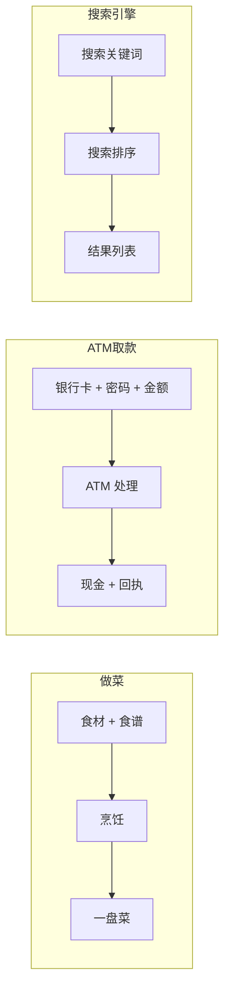
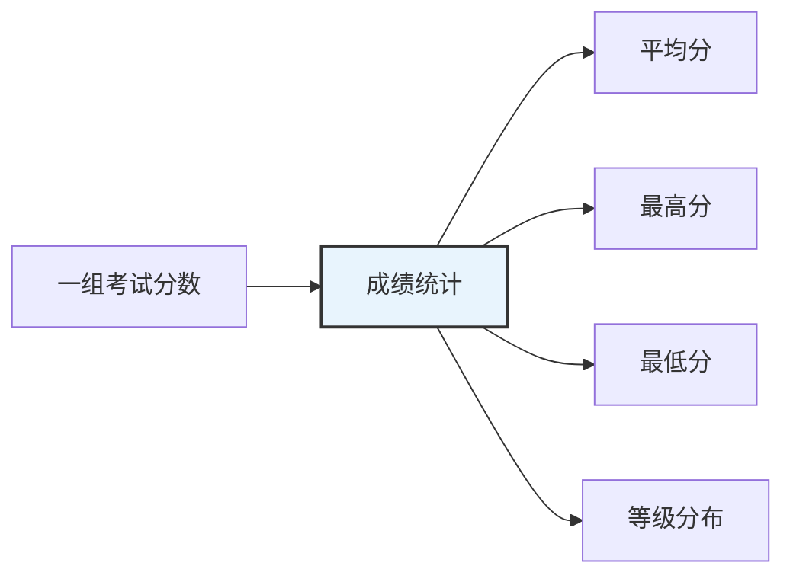

# 输入输出分析

> **所属路径**：`00_高中复习/03_信息素养/04_逻辑与问题拆解/01_输入输出分析`
> **预计学习时间**：30 分钟
> **难度等级**：⭐

---

## 前置知识

- [数据录入规范](../../03_表格与数据处理/01_数据录入规范/01_数据录入规范.md) — 理解数据格式有助于分析输入输出的数据类型

> 如果以上内容还不熟悉，建议先完成对应课程再继续。

---

## 学习目标

完成本节后，你将能够：

1. 解释什么是"输入"和"输出"，并用黑盒模型描述任意过程
2. 识别日常生活和计算机程序中的输入与输出
3. 区分不同数据类型的输入和输出（数字、文本、列表、文件）
4. 理解一个过程可以拥有多个输入和多个输出
5. 初步了解"副作用"的概念
6. 将输入输出分析的思维应用于理解人工智能模型的工作方式

---

## 正文讲解

### 1. 从一道菜说起——"黑盒"思维

想象你走进一家餐厅，把菜单上的菜名告诉服务员，过了一会儿，一盘热气腾腾的菜端到你面前。对于你来说，厨房里到底发生了什么、厨师用了几口锅、切菜切了几刀，你都不知道——你只知道自己给出了一个"菜名"，最终得到了"一盘菜"。

这就是 **输入输出分析（Input/Output Analysis）** 的核心思想：把一个过程看作一个"黑盒"，我们只关心 **输入（Input）** 是什么、 **输出（Output）** 是什么，而暂时不纠结中间的具体步骤。

为什么这种思维方式如此重要？因为面对复杂问题时，如果一开始就钻进内部细节，很容易迷失方向。先搞清楚"进去了什么、出来了什么"，是理解和拆解任何问题的第一步。

下面这张图展示了黑盒模型的基本结构：


> 📌 **图解说明**：任何一个过程都可以抽象为"输入 → 黑盒 → 输出"的结构。黑盒内部的具体实现我们暂时不关心，先聚焦于进出两端。

从图中可以看到，黑盒模型将复杂的过程简化为三个部分。这种简化并不是偷懒，而是一种强大的分析工具——它让我们能在不了解全部细节的情况下，先把握住问题的整体框架。

### 2. 生活中的输入和输出

为了加深理解，我们来看几个日常生活中的例子。你会发现，输入输出无处不在。

**例 1：做菜**

| 输入 | 过程 | 输出 |
| ---- | ---- | ---- |
| 食材（鸡蛋、盐、油）、食谱 | 烹饪 | 一盘炒鸡蛋 |

**例 2：ATM 取款**

| 输入 | 过程 | 输出 |
| ---- | ---- | ---- |
| 银行卡、密码、取款金额 | ATM 处理 | 现金、交易回执 |

**例 3：搜索引擎**

| 输入 | 过程 | 输出 |
| ---- | ---- | ---- |
| 搜索关键词 | 搜索与排序 | 搜索结果列表 |

想一想：在 ATM 取款这个例子里，为什么有三个输入？少了任何一个会怎样？如果你不插卡，ATM 不知道你是谁；如果你不输密码，ATM 无法验证身份；如果你不输金额，ATM 不知道该吐多少钱。每一个输入都是不可或缺的。

下面我们用一张 Mermaid 图把这三个例子放在一起对比：



> 📌 **图解说明**：三个日常场景对比，展示不同过程的输入数量和输出数量可以各不相同——有的只有一个输入（搜索引擎），有的有三个输入（ATM）；有的只有一个输出（做菜），有的有两个输出（ATM）。

从这些例子中我们可以总结出一个规律：不同的过程可以有不同数量的输入和输出。接下来，让我们把这个概念搬到计算机的世界。

### 3. 计算机中的输入和输出——函数

在编程中，最能体现输入输出思维的概念就是 **函数（Function）** 。一个函数接收 **参数（Parameter）** 作为输入，经过计算后 **返回值（Return Value）** 作为输出。

比如一个计算圆面积的函数：

- **输入**：半径 $r$
- **过程**：计算面积

$$
S = \pi r^2
$$

- **输出**：面积 $S$

这个公式告诉我们，只要知道半径 $r$ ，就能唯一确定面积 $S$ 。输入和输出之间有一个清晰的、确定性的关系。


> 📌 **图解说明**：函数 `circle_area()` 就是一个黑盒，输入半径 $r$ ，输出面积 $S$ 。调用者不需要关心函数内部用了什么公式，只需要知道"给它半径，它返回面积"。

### 4. 输入输出的数据类型

在真实的计算机程序中，输入和输出不只是数字。常见的 **数据类型（Data Type）** 包括：

| 数据类型 | 举例 | 使用场景 |
| -------- | ---- | -------- |
| 数字（整数、小数） | $42$ ， $3.14$ | 数学计算、统计 |
| 文本（字符串） | `"你好世界"` | 搜索、聊天 |
| 布尔值 | `True` / `False` | 判断条件 |
| 列表 | `[1, 2, 3, 4, 5]` | 批量数据 |
| 文件 | `photo.jpg` ， `data.csv` | 图像处理、数据分析 |

想一想：当你用手机拍照并发送给朋友时，输入是什么？输出是什么？数据类型是什么？

- 输入：拍摄到的光信号（由传感器转换为数字图像文件）
- 输出：朋友手机上显示的照片（图像文件）
- 数据类型：文件（图像文件）

理解数据类型有助于我们更精确地描述一个过程的输入输出，这在后续学习编程和人工智能时尤为重要。

### 5. 多输入与多输出

前面的 ATM 例子已经暗示了：一个过程可以有 **多个输入** ，也可以有 **多个输出** 。

我们再来看一个学习中的例子——成绩统计：

- **输入**：一组学生的考试分数（列表），例如 `[85, 92, 78, 95, 88]`
- **输出**：
  - 平均分（数字）
  - 最高分（数字）
  - 最低分（数字）
  - 成绩等级分布（列表）



> 📌 **图解说明**：成绩统计过程接收一个输入（分数列表），产生四个不同的输出。一个黑盒可以同时生成多个结果。

从图中可以看出，多输出是非常常见的——一次处理可以同时得出多个有用的结果，而不必为每个结果单独运行一次。

### 6. 副作用——"隐藏的输出"

到目前为止，我们讨论的输出都是通过返回值显式给出的。但在真实的程序中，有些过程除了返回值之外，还会产生其他影响，这就是所谓的 **副作用（Side Effect）** 。

什么是副作用？简单来说，就是一个过程在"正式输出"之外，还偷偷做了其他事情。比如：

| 过程 | 正式输出（返回值） | 副作用 |
| ---- | -------------------- | ------ |
| 存钱到银行 | 存款成功确认 | 银行账户余额增加 |
| 打印函数 `print()` | 无返回值 | 屏幕上显示文字 |
| 保存文件 | 保存成功状态 | 磁盘上多了一个文件 |

副作用不一定是坏事，但它让输入输出的分析变得更复杂。在学习编程时，我们应该有意识地区分"返回值"和"副作用"，这有助于写出更清晰、更可靠的代码。

> 💡 **小贴士**：在后续学习函数式编程时，你会发现很多设计原则都在尽量减少副作用，让函数变成"纯粹的输入输出映射"。这就是输入输出分析思维在高级编程中的体现。

### 7. 连接人工智能——模型就是"输入→输出"的映射

现在，让我们把视野拉远一些。在人工智能领域，一个 **机器学习模型（Machine Learning Model）** 本质上也是一个"黑盒"：

- **输入**：特征数据（比如一张图片的像素值、一段文字的词语序列）
- **输出**：预测结果（比如"这张图片是一只猫"、"这段文字的情感是正面的"）


> 📌 **图解说明**：机器学习模型和我们讨论过的所有黑盒一样，接收输入（特征数据），产生输出（预测结果）。不同的是，这个黑盒的内部规则是通过大量数据"学习"出来的，而不是人手动编写的。

你不需要现在就理解模型内部如何工作——那是后续课程的内容。现在你只需要记住：**分析任何人工智能系统，第一步永远是搞清楚它的输入是什么、输出是什么。** 这正是本节课要教你的核心技能。

---

## 动手实践

前面我们用文字和图表理解了输入输出分析的概念，现在让我们用 Python 代码来亲手实践一下。

### 实践 1：单输入单输出——计算圆面积

```python
# 文件：code/circle_area.py
# 环境：Python 3.10+（无额外依赖）
import math


def circle_area(radius: float) -> float:
    """计算圆的面积。

    输入：radius — 圆的半径（浮点数，单位自定）
    输出：圆的面积（浮点数）
    """
    return math.pi * radius ** 2


# 测试：输入半径 5，预期输出约 78.54
result = circle_area(5)
print(f"半径 = 5 时，面积 = {result:.2f}")
```

**运行说明**：
- 环境要求：Python 3.10+，无需安装第三方库
- 运行命令：`python code/circle_area.py`

**预期输出**：
```
半径 = 5 时，面积 = 78.54
```

在这个例子中，函数的输入（ $radius$ ）和输出（面积）都非常清晰。函数签名中的 `radius: float` 和 `-> float` 就是 **类型提示（Type Hint）** ，它明确告诉阅读代码的人：输入是什么类型、输出是什么类型。

### 实践 2：多输入多输出——成绩统计

```python
# 文件：code/score_stats.py
# 环境：Python 3.10+（无额外依赖）


def score_statistics(scores: list[float]) -> dict[str, float]:
    """统计一组成绩的关键指标。

    输入：scores — 成绩列表（浮点数列表）
    输出：包含平均分、最高分、最低分的字典
    """
    return {
        "average": sum(scores) / len(scores),
        "max": max(scores),
        "min": min(scores),
    }


# 测试
scores = [85, 92, 78, 95, 88]
stats = score_statistics(scores)
print(f"输入成绩：{scores}")
print(f"平均分：{stats['average']:.1f}")
print(f"最高分：{stats['max']:.0f}")
print(f"最低分：{stats['min']:.0f}")
```

**运行说明**：
- 环境要求：Python 3.10+，无需安装第三方库
- 运行命令：`python code/score_stats.py`

**预期输出**：
```
输入成绩：[85, 92, 78, 95, 88]
平均分：87.6
最高分：95
最低分：78
```

注意这个函数的输入是一个列表（多个分数），输出是一个字典（包含三个统计结果）。通过字典，我们可以在一次函数调用中返回多个值，这正对应了前面"多输入多输出"的概念。

### 实践 3：副作用演示——带日志的函数

```python
# 文件：code/side_effect_demo.py
# 环境：Python 3.10+（无额外依赖）


def add_with_log(a: float, b: float) -> float:
    """计算两数之和，并在屏幕上打印日志（副作用）。

    输入：a, b — 两个数字
    输出（返回值）：两数之和
    副作用：在屏幕上打印计算过程
    """
    print(f"  [日志] 正在计算 {a} + {b} ...")  # 这是副作用！
    result = a + b
    print(f"  [日志] 计算完成，结果为 {result}")  # 这也是副作用！
    return result


# 测试
print("调用 add_with_log(3, 7)：")
answer = add_with_log(3, 7)
print(f"返回值：{answer}")
print()
print("注意：屏幕上的日志信息就是'副作用'——")
print("它们不是通过返回值传递的，而是函数在执行过程中'额外'产生的。")
```

**运行说明**：
- 环境要求：Python 3.10+，无需安装第三方库
- 运行命令：`python code/side_effect_demo.py`

**预期输出**：
```
调用 add_with_log(3, 7)：
  [日志] 正在计算 3 + 7 ...
  [日志] 计算完成，结果为 10
返回值：10

注意：屏幕上的日志信息就是'副作用'——
它们不是通过返回值传递的，而是函数在执行过程中'额外'产生的。
```

通过这个例子可以清楚地看到：函数的"正式输出"是返回值 $10$ ，而屏幕上打印的日志信息是"副作用"。两者都是函数执行的结果，但性质不同。

---

## 典型误区

| 误区 | 正确理解 |
| ---- | -------- |
| "输入只有一个，输出也只有一个" | 一个过程可以有零个、一个或多个输入，也可以有零个、一个或多个输出。ATM 取款就有三个输入和两个输出 |
| "屏幕上显示的内容就是输出" | 屏幕显示可能只是副作用。真正的"输出"是函数的返回值，副作用是额外的影响 |
| "搞清楚输入输出就够了，不需要了解内部" | 黑盒思维是分析的 **第一步** ，不是唯一一步。理解内部机制是后续深入学习的目标，但先明确输入输出能帮助你快速建立全局认知 |
| "输入输出分析只在编程中有用" | 输入输出分析是一种通用思维方式，适用于做菜、理财、科学实验等一切需要分析"因果关系"的场景 |

---

## 练习题

### 练习 1：识别输入输出（难度：⭐）

请分析以下日常场景的输入和输出：

**场景：使用手机地图导航从家到学校。**

请列出该过程的所有输入和输出。

<details>
<summary>💡 提示</summary>

想一想：导航软件需要知道哪些信息才能工作？它最终给你提供了什么？除了路线之外还有没有其他输出？

</details>

<details>
<summary>✅ 参考答案</summary>

**输入**：

- 起点位置（家的地址或当前 GPS 坐标）
- 终点位置（学校的地址）
- 出行方式（步行 / 骑行 / 驾车 / 公交）
- 当前时间（影响路况和公交班次）

**输出**：

- 推荐路线（可能有多条）
- 预计到达时间
- 总距离
- 实时导航语音提示（副作用）

</details>

### 练习 2：给函数画黑盒图（难度：⭐）

下面是一个 Python 函数签名：

```python
def bmi(weight_kg: float, height_m: float) -> str:
    ...
```

请回答：
1. 这个函数有几个输入？分别是什么类型？
2. 输出是什么类型？
3. 试着用文字画一个黑盒图（格式：`输入 → [过程] → 输出`）。

<details>
<summary>💡 提示</summary>

注意函数签名中的类型提示： `weight_kg: float` 表示输入是浮点数， `-> str` 表示输出是字符串。BMI 是身体质量指数。

</details>

<details>
<summary>✅ 参考答案</summary>

1. 两个输入：体重 `weight_kg`（浮点数）和身高 `height_m`（浮点数）
2. 输出：一个字符串（可能是 BMI 值对应的等级描述，如"正常"、"偏重"等）
3. 黑盒图：

$$\text{weight\_kg (float)} + \text{height\_m (float)} \;\longrightarrow\; [\text{bmi()}] \;\longrightarrow\; \text{等级描述 (str)}$$

</details>

### 练习 3：编写函数（难度：⭐⭐）

请编写一个 Python 函数 `temperature_convert` ，实现以下输入输出：

- **输入**：摄氏温度 $C$ （浮点数）
- **输出**：一个字典，包含对应的华氏温度 $F$ 和开尔文温度 $K$

转换公式：

$$F = C \times 1.8 + 32$$

$$K = C + 273.15$$

<details>
<summary>💡 提示</summary>

参考实践 2 中成绩统计函数的写法，返回一个包含两个键值对的字典。别忘了加类型提示！

</details>

<details>
<summary>✅ 参考答案</summary>

```python
def temperature_convert(celsius: float) -> dict[str, float]:
    return {
        "fahrenheit": celsius * 1.8 + 32,
        "kelvin": celsius + 273.15,
    }

# 测试
result = temperature_convert(100)
print(result)
# 预期输出：{'fahrenheit': 212.0, 'kelvin': 373.15}
```

验证：将 $C = 100$ 代入公式：

$$F = 100 \times 1.8 + 32 = 212.0$$

$$K = 100 + 273.15 = 373.15$$

</details>

### 练习 4：分析 AI 模型的输入输出（难度：⭐⭐）

假设有一个"垃圾邮件分类器"，它能判断一封邮件是否为垃圾邮件。请分析：

1. 这个模型的输入是什么？什么数据类型？
2. 这个模型的输出是什么？什么数据类型？
3. 如果要提升分类准确率，你觉得可以增加哪些额外的输入信息？

<details>
<summary>💡 提示</summary>

想一想：一封邮件包含哪些信息？模型最终要做出什么判断？判断结果可以用什么形式表示？

</details>

<details>
<summary>✅ 参考答案</summary>

1. **输入**：邮件内容（字符串），可能还包括邮件标题（字符串）、发件人地址（字符串）
2. **输出**：分类结果——"垃圾邮件"或"正常邮件"（字符串或布尔值），以及置信度分数（浮点数，如 $0.95$ 表示 95% 的把握）
3. **额外输入**：发件人历史记录、邮件中的链接数量、是否包含附件、发送时间等。这些额外输入可以帮助模型做出更准确的判断——这也是后续课程中 **[特征工程](../../../../01_基础能力/05_数据能力/03_特征工程/)** 要讨论的核心问题

</details>

---

## 下一步学习

- 📖 下一个知识点：[步骤分解](../02_步骤分解/02_步骤分解.md) — 学会把一个复杂过程拆解为有序的步骤
- 🔗 相关知识点：[流程图与伪代码](../04_流程图与伪代码/) — 用图形和文字描述输入输出之间的处理逻辑
- 🔗 相关知识点：[函数与模块](../../../../01_基础能力/01_开发环境与技术英语/01_编程语言基础/03_函数与模块/) — 深入学习编程中的函数概念

---

## 参考资料

1. [Python 官方教程 — 定义函数](https://docs.python.org/zh-cn/3/tutorial/controlflow.html#defining-functions) — Python 官方文档（中文版），介绍函数的定义、参数和返回值（官方文档）
2. [Computational Thinking — Carnegie Mellon University](https://www.cs.cmu.edu/~CompThink/) — 卡内基梅隆大学计算思维课程资源，包含输入输出分析的系统性介绍（公开教育资源）
3. [维基百科 — 黑箱](https://zh.wikipedia.org/wiki/%E9%BB%91%E7%AE%B1) — 黑盒模型概念的百科介绍，涵盖科学、工程等多个领域的应用（公共知识库）
