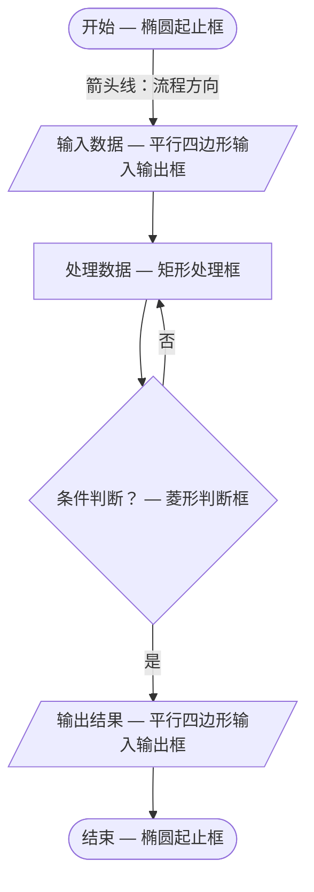
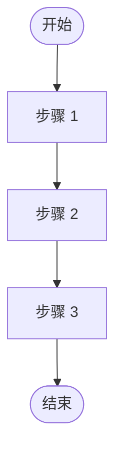
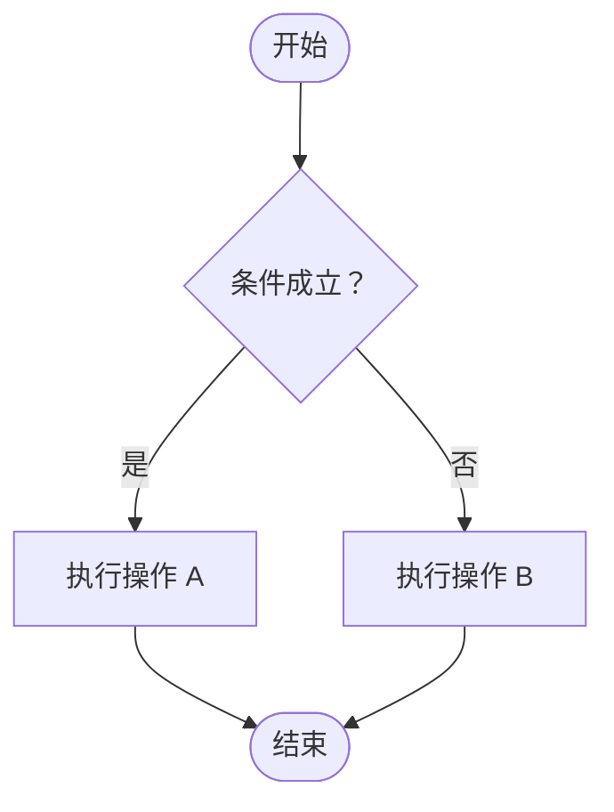
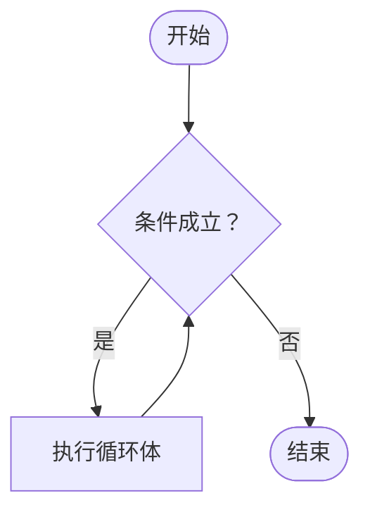
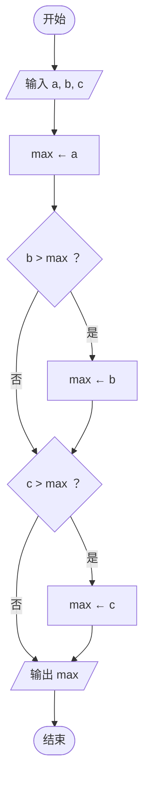
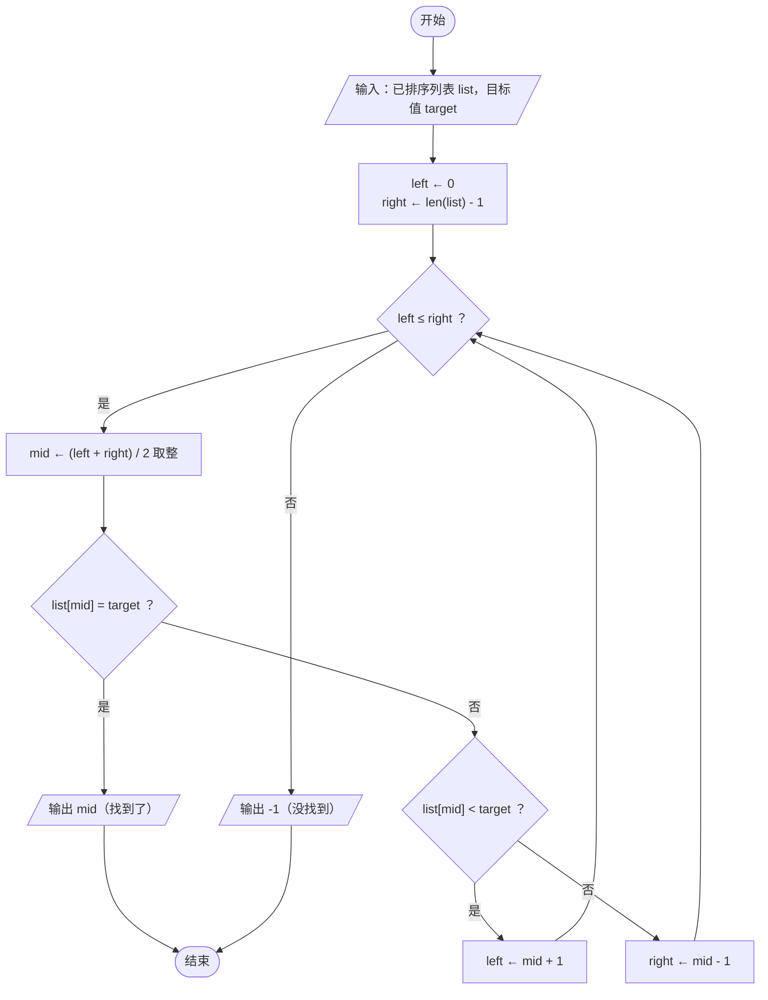
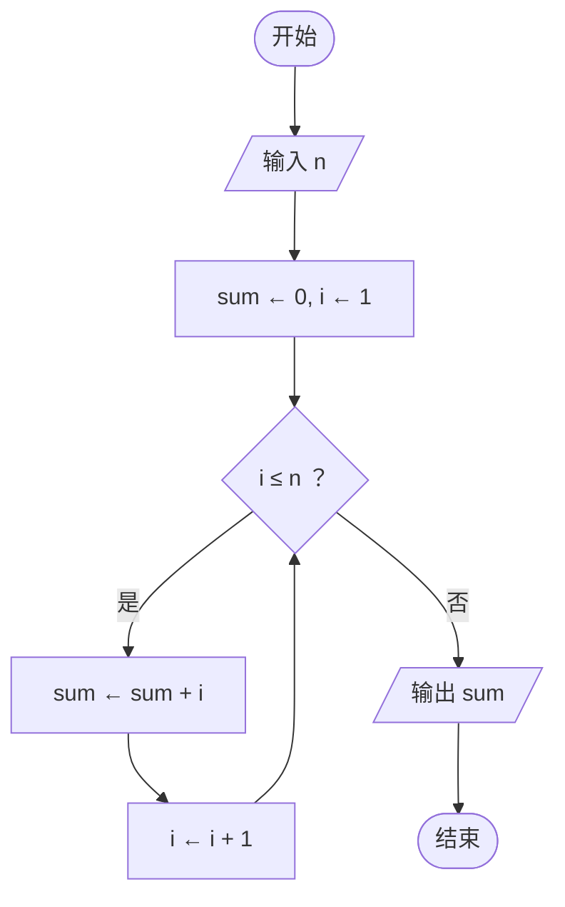
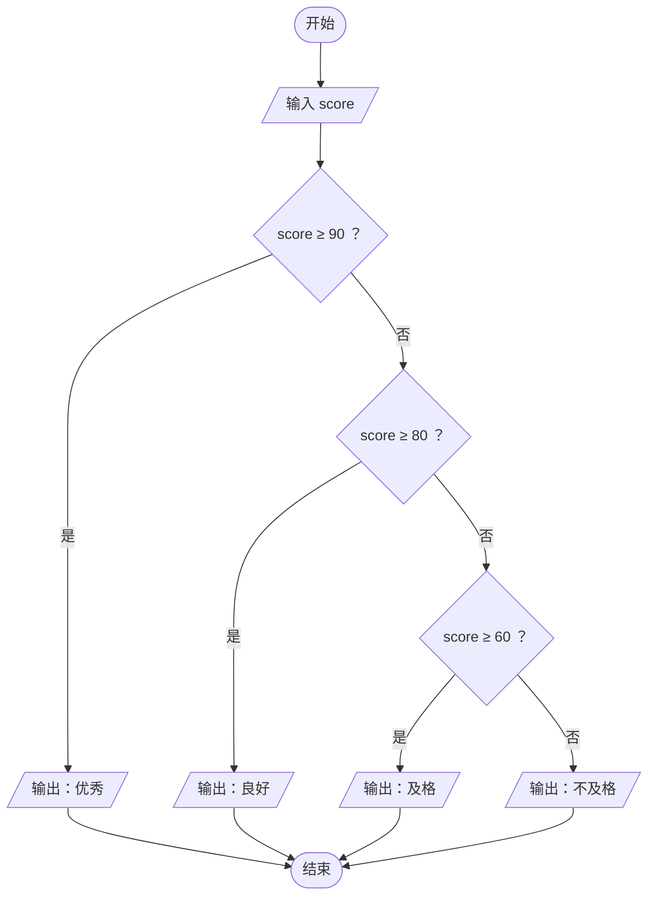

# 流程图与伪代码

> **所属路径**：`00_高中复习/03_信息素养/04_逻辑与问题拆解/04_流程图与伪代码`
> **预计学习时间**：40 分钟
> **难度等级**：⭐⭐

---

## 前置知识

- [边界情况](../03_边界情况/03_边界情况.md) — 在设计流程时需要考虑边界情况的处理分支

> 如果以上内容还不熟悉，建议先完成对应课程再继续。

---

## 学习目标

完成本节后，你将能够：

1. 解释为什么在写代码之前要先用流程图或伪代码表达算法
2. 识别并正确使用流程图的五种基本符号（起止框、处理框、判断框、输入输出框、流程线）
3. 区分三种基本控制结构（顺序、选择、循环）并用流程图和伪代码分别表示
4. 将一个小规模问题从自然语言描述转化为流程图 → 伪代码 → 可运行的 Python 代码

---

## 正文讲解

### 1. 为什么要先"画"再"写"

在前面的课程中，我们学会了 [输入输出分析](../01_输入输出分析/01_输入输出分析.md)、[步骤分解](../02_步骤分解/02_步骤分解.md) 以及 [边界情况](../03_边界情况/03_边界情况.md) 的识别——现在你已经能把一个问题拆成一系列清晰的小步骤了。但问题来了：这些步骤该怎么组织起来？如果你直接打开电脑就敲代码，很可能会遇到这样的情况：写了一半发现逻辑不对，删掉重来；或者程序跑出来的结果完全不对，却不知道哪一步错了。

有经验的程序员和人工智能研究者在真正编写代码之前，往往会先用两种工具理清思路：

- **流程图（Flowchart）**：用图形符号把算法的每一步画出来，一目了然地看到整个流程的走向和分支。
- **伪代码（Pseudocode）**：用接近自然语言的文字来描述算法步骤，比图更精确，比真实代码更灵活。

这两种工具的作用就像建筑师盖房子前画的设计图纸——不是多余的步骤，而是让最终成品更可靠的关键环节。实际上，在人工智能的顶级论文中，作者们展示新算法时，最常用的方式就是伪代码——它不绑定任何编程语言，任何人都能看懂。

### 2. 流程图的基本符号

**流程图（Flowchart）** 有一套国际通用的图形符号。就像交通标志一样，每种形状都有固定的含义，掌握这五种你就能读懂绝大多数流程图：

| 符号形状 | 名称 | 用途 | 助记 |
| -------- | ---- | ---- | ---- |
| 椭圆（圆角矩形） | 起止框 | 表示算法的开始或结束 | "起跑线"和"终点线" |
| 矩形 | 处理框 | 表示一个操作或计算步骤 | "干活的盒子" |
| 菱形 | 判断框 | 表示一个条件判断，有两个或多个出口 | "分叉路口" |
| 平行四边形 | 输入输出框 | 表示数据的输入或输出 | "数据的入口和出口" |
| 箭头线 | 流程线 | 表示步骤之间的执行顺序 | "路线指引" |

下面用一张 Mermaid 流程图来展示这五种符号的样子：



> 📌 **图解说明**：这张图展示了流程图的五种基本符号及其使用方式。注意菱形判断框有两条出路——"是"和"否"，这正是流程出现分支的地方。

> 💡 **小贴士**：Mermaid 中使用 `([...])` 表示圆角矩形（起止框）、`[...]` 表示矩形（处理框）、`{...}` 表示菱形（判断框）、`[/... /]` 表示平行四边形（输入输出框）。

### 3. 三种基本控制结构

不管多复杂的算法，都可以由三种基本 **控制结构（Control Structure）** 组合而成。这是计算机科学的一个重要结论——只要掌握了这三种结构，你就能描述任何可计算的过程。

#### 顺序结构

**顺序结构（Sequence）** 是最简单的控制结构：按照从上到下的顺序依次执行每一步，没有任何分支或重复。就像你早上起床的流程——起床 → 洗漱 → 吃早餐，一步接一步。



> 📌 **图解说明**：顺序结构中，每一步都严格按照从上到下的顺序执行，没有跳转、没有回头。

对应的伪代码写法也同样直白：

```
步骤 1
步骤 2
步骤 3
```

#### 选择结构

**选择结构（Selection）** 让程序在一个"分叉路口"做出选择：根据条件的真假，走不同的路。最常见的形式是 **如果…那么…否则…（IF…THEN…ELSE）**。



> 📌 **图解说明**：选择结构像一个 Y 形路口——根据菱形框中条件判断的结果，走向不同的处理步骤，最终汇合到同一个出口。

对应的伪代码：

```
IF 条件成立 THEN
    执行操作 A
ELSE
    执行操作 B
END IF
```

#### 循环结构

**循环结构（Iteration / Loop）** 让程序反复执行同一段操作，直到某个条件不再满足。最常见的形式是 **当…时重复…（WHILE…DO）**。



> 📌 **图解说明**：循环结构的核心特征是"回头箭头"——执行完循环体后，箭头指回判断框，重新检查条件。只有条件不满足时，才跳出循环。

对应的伪代码：

```
WHILE 条件成立 DO
    执行循环体
END WHILE
```

想一想：为什么循环结构一定需要一个"退出条件"？如果没有退出条件，程序会怎样？——没错，它会永远循环下去，变成 **死循环（Infinite Loop）**，这是编程中需要极力避免的经典错误。

### 4. 流程图实战：三个数中找最大值

理论讲完了，我们来动手画一个完整的流程图。问题很简单：给定三个数 $a$ 、 $b$ 、 $c$ ，找出其中的最大值。

思路是：先假设 $a$ 就是最大值，然后依次跟 $b$ 和 $c$ 比较，如果遇到更大的就更新。这用到了顺序结构和选择结构的组合。



> 📌 **图解说明**：这张流程图展示了"三个数取最大值"的完整逻辑——先假设 $a$ 最大，然后通过两次判断逐步更新 `max` 的值。注意无论条件是否成立，流程最终都会汇合到输出步骤。

### 5. 什么是伪代码

**伪代码（Pseudocode）** 是一种介于自然语言和编程语言之间的算法描述方式。它用类似编程语言的结构化写法来表达逻辑，但不拘泥于任何语言的具体语法——不需要担心分号、括号或缩进错误，重点是把思路说清楚。

伪代码的名字已经暗示了它的本质："伪"（pseudo）意味着"看起来像代码但不是真正的代码"。它的目的不是让计算机执行，而是让人类读懂。

为什么不直接写代码呢？因为：

- **沟通效率高**：不同团队成员可能使用不同的编程语言（Python、Java、C++……），伪代码是大家都能看懂的"通用语言"。
- **聚焦逻辑本身**：不用在语法细节上纠结，把精力集中在算法的核心思路上。
- **论文中的标准做法**：人工智能领域的学术论文几乎都用伪代码来展示算法，你将来读论文时会频繁遇到。

### 6. 伪代码的基本约定

伪代码没有严格的"标准语法"，但学术界和工业界有一套广泛认可的书写约定：

| 约定 | 示例 | 说明 |
| ---- | ---- | ---- |
| 关键词大写 | `IF`, `THEN`, `ELSE`, `WHILE`, `FOR`, `RETURN` | 让控制结构一目了然 |
| 缩进表示层次 | 循环体和条件体内缩进 | 和 Python 的缩进规则类似 |
| 赋值用 `←` | `max ← a` | 区别于数学等号 $=$ ，表示"把右边的值赋给左边" |
| 块结束标记 | `END IF`, `END WHILE`, `END FOR` | 明确每个块的起止范围 |
| 输入输出 | `INPUT a`, `OUTPUT max` | 标明数据的读入和输出 |
| 注释 | `// 这是注释` | 解释某一行的意图 |

下面是一个简单示例——判断一个数是奇数还是偶数：

```
INPUT n
IF n MOD 2 = 0 THEN
    OUTPUT "偶数"
ELSE
    OUTPUT "奇数"
END IF
```

可以看到，伪代码既保留了编程的结构化表达（`IF…THEN…ELSE…END IF`），又使用了自然语言式的表述方式（不需要括号、冒号等语法符号），任何有基本逻辑思维的人都能读懂。

### 7. 伪代码实战：三个数中找最大值

让我们用伪代码重写第 4 小节的"三个数取最大值"问题，你可以和前面的流程图对照着看：

```
FUNCTION FindMax(a, b, c)
    max ← a                // 先假设 a 最大
    IF b > max THEN
        max ← b            // b 更大，更新 max
    END IF
    IF c > max THEN
        max ← c            // c 更大，更新 max
    END IF
    RETURN max
END FUNCTION

// 主程序
INPUT a, b, c
result ← FindMax(a, b, c)
OUTPUT result
```

> 💡 **对照阅读**：试着把这段伪代码和第 4 小节的流程图逐步对应——每一个处理框对应伪代码中的一条赋值语句，每一个判断框对应一个 `IF` 语句。两种表示方式描述的是完全相同的逻辑。

### 8. 从伪代码到 Python：直接翻译

伪代码最大的实用价值在于：它可以几乎逐行翻译成真正的编程语言。下面我们把上面的伪代码翻译成 Python：

| 伪代码 | Python |
| ------ | ------ |
| `FUNCTION FindMax(a, b, c)` | `def find_max(a, b, c):` |
| `max ← a` | `max_val = a` |
| `IF b > max THEN` | `if b > max_val:` |
| `max ← b` | `max_val = b` |
| `END IF` | （Python 靠缩进结束，不需要） |
| `RETURN max` | `return max_val` |
| `INPUT a, b, c` | `a, b, c = 7, 3, 9` |
| `OUTPUT result` | `print(result)` |

注意几点差异：

- 伪代码的 `←` 对应 Python 的 `=`。
- 伪代码的 `END IF` 在 Python 中不需要——Python 用缩进来界定代码块。
- 我们用 `max_val` 而不是 `max` 作为变量名，因为 `max` 是 Python 的内置函数名，避免冲突是个好习惯。

### 9. 流程图、伪代码与人工智能的关系

你可能会问：学流程图和伪代码，跟人工智能有什么关系？关系非常密切：

1. **算法设计是 AI 的基石**：不管是训练一个神经网络、实现一个搜索算法，还是构建一条数据管道，底层都是一步步的逻辑流程。流程图和伪代码是你设计和理解这些流程的工具。
2. **论文中的"算法框"**：翻开几乎任何一篇 AI 论文，你都会看到一个用伪代码写成的"Algorithm"框。比如经典的 **[梯度下降（Gradient Descent）](../../../../01_基础能力/02_数学基础/04_最优化/02_梯度下降/)** 算法通常会被写成这样的伪代码形式：

```
ALGORITHM GradientDescent(f, θ₀, α, T)
    θ ← θ₀
    FOR t = 1 TO T DO
        g ← ∇f(θ)          // 计算梯度
        θ ← θ - α · g      // 更新参数
    END FOR
    RETURN θ
END ALGORITHM
```

3. **调试与沟通**：当你的 AI 模型训练出了问题，画一张数据流的流程图往往能帮你快速定位 bug 在哪一步。在团队协作中，流程图也是让非技术人员理解 AI 系统工作方式的最佳工具。

### 10. 综合实战：二分查找

让我们用一个稍微复杂一点的问题来综合练习：**二分查找（Binary Search）**。问题是：在一个已排好序的列表中，查找目标值 $target$ 的位置。如果找到则返回索引，找不到则返回 $-1$ 。

二分查找的核心思想是：每次取列表的中间元素跟目标值比较，如果中间值偏大就在左半部分继续找，如果偏小就在右半部分继续找。每一次比较都能排除一半的候选，效率远高于逐个检查。

首先用流程图表示：



> 📌 **图解说明**：二分查找流程图的核心是一个循环（`left ≤ right` 判断框与回头箭头），循环体内嵌套了两层判断（先判等、再判大小）。每次循环将搜索范围缩小一半。

然后用伪代码描述同样的逻辑：

```
FUNCTION BinarySearch(list, target)
    left ← 0
    right ← LENGTH(list) - 1

    WHILE left ≤ right DO
        mid ← FLOOR((left + right) / 2)

        IF list[mid] = target THEN
            RETURN mid                  // 找到了，返回索引
        ELSE IF list[mid] < target THEN
            left ← mid + 1             // 目标在右半部分
        ELSE
            right ← mid - 1            // 目标在左半部分
        END IF
    END WHILE

    RETURN -1                           // 没找到
END FUNCTION
```

最后翻译成 Python——你会发现几乎是逐行对应的：

```python
def binary_search(lst, target):
    """在已排序列表中查找 target，返回索引，找不到返回 -1"""
    left = 0
    right = len(lst) - 1

    while left <= right:
        mid = (left + right) // 2  # 取整除法

        if lst[mid] == target:
            return mid              # 找到了
        elif lst[mid] < target:
            left = mid + 1          # 目标在右半部分
        else:
            right = mid - 1         # 目标在左半部分

    return -1                       # 没找到


# 测试
numbers = [2, 5, 8, 12, 16, 23, 38, 56, 72, 91]
print(binary_search(numbers, 23))   # 期望输出：5
print(binary_search(numbers, 10))   # 期望输出：-1
```

这个例子完美展示了"流程图 → 伪代码 → Python 代码"的三步转化过程。每一步都在做同一件事——描述算法逻辑——只是表达方式越来越精确。

---

## 动手实践

上面展示了二分查找的完整转化过程，现在让我们来运行并验证。

```python
# 文件：code/flowchart_to_code.py
# 演示"流程图思维 → 伪代码 → Python 代码"的完整过程
# 环境要求：Python 3.10+（无额外依赖）


# ========== 示例 1：三个数取最大值 ==========
def find_max(a, b, c):
    """对应伪代码 FindMax(a, b, c)"""
    max_val = a            # max ← a
    if b > max_val:        # IF b > max THEN
        max_val = b        #     max ← b
    if c > max_val:        # IF c > max THEN
        max_val = c        #     max ← c
    return max_val         # RETURN max


# ========== 示例 2：二分查找 ==========
def binary_search(lst, target):
    """对应伪代码 BinarySearch(list, target)"""
    left = 0
    right = len(lst) - 1

    while left <= right:
        mid = (left + right) // 2

        if lst[mid] == target:
            return mid
        elif lst[mid] < target:
            left = mid + 1
        else:
            right = mid - 1

    return -1


# ========== 测试与验证 ==========
if __name__ == "__main__":
    # 测试 find_max
    print("=== 三个数取最大值 ===")
    print(f"find_max(7, 3, 9) = {find_max(7, 3, 9)}")       # 期望：9
    print(f"find_max(5, 5, 5) = {find_max(5, 5, 5)}")       # 期望：5（全相等）
    print(f"find_max(-1, -3, -2) = {find_max(-1, -3, -2)}") # 期望：-1（负数）

    # 测试 binary_search
    print("\n=== 二分查找 ===")
    numbers = [2, 5, 8, 12, 16, 23, 38, 56, 72, 91]
    print(f"查找 23: 索引 = {binary_search(numbers, 23)}")   # 期望：5
    print(f"查找 2:  索引 = {binary_search(numbers, 2)}")    # 期望：0（第一个元素）
    print(f"查找 91: 索引 = {binary_search(numbers, 91)}")   # 期望：9（最后一个元素）
    print(f"查找 10: 索引 = {binary_search(numbers, 10)}")   # 期望：-1（不存在）
    print(f"查找空列表: 索引 = {binary_search([], 5)}")      # 期望：-1（边界情况）
```

**运行说明**：
- 环境要求：Python 3.10+，无额外依赖
- 运行命令：`python code/flowchart_to_code.py`

**预期输出**：
```
=== 三个数取最大值 ===
find_max(7, 3, 9) = 9
find_max(5, 5, 5) = 5
find_max(-1, -3, -2) = -1

=== 二分查找 ===
查找 23: 索引 = 5
查找 2:  索引 = 0
查找 91: 索引 = 9
查找 10: 索引 = -1
查找空列表: 索引 = -1
```

从输出可以看到，两个函数都正确处理了常规输入和边界情况（全相等、负数、第一个/最后一个元素、空列表）。这印证了我们在 [边界情况](../03_边界情况/03_边界情况.md) 中学到的道理：好的算法设计需要从一开始就考虑这些特殊情况。

---

## 典型误区

| 误区 | 正确理解 |
| ---- | -------- |
| "流程图太麻烦了，直接写代码更快" | 对于简单问题确实可以，但问题一旦变复杂，没有流程图/伪代码的指引很容易在细节中迷失方向。先理清逻辑再编码，整体效率更高 |
| "伪代码必须严格遵守某种固定语法" | 伪代码没有唯一标准语法，核心要求是清晰、一致、人类可读。不同教材和论文的写法会有差异，这完全正常 |
| "流程图和伪代码只是初学者用的，专业人士不需要" | 恰恰相反——顶级 AI 论文几乎都用伪代码展示算法；工程团队在设计复杂系统时也会画架构流程图。它们是专业工具，不只是教学工具 |
| "判断框只能有'是'和'否'两个出口" | 标准判断框确实是两个出口，但对于多分支情况（如根据成绩等级分 A/B/C/D），可以用多个判断框串联，或在伪代码中使用 `SWITCH…CASE` 结构 |

---

## 练习题

### 练习 1：读懂流程图（难度：⭐）

下面的流程图描述了一个什么功能？请用一句话概括，并写出当输入 $n = 5$ 时的输出结果。



<details>
<summary>💡 提示</summary>

注意循环中 `sum` 和 `i` 分别在做什么：`sum` 在不断累加，`i` 从 $1$ 递增到 $n$ 。

</details>

<details>
<summary>✅ 参考答案</summary>

**功能**：计算从 $1$ 到 $n$ 的所有整数之和，即：

$$\text{sum} = 1 + 2 + 3 + \cdots + n$$

**当 $n = 5$ 时**：

$$\text{sum} = 1 + 2 + 3 + 4 + 5 = 15$$

输出结果为 $15$ 。

</details>

### 练习 2：伪代码补全（难度：⭐）

以下伪代码用于判断一个整数是否为偶数，但有两处空缺（用 `____` 表示）。请补全它们。

```
FUNCTION IsEven(n)
    IF ____(1)____ THEN
        RETURN ____(2)____
    ELSE
        RETURN FALSE
    END IF
END FUNCTION
```

<details>
<summary>💡 提示</summary>

偶数的特征是什么？用取余（MOD）运算来判断。空缺 (2) 要返回的是什么逻辑值？

</details>

<details>
<summary>✅ 参考答案</summary>

- 空缺 (1)：`n MOD 2 = 0`
- 空缺 (2)：`TRUE`

完整伪代码：

```
FUNCTION IsEven(n)
    IF n MOD 2 = 0 THEN
        RETURN TRUE
    ELSE
        RETURN FALSE
    END IF
END FUNCTION
```

</details>

### 练习 3：从伪代码到 Python（难度：⭐⭐）

将以下伪代码翻译成 Python 函数，并用至少 3 个测试用例验证（包括边界情况）。

```
FUNCTION CountPositive(list)
    count ← 0
    FOR EACH item IN list DO
        IF item > 0 THEN
            count ← count + 1
        END IF
    END FOR
    RETURN count
END FUNCTION
```

<details>
<summary>💡 提示</summary>

逐行对应翻译即可。Python 中的 `for item in lst:` 对应伪代码的 `FOR EACH item IN list DO` 。别忘了测试空列表和全负数列表这两个边界情况。

</details>

<details>
<summary>✅ 参考答案</summary>

```python
def count_positive(lst):
    count = 0
    for item in lst:
        if item > 0:
            count += 1
    return count

# 测试
print(count_positive([3, -1, 4, 0, -5, 2]))  # 期望：3
print(count_positive([]))                      # 期望：0（空列表）
print(count_positive([-3, -1, -4]))            # 期望：0（全负数）
```

</details>

### 练习 4：画流程图（难度：⭐⭐）

请为以下问题画一张流程图（可以用 Mermaid 语法或手绘）：

> 输入一个学生的百分制成绩 $score$ ，按照以下规则输出等级：
> - $score \geq 90$ ：优秀
> - $80 \leq score < 90$ ：良好
> - $60 \leq score < 80$ ：及格
> - $score < 60$ ：不及格

<details>
<summary>💡 提示</summary>

需要使用多个判断框串联——先判断最高等级（≥ 90），如果不满足再判断下一级（≥ 80），以此类推。这是选择结构的嵌套应用。

</details>

<details>
<summary>✅ 参考答案</summary>



对应伪代码：

```
INPUT score
IF score ≥ 90 THEN
    OUTPUT "优秀"
ELSE IF score ≥ 80 THEN
    OUTPUT "良好"
ELSE IF score ≥ 60 THEN
    OUTPUT "及格"
ELSE
    OUTPUT "不及格"
END IF
```

</details>

---

## 下一步学习

- 📖 下一个模块：[科学思维](../../04_科学思维/) — 从信息处理过渡到科学探究，学习如何用变量控制、假设验证等方法系统性地分析问题
- 🔗 相关进阶：[编程语言基础](../../../../01_基础能力/01_开发环境与技术英语/01_编程语言基础/) — 将伪代码转化为真正的程序，系统学习 Python 语法

---

## 参考资料

1. [Flowchart - Wikipedia](https://en.wikipedia.org/wiki/Flowchart) — 流程图的历史、符号标准和应用场景的全面介绍（公共知识库）
2. [Pseudocode - Wikipedia](https://en.wikipedia.org/wiki/Pseudocode) — 伪代码的定义、常见约定和各学科中的使用方式（公共知识库）
3. [Mermaid Flowchart 官方文档](https://mermaid.js.org/syntax/flowchart.html) — Mermaid 流程图语法参考，用于在 Markdown 中绘制流程图（官方文档，MIT 许可）
4. [Python 官方教程 - 控制流](https://docs.python.org/zh-cn/3/tutorial/controlflow.html) — Python 中 if/for/while 等控制结构的官方教程（官方文档，PSF 许可）
