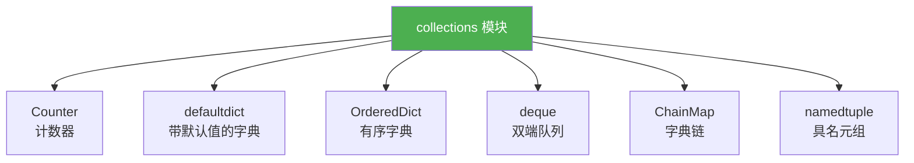
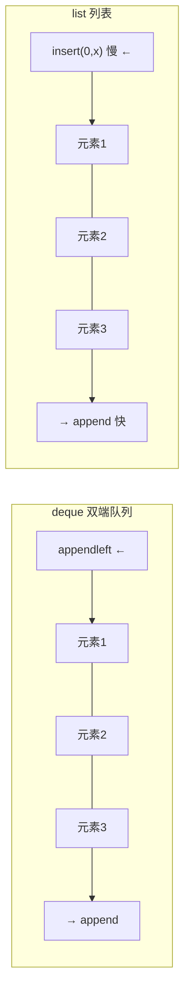

# collections模块

> **所属路径**：`01_基础能力/01_开发环境与技术英语/03_容器类型深入/01_collections模块`
> **预计学习时间**：50 分钟
> **难度等级**：⭐⭐

---

## 前置知识

- [变量与数据类型](../../01_编程语言基础/01_变量与数据类型/01_变量与数据类型.md)（了解列表、字典、元组、集合的基本用法）
- [列表推导与生成器](../../01_编程语言基础/04_列表推导与生成器/04_列表推导与生成器.md)（了解列表推导式和基本迭代模式）
- [函数与模块](../../01_编程语言基础/03_函数与模块/03_函数与模块.md)（了解模块导入和函数作为参数的概念）

> 如果以上内容还不熟悉，建议先完成对应课程再继续。

---

## 学习目标

完成本节后，你将能够：

1. 使用 `Counter` 快速统计元素频率并进行常见的频率分析操作
2. 使用 `defaultdict` 构建带有默认值的字典，简化分组和累加逻辑
3. 使用 `OrderedDict` 理解字典有序性的历史演变，并掌握其独有的操作
4. 使用 `deque` 实现高效的双端队列操作，替代列表的低效插入/删除
5. 使用 `ChainMap` 合并多个字典的查询视图

---

## 正文讲解

### 1. 为什么需要 collections 模块？

假设你正在处理一份学生选课数据，需要统计每门课被选了多少次。用内置字典，你可能会写出这样的代码：

```python
courses = ["数学", "物理", "数学", "英语", "物理", "数学", "化学"]

# 传统写法：手动检查键是否存在
count = {}
for c in courses:
    if c in count:
        count[c] += 1
    else:
        count[c] = 1
print(count)  # {'数学': 3, '物理': 2, '英语': 1, '化学': 1}
```

代码能工作，但每次都要写 `if-else` 判断键是否存在，显得啰嗦。如果需求再复杂一点——比如按学院分组统计学生名单、实现一个最近访问缓存、或者构建一个先进先出的任务队列——用内置容器就更加繁琐了。

Python 标准库中的 **collections 模块** 正是为了解决这类问题而生的。它提供了一组**增强型容器**，每一个都是针对特定使用场景优化的数据结构。



> 📌 **图解说明**：collections 模块中最常用的六个容器类型。其中 `namedtuple` 将在 [下一课](../02_数据类与具名元组/02_数据类与具名元组.md) 详细讲解，本课重点介绍前五个。

### 2. Counter——一行代码搞定频率统计

还记得开头那个统计选课次数的例子吗？用 **Counter（计数器）** 只需一行：

```python
from collections import Counter

courses = ["数学", "物理", "数学", "英语", "物理", "数学", "化学"]
count = Counter(courses)
print(count)  # Counter({'数学': 3, '物理': 2, '英语': 1, '化学': 1})
```

`Counter` 是 `dict` 的子类，所以你可以像操作字典一样使用它，同时它还额外提供了许多实用方法。

#### 常用操作

```python
from collections import Counter

# 从任何可迭代对象创建
word_count = Counter("abracadabra")
print(word_count)  # Counter({'a': 5, 'b': 2, 'r': 2, 'c': 1, 'd': 1})

# 获取最常见的 N 个元素
print(word_count.most_common(3))  # [('a', 5), ('b', 2), ('r', 2)]

# 访问不存在的键返回 0（而非 KeyError）
print(word_count['z'])  # 0

# 元素总数
print(word_count.total())  # 11（Python 3.10+）

# 两个 Counter 相加/相减
c1 = Counter(a=3, b=1)
c2 = Counter(a=1, b=2)
print(c1 + c2)  # Counter({'a': 4, 'b': 3})
print(c1 - c2)  # Counter({'a': 2})  —— 结果只保留正数
```

> 💡 **小技巧**：`Counter` 访问不存在的键时返回 `0` 而不是抛出 `KeyError` ，这在统计场景中非常方便——你不需要提前检查键是否存在。

#### 实际应用：词频统计

```python
from collections import Counter

text = "the quick brown fox jumps over the lazy dog the fox"
words = text.split()
freq = Counter(words)

print("词频排行：")
for word, count in freq.most_common():
    print(f"  {word}: {count}")
```

**预期输出**：
```
词频排行：
  the: 3
  fox: 2
  quick: 1
  brown: 1
  jumps: 1
  over: 1
  lazy: 1
  dog: 1
```

### 3. defaultdict——告别 "键不存在" 的烦恼

回到课程分组的问题：如果你想按学院把学生分组，用普通字典需要先检查键是否存在：

```python
students = [("计算机", "张三"), ("数学", "李四"), ("计算机", "王五"), ("数学", "赵六")]

# 传统写法
groups = {}
for dept, name in students:
    if dept not in groups:
        groups[dept] = []
    groups[dept].append(name)
```

使用 **defaultdict（带默认值的字典）** ，可以省去所有的键存在性检查：

```python
from collections import defaultdict

students = [("计算机", "张三"), ("数学", "李四"), ("计算机", "王五"), ("数学", "赵六")]

groups = defaultdict(list)  # 访问不存在的键时，自动创建空列表
for dept, name in students:
    groups[dept].append(name)

print(dict(groups))  # {'计算机': ['张三', '王五'], '数学': ['李四', '赵六']}
```

`defaultdict` 的构造函数接收一个**工厂函数**（callable），当你访问一个不存在的键时，它会自动调用这个工厂函数来创建默认值：

```python
from collections import defaultdict

# 默认值为 0（用于计数）
counter = defaultdict(int)
for char in "hello":
    counter[char] += 1
print(dict(counter))  # {'h': 1, 'e': 1, 'l': 2, 'o': 1}

# 默认值为空集合（用于去重分组）
index = defaultdict(set)
words = [("fruit", "apple"), ("fruit", "banana"), ("veggie", "carrot"), ("fruit", "apple")]
for category, item in words:
    index[category].add(item)
print(dict(index))  # {'fruit': {'apple', 'banana'}, 'veggie': {'carrot'}}
```

> ⚠️ **注意**：`defaultdict(list)` 中传入的是 `list` 这个类本身（一个可调用对象），而不是 `list()` 的返回值 `[]` 。写成 `defaultdict([])` 会报 `TypeError` ，因为列表对象不是可调用的。

想一想：`defaultdict` 的默认值工厂是在什么时候被调用的？答案是——**仅在通过 `__getitem__`（即 `d[key]`）访问不存在的键时** 才会触发，使用 `d.get(key)` 不会触发默认值创建。

### 4. OrderedDict——有序字典的前世今生

在 Python 3.7 之前，普通的 `dict` 是**不保证插入顺序**的。如果你需要一个按插入顺序遍历的字典，就得使用 `collections.OrderedDict` 。

从 Python 3.7 开始，内置的 `dict` 已经保证了插入顺序。那 `OrderedDict` 还有存在的必要吗？答案是：它仍然提供了一些 `dict` 没有的独特功能。

```python
from collections import OrderedDict

# 创建有序字典
od = OrderedDict()
od['banana'] = 3
od['apple'] = 1
od['cherry'] = 2

# 移动元素到末尾
od.move_to_end('banana')
print(list(od.keys()))  # ['apple', 'cherry', 'banana']

# 移动元素到开头
od.move_to_end('cherry', last=False)
print(list(od.keys()))  # ['cherry', 'apple', 'banana']

# 从末尾弹出
key, value = od.popitem(last=True)
print(f"弹出: {key}={value}")  # 弹出: banana=3

# 从开头弹出
key, value = od.popitem(last=False)
print(f"弹出: {key}={value}")  # 弹出: cherry=2
```

`OrderedDict` 的独有能力：

| 功能 | OrderedDict | dict（3.7+） |
| ---- | ----------- | ------------ |
| 保持插入顺序 | ✅ | ✅ |
| `move_to_end()` | ✅ | ❌ |
| `popitem(last=False)` 从开头弹出 | ✅ | ❌ |
| 比较时考虑顺序 | ✅（顺序不同则不等） | ❌（只比较内容） |

```python
from collections import OrderedDict

# 普通字典：只要内容相同就相等
d1 = {'a': 1, 'b': 2}
d2 = {'b': 2, 'a': 1}
print(d1 == d2)  # True

# OrderedDict：内容和顺序都必须相同
od1 = OrderedDict(a=1, b=2)
od2 = OrderedDict(b=2, a=1)
print(od1 == od2)  # False
```

> 💡 **实际应用**：`OrderedDict` 最常见的用途是实现 **LRU 缓存**（最近最少使用缓存）——每次访问一个键时，用 `move_to_end()` 把它移到末尾，当缓存满时，用 `popitem(last=False)` 从开头移除最久未使用的元素。

### 5. deque——高效的双端队列

你可能知道，Python 列表在**末尾**追加元素（`append`）很快，但在**开头**插入元素（`insert(0, x)`）很慢——因为需要把所有现有元素后移一位，时间复杂度是 $O(n)$ 。

**deque（双端队列，读作 "deck"）** 解决了这个问题。它在两端的插入和删除操作都是 $O(1)$ 的：

```python
from collections import deque

# 创建双端队列
dq = deque([1, 2, 3])

# 右端操作（和列表一样快）
dq.append(4)        # [1, 2, 3, 4]
dq.pop()             # [1, 2, 3]     返回 4

# 左端操作（比列表快得多！）
dq.appendleft(0)     # [0, 1, 2, 3]
dq.popleft()         # [1, 2, 3]     返回 0

print(dq)  # deque([1, 2, 3])
```



> 📌 **图解说明**：`deque` 在两端操作都是 $O(1)$ ，而列表只有右端操作是 $O(1)$ ，左端操作是 $O(n)$ 。

#### maxlen——固定长度的滑动窗口

`deque` 有一个非常实用的参数 `maxlen` ，可以创建固定长度的队列。当队列满了之后，从一端添加元素会自动从另一端丢弃元素：

```python
from collections import deque

# 只保留最近 5 条日志
recent_logs = deque(maxlen=5)
for i in range(8):
    recent_logs.append(f"日志{i}")

print(list(recent_logs))  # ['日志3', '日志4', '日志5', '日志6', '日志7']
```

这种"滑动窗口"特性在很多场景中非常有用：最近 N 条消息、移动平均值计算、历史命令记录等。

#### rotate——旋转操作

```python
from collections import deque

dq = deque([1, 2, 3, 4, 5])
dq.rotate(2)   # 右旋 2 步
print(dq)      # deque([4, 5, 1, 2, 3])

dq.rotate(-2)  # 左旋 2 步（恢复原状）
print(dq)      # deque([1, 2, 3, 4, 5])
```

> ⚠️ **注意**：`deque` 不支持高效的随机访问——通过索引访问中间元素（如 `dq[100]`）的时间复杂度是 $O(n)$ ，而列表是 $O(1)$ 。如果你需要频繁通过索引访问元素，列表仍然是更好的选择。

### 6. ChainMap——字典的"查询链"

有时候你需要在多个字典中按优先级查找某个键——比如程序的配置可能来自命令行参数、环境变量、配置文件三个来源，命令行参数的优先级最高。**ChainMap（字典链）** 可以把多个字典串成一条查询链：

```python
from collections import ChainMap

# 三个配置来源，优先级从高到低
cli_args = {'debug': True, 'port': 8080}
env_vars = {'port': 3000, 'host': 'localhost'}
defaults = {'debug': False, 'port': 80, 'host': '0.0.0.0', 'timeout': 30}

config = ChainMap(cli_args, env_vars, defaults)

print(config['debug'])    # True   — 来自 cli_args（最高优先级）
print(config['port'])     # 8080   — 来自 cli_args
print(config['host'])     # localhost — 来自 env_vars
print(config['timeout'])  # 30     — 来自 defaults
```

`ChainMap` 的关键特性：

- 查找时按顺序从第一个字典开始查找，找到就返回，找不到继续查下一个
- **不复制数据**——它只是多个字典的一个"视图"，修改原始字典会反映在 `ChainMap` 中
- 写入操作只影响第一个字典

```python
from collections import ChainMap

base = {'a': 1, 'b': 2}
override = {'b': 3}
combined = ChainMap(override, base)

# 写入只影响第一个字典
combined['c'] = 4
print(override)  # {'b': 3, 'c': 4}
print(base)      # {'a': 1, 'b': 2}  — 未受影响
```

---

## 动手实践

学完了五个 collections 容器，让我们用一个综合示例来实际感受它们的威力。

```python
# 文件：code/collections_demo.py
# 综合演示 collections 模块的五个核心容器
from collections import Counter, defaultdict, OrderedDict, deque, ChainMap

# === 1. Counter: 分析一段文本的词频 ===
text = "to be or not to be that is the question"
words = text.split()
freq = Counter(words)
print("=== Counter: 词频统计 ===")
print(f"词频: {freq}")
print(f"最常见的3个词: {freq.most_common(3)}")

# === 2. defaultdict: 按首字母分组 ===
groups = defaultdict(list)
for word in set(words):  # 去重
    groups[word[0]].append(word)
print("\n=== defaultdict: 按首字母分组 ===")
for letter, group in sorted(groups.items()):
    print(f"  {letter}: {group}")

# === 3. OrderedDict: 按词频排序的字典 ===
sorted_freq = OrderedDict(freq.most_common())
print("\n=== OrderedDict: 按频率排序 ===")
print(f"  {sorted_freq}")

# === 4. deque: 保留最近 3 个处理的词 ===
recent = deque(maxlen=3)
for word in words:
    recent.append(word)
print(f"\n=== deque: 最近3个词 ===")
print(f"  {list(recent)}")

# === 5. ChainMap: 多层配置合并 ===
user_config = {'theme': 'dark'}
app_defaults = {'theme': 'light', 'font_size': 14, 'language': 'zh'}
config = ChainMap(user_config, app_defaults)
print(f"\n=== ChainMap: 配置合并 ===")
print(f"  theme={config['theme']}, font_size={config['font_size']}")
```

**运行说明**：
- 环境要求：Python 3.10+（无第三方依赖）
- 运行命令：`python code/collections_demo.py`

**预期输出**：
```
=== Counter: 词频统计 ===
词频: Counter({'to': 2, 'be': 2, 'or': 1, 'not': 1, 'that': 1, 'is': 1, 'the': 1, 'question': 1})
最常见的3个词: [('to', 2), ('be', 2), ('or', 1)]

=== defaultdict: 按首字母分组 ===
  b: ['be']
  i: ['is']
  n: ['not']
  o: ['or']
  q: ['question']
  t: ['to', 'that', 'the']

=== OrderedDict: 按频率排序 ===
  OrderedDict([('to', 2), ('be', 2), ('or', 1), ('not', 1), ('that', 1), ('is', 1), ('the', 1), ('question', 1)])

=== deque: 最近3个词 ===
  ['the', 'question']

=== ChainMap: 配置合并 ===
  theme=dark, font_size=14
```

---

## 典型误区

| 误区 | 正确理解 |
| ---- | -------- |
| `defaultdict(0)` 传入默认值 `0` | 应传入工厂函数 `int` ，即 `defaultdict(int)` 。`0` 不是可调用对象 |
| `Counter` 减法运算会出现负数 | `Counter` 的 `-` 运算符只保留正数结果，负数和零会被自动丢弃 |
| Python 3.7+ 后不再需要 `OrderedDict` | `OrderedDict` 仍然有 `move_to_end()`、顺序敏感的相等比较等独有功能 |
| `deque` 可以完全替代列表 | `deque` 不支持高效的随机索引访问（ $O(n)$ ），列表在这方面是 $O(1)$ |
| `ChainMap` 会合并所有字典为一个新字典 | `ChainMap` 不复制数据，只是多个字典的查询视图，修改源字典会影响它 |

---

## 练习题

### 练习 1：找出最热门的标签（难度：⭐）

给定一个博客文章的标签列表，找出出现次数最多的 3 个标签：

```python
tags = ["python", "ai", "python", "web", "ai", "python", "data", "ai", "web", "cloud"]
# 请用 Counter 找出最热门的 3 个标签
```

<details>
<summary>💡 提示</summary>

使用 `Counter(tags).most_common(3)` 即可。

</details>

<details>
<summary>✅ 参考答案</summary>

```python
from collections import Counter

tags = ["python", "ai", "python", "web", "ai", "python", "data", "ai", "web", "cloud"]
top3 = Counter(tags).most_common(3)
print(top3)  # [('python', 3), ('ai', 3), ('web', 2)]
```

</details>

### 练习 2：嵌套分组（难度：⭐⭐）

给定一个学生成绩列表，按科目分组后计算每科的平均分：

```python
scores = [
    ("数学", 85), ("语文", 92), ("数学", 78),
    ("语文", 88), ("英语", 95), ("数学", 90),
    ("英语", 87), ("语文", 76),
]
# 请用 defaultdict 实现按科目分组，然后计算每科平均分
```

<details>
<summary>💡 提示</summary>

先用 `defaultdict(list)` 按科目分组收集分数，然后对每组求平均值。

</details>

<details>
<summary>✅ 参考答案</summary>

```python
from collections import defaultdict

scores = [
    ("数学", 85), ("语文", 92), ("数学", 78),
    ("语文", 88), ("英语", 95), ("数学", 90),
    ("英语", 87), ("语文", 76),
]

subject_scores = defaultdict(list)
for subject, score in scores:
    subject_scores[subject].append(score)

for subject, s_list in subject_scores.items():
    avg = sum(s_list) / len(s_list)
    print(f"{subject}: 平均分 {avg:.1f}")
# 数学: 平均分 84.3
# 语文: 平均分 85.3
# 英语: 平均分 91.0
```

</details>

### 练习 3：滑动窗口最大值（难度：⭐⭐⭐）

使用 `deque` 实现一个函数，给定一个整数列表和窗口大小 `k` ，返回每个窗口中的最大值：

```python
def sliding_max(nums: list[int], k: int) -> list[int]:
    """返回每个大小为 k 的滑动窗口中的最大值"""
    # 请实现此函数
    pass

# 测试
assert sliding_max([1, 3, -1, -3, 5, 3, 6, 7], 3) == [3, 3, 5, 5, 6, 7]
```

<details>
<summary>💡 提示</summary>

使用 `deque` 维护一个单调递减的索引队列：队首始终是当前窗口的最大值索引。遍历时，移除队首超出窗口范围的索引，从队尾移除所有比当前元素小的索引。

</details>

<details>
<summary>✅ 参考答案</summary>

```python
from collections import deque

def sliding_max(nums: list[int], k: int) -> list[int]:
    dq = deque()  # 存储索引，保持对应值单调递减
    result = []
    for i, num in enumerate(nums):
        # 移除超出窗口的索引
        while dq and dq[0] <= i - k:
            dq.popleft()
        # 移除队尾所有比当前值小的索引
        while dq and nums[dq[-1]] <= num:
            dq.pop()
        dq.append(i)
        # 窗口形成后记录最大值
        if i >= k - 1:
            result.append(nums[dq[0]])
    return result

assert sliding_max([1, 3, -1, -3, 5, 3, 6, 7], 3) == [3, 3, 5, 5, 6, 7]
print("测试通过！")
```

</details>

---

## 下一步学习

- 📖 下一个知识点：[数据类与具名元组](../02_数据类与具名元组/02_数据类与具名元组.md) — 学习 namedtuple 和 dataclass 的使用
- 🔗 相关知识点：[容器性能对比](../05_容器性能对比/05_容器性能对比.md) — 了解不同容器的性能特征
- 📚 拓展阅读：[数据结构](../../../03_编程与计算机基础/01_数据结构/) — 从计算机科学角度深入理解数据结构

---

## 参考资料

1. [Python 官方文档 - collections 模块](https://docs.python.org/zh-cn/3/library/collections.html) — collections 模块的完整 API 参考（官方文档）
2. [Python 官方教程 - 数据结构](https://docs.python.org/zh-cn/3/tutorial/datastructures.html) — Python 内置数据结构的官方教程（官方文档）
3. [Real Python - Python's collections Module](https://realpython.com/python-collections-module/) — collections 模块的详细使用指南（公开教程）
4. [Python Wiki - TimeComplexity](https://wiki.python.org/moin/TimeComplexity) — Python 各数据结构操作的时间复杂度表（官方 Wiki，CC BY 许可）
