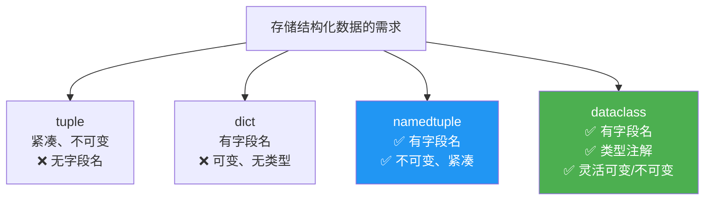

# 数据类与具名元组

> **所属路径**：`01_基础能力/01_开发环境与技术英语/03_容器类型深入/02_数据类与具名元组`
> **预计学习时间**：50 分钟
> **难度等级**：⭐⭐

---

## 前置知识

- [变量与数据类型](../../01_编程语言基础/01_变量与数据类型/01_变量与数据类型.md)（了解元组和字典的基本用法）
- [函数与模块](../../01_编程语言基础/03_函数与模块/03_函数与模块.md)（了解类的基本概念和模块导入）
- [类型提示与静态检查](../../01_编程语言基础/08_类型提示与静态检查/08_类型提示与静态检查.md)（了解类型注解的基本语法）

> 如果以上内容还不熟悉，建议先完成对应课程再继续。

---

## 学习目标

完成本节后，你将能够：

1. 使用 `namedtuple` 创建具有字段名的不可变元组，替代普通元组和字典
2. 使用 `@dataclass` 装饰器快速定义带有类型注解的数据类
3. 区分 `namedtuple` 和 `dataclass` 的适用场景，做出合理选择
4. 使用 `dataclass` 的高级功能：默认值、字段工厂、冻结、排序和比较

---

## 正文讲解

### 1. 从一个真实痛点说起

假设你正在开发一个学生管理系统，需要存储学生信息。最简单的方式是用元组：

```python
# 用元组存储学生信息
student = ("张三", 20, "计算机科学")
print(student[0])  # 张三
print(student[1])  # 20
```

代码能工作，但有一个严重问题：`student[0]`、`student[1]` 这些数字索引完全没有语义——一个月后你回来看代码，根本想不起来 `[0]` 是姓名还是年龄。

那用字典呢？

```python
student = {"name": "张三", "age": 20, "major": "计算机科学"}
print(student["name"])  # 好多了！
```

语义清晰了，但字典是可变的（可以随意添加或删除键）、没有类型检查、而且写起来很啰嗦。如果你需要存储 1000 个学生，创建 1000 个字典的内存开销也不小。

有没有一种方式，既有元组的紧凑和不可变性，又有字典的语义清晰？这就是 **具名元组（namedtuple）** 和 **数据类（dataclass）** 要解决的问题。



> 📌 **图解说明**：从普通元组和字典演进到具名元组和数据类——它们分别从不同角度解决了结构化数据存储的痛点。

### 2. namedtuple——给元组的每个位置取个名字

**具名元组（namedtuple）** 是 `collections` 模块提供的一个工厂函数，它创建一个元组的子类，每个位置都有一个字段名：

```python
from collections import namedtuple

# 定义一个 Student 类型
Student = namedtuple('Student', ['name', 'age', 'major'])

# 创建实例
s = Student("张三", 20, "计算机科学")

# 通过字段名访问（语义清晰！）
print(s.name)    # 张三
print(s.age)     # 20
print(s.major)   # 计算机科学

# 仍然可以通过索引访问（兼容元组）
print(s[0])      # 张三

# 不可变——和普通元组一样
# s.age = 21     # AttributeError: can't set attribute
```

`namedtuple` 的定义方式很灵活：

```python
from collections import namedtuple

# 方式 1：列表形式
Point = namedtuple('Point', ['x', 'y'])

# 方式 2：逗号分隔的字符串
Point = namedtuple('Point', 'x, y')

# 方式 3：空格分隔的字符串
Point = namedtuple('Point', 'x y')
```

#### namedtuple 的实用方法

```python
from collections import namedtuple

Student = namedtuple('Student', ['name', 'age', 'major'])
s = Student("张三", 20, "计算机科学")

# 转换为字典
print(s._asdict())  # {'name': '张三', 'age': 20, 'major': '计算机科学'}

# 替换字段值（返回新实例，原实例不变）
s2 = s._replace(age=21)
print(s2)  # Student(name='张三', age=21, major='计算机科学')
print(s)   # Student(name='张三', age=20, major='计算机科学') — 原实例未变

# 从字典创建
data = {'name': '李四', 'age': 22, 'major': '数学'}
s3 = Student(**data)
print(s3)  # Student(name='李四', age=22, major='数学')

# 查看字段名
print(Student._fields)  # ('name', 'age', 'major')
```

#### typing.NamedTuple——更现代的写法

Python 3.6+ 提供了基于类型注解的具名元组定义方式，写起来更像定义一个类：

```python
from typing import NamedTuple

class Student(NamedTuple):
    name: str
    age: int
    major: str
    gpa: float = 0.0  # 可以设置默认值

s = Student("王五", 19, "物理")
print(s)       # Student(name='王五', age=19, major='物理', gpa=0.0)
print(s.gpa)   # 0.0
```

> 💡 **建议**：在新项目中，优先使用 `typing.NamedTuple` 的类定义语法，它有类型注解、更易读、支持默认值，而且 IDE 的代码补全和类型检查体验更好。

### 3. dataclass——现代 Python 的数据容器

Python 3.7 引入的 **数据类（dataclass）** 是定义数据结构的另一种强大方式。它通过 `@dataclass` 装饰器，自动为你生成 `__init__`、`__repr__`、`__eq__` 等常用方法：

```python
from dataclasses import dataclass

@dataclass
class Student:
    name: str
    age: int
    major: str

# 自动生成的 __init__
s = Student("张三", 20, "计算机科学")

# 自动生成的 __repr__
print(s)  # Student(name='张三', age=20, major='计算机科学')

# 自动生成的 __eq__
s2 = Student("张三", 20, "计算机科学")
print(s == s2)  # True

# 默认是可变的
s.age = 21
print(s.age)  # 21
```

想一想：如果不用 `@dataclass` ，要实现上面同样的功能，需要手写多少代码？

```python
# 不用 dataclass 的等价代码
class Student:
    def __init__(self, name: str, age: int, major: str):
        self.name = name
        self.age = age
        self.major = major

    def __repr__(self):
        return f"Student(name={self.name!r}, age={self.age!r}, major={self.major!r})"

    def __eq__(self, other):
        if not isinstance(other, Student):
            return NotImplemented
        return (self.name, self.age, self.major) == (other.name, other.age, other.major)
```

使用 `@dataclass` 把十几行样板代码减少到了四行！

#### 默认值与字段工厂

```python
from dataclasses import dataclass, field

@dataclass
class Student:
    name: str
    age: int
    major: str = "未选择"              # 简单默认值
    courses: list[str] = field(default_factory=list)  # 可变默认值必须用 field

s1 = Student("张三", 20)
s2 = Student("李四", 21)
s1.courses.append("数学")

print(s1.courses)  # ['数学']
print(s2.courses)  # []  — 每个实例有独立的列表
```

> ⚠️ **注意**：可变类型（列表、字典、集合）的默认值**必须**使用 `field(default_factory=...)` ，不能直接写 `courses: list = []` 。这与函数默认参数的可变对象陷阱类似——如果直接写 `[]` ，所有实例会共享同一个列表，导致意想不到的 bug。`dataclass` 会主动检测并报 `ValueError` 。

#### 冻结——不可变的数据类

如果你需要不可变的数据类（类似 `namedtuple`），可以使用 `frozen=True` ：

```python
from dataclasses import dataclass

@dataclass(frozen=True)
class Point:
    x: float
    y: float

p = Point(1.0, 2.0)
# p.x = 3.0  # FrozenInstanceError: cannot assign to field 'x'

# 冻结的 dataclass 可以作为字典的键或集合的元素
points = {Point(0, 0), Point(1, 1), Point(0, 0)}
print(len(points))  # 2（自动去重）
```

#### 排序与比较

```python
from dataclasses import dataclass

@dataclass(order=True)
class Score:
    value: float
    subject: str = field(compare=False)  # 排序时忽略科目名

scores = [
    Score(85, "数学"),
    Score(92, "语文"),
    Score(78, "英语"),
]

# 可以直接排序
for s in sorted(scores):
    print(f"  {s.subject}: {s.value}")
```

**预期输出**：
```
  英语: 78
  数学: 85
  语文: 92
```

#### __post_init__——自定义初始化逻辑

有时你需要在初始化后做一些额外的计算或验证：

```python
from dataclasses import dataclass

@dataclass
class Rectangle:
    width: float
    height: float
    area: float = field(init=False)  # 不在 __init__ 参数中

    def __post_init__(self):
        if self.width <= 0 or self.height <= 0:
            raise ValueError("宽和高必须为正数")
        self.area = self.width * self.height

r = Rectangle(3, 4)
print(r)       # Rectangle(width=3, height=4, area=12)
print(r.area)  # 12
```

### 4. namedtuple vs dataclass——如何选择？

| 特性 | namedtuple | dataclass |
| ---- | ---------- | --------- |
| 可变性 | 不可变 | 默认可变（可设为冻结） |
| 类型注解 | `typing.NamedTuple` 支持 | 原生支持 |
| 继承自 | `tuple` | `object` |
| 内存占用 | 更小（元组结构） | 较大（普通类） |
| 索引访问 | ✅ `obj[0]` | ❌ |
| 解包 | ✅ `a, b = point` | ❌（除非手动实现） |
| 默认值 | 支持 | 支持（含 `field`） |
| `__post_init__` | ❌ | ✅ |
| 方法定义 | 可以（类语法） | 可以 |
| 适用场景 | 轻量级不可变记录 | 复杂数据对象 |

**选择建议**：

- 如果数据是**不可变的、字段少、轻量级**的（如坐标点、RGB颜色、配置记录），优先用 `NamedTuple`
- 如果数据**需要修改、有复杂初始化逻辑、需要方法**，用 `@dataclass`
- 如果需要作为字典键或集合元素，用 `NamedTuple` 或 `@dataclass(frozen=True)`

---

## 动手实践

让我们用一个完整的例子来对比 `namedtuple` 和 `dataclass` 的使用：

```python
# 文件：code/data_containers.py
# 对比演示 namedtuple 和 dataclass
from typing import NamedTuple
from dataclasses import dataclass, field

# === NamedTuple: 不可变的坐标点 ===
class Point(NamedTuple):
    x: float
    y: float

    def distance_to(self, other: 'Point') -> float:
        return ((self.x - other.x) ** 2 + (self.y - other.y) ** 2) ** 0.5

p1 = Point(0, 0)
p2 = Point(3, 4)
print(f"=== NamedTuple: Point ===")
print(f"  p1 = {p1}")
print(f"  p2 = {p2}")
print(f"  距离 = {p1.distance_to(p2)}")
print(f"  解包: x={p1[0]}, y={p1[1]}")

# === dataclass: 可变的购物车商品 ===
@dataclass
class CartItem:
    name: str
    price: float
    quantity: int = 1
    tags: list[str] = field(default_factory=list)

    @property
    def total(self) -> float:
        return self.price * self.quantity

item1 = CartItem("Python教程", 99.0, 2)
item2 = CartItem("机械键盘", 399.0, tags=["电子", "外设"])
item1.quantity = 3  # 可修改

print(f"\n=== dataclass: CartItem ===")
print(f"  {item1}, 小计: {item1.total}")
print(f"  {item2}, 小计: {item2.total}")

# === frozen dataclass: 不可变配置 ===
@dataclass(frozen=True)
class AppConfig:
    host: str
    port: int
    debug: bool = False

config = AppConfig("localhost", 8080, debug=True)
print(f"\n=== frozen dataclass: AppConfig ===")
print(f"  {config}")
# config.port = 3000  # 取消注释会抛出 FrozenInstanceError
```

**运行说明**：
- 环境要求：Python 3.10+
- 运行命令：`python code/data_containers.py`

**预期输出**：
```
=== NamedTuple: Point ===
  p1 = Point(x=0, y=0)
  p2 = Point(x=3, y=4)
  距离 = 5.0
  解包: x=0, y=0

=== dataclass: CartItem ===
  CartItem(name='Python教程', price=99.0, quantity=3, tags=[]), 小计: 297.0
  CartItem(name='机械键盘', price=399.0, quantity=1, tags=['电子', '外设']), 小计: 399.0

=== frozen dataclass: AppConfig ===
  AppConfig(host='localhost', port=8080, debug=True)
```

---

## 典型误区

| 误区 | 正确理解 |
| ---- | -------- |
| `namedtuple` 的字段可以修改 | `namedtuple` 继承自 `tuple` ，是不可变的。需要"修改"时使用 `_replace()` 返回新实例 |
| `dataclass` 的可变默认值直接写 `field: list = []` | 必须使用 `field(default_factory=list)` ，否则 `dataclass` 会抛出 `ValueError` |
| `NamedTuple` 和 `namedtuple()` 完全等价 | 类语法的 `NamedTuple` 支持类型注解、默认值和方法定义，功能更强大 |
| `@dataclass` 自动生成所有魔术方法 | 默认只生成 `__init__`、`__repr__`、`__eq__` ，要排序需要加 `order=True` ，要哈希需要 `frozen=True` |

---

## 练习题

### 练习 1：用 NamedTuple 表示颜色（难度：⭐）

定义一个 `Color` 具名元组，包含 `r`、`g`、`b` 三个字段（范围 0–255），并实现一个 `hex()` 方法，将颜色转换为十六进制字符串（如 `#FF0000`）。

```python
# 请定义 Color 类并测试
# Color(255, 0, 0).hex() 应返回 '#FF0000'
```

<details>
<summary>💡 提示</summary>

使用 `typing.NamedTuple` 的类语法定义，`hex()` 方法中使用 `f"#{self.r:02X}{self.g:02X}{self.b:02X}"` 格式化。

</details>

<details>
<summary>✅ 参考答案</summary>

```python
from typing import NamedTuple

class Color(NamedTuple):
    r: int
    g: int
    b: int

    def hex(self) -> str:
        return f"#{self.r:02X}{self.g:02X}{self.b:02X}"

red = Color(255, 0, 0)
print(red.hex())   # #FF0000
green = Color(0, 128, 0)
print(green.hex()) # #008000
```

</details>

### 练习 2：带验证的数据类（难度：⭐⭐）

定义一个 `Temperature` 数据类，包含 `celsius` 字段（摄氏温度），并满足以下要求：

1. 自动计算 `fahrenheit` 属性（华氏温度 = 摄氏 × 9/5 + 32）
2. 在 `__post_init__` 中验证温度不低于绝对零度（-273.15°C）
3. 支持 `frozen=True` 不可变

```python
# 请实现 Temperature 类
# Temperature(100).fahrenheit 应返回 212.0
# Temperature(-300) 应抛出 ValueError
```

<details>
<summary>💡 提示</summary>

使用 `@dataclass(frozen=True)` ，在 `__post_init__` 中验证。注意冻结的 dataclass 中不能直接赋值，需要用 `object.__setattr__(self, 'fahrenheit', ...)` 设置计算字段。

</details>

<details>
<summary>✅ 参考答案</summary>

```python
from dataclasses import dataclass, field

@dataclass(frozen=True)
class Temperature:
    celsius: float
    fahrenheit: float = field(init=False)

    def __post_init__(self):
        if self.celsius < -273.15:
            raise ValueError(f"温度 {self.celsius}°C 低于绝对零度")
        object.__setattr__(self, 'fahrenheit', self.celsius * 9 / 5 + 32)

t = Temperature(100)
print(f"{t.celsius}°C = {t.fahrenheit}°F")  # 100°C = 212.0°F

try:
    Temperature(-300)
except ValueError as e:
    print(e)  # 温度 -300°C 低于绝对零度
```

</details>

### 练习 3：学生成绩系统（难度：⭐⭐）

设计一个包含 `Student` 和 `Grade` 的数据模型：

- `Grade` 用 `NamedTuple` 实现，包含 `subject`（科目）和 `score`（分数）
- `Student` 用 `dataclass` 实现，包含 `name`、`grades`（成绩列表），以及一个 `gpa` 属性（计算所有成绩的平均分）

```python
# 请实现并测试
# s = Student("张三")
# s.grades.append(Grade("数学", 90))
# s.grades.append(Grade("英语", 85))
# print(s.gpa)  # 87.5
```

<details>
<summary>💡 提示</summary>

`grades` 使用 `field(default_factory=list)` ，`gpa` 使用 `@property` 计算。

</details>

<details>
<summary>✅ 参考答案</summary>

```python
from typing import NamedTuple
from dataclasses import dataclass, field

class Grade(NamedTuple):
    subject: str
    score: float

@dataclass
class Student:
    name: str
    grades: list[Grade] = field(default_factory=list)

    @property
    def gpa(self) -> float:
        if not self.grades:
            return 0.0
        return sum(g.score for g in self.grades) / len(self.grades)

s = Student("张三")
s.grades.append(Grade("数学", 90))
s.grades.append(Grade("英语", 85))
print(f"{s.name} 的平均分: {s.gpa}")  # 张三 的平均分: 87.5
```

</details>

---

## 下一步学习

- 📖 下一个知识点：[枚举类型](../03_枚举类型/03_枚举类型.md) — 学习如何定义一组固定的常量
- 🔗 相关知识点：[类型提示与静态检查](../../01_编程语言基础/08_类型提示与静态检查/08_类型提示与静态检查.md) — 深入了解类型注解
- 🔗 相关知识点：[描述符协议](../../10_元编程与高级特性/01_描述符协议/) — 理解 dataclass 背后的魔术方法

---

## 参考资料

1. [Python 官方文档 - dataclasses 模块](https://docs.python.org/zh-cn/3/library/dataclasses.html) — dataclass 的完整 API 参考（官方文档）
2. [Python 官方文档 - collections.namedtuple](https://docs.python.org/zh-cn/3/library/collections.html#collections.namedtuple) — namedtuple 的官方说明（官方文档）
3. [Python 官方文档 - typing.NamedTuple](https://docs.python.org/zh-cn/3/library/typing.html#typing.NamedTuple) — 类型注解版具名元组（官方文档）
4. [Real Python - Data Classes in Python](https://realpython.com/python-data-classes/) — dataclass 详细使用指南（公开教程）
