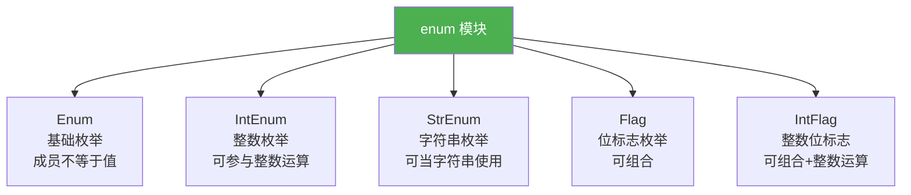

# 枚举类型

> **所属路径**：`01_基础能力/01_开发环境与技术英语/03_容器类型深入/03_枚举类型`
> **预计学习时间**：35 分钟
> **难度等级**：⭐

---

## 前置知识

- [变量与数据类型](../../01_编程语言基础/01_变量与数据类型/01_变量与数据类型.md)（了解基本数据类型）
- [函数与模块](../../01_编程语言基础/03_函数与模块/03_函数与模块.md)（了解类的基本概念和模块导入）

> 如果以上内容还不熟悉，建议先完成对应课程再继续。

---

## 学习目标

完成本节后，你将能够：

1. 理解为什么需要枚举类型，以及它解决了哪些"魔术常量"问题
2. 使用 `Enum` 定义一组命名常量，并掌握枚举成员的访问方式
3. 使用 `IntEnum`、`StrEnum` 等特殊枚举实现与整数或字符串的互操作
4. 使用 `Flag` 和 `IntFlag` 实现可组合的位标志枚举
5. 了解枚举的高级用法：自定义方法、自动值和别名

---

## 正文讲解

### 1. "魔术常量"的困境

在编程中，你经常需要表示一组固定的选项——比如星期几、方向、状态码、日志级别等。最直接的做法是用字符串或整数常量：

```python
# 方式 1：用字符串
status = "pending"
if status == "pending":
    print("处理中...")

# 方式 2：用整数
STATUS_PENDING = 0
STATUS_APPROVED = 1
STATUS_REJECTED = 2
status = STATUS_PENDING
```

这两种方式都有明显的问题：

- **字符串**：容易拼写错误（`"pedning"` vs `"pending"`），IDE 无法自动补全和类型检查
- **整数常量**：`status = 0` 毫无语义，三个月后你不记得 `0` 代表什么；而且没有什么能阻止你写出 `status = 999` 这样的非法值

**枚举类型（Enum）** 正是为了解决这个问题而存在的——它将一组固定的常量定义为一个**类型**，让编译器和 IDE 帮你检查合法性。

### 2. 基础枚举：Enum

Python 的 `enum` 模块提供了 `Enum` 基类，让你用类语法定义枚举：

```python
from enum import Enum

class Color(Enum):
    RED = 1
    GREEN = 2
    BLUE = 3

# 访问枚举成员
print(Color.RED)        # Color.RED
print(Color.RED.name)   # 'RED'
print(Color.RED.value)  # 1

# 通过值获取枚举成员
print(Color(2))         # Color.GREEN

# 通过名称获取枚举成员
print(Color['BLUE'])    # Color.BLUE
```

枚举成员有两个核心属性：
- `name`：成员的名称（字符串），如 `'RED'`
- `value`：成员的值，如 `1`

#### 枚举的关键特性

```python
from enum import Enum

class Direction(Enum):
    UP = "up"
    DOWN = "down"
    LEFT = "left"
    RIGHT = "right"

# 1. 枚举成员是单例——同一个值总是返回同一个对象
print(Direction.UP is Direction.UP)  # True

# 2. 枚举成员可比较身份和相等性
print(Direction.UP == Direction.UP)     # True
print(Direction.UP == Direction.DOWN)   # False
print(Direction.UP == "up")             # False!（不等于字符串）

# 3. 可以遍历所有成员
for d in Direction:
    print(f"  {d.name} -> {d.value}")

# 4. 不能创建新成员
# Direction.DIAGONAL = "diagonal"  # AttributeError
```

> 💡 **重要**：枚举成员 **不等于** 其值——`Direction.UP == "up"` 返回 `False` 。这是一个设计特性：枚举成员是一种独立的类型，需要显式使用 `.value` 来获取其底层值。

#### 在条件判断中使用枚举

```python
from enum import Enum

class OrderStatus(Enum):
    PENDING = "pending"
    PROCESSING = "processing"
    SHIPPED = "shipped"
    DELIVERED = "delivered"
    CANCELLED = "cancelled"

def handle_order(status: OrderStatus):
    match status:
        case OrderStatus.PENDING:
            print("订单待处理")
        case OrderStatus.PROCESSING:
            print("订单处理中")
        case OrderStatus.SHIPPED:
            print("订单已发货")
        case OrderStatus.DELIVERED:
            print("订单已送达")
        case OrderStatus.CANCELLED:
            print("订单已取消")

handle_order(OrderStatus.SHIPPED)  # 订单已发货
```

### 3. IntEnum 和 StrEnum——与基础类型互操作

普通的 `Enum` 成员不能与整数或字符串直接比较。如果你需要这种互操作性，可以使用 `IntEnum` 或 `StrEnum` ：

```python
from enum import IntEnum, StrEnum

class Priority(IntEnum):
    LOW = 1
    MEDIUM = 2
    HIGH = 3

# IntEnum 成员可以当整数使用
print(Priority.HIGH == 3)      # True（与 Enum 不同！）
print(Priority.HIGH > Priority.LOW)  # True（可比较大小）
print(Priority.HIGH + 10)      # 13（可参与运算）

class Color(StrEnum):  # Python 3.11+
    RED = "red"
    GREEN = "green"
    BLUE = "blue"

# StrEnum 成员可以当字符串使用
print(Color.RED == "red")       # True
print(Color.RED.upper())        # "RED"
print(f"颜色是: {Color.GREEN}") # "颜色是: green"
```

> ⚠️ **注意**：`StrEnum` 从 Python 3.11 才开始可用。在更早的版本中，可以通过 `class Color(str, Enum)` 实现类似效果。



> 📌 **图解说明**：enum 模块提供了五种枚举基类，从基础的 `Enum` 到可组合的 `Flag` ，满足不同的使用场景。

### 4. Flag——可组合的位标志

有时候一个选项不是"多选一"而是"可多选"——比如文件权限可以同时包含读、写、执行。`Flag` 枚举支持用按位运算符组合多个成员：

```python
from enum import Flag, auto

class Permission(Flag):
    READ = auto()      # 1
    WRITE = auto()     # 2
    EXECUTE = auto()   # 4

# 组合权限
rw = Permission.READ | Permission.WRITE
print(rw)                          # Permission.READ|WRITE
print(Permission.READ in rw)       # True
print(Permission.EXECUTE in rw)    # False

# 所有权限
all_perms = Permission.READ | Permission.WRITE | Permission.EXECUTE
print(all_perms)                   # Permission.READ|WRITE|EXECUTE
```

> 💡 **`auto()` 的作用**：在 `Enum` 中，`auto()` 自动生成递增的整数值（1, 2, 3...）。在 `Flag` 中，`auto()` 自动生成 2 的幂次（1, 2, 4, 8...），适合位运算。

### 5. 高级用法

#### 自定义方法

枚举类可以像普通类一样定义方法：

```python
from enum import Enum

class Planet(Enum):
    MERCURY = (3.303e+23, 2.4397e6)
    VENUS   = (4.869e+24, 6.0518e6)
    EARTH   = (5.976e+24, 6.37814e6)

    def __init__(self, mass, radius):
        self.mass = mass      # 质量 (kg)
        self.radius = radius  # 半径 (m)

    @property
    def surface_gravity(self):
        G = 6.67430e-11  # 万有引力常数
        return G * self.mass / (self.radius ** 2)

print(f"地球表面重力加速度: {Planet.EARTH.surface_gravity:.2f} m/s²")
# 地球表面重力加速度: 9.80 m/s²
```

#### 枚举别名

如果两个成员有相同的值，后面的会成为前面的**别名**：

```python
from enum import Enum

class Shape(Enum):
    SQUARE = 2
    DIAMOND = 1
    CIRCLE = 3
    ALIAS_FOR_SQUARE = 2  # 这是 SQUARE 的别名

print(Shape.ALIAS_FOR_SQUARE is Shape.SQUARE)  # True
print(list(Shape))  # [Shape.SQUARE, Shape.DIAMOND, Shape.CIRCLE]
# 注意：别名不出现在迭代中
```

如果你不希望出现别名（即禁止重复值），可以使用 `@unique` 装饰器：

```python
from enum import Enum, unique

@unique
class Status(Enum):
    ACTIVE = 1
    INACTIVE = 2
    # ENABLED = 1  # 取消注释会抛出 ValueError: duplicate values found
```

---

## 动手实践

让我们用枚举来实现一个简洁的交通信号灯状态机：

```python
# 文件：code/enum_demo.py
# 用枚举实现交通信号灯状态机
from enum import Enum, auto

class TrafficLight(Enum):
    RED = auto()
    YELLOW = auto()
    GREEN = auto()

    @property
    def next(self) -> 'TrafficLight':
        """返回下一个信号灯状态"""
        transitions = {
            TrafficLight.RED: TrafficLight.GREEN,
            TrafficLight.GREEN: TrafficLight.YELLOW,
            TrafficLight.YELLOW: TrafficLight.RED,
        }
        return transitions[self]

    @property
    def action(self) -> str:
        """返回对应的行动指示"""
        actions = {
            TrafficLight.RED: "停车等待",
            TrafficLight.YELLOW: "减速慢行",
            TrafficLight.GREEN: "正常通行",
        }
        return actions[self]

# 模拟信号灯循环
light = TrafficLight.RED
print("=== 交通信号灯模拟 ===")
for _ in range(6):
    print(f"  {light.name:6s} -> {light.action}")
    light = light.next
```

**运行说明**：
- 环境要求：Python 3.10+
- 运行命令：`python code/enum_demo.py`

**预期输出**：
```
=== 交通信号灯模拟 ===
  RED    -> 停车等待
  GREEN  -> 正常通行
  YELLOW -> 减速慢行
  RED    -> 停车等待
  GREEN  -> 正常通行
  YELLOW -> 减速慢行
```

---

## 典型误区

| 误区 | 正确理解 |
| ---- | -------- |
| `Color.RED == 1` 对于普通 `Enum` 成立 | 普通 `Enum` 成员不等于其值，只有 `IntEnum` 才可以。应使用 `Color.RED.value == 1` |
| 枚举成员可以在运行时动态添加 | 枚举类定义后，成员是固定的，不能动态添加或删除 |
| `auto()` 在 `Flag` 中生成连续整数 | 在 `Flag` 中，`auto()` 生成 2 的幂次（1, 2, 4, 8...），以支持位运算组合 |
| 枚举只能有一个值 | 枚举成员的值可以是任意类型，包括元组（如 `Planet` 示例中的质量和半径） |

---

## 练习题

### 练习 1：定义 HTTP 状态码枚举（难度：⭐）

定义一个 `HTTPStatus` 枚举，包含常见的 HTTP 状态码，并添加一个 `is_error` 属性判断是否为错误码（状态码 >= 400）。

```python
# 请实现 HTTPStatus 枚举
# HTTPStatus.OK.value 应为 200
# HTTPStatus.NOT_FOUND.is_error 应为 True
```

<details>
<summary>💡 提示</summary>

使用 `IntEnum` 可以方便地进行数值比较。在枚举类中定义 `@property` 方法。

</details>

<details>
<summary>✅ 参考答案</summary>

```python
from enum import IntEnum

class HTTPStatus(IntEnum):
    OK = 200
    CREATED = 201
    BAD_REQUEST = 400
    NOT_FOUND = 404
    INTERNAL_ERROR = 500

    @property
    def is_error(self) -> bool:
        return self.value >= 400

print(f"OK: {HTTPStatus.OK.is_error}")           # False
print(f"NOT_FOUND: {HTTPStatus.NOT_FOUND.is_error}")  # True
print(f"500: {HTTPStatus.INTERNAL_ERROR.is_error}")   # True
```

</details>

### 练习 2：用 Flag 实现文件权限系统（难度：⭐⭐）

定义一个 `FilePermission` 标志枚举，支持组合权限，并实现一个 `check_permission` 函数：

```python
# 请实现 FilePermission 枚举和 check_permission 函数
# admin_perm = FilePermission.READ | FilePermission.WRITE | FilePermission.EXECUTE
# check_permission(admin_perm, FilePermission.WRITE) 应返回 True
```

<details>
<summary>💡 提示</summary>

使用 `Flag` 和 `auto()` 定义枚举，用 `in` 运算符检查某个权限是否在组合权限中。

</details>

<details>
<summary>✅ 参考答案</summary>

```python
from enum import Flag, auto

class FilePermission(Flag):
    READ = auto()
    WRITE = auto()
    EXECUTE = auto()

def check_permission(user_perm: FilePermission, required: FilePermission) -> bool:
    return required in user_perm

# 测试
admin = FilePermission.READ | FilePermission.WRITE | FilePermission.EXECUTE
reader = FilePermission.READ

print(f"管理员可写: {check_permission(admin, FilePermission.WRITE)}")    # True
print(f"只读用户可写: {check_permission(reader, FilePermission.WRITE)}") # False
print(f"只读用户可读: {check_permission(reader, FilePermission.READ)}")  # True
```

</details>

### 练习 3：季节枚举与自定义方法（难度：⭐⭐）

定义一个 `Season` 枚举，每个季节有名称和对应的月份范围，并实现一个 `from_month` 类方法，根据月份返回对应的季节：

```python
# Season.from_month(7) 应返回 Season.SUMMER
# Season.SPRING.months 应返回 (3, 4, 5)
```

<details>
<summary>💡 提示</summary>

让枚举成员的值为元组 `(名称, 月份元组)` ，使用自定义的 `__init__` 方法解包。`from_month` 使用 `@classmethod` 装饰器。

</details>

<details>
<summary>✅ 参考答案</summary>

```python
from enum import Enum

class Season(Enum):
    SPRING = ("春天", (3, 4, 5))
    SUMMER = ("夏天", (6, 7, 8))
    AUTUMN = ("秋天", (9, 10, 11))
    WINTER = ("冬天", (12, 1, 2))

    def __init__(self, label, months):
        self.label = label
        self.months = months

    @classmethod
    def from_month(cls, month: int) -> 'Season':
        for season in cls:
            if month in season.months:
                return season
        raise ValueError(f"无效月份: {month}")

print(Season.from_month(7))          # Season.SUMMER
print(Season.from_month(7).label)    # 夏天
print(Season.SPRING.months)          # (3, 4, 5)
```

</details>

---

## 下一步学习

- 📖 下一个知识点：[自定义容器](../04_自定义容器/04_自定义容器.md) — 学习如何创建行为类似列表或字典的自定义数据结构
- 🔗 相关知识点：[数据类与具名元组](../02_数据类与具名元组/02_数据类与具名元组.md) — 枚举常与数据类配合使用
- 🔗 相关知识点：[类型提示与静态检查](../../01_编程语言基础/08_类型提示与静态检查/08_类型提示与静态检查.md) — 在类型注解中使用枚举提升代码质量

---

## 参考资料

1. [Python 官方文档 - enum 模块](https://docs.python.org/zh-cn/3/library/enum.html) — 枚举类型的完整 API 参考（官方文档）
2. [Python 官方教程 - Enum HOWTO](https://docs.python.org/zh-cn/3/howto/enum.html) — 枚举使用指南（官方文档）
3. [Real Python - Build Enumerations of Constants With Python's Enum](https://realpython.com/python-enum/) — 枚举类型详细教程（公开教程）
