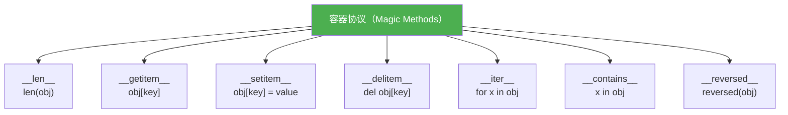

# 自定义容器

> **所属路径**：`01_基础能力/01_开发环境与技术英语/03_容器类型深入/04_自定义容器`
> **预计学习时间**：55 分钟
> **难度等级**：⭐⭐⭐

---

## 前置知识

- [变量与数据类型](../../01_编程语言基础/01_变量与数据类型/01_变量与数据类型.md)（了解列表、字典等内置容器的基本用法）
- [装饰器与上下文管理器](../../01_编程语言基础/06_装饰器与上下文管理器/06_装饰器与上下文管理器.md)（了解魔术方法的基本概念）
- [collections模块](../01_collections模块/01_collections模块.md)（了解标准库提供的高级容器）

> 如果以上内容还不熟悉，建议先完成对应课程再继续。

---

## 学习目标

完成本节后，你将能够：

1. 理解 Python 数据模型中与容器相关的魔术方法（`__getitem__`、`__len__`、`__iter__` 等）
2. 实现一个自定义的序列类型（类列表行为）
3. 实现一个自定义的映射类型（类字典行为）
4. 使用 `collections.abc` 中的抽象基类来规范自定义容器
5. 理解鸭子类型与抽象基类在容器设计中的权衡

---

## 正文讲解

### 1. Python 的容器协议——万物皆协议

在 Python 中，一个对象是否"像列表"、"像字典"，并不取决于它继承了什么类，而取决于它实现了哪些 **魔术方法（Magic Methods）** 。这就是 Python 的 **鸭子类型（Duck Typing）** 哲学——"如果它走路像鸭子，叫声像鸭子，那它就是鸭子"。

比如，只要一个对象实现了 `__getitem__` 方法，就可以用 `obj[key]` 语法访问它；只要实现了 `__len__`，就可以用 `len(obj)` 获取长度。



> 📌 **图解说明**：Python 中容器行为由一组魔术方法定义。实现不同的组合，就能让自定义对象支持不同的容器操作。

让我们从一个最简单的例子开始，直观感受魔术方法的作用：

```python
class MyBox:
    """一个只实现了 __getitem__ 的简单容器"""
    def __init__(self, items):
        self._items = list(items)

    def __getitem__(self, index):
        return self._items[index]

box = MyBox([10, 20, 30])
print(box[0])      # 10   —— __getitem__ 让 [] 语法生效
print(box[1:3])    # [20, 30] —— 切片也自动支持！

# 令人惊喜的是，for 循环也能工作！
for item in box:   # Python 会自动用 __getitem__(0), __getitem__(1), ... 来迭代
    print(item, end=" ")  # 10 20 30
```

仅仅实现一个 `__getitem__`，就同时获得了索引访问、切片、迭代三种能力。这就是 Python 数据模型的强大之处。

### 2. 实战：自定义序列——一个有范围检查的列表

假设你需要一个"受限列表"，只允许存储特定范围内的整数（比如考试分数必须在 0–100 之间）。用内置列表没有办法做到这种约束，但自定义容器可以：

```python
class BoundedList:
    """一个只允许存储指定范围内整数的列表"""

    def __init__(self, min_val: int = 0, max_val: int = 100):
        self._items: list[int] = []
        self._min = min_val
        self._max = max_val

    def _validate(self, value):
        if not isinstance(value, int):
            raise TypeError(f"只接受整数，收到 {type(value).__name__}")
        if not (self._min <= value <= self._max):
            raise ValueError(f"值 {value} 超出范围 [{self._min}, {self._max}]")

    # === 容器协议方法 ===

    def __len__(self):
        return len(self._items)

    def __getitem__(self, index):
        return self._items[index]

    def __setitem__(self, index, value):
        self._validate(value)
        self._items[index] = value

    def __delitem__(self, index):
        del self._items[index]

    def __contains__(self, value):
        return value in self._items

    def __iter__(self):
        return iter(self._items)

    def __repr__(self):
        return f"BoundedList({self._items}, range=[{self._min}, {self._max}])"

    # === 业务方法 ===

    def append(self, value):
        self._validate(value)
        self._items.append(value)

    def average(self):
        if not self._items:
            return 0
        return sum(self._items) / len(self._items)
```

让我们测试它：

```python
scores = BoundedList(0, 100)
scores.append(85)
scores.append(92)
scores.append(78)

print(len(scores))    # 3
print(scores[0])      # 85
print(85 in scores)   # True
print(scores.average())  # 85.0

# 验证生效！
try:
    scores.append(150)  # ValueError: 值 150 超出范围 [0, 100]
except ValueError as e:
    print(e)

try:
    scores.append("A")  # TypeError: 只接受整数，收到 str
except TypeError as e:
    print(e)

# 修改也有验证
try:
    scores[0] = -10    # ValueError
except ValueError as e:
    print(e)
```

### 3. 实战：自定义映射——一个双向字典

普通字典只能从键查值，但有时你还需要从值查键（比如编码-解码映射）。让我们实现一个 **双向字典（BiDict）** ：

```python
class BiDict:
    """双向字典：支持从键查值和从值查键"""

    def __init__(self, data=None):
        self._forward = {}   # 键 -> 值
        self._inverse = {}   # 值 -> 键
        if data:
            for k, v in data.items():
                self[k] = v

    def __setitem__(self, key, value):
        # 如果键已存在，先删除旧的反向映射
        if key in self._forward:
            old_value = self._forward[key]
            del self._inverse[old_value]
        # 如果值已存在于反向映射中，先删除旧的正向映射
        if value in self._inverse:
            old_key = self._inverse[value]
            del self._forward[old_key]
        self._forward[key] = value
        self._inverse[value] = key

    def __getitem__(self, key):
        return self._forward[key]

    def __delitem__(self, key):
        value = self._forward.pop(key)
        del self._inverse[value]

    def __len__(self):
        return len(self._forward)

    def __iter__(self):
        return iter(self._forward)

    def __contains__(self, key):
        return key in self._forward

    def __repr__(self):
        return f"BiDict({self._forward})"

    def get_by_value(self, value):
        """通过值查找键"""
        return self._inverse.get(value)

    def inverse(self):
        """返回反向视图（只读）"""
        return dict(self._inverse)
```

测试双向字典：

```python
codes = BiDict({"python": "py", "javascript": "js", "typescript": "ts"})

# 正向查找
print(codes["python"])           # py

# 反向查找
print(codes.get_by_value("js"))  # javascript

# 设置新映射
codes["rust"] = "rs"
print(codes.get_by_value("rs"))  # rust

# 查看反向映射
print(codes.inverse())  # {'py': 'python', 'js': 'javascript', 'ts': 'typescript', 'rs': 'rust'}
```

### 4. collections.abc——用抽象基类规范容器

到目前为止，我们通过直接实现魔术方法来创建自定义容器。但这种方式有一个问题：你可能漏掉某些方法，导致容器行为不完整。

`collections.abc` 模块提供了一系列 **抽象基类（Abstract Base Classes, ABCs）** ，它们定义了各种容器类型需要实现的最小方法集。继承抽象基类后：

1. 如果你漏实现了必需的方法，Python 会在实例化时报错（而不是在使用时才发现）
2. 抽象基类会自动提供一些"免费"的方法——你只需要实现核心方法，其他方法会基于核心方法自动派生

| 抽象基类 | 需要实现的方法 | 自动获得的方法 |
| -------- | -------------- | -------------- |
| `Sized` | `__len__` | — |
| `Iterable` | `__iter__` | — |
| `Container` | `__contains__` | — |
| `Sequence` | `__getitem__`, `__len__` | `__contains__`, `__iter__`, `__reversed__`, `index`, `count` |
| `MutableSequence` | `__getitem__`, `__setitem__`, `__delitem__`, `__len__`, `insert` | `append`, `clear`, `reverse`, `extend`, `pop`, `__iadd__`, `__contains__`, `count`, `index` |
| `Mapping` | `__getitem__`, `__len__`, `__iter__` | `__contains__`, `keys`, `items`, `values`, `get`, `__eq__`, `__ne__` |
| `MutableMapping` | `__getitem__`, `__setitem__`, `__delitem__`, `__len__`, `__iter__` | `pop`, `popitem`, `clear`, `update`, `setdefault` |

让我们用 `MutableSequence` 重写之前的 `BoundedList` ：

```python
from collections.abc import MutableSequence

class BoundedList(MutableSequence):
    """继承 MutableSequence 的受限列表"""

    def __init__(self, min_val=0, max_val=100):
        self._items = []
        self._min = min_val
        self._max = max_val

    def _validate(self, value):
        if not isinstance(value, int):
            raise TypeError(f"只接受整数，收到 {type(value).__name__}")
        if not (self._min <= value <= self._max):
            raise ValueError(f"值 {value} 超出范围 [{self._min}, {self._max}]")

    # === 必须实现的 5 个抽象方法 ===

    def __getitem__(self, index):
        return self._items[index]

    def __setitem__(self, index, value):
        self._validate(value)
        self._items[index] = value

    def __delitem__(self, index):
        del self._items[index]

    def __len__(self):
        return len(self._items)

    def insert(self, index, value):
        self._validate(value)
        self._items.insert(index, value)

    def __repr__(self):
        return f"BoundedList({self._items})"
```

现在 `BoundedList` **自动**获得了 `append`、`extend`、`pop`、`clear`、`reverse`、`count`、`index`、`__contains__`、`__iter__`、`__reversed__` 等方法——全部免费：

```python
scores = BoundedList(0, 100)
scores.append(85)      # 自动获得的 append（内部调用 insert）
scores.append(92)
scores.extend([78, 90]) # 自动获得的 extend
print(scores)           # BoundedList([85, 92, 78, 90])
print(scores.count(85)) # 1 —— 自动获得的 count
print(list(reversed(scores)))  # [90, 78, 92, 85] —— 自动获得的 reversed
scores.pop()            # 自动获得的 pop
print(scores)           # BoundedList([85, 92, 78])
```

> 💡 **建议**：当你需要创建一个行为完整的自定义容器时，优先继承 `collections.abc` 中的抽象基类。这样不仅减少了代码量，还能确保你的容器行为符合 Python 社区的预期。

### 5. 鸭子类型 vs 抽象基类——如何选择？

Python 有两种方式来判断一个对象是否是"某种容器"：

- **鸭子类型**：只要实现了相应的魔术方法就行，不需要继承任何东西
- **抽象基类**：通过继承或注册，让 `isinstance()` 检查通过

```python
from collections.abc import Sequence

# 鸭子类型：不继承 Sequence，但实现了相同的方法
class DuckSequence:
    def __getitem__(self, index):
        return [10, 20, 30][index]
    def __len__(self):
        return 3

ds = DuckSequence()
print(ds[0])            # 10 —— 可以用，行为像序列
print(isinstance(ds, Sequence))  # False —— 但 isinstance 检查失败

# 抽象基类：继承 Sequence
class ABCSequence(Sequence):
    def __getitem__(self, index):
        return [10, 20, 30][index]
    def __len__(self):
        return 3

abcs = ABCSequence()
print(abcs[0])          # 10
print(isinstance(abcs, Sequence))  # True —— isinstance 检查通过
```

**选择建议**：

- **小型脚本或内部使用**：鸭子类型足够，简单灵活
- **库或框架开发**：继承抽象基类更规范，方便类型检查和 IDE 支持
- **只需要部分容器行为**：鸭子类型更灵活，不需要实现所有抽象方法

---

## 动手实践

让我们用 `MutableMapping` 实现一个带过期时间的缓存字典：

```python
# 文件：code/custom_container.py
# 用 MutableMapping 实现一个带过期时间的缓存
import time
from collections.abc import MutableMapping

class ExpiringDict(MutableMapping):
    """键值对会在指定秒数后自动过期的字典"""

    def __init__(self, ttl: float = 60):
        self._data = {}       # key -> value
        self._timestamps = {} # key -> 设置时间
        self._ttl = ttl       # 存活时间（秒）

    def _is_expired(self, key):
        return time.time() - self._timestamps.get(key, 0) > self._ttl

    def _cleanup(self):
        """清理所有过期的键"""
        expired = [k for k in self._data if self._is_expired(k)]
        for k in expired:
            del self._data[k]
            del self._timestamps[k]

    # === MutableMapping 必须实现的 5 个方法 ===

    def __getitem__(self, key):
        if key not in self._data or self._is_expired(key):
            # 清理过期项
            self._data.pop(key, None)
            self._timestamps.pop(key, None)
            raise KeyError(key)
        return self._data[key]

    def __setitem__(self, key, value):
        self._data[key] = value
        self._timestamps[key] = time.time()

    def __delitem__(self, key):
        del self._data[key]
        del self._timestamps[key]

    def __iter__(self):
        self._cleanup()
        return iter(self._data)

    def __len__(self):
        self._cleanup()
        return len(self._data)

    def __repr__(self):
        self._cleanup()
        return f"ExpiringDict({self._data}, ttl={self._ttl}s)"


# 测试
cache = ExpiringDict(ttl=2)  # 2秒过期
cache["key1"] = "value1"
cache["key2"] = "value2"

print(f"刚设置: {cache}")           # ExpiringDict({'key1': 'value1', 'key2': 'value2'}, ttl=2s)
print(f"key1 = {cache['key1']}")    # value1
print(f"长度 = {len(cache)}")       # 2

# 自动获得的方法
print(f"keys = {list(cache.keys())}")    # ['key1', 'key2']
print(f"values = {list(cache.values())}") # ['value1', 'value2']
print(f"get = {cache.get('key3', '默认')}")  # 默认

print(f"\n等待过期...")
time.sleep(2.5)

print(f"过期后长度 = {len(cache)}")  # 0
try:
    _ = cache["key1"]
except KeyError:
    print("key1 已过期！")
```

**运行说明**：
- 环境要求：Python 3.10+
- 运行命令：`python code/custom_container.py`

**预期输出**：
```
刚设置: ExpiringDict({'key1': 'value1', 'key2': 'value2'}, ttl=2s)
key1 = value1
长度 = 2
keys = ['key1', 'key2']
values = ['value1', 'value2']
get = 默认

等待过期...
过期后长度 = 0
key1 已过期！
```

---

## 典型误区

| 误区 | 正确理解 |
| ---- | -------- |
| 只要实现 `__getitem__` 就能用 `len()` | `len()` 需要 `__len__` 方法，`__getitem__` 只提供索引和迭代支持 |
| 继承 `list` 是创建自定义列表的最佳方式 | 直接继承 `list` 可能导致意外行为（如 `__init__` 和内部 C 实现的不一致），推荐继承 `collections.abc.MutableSequence` 或使用组合模式 |
| `collections.abc` 的抽象基类会增加运行时开销 | 抽象基类主要是开发时的约束工具，运行时开销极小 |
| 自定义容器必须继承抽象基类 | 鸭子类型完全足够，抽象基类只是一种可选的规范化手段 |

---

## 练习题

### 练习 1：实现 __contains__（难度：⭐）

给以下的 `Stack` 类添加 `__contains__` 方法，使 `in` 运算符能够检查元素是否在栈中：

```python
class Stack:
    def __init__(self):
        self._items = []

    def push(self, item):
        self._items.append(item)

    def pop(self):
        return self._items.pop()

    def __len__(self):
        return len(self._items)

    # 请添加 __contains__ 方法

# 测试
s = Stack()
s.push(1)
s.push(2)
s.push(3)
assert 2 in s
assert 4 not in s
```

<details>
<summary>💡 提示</summary>

`__contains__` 方法接收 `self` 和一个 `item` 参数，返回布尔值。

</details>

<details>
<summary>✅ 参考答案</summary>

```python
class Stack:
    def __init__(self):
        self._items = []

    def push(self, item):
        self._items.append(item)

    def pop(self):
        return self._items.pop()

    def __len__(self):
        return len(self._items)

    def __contains__(self, item):
        return item in self._items

s = Stack()
s.push(1)
s.push(2)
s.push(3)
assert 2 in s
assert 4 not in s
print("测试通过！")
```

</details>

### 练习 2：大小写不敏感的字典（难度：⭐⭐）

实现一个 `CaseInsensitiveDict` ，键不区分大小写：

```python
# d = CaseInsensitiveDict()
# d["Name"] = "张三"
# print(d["name"])   # 张三
# print(d["NAME"])   # 张三
# print("name" in d) # True
```

<details>
<summary>💡 提示</summary>

继承 `MutableMapping` ，在所有方法中将键转换为小写后再操作。

</details>

<details>
<summary>✅ 参考答案</summary>

```python
from collections.abc import MutableMapping

class CaseInsensitiveDict(MutableMapping):
    def __init__(self):
        self._data = {}

    def __getitem__(self, key):
        return self._data[key.lower()]

    def __setitem__(self, key, value):
        self._data[key.lower()] = value

    def __delitem__(self, key):
        del self._data[key.lower()]

    def __iter__(self):
        return iter(self._data)

    def __len__(self):
        return len(self._data)

    def __repr__(self):
        return f"CaseInsensitiveDict({self._data})"

d = CaseInsensitiveDict()
d["Name"] = "张三"
print(d["name"])    # 张三
print(d["NAME"])    # 张三
print("name" in d)  # True
print(len(d))       # 1
```

</details>

### 练习 3：带历史记录的字典（难度：⭐⭐⭐）

实现一个 `HistoryDict` ，每次修改值时都保留历史记录，并提供 `history(key)` 方法查看某个键的所有历史值：

```python
# h = HistoryDict()
# h["x"] = 1
# h["x"] = 2
# h["x"] = 3
# print(h["x"])          # 3（当前值）
# print(h.history("x"))  # [1, 2, 3]（所有历史值）
```

<details>
<summary>💡 提示</summary>

内部使用一个 `defaultdict(list)` 来存储每个键的所有历史值。`__getitem__` 返回列表的最后一个元素。

</details>

<details>
<summary>✅ 参考答案</summary>

```python
from collections import defaultdict
from collections.abc import MutableMapping

class HistoryDict(MutableMapping):
    def __init__(self):
        self._data = defaultdict(list)

    def __setitem__(self, key, value):
        self._data[key].append(value)

    def __getitem__(self, key):
        if key not in self._data or not self._data[key]:
            raise KeyError(key)
        return self._data[key][-1]

    def __delitem__(self, key):
        del self._data[key]

    def __iter__(self):
        return iter(self._data)

    def __len__(self):
        return len(self._data)

    def history(self, key):
        return list(self._data.get(key, []))

h = HistoryDict()
h["x"] = 1
h["x"] = 2
h["x"] = 3
print(h["x"])          # 3
print(h.history("x"))  # [1, 2, 3]
print(h.history("y"))  # []
```

</details>

---

## 下一步学习

- 📖 下一个知识点：[容器性能对比](../05_容器性能对比/05_容器性能对比.md) — 了解不同容器在不同操作下的性能差异
- 🔗 相关知识点：[描述符协议](../../10_元编程与高级特性/01_描述符协议/) — 深入理解 Python 数据模型
- 🔗 相关知识点：[抽象基类与协议](../../10_元编程与高级特性/03_抽象基类与协议/) — 了解 Protocol 和 ABC 的更多用法

---

## 参考资料

1. [Python 官方文档 - collections.abc](https://docs.python.org/zh-cn/3/library/collections.abc.html) — 容器抽象基类参考（官方文档）
2. [Python 官方文档 - 数据模型](https://docs.python.org/zh-cn/3/reference/datamodel.html) — 魔术方法的完整参考（官方文档）
3. [Fluent Python, 2nd Edition - Chapter 13](https://www.oreilly.com/library/view/fluent-python-2nd/9781492056348/) — 接口、协议与抽象基类（公开章节摘要）
4. [Real Python - Interfaces in Python](https://realpython.com/python-interface/) — Python 接口与协议模式教程（公开教程）
