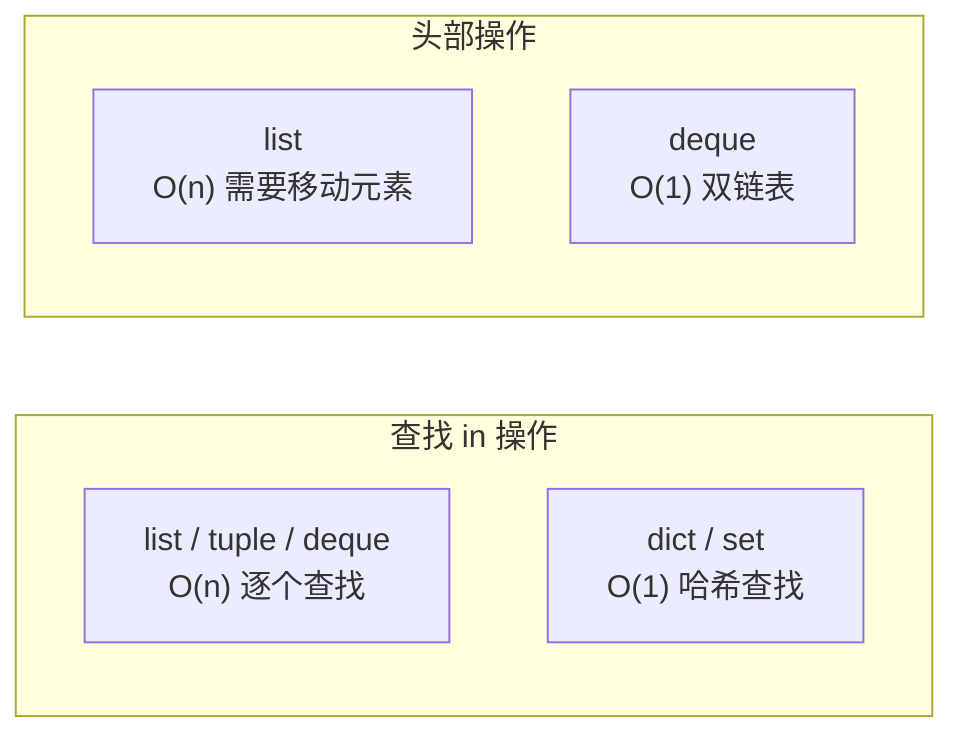
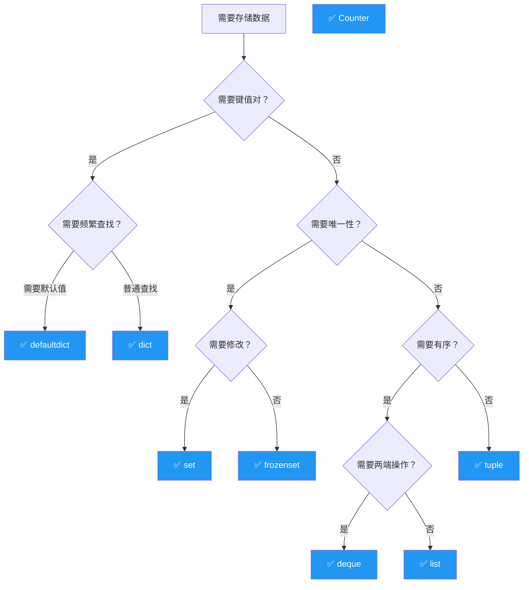

# 容器性能对比

> **所属路径**：`01_基础能力/01_开发环境与技术英语/03_容器类型深入/05_容器性能对比`
> **预计学习时间**：45 分钟
> **难度等级**：⭐⭐

---

## 前置知识

- [变量与数据类型](../../01_编程语言基础/01_变量与数据类型/01_变量与数据类型.md)（了解列表、字典、元组、集合的基本用法）
- [collections模块](../01_collections模块/01_collections模块.md)（了解 deque、Counter 等容器）
- [数据类与具名元组](../02_数据类与具名元组/02_数据类与具名元组.md)（了解 namedtuple 和 dataclass）

> 如果以上内容还不熟悉，建议先完成对应课程再继续。

---

## 学习目标

完成本节后，你将能够：

1. 说出 Python 常用容器在增、删、查、改操作上的时间复杂度
2. 理解列表与 deque 在头部操作上的性能差异，并选择合适的数据结构
3. 理解字典与集合基于哈希表的查找优势
4. 使用 `timeit` 模块实际测量不同容器的操作耗时
5. 根据实际场景选择最合适的容器类型

---

## 正文讲解

### 1. 为什么性能很重要？

在学习容器类型时，初学者往往只关注"能不能用"，而忽略了"用什么最快"。当你处理 100 个元素时，容器之间的性能差异可以忽略不计；但当数据量增长到 10 万、100 万甚至更多时，选错容器可能让你的程序从"瞬间完成"变成"等到天荒地老"。

举一个直观的例子：在一个包含 100 万个元素的列表中，用 `in` 检查某个元素是否存在，平均需要遍历 50 万个元素；而用集合，只需要一次哈希计算。当你需要做 1000 次这样的检查时，列表需要约 5 亿次比较，集合只需要 1000 次哈希——**差距是 50 万倍**。

理解容器的性能特征，是写出高效代码的第一步。

### 2. 时间复杂度速查表

下面这张表总结了 Python 常用容器在各种操作下的 **平均时间复杂度** ：

| 操作 | list | dict | set | deque | tuple |
| ---- | ---- | ---- | --- | ----- | ----- |
| 索引访问 `x[i]` | $O(1)$ | — | — | $O(n)$ | $O(1)$ |
| 键/值查找 `x[k]` | — | $O(1)$ | — | — | — |
| 成员检查 `in` | $O(n)$ | $O(1)$ | $O(1)$ | $O(n)$ | $O(n)$ |
| 尾部追加 `append` | $O(1)$\* | — | — | $O(1)$ | — |
| 头部追加 `appendleft` | $O(n)$ | — | — | $O(1)$ | — |
| 中间插入 `insert(i, x)` | $O(n)$ | — | — | $O(n)$ | — |
| 尾部删除 `pop()` | $O(1)$ | — | — | $O(1)$ | — |
| 头部删除 `pop(0)` | $O(n)$ | — | — | $O(1)$ | — |
| 按值删除 `remove(x)` | $O(n)$ | — | $O(1)$ | $O(n)$ | — |
| 添加元素 `add` | — | — | $O(1)$ | — | — |
| 设置键值 `d[k]=v` | — | $O(1)$ | — | — | — |
| 删除键 `del d[k]` | — | $O(1)$ | $O(1)$ | — | — |
| 排序 `sort()` | $O(n \log n)$ | — | — | — | — |
| 长度 `len()` | $O(1)$ | $O(1)$ | $O(1)$ | $O(1)$ | $O(1)$ |

> \* 列表的 `append` 是 **均摊** $O(1)$ ——大部分时候是 $O(1)$ ，偶尔需要扩容时是 $O(n)$ ，但平均下来仍是 $O(1)$ 。



> 📌 **图解说明**：两个最关键的性能差异：（1）成员检查用 `set`/`dict` 比 `list` 快得多；（2）头部操作用 `deque` 比 `list` 快得多。

### 3. 实测验证：用 timeit 说话

理论是一方面，让我们用代码实际测量，看看差距到底有多大。

#### 实验 1：成员检查——list vs set

```python
import timeit

n = 100_000
test_list = list(range(n))
test_set = set(range(n))
target = n - 1  # 最坏情况：查找最后一个元素

# 列表中查找
list_time = timeit.timeit(lambda: target in test_list, number=1000)

# 集合中查找
set_time = timeit.timeit(lambda: target in test_set, number=1000)

print(f"list 查找 1000 次: {list_time:.4f} 秒")
print(f"set  查找 1000 次: {set_time:.6f} 秒")
print(f"set 比 list 快 {list_time / set_time:.0f} 倍")
```

**典型输出**（实际结果因机器而异）：
```
list 查找 1000 次: 1.2345 秒
set  查找 1000 次: 0.000045 秒
set 比 list 快 27433 倍
```

#### 实验 2：头部插入——list vs deque

```python
import timeit
from collections import deque

n = 100_000

# 列表头部插入
def list_insert():
    lst = []
    for i in range(n):
        lst.insert(0, i)

# deque 头部插入
def deque_insert():
    dq = deque()
    for i in range(n):
        dq.appendleft(i)

list_time = timeit.timeit(list_insert, number=1)
deque_time = timeit.timeit(deque_insert, number=1)

print(f"list 头部插入 {n} 次: {list_time:.4f} 秒")
print(f"deque 头部插入 {n} 次: {deque_time:.4f} 秒")
print(f"deque 比 list 快 {list_time / deque_time:.0f} 倍")
```

**典型输出**：
```
list 头部插入 100000 次: 2.1234 秒
deque 头部插入 100000 次: 0.0089 秒
deque 比 list 快 238 倍
```

#### 实验 3：字典 vs 列表的键值查找

```python
import timeit

n = 100_000
# 列表存储键值对
pairs_list = [(i, f"value_{i}") for i in range(n)]
# 字典存储键值对
pairs_dict = {i: f"value_{i}" for i in range(n)}

target = n - 1

# 在列表中查找
def list_lookup():
    for k, v in pairs_list:
        if k == target:
            return v

# 在字典中查找
def dict_lookup():
    return pairs_dict[target]

list_time = timeit.timeit(list_lookup, number=1000)
dict_time = timeit.timeit(dict_lookup, number=1000)

print(f"list 查找 1000 次: {list_time:.4f} 秒")
print(f"dict 查找 1000 次: {dict_time:.6f} 秒")
print(f"dict 比 list 快 {list_time / dict_time:.0f} 倍")
```

### 4. 内存占用对比

性能不仅仅是速度，还包括内存占用。不同容器存储同样的数据，占用的内存可能差别很大：

```python
import sys
from collections import namedtuple, deque
from dataclasses import dataclass

# 存储一个 "点"
point_tuple = (1.0, 2.0)
point_dict = {"x": 1.0, "y": 2.0}

Point_nt = namedtuple("Point", ["x", "y"])
point_nt = Point_nt(1.0, 2.0)

@dataclass
class PointDC:
    x: float
    y: float

point_dc = PointDC(1.0, 2.0)

@dataclass(slots=True)  # Python 3.10+
class PointSlots:
    x: float
    y: float

point_slots = PointSlots(1.0, 2.0)

print("=== 单个 '点' 的内存占用 ===")
print(f"  tuple:          {sys.getsizeof(point_tuple):>4} bytes")
print(f"  dict:           {sys.getsizeof(point_dict):>4} bytes")
print(f"  namedtuple:     {sys.getsizeof(point_nt):>4} bytes")
print(f"  dataclass:      {sys.getsizeof(point_dc):>4} bytes")
print(f"  dataclass+slots:{sys.getsizeof(point_slots):>4} bytes")
```

**典型输出**：
```
=== 单个 '点' 的内存占用 ===
  tuple:            56 bytes
  dict:            184 bytes
  namedtuple:       56 bytes
  dataclass:        48 bytes
  dataclass+slots:  48 bytes
```

> 💡 **关键发现**：
> - `tuple` 和 `namedtuple` 的内存占用几乎相同（namedtuple 本质就是 tuple）
> - `dict` 占用的内存是 tuple 的 3 倍多（因为需要存储哈希表结构）
> - `dataclass` 使用 `slots=True` 可以减少内存占用（省去了 `__dict__`）

### 5. 容器选择决策树

面对一个具体的编程场景，如何快速选择最合适的容器？以下决策树可以帮助你：



> 📌 **图解说明**：根据你的数据特征（是否需要键值对、唯一性、有序性、两端操作、可变性）逐步缩小容器选择范围。

### 6. 常见场景与最佳容器选择

| 场景 | 推荐容器 | 原因 |
| ---- | -------- | ---- |
| 存储有序元素，需要索引访问 | `list` | $O(1)$ 随机访问 |
| 需要频繁在两端添加/删除 | `deque` | 两端操作均为 $O(1)$ |
| 需要快速判断元素是否存在 | `set` | $O(1)$ 成员检查 |
| 键值映射，快速通过键查值 | `dict` | $O(1)$ 键查找 |
| 不可变的记录（如坐标、配置） | `tuple` / `namedtuple` | 内存小、不可变、可哈希 |
| 统计元素频率 | `Counter` | 内置 `most_common()` 等方法 |
| 分组聚合 | `defaultdict(list)` | 自动创建默认值，省去键检查 |
| 需要所有元素唯一且不可变 | `frozenset` | 不可变集合，可作为字典键 |
| 大量结构化对象 | `dataclass(slots=True)` | 内存占用小，支持类型注解 |
| 固定长度的滑动窗口 | `deque(maxlen=N)` | 自动丢弃旧元素 |
| 多级配置的优先级查找 | `ChainMap` | 不复制数据，按优先级查找 |

---

## 动手实践

让我们写一个完整的性能基准测试脚本，直观对比各容器的关键操作：

```python
# 文件：code/benchmark.py
# 容器性能基准测试
import timeit
from collections import deque

def benchmark(name, stmt, setup="", number=1000):
    """运行基准测试并打印结果"""
    time_taken = timeit.timeit(stmt, setup=setup, number=number, globals=globals())
    print(f"  {name:<35s} {time_taken:.6f} 秒 ({number} 次)")
    return time_taken

N = 50_000
test_list = list(range(N))
test_set = set(range(N))
test_dict = {i: i for i in range(N)}
test_deque = deque(range(N))
target = N - 1  # 查找最后一个元素

print(f"=== 成员检查 (in) · 数据量 {N} · 各执行 1000 次 ===")
t_list = benchmark("list  中查找", f"{target} in test_list")
t_set = benchmark("set   中查找", f"{target} in test_set")
t_dict = benchmark("dict  中查找", f"{target} in test_dict")
print(f"  → set 比 list 快约 {t_list/t_set:.0f} 倍\n")

print(f"=== 尾部追加 · 各追加 {N} 个元素 · 执行 1 次 ===")
benchmark("list.append", f"""
lst = []
for i in range({N}):
    lst.append(i)
""", number=1)
benchmark("deque.append", f"""
from collections import deque
dq = deque()
for i in range({N}):
    dq.append(i)
""", number=1)

print(f"\n=== 头部追加 · 各追加 {N} 个元素 · 执行 1 次 ===")
benchmark("list.insert(0, x)", f"""
lst = []
for i in range({N}):
    lst.insert(0, i)
""", number=1)
benchmark("deque.appendleft", f"""
from collections import deque
dq = deque()
for i in range({N}):
    dq.appendleft(i)
""", number=1)
```

**运行说明**：
- 环境要求：Python 3.10+
- 运行命令：`python code/benchmark.py`

---

## 典型误区

| 误区 | 正确理解 |
| ---- | -------- |
| "列表什么都能做，不需要考虑其他容器" | 列表是通用容器，但在特定场景下（成员检查、头部操作、键值查找）其他容器快几个数量级 |
| "集合和字典查找也有可能变慢" | 理论上哈希冲突严重时会退化到 $O(n)$ ，但 Python 的哈希实现已经极大地降低了这种概率，实际中几乎总是 $O(1)$ |
| "`sys.getsizeof` 能准确反映总内存" | `sys.getsizeof` 只测量对象自身的大小，不包括它引用的其他对象。对于嵌套容器，需要递归测量 |
| "tuple 比 list 快是因为不可变" | `tuple` 在创建和迭代上比 `list` 稍快，但最主要的优势是内存更小和可哈希。在索引访问和迭代速度上，两者差异很小 |

---

## 练习题

### 练习 1：选择合适的容器（难度：⭐）

对于以下每个场景，选择最合适的容器类型并说明原因：

1. 存储 100 万个用户 ID，需要快速判断某个 ID 是否存在
2. 存储最近 100 条聊天消息，新消息到来时自动丢弃最旧的
3. 存储学生姓名和成绩的对应关系
4. 存储一个 RGB 颜色值（三个整数）

<details>
<summary>✅ 参考答案</summary>

1. **`set`** — 成员检查 $O(1)$ ，且不需要键值对，只需要判断存在性
2. **`deque(maxlen=100)`** — 固定长度的滑动窗口，自动丢弃旧元素
3. **`dict`** — 键值映射，通过姓名快速查找成绩
4. **`namedtuple` 或 `tuple`** — 固定不变的三个值，namedtuple 提供字段名语义

</details>

### 练习 2：优化一段慢代码（难度：⭐⭐）

以下代码在大数据量下非常慢，请分析原因并优化：

```python
# 原始代码：找出两个列表中的共同元素
def find_common_slow(list_a, list_b):
    common = []
    for item in list_a:
        if item in list_b:  # 这里很慢！
            if item not in common:  # 这里也很慢！
                common.append(item)
    return common

# 测试数据
import random
a = random.sample(range(1_000_000), 100_000)
b = random.sample(range(1_000_000), 100_000)
```

<details>
<summary>💡 提示</summary>

两处 `in` 检查都是 $O(n)$ 。可以将 `list_b` 和 `common` 都改为集合。更简洁的做法是直接用集合的交集运算。

</details>

<details>
<summary>✅ 参考答案</summary>

```python
# 优化方案 1：使用集合
def find_common_fast(list_a, list_b):
    set_b = set(list_b)       # 转为集合，in 检查 O(1)
    seen = set()
    common = []
    for item in list_a:
        if item in set_b and item not in seen:
            common.append(item)
            seen.add(item)
    return common

# 优化方案 2：一行搞定（最 Pythonic）
def find_common_pythonic(list_a, list_b):
    return list(set(list_a) & set(list_b))

# 验证
import random
a = random.sample(range(1_000_000), 100_000)
b = random.sample(range(1_000_000), 100_000)

import timeit
# t_slow = timeit.timeit(lambda: find_common_slow(a, b), number=1)  # 太慢，不建议运行
t_fast = timeit.timeit(lambda: find_common_fast(a, b), number=10)
t_pythonic = timeit.timeit(lambda: find_common_pythonic(a, b), number=10)
print(f"fast 方案:     {t_fast:.4f} 秒 (10次)")
print(f"pythonic 方案: {t_pythonic:.4f} 秒 (10次)")
```

</details>

### 练习 3：性能实验报告（难度：⭐⭐）

使用 `timeit` 测量以下操作在不同数据量（ $n = 1000, 10000, 100000$ ）下的耗时，并总结规律：

1. `list` 的 `append` vs `insert(0, x)` （各执行 $n$ 次）
2. `list` 的 `in` vs `set` 的 `in` （各执行 1000 次查找）

<details>
<summary>💡 提示</summary>

使用循环遍历不同的 $n$ 值，用 `timeit.timeit` 测量。结果应该清晰地展示 $O(1)$ vs $O(n)$ 的增长趋势。

</details>

<details>
<summary>✅ 参考答案</summary>

```python
import timeit
from collections import deque

for n in [1000, 10_000, 100_000]:
    print(f"\n=== n = {n:,} ===")

    # 1. append vs insert(0, x)
    t_append = timeit.timeit(f"""
lst = []
for i in range({n}):
    lst.append(i)
""", number=1)
    t_insert = timeit.timeit(f"""
lst = []
for i in range({n}):
    lst.insert(0, i)
""", number=1)
    print(f"  list.append x{n}: {t_append:.4f}s")
    print(f"  list.insert(0) x{n}: {t_insert:.4f}s (慢 {t_insert/t_append:.0f}x)")

    # 2. list in vs set in
    setup = f"data_list = list(range({n})); data_set = set(range({n})); target = {n-1}"
    t_list_in = timeit.timeit("target in data_list", setup=setup, number=1000)
    t_set_in = timeit.timeit("target in data_set", setup=setup, number=1000)
    print(f"  list 'in' x1000: {t_list_in:.4f}s")
    print(f"  set  'in' x1000: {t_set_in:.6f}s (快 {t_list_in/t_set_in:.0f}x)")
```

你应该能观察到：
- `insert(0, x)` 的耗时随 $n$ 的增大 **二次增长** （因为每次插入都是 $O(n)$ ，总共执行 $n$ 次）
- `set` 的 `in` 操作耗时**几乎不变**（始终是 $O(1)$ ），而 `list` 的耗时**线性增长**

</details>

---

## 下一步学习

- 📖 下一个知识主题：[迭代器与函数式工具](../../04_迭代器与函数式工具/) — 学习迭代器协议和 itertools、functools 等函数式编程工具
- 🔗 相关知识点：[Python内存模型与性能](../../09_Python内存模型与性能/) — 深入了解 Python 的内存管理和性能优化
- 🔗 相关知识点：[字符串性能与intern机制](../../02_字符串与编码/04_字符串性能与intern机制/04_字符串性能与intern机制.md) — 字符串层面的性能优化

---

## 参考资料

1. [Python Wiki - TimeComplexity](https://wiki.python.org/moin/TimeComplexity) — Python 各数据结构操作的时间复杂度表（官方 Wiki，CC BY 许可）
2. [Python 官方文档 - timeit 模块](https://docs.python.org/zh-cn/3/library/timeit.html) — 性能测量工具（官方文档）
3. [Python 官方文档 - 数据结构](https://docs.python.org/zh-cn/3/tutorial/datastructures.html) — 内置数据结构的官方教程（官方文档）
4. [Real Python - Python Timer Functions](https://realpython.com/python-timer/) — Python 性能测量技巧（公开教程）
