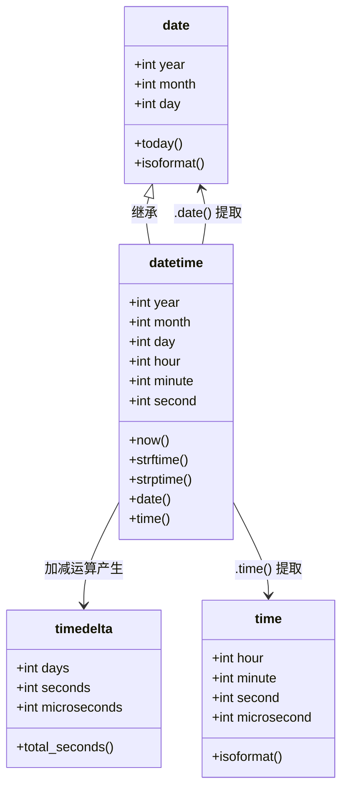
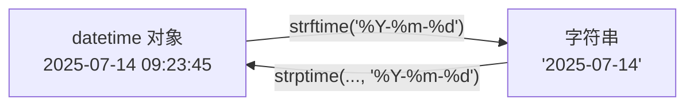

# 日期与时间处理

> **所属路径**：`01_基础能力/01_开发环境与技术英语/06_日期时间与日志/01_日期与时间处理`
> **预计学习时间**：45 分钟
> **难度等级**：⭐

---

## 前置知识

- [变量与数据类型](../../01_编程语言基础/01_变量与数据类型/01_变量与数据类型.md)（整数、浮点数、字符串等基础类型）
- [函数与模块](../../01_编程语言基础/03_函数与模块/03_函数与模块.md)（`import` 导入和函数调用）
- [字符串方法与格式化](../../02_字符串与编码/01_字符串方法与格式化/01_字符串方法与格式化.md)（f-string 和字符串拼接）

> 如果以上内容还不熟悉，建议先完成对应课程再继续。

---

## 学习目标

完成本节后，你将能够：

1. 使用 `datetime` 模块创建和操作日期与时间对象
2. 用 `strftime()` 将日期对象格式化为指定样式的字符串
3. 用 `strptime()` 将日期字符串解析为 `datetime` 对象
4. 通过 `timedelta` 完成日期加减运算和时间间隔计算
5. 使用 `time` 模块进行程序性能计时

---

## 正文讲解

### 1. 为什么需要日期与时间处理

想象你在开发一个日志分析工具。服务器每秒钟产生数百条日志，每条日志都带有一个时间戳，类似 `"2025-07-14 09:23:45"` 。你的任务是找出过去 24 小时内所有的错误日志。这时你会遇到一连串问题：怎么把这段文字变成程序能理解的"时间"？怎么计算"24 小时前"是哪一刻？怎么比较两个时间的先后？

再比如，你在做数据分析，需要统计"每个月的销售额"——这就要从日期中提取年份和月份。又或者你写一个定时任务脚本，需要判断"现在是不是每周一的上午 9 点"。

这些场景都离不开 **日期与时间处理** 。Python 标准库提供了 `datetime` 、 `time` 和 `calendar` 三个模块来应对这些需求。接下来我们从最核心的 `datetime` 模块开始，一步一步掌握这些工具。

### 2. datetime 模块全景

`datetime` 模块是 Python 中处理日期和时间的核心工具箱。它提供了几个关键类，每个类负责不同维度的时间信息：



> 📌 **图解说明**：`datetime` 类继承自 `date` ，同时包含日期和时间信息。两个 `datetime` 对象相减会产生一个 `timedelta` 对象，表示时间间隔。通过 `.date()` 和 `.time()` 方法可以分别提取纯日期和纯时间部分。

简单来说：

| 类 | 用途 | 包含信息 |
| --- | --- | --- |
| `date` | 纯日期 | 年、月、日 |
| `time` | 纯时间 | 时、分、秒、微秒 |
| `datetime` | 日期 + 时间 | 年、月、日、时、分、秒 |
| `timedelta` | 时间间隔 | 天数、秒数、微秒数 |

在实际开发中，`datetime` 类是用得最多的——因为我们通常需要同时知道"哪一天"和"几点钟"。

### 3. 创建日期时间对象

有了全景认识后，让我们动手创建第一个日期时间对象。最常用的方式有三种：获取当前时间、手动指定时间、以及获取今天的日期。

```python
from datetime import datetime, date, time

# 方式一：获取当前日期和时间
now = datetime.now()
print(f"当前时间：{now}")
# 输出示例：当前时间：2025-07-14 10:30:45.123456

# 方式二：手动创建指定的日期时间
birthday = datetime(2000, 6, 15, 8, 30, 0)
print(f"生日：{birthday}")
# 输出：生日：2000-06-15 08:30:00

# 方式三：只创建日期（不含时间）
today = date.today()
print(f"今天：{today}")
# 输出示例：今天：2025-07-14

# 方式四：只创建时间（不含日期）
alarm = time(7, 30, 0)
print(f"闹钟：{alarm}")
# 输出：闹钟：07:30:00
```

注意一个细节：`datetime.now()` 返回的时间精确到微秒（小数点后 6 位），而手动创建时如果不指定秒和微秒，它们默认为 0。

创建好对象后，你可以通过属性访问其中的各个部分：

```python
from datetime import datetime

now = datetime.now()
print(f"年：{now.year}")
print(f"月：{now.month}")
print(f"日：{now.day}")
print(f"时：{now.hour}")
print(f"分：{now.minute}")
print(f"秒：{now.second}")
print(f"星期几：{now.weekday()}")  # 0=周一, 6=周日
print(f"ISO 星期几：{now.isoweekday()}")  # 1=周一, 7=周日
```

这里有一个容易混淆的地方：`weekday()` 从 0 开始（周一=0），而 `isoweekday()` 从 1 开始（周一=1）。后续练习中会再次提醒这个区别。

### 4. 格式化输出：strftime()

我们已经能创建日期时间对象了，但当你需要把日期展示给用户、写入日志或者保存到文件时，往往需要特定的格式。比如中国习惯 `"2025年07月14日"` ，而国际标准是 `"2025-07-14"` ，美式写法则是 `"07/14/2025"` 。

**`strftime()`** （string format time）方法就是做这件事的——它把 `datetime` 对象转换为你指定格式的 **[字符串（String）](../../02_字符串与编码/01_字符串方法与格式化/01_字符串方法与格式化.md)** 。

常用的格式化代码如下：

| 格式代码 | 含义 | 示例 |
| --- | --- | --- |
| `%Y` | 四位年份 | `2025` |
| `%m` | 两位月份（补零） | `07` |
| `%d` | 两位日期（补零） | `14` |
| `%H` | 24 小时制小时 | `09` |
| `%I` | 12 小时制小时 | `09` |
| `%M` | 分钟 | `23` |
| `%S` | 秒 | `45` |
| `%p` | AM/PM | `AM` |
| `%A` | 星期几（英文全称） | `Monday` |
| `%a` | 星期几（英文缩写） | `Mon` |
| `%B` | 月份（英文全称） | `July` |
| `%b` | 月份（英文缩写） | `Jul` |

来看几个实际例子：

```python
from datetime import datetime

now = datetime(2025, 7, 14, 9, 23, 45)

# 中文日期格式
print(now.strftime("%Y年%m月%d日"))
# 输出：2025年07月14日

# ISO 标准格式
print(now.strftime("%Y-%m-%d %H:%M:%S"))
# 输出：2025-07-14 09:23:45

# 日志常用格式
print(now.strftime("[%Y-%m-%d %H:%M:%S]"))
# 输出：[2025-07-14 09:23:45]

# 12 小时制
print(now.strftime("%I:%M %p"))
# 输出：09:23 AM

# 文件名安全格式（避免冒号和空格）
print(now.strftime("report_%Y%m%d_%H%M%S"))
# 输出：report_20250714_092345
```

> 💡 **记忆技巧**：`%Y` 中的 Y 代表 Year（年），`%m` 小写 m 代表 month（月），`%d` 代表 day（日），`%H` 大写 H 代表 Hour（24 小时制），`%M` 大写 M 代表 Minute（分），`%S` 代表 Second（秒）。注意大小写：`%m` 是月份，`%M` 是分钟，搞混了输出就全乱了！

### 5. 解析日期字符串：strptime()

格式化是把"对象变成字符串"，反过来，**解析** 是把"字符串变成对象"。当你从日志文件、CSV 数据或 API 响应中读到一个日期字符串时，需要用 `strptime()` 把它还原为 `datetime` 对象，才能做进一步的计算和比较。

`strptime()` 的名字可以理解为 "string parse time"——根据你指定的格式模板来解析字符串。

```python
from datetime import datetime

# 解析 ISO 格式
dt1 = datetime.strptime("2025-07-14 09:23:45", "%Y-%m-%d %H:%M:%S")
print(dt1)
# 输出：2025-07-14 09:23:45

# 解析中文日期
dt2 = datetime.strptime("2025年07月14日", "%Y年%m月%d日")
print(dt2)
# 输出：2025-07-14 00:00:00

# 解析美式日期
dt3 = datetime.strptime("07/14/2025", "%m/%d/%Y")
print(dt3)
# 输出：2025-07-14 00:00:00

# 解析日志时间戳
dt4 = datetime.strptime("[2025-07-14 09:23:45]", "[%Y-%m-%d %H:%M:%S]")
print(dt4)
# 输出：2025-07-14 09:23:45
```

`strftime()` 和 `strptime()` 是一对互逆操作，用的格式代码完全相同：



> 📌 **图解说明**：`strftime()` 负责"对象 → 字符串"，`strptime()` 负责"字符串 → 对象"。两者使用相同的格式代码，方向相反。

⚠️ **注意**：如果字符串格式和你提供的格式模板不匹配，`strptime()` 会抛出 `ValueError` 。比如用 `"%Y-%m-%d"` 去解析 `"07/14/2025"` 就会报错，因为分隔符不一致。

### 6. 日期算术：timedelta

现在你已经能创建和解析日期了，接下来最实用的操作就是日期加减——"三天后是几号？""两个事件之间隔了多久？"这些问题都要用到 **`timedelta`** 类。

`timedelta` 表示两个时间点之间的"间隔"。你可以用它来对日期做加减运算：

```python
from datetime import datetime, timedelta

now = datetime(2025, 7, 14, 9, 0, 0)

# 3 天后
three_days_later = now + timedelta(days=3)
print(f"3 天后：{three_days_later}")
# 输出：3 天后：2025-07-17 09:00:00

# 2 小时前
two_hours_ago = now - timedelta(hours=2)
print(f"2 小时前：{two_hours_ago}")
# 输出：2 小时前：2025-07-14 07:00:00

# 1 周 + 3 小时后
future = now + timedelta(weeks=1, hours=3)
print(f"1 周 3 小时后：{future}")
# 输出：1 周 3 小时后：2025-07-21 12:00:00
```

两个 `datetime` 对象相减，结果就是一个 `timedelta` ：

```python
from datetime import datetime

start = datetime(2025, 1, 1)
end = datetime(2025, 7, 14)

duration = end - start
print(f"间隔天数：{duration.days}")
# 输出：间隔天数：194

print(f"总秒数：{duration.total_seconds()}")
# 输出：总秒数：16761600.0
```

`timedelta` 支持的参数包括：`weeks` 、 `days` 、 `hours` 、 `minutes` 、 `seconds` 、 `milliseconds` 、 `microseconds` 。不过要注意，`timedelta` 内部只存储三个值—— `days` 、 `seconds` 和 `microseconds` ，其他参数会被自动换算：

```python
from datetime import timedelta

# 创建 1.5 小时的间隔
td = timedelta(hours=1, minutes=30)
print(f"days={td.days}, seconds={td.seconds}")
# 输出：days=0, seconds=5400
# 因为 1.5 小时 = 5400 秒
```

### 7. 日期比较

在日志分析和数据筛选中，经常需要判断一个时间是否在某个范围内。`datetime` 对象支持所有标准比较运算符：

```python
from datetime import datetime

dt1 = datetime(2025, 7, 14)
dt2 = datetime(2025, 7, 20)
dt3 = datetime(2025, 7, 14)

print(dt1 < dt2)   # True —— dt1 更早
print(dt1 > dt2)   # False
print(dt1 == dt3)   # True —— 同一时刻
print(dt1 != dt2)   # True
print(dt1 <= dt3)   # True
```

结合 `timedelta` ，可以轻松实现"过去 N 天内"的筛选逻辑：

```python
from datetime import datetime, timedelta

# 模拟日志列表
logs = [
    {"time": datetime(2025, 7, 10, 8, 0), "msg": "启动服务"},
    {"time": datetime(2025, 7, 13, 14, 30), "msg": "磁盘告警"},
    {"time": datetime(2025, 7, 14, 2, 15), "msg": "连接超时"},
    {"time": datetime(2025, 7, 14, 9, 0), "msg": "恢复正常"},
]

now = datetime(2025, 7, 14, 10, 0)
one_day_ago = now - timedelta(days=1)

# 筛选过去 24 小时内的日志
recent = [log for log in logs if log["time"] >= one_day_ago]
for log in recent:
    print(f"  {log['time'].strftime('%m-%d %H:%M')} | {log['msg']}")
# 输出：
#   07-13 14:30 | 磁盘告警
#   07-14 02:15 | 连接超时
#   07-14 09:00 | 恢复正常
```

### 8. calendar 模块

除了 `datetime` ，Python 还提供了 `calendar` 模块来处理与日历相关的操作。虽然使用频率不如 `datetime` 高，但在某些场景下非常方便：

```python
import calendar

# 判断闰年
print(calendar.isleap(2024))  # True
print(calendar.isleap(2025))  # False

# 某月有多少天
# monthrange 返回 (该月第一天是星期几, 该月总天数)
weekday, days = calendar.monthrange(2025, 2)
print(f"2025年2月有 {days} 天")
# 输出：2025年2月有 28 天

weekday, days = calendar.monthrange(2024, 2)
print(f"2024年2月有 {days} 天")
# 输出：2024年2月有 29 天

# 打印某月日历
print(calendar.month(2025, 7))
```

`calendar.monthrange()` 在需要遍历某个月所有日期、或者计算月末日期时特别有用——比如生成"每月最后一天"的报表日期。

### 9. time 模块与性能计时

最后来看 `time` 模块。虽然 `datetime` 是处理"人类可读时间"的主力，但 `time` 模块在两个场景下不可替代：获取时间戳和精确计时。

**时间戳（Timestamp）** 是从 1970 年 1 月 1 日 00:00:00 UTC 到现在的秒数（也叫 **Unix 时间戳** ），常用于数据库存储和 API 通信：

```python
import time
from datetime import datetime

# 获取当前时间戳
ts = time.time()
print(f"当前时间戳：{ts}")
# 输出示例：当前时间戳：1752487200.123456

# 时间戳与 datetime 互转
dt = datetime.fromtimestamp(ts)
print(f"转为 datetime：{dt}")

ts2 = datetime(2025, 7, 14).timestamp()
print(f"datetime 转时间戳：{ts2}")
```

**性能计时** 是另一个高频需求。当你想测量一段代码的执行时间时，应该使用 `time.perf_counter()` 而不是 `time.time()` ——前者提供更高的精度，专为性能测量设计：

```python
import time

start = time.perf_counter()

# 模拟耗时操作
total = sum(range(1_000_000))

end = time.perf_counter()
elapsed = end - start
print(f"计算结果：{total}")
print(f"耗时：{elapsed:.6f} 秒")
# 输出示例：
# 计算结果：499999500000
# 耗时：0.023456 秒
```

> 💡 **为什么不用 `time.time()` 计时？** `time.time()` 返回的是系统时钟时间，可能受系统时间调整（如 NTP 同步）的影响。而 `time.perf_counter()` 使用的是单调递增的高精度计时器，不受系统时钟修改的影响，是性能测量的首选。

`time` 模块还提供了 `time.sleep()` 方法，可以让程序暂停指定秒数——这在定时任务和节流控制中很常用：

```python
import time

print("开始等待...")
time.sleep(1.5)  # 暂停 1.5 秒
print("等待结束！")
```

---

## 动手实践

> 下面我们把前面学到的知识串联起来，实现一个简单的"项目倒计时工具"：输入项目截止日期，输出距离截止还有多少天、多少小时，以及格式化的提醒信息。

```python
# 文件：code/countdown.py
# 项目倒计时工具 —— 综合运用 datetime 模块的核心功能
# 环境要求：Python 3.10+（无需额外库）

from datetime import datetime, timedelta
import time


def countdown_report(deadline_str: str, fmt: str = "%Y-%m-%d %H:%M") -> None:
    """根据截止日期字符串，生成倒计时报告。"""

    # 1. 解析截止日期字符串 —— strptime
    try:
        deadline = datetime.strptime(deadline_str, fmt)
    except ValueError:
        print(f"❌ 日期格式错误！请使用格式：{fmt}")
        print(f"   示例：2025-12-31 23:59")
        return

    # 2. 获取当前时间
    now = datetime.now()

    # 3. 格式化输出基本信息 —— strftime
    print("=" * 50)
    print(f"📅 当前时间：{now.strftime('%Y年%m月%d日 %H:%M:%S')}")
    print(f"🎯 截止时间：{deadline.strftime('%Y年%m月%d日 %H:%M')}")
    print(f"   星期{['一','二','三','四','五','六','日'][deadline.weekday()]}")
    print("=" * 50)

    # 4. 计算时间差 —— timedelta
    diff: timedelta = deadline - now

    if diff.total_seconds() <= 0:
        print("⏰ 截止时间已过！")
        overdue = now - deadline
        print(f"   已超期 {overdue.days} 天 {overdue.seconds // 3600} 小时")
        return

    # 5. 拆解时间差为 天、小时、分钟
    total_seconds = int(diff.total_seconds())
    days = diff.days
    hours = (total_seconds % 86400) // 3600
    minutes = (total_seconds % 3600) // 60

    print(f"⏳ 剩余时间：{days} 天 {hours} 小时 {minutes} 分钟")
    print(f"   （共 {total_seconds:,} 秒）")

    # 6. 日期比较 —— 给出紧急程度提示
    if diff <= timedelta(hours=24):
        print("🔴 紧急：不到 24 小时！")
    elif diff <= timedelta(days=3):
        print("🟡 注意：不到 3 天！")
    elif diff <= timedelta(weeks=1):
        print("🟢 还有时间，但别拖延。")
    else:
        print("✅ 时间充裕，合理规划即可。")

    # 7. 性能计时演示 —— time.perf_counter
    start = time.perf_counter()
    # 模拟一个小计算
    _ = sum(range(100_000))
    elapsed = time.perf_counter() - start
    print(f"\n📊 本次报告生成耗时：{elapsed:.4f} 秒")


# ---- 运行演示 ----
if __name__ == "__main__":
    # 演示 1：使用一个未来的截止日期
    print("\n【演示 1：项目截止倒计时】")
    # 设定为 30 天后的截止日期
    future_deadline = datetime.now() + timedelta(days=30)
    deadline_str = future_deadline.strftime("%Y-%m-%d %H:%M")
    countdown_report(deadline_str)

    # 演示 2：使用一个已过期的日期
    print("\n【演示 2：已过期的截止日期】")
    countdown_report("2020-01-01 00:00")

    # 演示 3：错误的日期格式
    print("\n【演示 3：格式错误处理】")
    countdown_report("14/07/2025")
```

**运行说明**：
- 环境要求：Python 3.10+（仅使用标准库）
- 运行命令：`python code/countdown.py`

**预期输出**（示例，具体数值取决于运行时间）：
```
【演示 1：项目截止倒计时】
==================================================
📅 当前时间：2025年07月14日 10:00:00
🎯 截止时间：2025年08月13日 10:00
   星期三
==================================================
⏳ 剩余时间：30 天 0 小时 0 分钟
   （共 2,592,000 秒）
✅ 时间充裕，合理规划即可。

📊 本次报告生成耗时：0.0012 秒

【演示 2：已过期的截止日期】
==================================================
📅 当前时间：2025年07月14日 10:00:00
🎯 截止时间：2020年01月01日 00:00
   星期三
==================================================
⏰ 截止时间已过！
   已超期 2020 天 10 小时

【演示 3：格式错误处理】
❌ 日期格式错误！请使用格式：%Y-%m-%d %H:%M
   示例：2025-12-31 23:59
```

这段代码综合运用了：`datetime.now()` 获取当前时间、`strptime()` 解析字符串、`strftime()` 格式化输出、`timedelta` 日期算术与比较、以及 `time.perf_counter()` 性能计时。

---

## 典型误区

| 误区 | 正确理解 |
| --- | --- |
| 用字符串比较日期（`"2025-07-14" > "2025-07-9"`） | 字符串按字典序比较，`"9"` > `"1"` 导致结果错误。应将字符串解析为 `datetime` 对象后再比较 |
| 混淆 `strftime` 和 `strptime` | `strftime` = format（格式化，对象→字符串）；`strptime` = parse（解析，字符串→对象） |
| 混淆 `%m`（月份）和 `%M`（分钟） | 大小写不同含义完全不同：`%m` 是 month，`%M` 是 minute。记住"小 m 是月，大 M 是分" |
| 用 `time.time()` 做性能计时 | `time.time()` 受系统时钟调整影响，应使用 `time.perf_counter()` 做精确计时 |
| 以为 `timedelta` 支持"月"和"年" | `timedelta` 只支持 weeks/days/hours/minutes/seconds，不支持月和年（因为月份天数不固定）。需要按月操作时可借助第三方库 `dateutil` |
| `weekday()` 以为周日是 0 | Python 的 `weekday()` 中周一=0、周日=6；如果需要周一=1 的约定，请使用 `isoweekday()` |

---

## 练习题

### 练习 1：日期格式转换器（难度：⭐）

编写一个函数 `convert_date_format(date_str, input_fmt, output_fmt)` ，接收一个日期字符串和输入/输出格式，返回转换后的字符串。

例如：`convert_date_format("07/14/2025", "%m/%d/%Y", "%Y年%m月%d日")` 应返回 `"2025年07月14日"` 。

<details>
<summary>💡 提示</summary>

先用 `strptime()` 按 `input_fmt` 解析，再用 `strftime()` 按 `output_fmt` 格式化。

</details>

<details>
<summary>✅ 参考答案</summary>

```python
from datetime import datetime


def convert_date_format(date_str: str, input_fmt: str, output_fmt: str) -> str:
    dt = datetime.strptime(date_str, input_fmt)
    return dt.strftime(output_fmt)


# 测试
result = convert_date_format("07/14/2025", "%m/%d/%Y", "%Y年%m月%d日")
assert result == "2025年07月14日", f"期望 '2025年07月14日'，实际 '{result}'"

result2 = convert_date_format("2025-07-14 09:30:00", "%Y-%m-%d %H:%M:%S", "%m/%d %I:%M %p")
assert result2 == "07/14 09:30 AM", f"期望 '07/14 09:30 AM'，实际 '{result2}'"

print("所有测试通过！✅")
```

</details>

### 练习 2：计算工作日天数（难度：⭐⭐）

编写一个函数 `count_workdays(start_str, end_str)` ，输入两个日期字符串（格式 `"%Y-%m-%d"` ），返回两个日期之间（含起止日）的工作日天数（周一到周五）。

例如：`count_workdays("2025-07-14", "2025-07-20")` ，其中 7 月 14 日是周一，7 月 20 日是周日，工作日为周一到周五共 5 天。

<details>
<summary>💡 提示</summary>

用 `strptime()` 解析日期，然后用 `timedelta(days=1)` 逐天遍历，通过 `weekday() < 5` 判断是否为工作日。

</details>

<details>
<summary>✅ 参考答案</summary>

```python
from datetime import datetime, timedelta


def count_workdays(start_str: str, end_str: str) -> int:
    start = datetime.strptime(start_str, "%Y-%m-%d")
    end = datetime.strptime(end_str, "%Y-%m-%d")
    count = 0
    current = start
    while current <= end:
        if current.weekday() < 5:  # 0-4 是周一到周五
            count += 1
        current += timedelta(days=1)
    return count


# 测试
assert count_workdays("2025-07-14", "2025-07-20") == 5  # 周一到周日，工作日5天
assert count_workdays("2025-07-14", "2025-07-14") == 1  # 单日（周一），1个工作日
assert count_workdays("2025-07-19", "2025-07-20") == 0  # 周六到周日，0个工作日

print("所有测试通过！✅")
```

</details>

### 练习 3：日志时间范围过滤（难度：⭐⭐）

给定以下日志数据，编写代码筛选出指定时间范围内的日志，并按时间排序输出：

```python
logs = [
    "2025-07-14 08:15:00 | 用户登录",
    "2025-07-13 22:30:00 | 数据备份完成",
    "2025-07-14 10:45:00 | API 超时",
    "2025-07-12 16:00:00 | 部署上线",
    "2025-07-14 03:20:00 | 内存告警",
]
```

筛选 `"2025-07-13 00:00:00"` 到 `"2025-07-14 09:00:00"` 之间的日志。

<details>
<summary>💡 提示</summary>

用 `split(" | ")` 分割日志行提取时间部分，再用 `strptime()` 解析后与范围端点比较。最后用 `sorted()` 排序。

</details>

<details>
<summary>✅ 参考答案</summary>

```python
from datetime import datetime

logs = [
    "2025-07-14 08:15:00 | 用户登录",
    "2025-07-13 22:30:00 | 数据备份完成",
    "2025-07-14 10:45:00 | API 超时",
    "2025-07-12 16:00:00 | 部署上线",
    "2025-07-14 03:20:00 | 内存告警",
]

start = datetime.strptime("2025-07-13 00:00:00", "%Y-%m-%d %H:%M:%S")
end = datetime.strptime("2025-07-14 09:00:00", "%Y-%m-%d %H:%M:%S")
fmt = "%Y-%m-%d %H:%M:%S"


def parse_log_time(log_line: str) -> datetime:
    time_str = log_line.split(" | ")[0]
    return datetime.strptime(time_str, fmt)


filtered = [log for log in logs if start <= parse_log_time(log) <= end]
filtered.sort(key=parse_log_time)

for log in filtered:
    print(log)

# 预期输出：
# 2025-07-13 22:30:00 | 数据备份完成
# 2025-07-14 03:20:00 | 内存告警
# 2025-07-14 08:15:00 | 用户登录
```

</details>

---

## 下一步学习

- 📖 下一个知识点：[时区与国际化](../02_时区与国际化/02_时区与国际化.md)——学习如何处理不同时区、UTC 转换和 `zoneinfo` 模块
- 🔗 知识主题概览：[日期时间与日志](../README.md)
- 📚 相关知识点：[字符串方法与格式化](../../02_字符串与编码/01_字符串方法与格式化/01_字符串方法与格式化.md)——日期格式化的字符串基础

---

## 参考资料

1. [datetime — Basic date and time types](https://docs.python.org/3/library/datetime.html) — Python 官方文档，`datetime` 模块完整 API 参考（官方文档）
2. [time — Time access and conversions](https://docs.python.org/3/library/time.html) — Python 官方文档，`time` 模块 API 参考（官方文档）
3. [calendar — General calendar-related functions](https://docs.python.org/3/library/calendar.html) — Python 官方文档，`calendar` 模块 API 参考（官方文档）
4. [strftime() and strptime() Format Codes](https://docs.python.org/3/library/datetime.html#strftime-and-strptime-format-codes) — Python 官方文档，格式化代码完整列表（官方文档）
