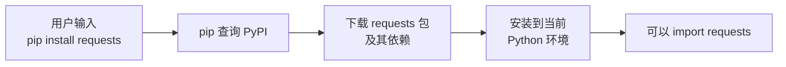
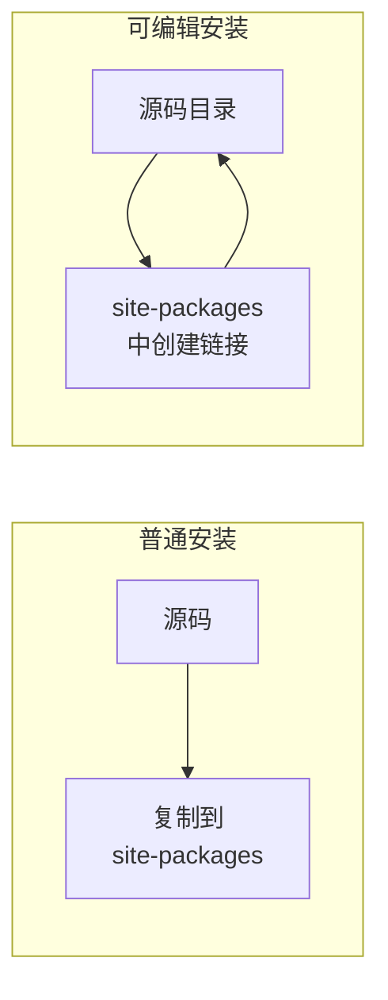

# 安装与卸载

> **所属路径**：`01_基础能力/01_开发环境与技术英语/14_包管理/01_安装与卸载`
> **预计学习时间**：30 分钟
> **难度等级**：⭐

---

## 前置知识

- [创建与激活虚拟环境](../../13_虚拟环境/02_创建与激活/02_创建与激活.md)

> 如果以上内容还不熟悉，建议先完成对应课程再继续。

---

## 学习目标

完成本节后，你将能够：

1. 使用 `pip install` 从 PyPI、本地文件和 Git 仓库安装 Python 包
2. 使用 `pip uninstall` 安全地卸载包
3. 使用 `pip list` 和 `pip show` 查看已安装包的信息
4. 区分全局安装和虚拟环境安装的差异
5. 使用 `pip install -e` 进行可编辑模式安装
6. 了解 `conda install` 和 `conda remove` 的基本用法

---

## 正文讲解

### 1. 为什么需要包管理

假设你正在学习数据分析，想用 Python 画一张折线图。Python 标准库本身并没有提供高级的绘图功能，但社区中有一个非常流行的库叫 matplotlib。问题来了：你怎么把它"装"到你的电脑上？

你当然不会去 matplotlib 的 GitHub 仓库手动下载源码、找到所有依赖、逐个编译——那太疯狂了。这正是 **包管理器（Package Manager）** 存在的意义：它帮你自动完成下载、安装、依赖解析等一系列繁琐的工作，让你只需一行命令就能把一个第三方库装好并投入使用。

在 Python 生态中，最常用的包管理器是 **pip** 和 **conda** 。pip 是 Python 官方推荐的包管理器，从 **Python 包索引（Python Package Index, PyPI）** 下载包；conda 则是 Anaconda/Miniconda 发行版自带的包管理器，拥有独立的包仓库，还能管理非 Python 依赖（如 C 库）。

下面这张图展示了 pip 安装包时的基本流程：



> 📌 **图解说明**：pip 会自动查询 PyPI 索引、下载目标包及其所有依赖包，然后将它们安装到当前活跃的 Python 环境中。

### 2. pip install 基本用法

pip 是你日常使用最多的包管理命令。它的基本语法非常简单：

```bash
pip install 包名
```

这条命令会从 PyPI 下载最新版本的包并安装。但 pip 的能力远不止于此——它支持多种安装来源。

#### 从 PyPI 安装

这是最常见的方式。PyPI 上有超过 50 万个包，几乎涵盖了你能想到的所有领域：

```bash
# 安装最新版本
pip install requests

# 安装指定版本
pip install requests==2.31.0

# 安装满足条件的版本
pip install "requests>=2.28,<3.0"
```

注意第三条命令中的引号——这是因为 `>` 和 `<` 在 Shell 中有特殊含义（输入/输出重定向），加引号可以避免 Shell 误解析。

#### 从本地文件安装

有时你从网上下载了一个 `.whl` 文件（**轮子文件（Wheel）** 是 Python 的预编译二进制分发格式），或者你拿到了一个 `.tar.gz` 格式的源码包，可以直接用 pip 安装：

```bash
# 安装本地 wheel 文件
pip install ./downloads/requests-2.31.0-py3-none-any.whl

# 安装本地源码包
pip install ./downloads/requests-2.31.0.tar.gz
```

#### 从 Git 仓库安装

当你需要使用某个库的最新开发版本（可能还没发布到 PyPI），可以直接从 Git 仓库安装：

```bash
# 从 GitHub 安装默认分支
pip install git+https://github.com/psf/requests.git

# 安装指定分支
pip install git+https://github.com/psf/requests.git@main

# 安装指定标签
pip install git+https://github.com/psf/requests.git@v2.31.0
```

这种方式在参与开源项目或使用尚未正式发布的功能时非常有用。

### 3. pip uninstall 卸载包

不再需要某个包时，用 `pip uninstall` 移除它：

```bash
pip uninstall requests
```

pip 会列出将要移除的文件列表，并要求你确认。如果你想跳过确认（例如在脚本中自动化操作），加上 `-y` 参数：

```bash
pip uninstall -y requests
```

需要注意的是，`pip uninstall` 只会卸载你指定的包本身，**不会自动卸载** 它的依赖项。例如，requests 依赖 urllib3 和 charset-normalizer，卸载 requests 后这些依赖仍然留在环境中。如果你想清理这些"孤立"依赖，需要手动判断它们是否还被其他包使用。

### 4. 查看已安装的包

在实际开发中，你经常需要确认某个包是否已安装、当前版本是多少。pip 提供了两个非常实用的命令。

#### pip list：列出所有已安装包

```bash
pip list
```

输出类似这样：

```
Package            Version
------------------ ---------
certifi            2024.2.2
charset-normalizer 3.3.2
idna               3.6
pip                24.0
requests           2.31.0
urllib3             2.2.1
```

加上 `--outdated` 参数可以查看哪些包有新版本：

```bash
pip list --outdated
```

#### pip show：查看单个包的详细信息

```bash
pip show requests
```

输出包括包名、版本、摘要、作者、许可证、安装位置、依赖关系等：

```
Name: requests
Version: 2.31.0
Summary: Python HTTP for Humans.
Home-page: https://requests.readthedocs.io
Author: Kenneth Reitz
License: Apache 2.0
Location: /home/user/.venv/lib/python3.12/site-packages
Requires: certifi, charset-normalizer, idna, urllib3
Required-by:
```

其中 `Requires` 字段告诉你这个包依赖了哪些其他包， `Required-by` 字段告诉你有哪些包依赖了它。这在排查依赖关系时非常有用。

### 5. 可编辑模式安装

当你正在开发一个 Python 包时（比如你自己写了一个库），每次修改代码后都重新 `pip install` 会非常麻烦。**可编辑模式安装（Editable Install）** 解决了这个问题：

```bash
pip install -e .
```

这条命令的意思是"把当前目录下的包以可编辑模式安装"。安装后，Python 不会把代码复制到 `site-packages` 目录，而是创建一个指向你源码目录的链接。这样，你对源码的任何修改都会立即生效，无需重新安装。



> 📌 **图解说明**：普通安装会将代码复制到 `site-packages` ，修改源码后需重新安装；可编辑安装创建链接，修改即时生效。

可编辑模式安装要求项目目录中存在 `pyproject.toml` 或 `setup.py` 文件，这样 pip 才知道如何识别你的包。

### 6. 全局安装 vs 虚拟环境安装

在前面的 [虚拟环境](../../13_虚拟环境/) 课程中，我们已经了解了环境隔离的重要性。这里再从包管理的角度强调一下两者的区别：

| 维度 | 全局安装 | 虚拟环境安装 |
| ---- | -------- | ------------ |
| 安装位置 | 系统 Python 的 `site-packages` | 虚拟环境的 `site-packages` |
| 影响范围 | 所有使用系统 Python 的项目 | 仅当前虚拟环境 |
| 权限要求 | 可能需要管理员权限（`sudo`） | 普通用户即可 |
| 版本冲突 | 项目 A 和 B 不能使用同一包的不同版本 | 每个项目独立，互不干扰 |
| 推荐场景 | 全局工具（如 `pipx`） | 所有项目开发 |

**最佳实践**：永远在虚拟环境中安装项目依赖。全局 Python 环境应保持干净，只安装少数全局工具（如 `pipx` 、 `cookiecutter` 等）。

### 7. conda install 与 conda remove

如果你使用 Anaconda 或 Miniconda，**conda** 是另一个强大的选择。conda 与 pip 的主要区别在于：

| 维度 | pip | conda |
| ---- | --- | ----- |
| 包来源 | PyPI | Anaconda 仓库 / conda-forge |
| 依赖解析 | 仅 Python 包 | Python + 非 Python 依赖（如 CUDA、MKL） |
| 环境管理 | 需配合 venv | 自带环境管理功能 |

conda 安装和卸载的命令如下：

```bash
# 安装包
conda install numpy

# 安装指定版本
conda install numpy=1.26.4

# 从 conda-forge 频道安装
conda install -c conda-forge scikit-learn

# 卸载包
conda remove numpy
```

**混合使用建议**：在 conda 环境中，优先使用 `conda install` 安装包。如果某个包在 conda 仓库中找不到，再退而使用 `pip install` 。反过来先 pip 后 conda 可能导致包管理状态混乱。

---

## 动手实践

下面我们在虚拟环境中实际操作一遍完整的包管理流程。请打开终端，逐步执行以下命令：

```bash
# 文件：code/practice.sh
# 包管理基本操作演练

# 1. 创建并激活虚拟环境
python -m venv demo_env
source demo_env/bin/activate   # Windows: demo_env\Scripts\activate

# 2. 确认环境是干净的
pip list

# 3. 安装 requests 库
pip install requests

# 4. 查看安装结果
pip list
pip show requests

# 5. 查看 requests 的依赖
pip show requests | grep Requires

# 6. 卸载 requests（注意依赖不会自动卸载）
pip uninstall -y requests
pip list   # 依赖包仍在

# 7. 清理环境
deactivate
rm -rf demo_env
```

**运行说明**：
- 环境要求：Python 3.10+
- 逐条执行上述命令，观察每一步的输出变化

**预期输出**（第 4 步 `pip show requests` 的关键输出）：
```
Name: requests
Version: 2.32.3
Requires: certifi, charset-normalizer, idna, urllib3
Required-by:
```

从输出中可以看到，安装 requests 后，pip 自动下载并安装了它的四个依赖项。这就是包管理器为你做的事情——自动解析并安装整棵依赖树。

---

## 典型误区

| 误区 | 正确理解 |
| ---- | -------- |
| 在系统全局环境中 `sudo pip install` 安装项目依赖 | 应在虚拟环境中安装，避免污染系统 Python 环境 |
| 认为 `pip uninstall` 会自动清除所有依赖 | pip 只卸载指定包，不自动卸载其依赖项 |
| pip 和 conda 可以随意混用 | 在 conda 环境中应优先用 conda，找不到再用 pip |
| 认为 `pip install -e .` 和普通安装效果一样 | 可编辑安装创建的是链接，修改源码后无需重新安装 |
| 不关心安装来源，随意从网上下载 whl 文件安装 | 应优先从 PyPI 安装，确保包的完整性和安全性 |

---

## 练习题

### 练习 1：基本安装与信息查看（难度：⭐）

在一个新的虚拟环境中安装 `httpx` 库，然后回答以下问题：
1. `httpx` 的当前版本号是多少？
2. `httpx` 依赖了哪些包？
3. 虚拟环境中总共安装了多少个包？

<details>
<summary>💡 提示</summary>

使用 `pip show httpx` 查看版本和依赖信息，使用 `pip list` 查看所有已安装包。

</details>

<details>
<summary>✅ 参考答案</summary>

```bash
# 创建虚拟环境并安装
python -m venv exercise_env
source exercise_env/bin/activate
pip install httpx

# 查看版本和依赖
pip show httpx
# 输出中的 Version 字段即为版本号
# Requires 字段列出了依赖包

# 查看总包数
pip list
# 数一数列出的包数量（包括 pip 和 setuptools 本身）
```

具体版本号随时间变化，关键是掌握查看方法。

</details>

### 练习 2：从 Git 仓库安装（难度：⭐⭐）

请完成以下任务：
1. 从 GitHub 安装 `httpbin` 的最新开发版本（仓库地址：`https://github.com/postmanlabs/httpbin.git`）
2. 对比从 PyPI 安装和从 Git 安装的版本号是否不同
3. 说明在什么场景下你会选择从 Git 仓库安装而非从 PyPI 安装

<details>
<summary>💡 提示</summary>

从 Git 安装的语法是 `pip install git+仓库URL` 。从 PyPI 安装的是已发布的稳定版本，而从 Git 安装的可能是尚未发布的开发版本。

</details>

<details>
<summary>✅ 参考答案</summary>

```bash
# 从 Git 安装
pip install git+https://github.com/postmanlabs/httpbin.git

# 查看版本
pip show httpbin
```

适合从 Git 仓库安装的场景包括：
- 需要使用尚未发布到 PyPI 的最新功能或修复
- 需要使用某个特定分支或 commit 的代码
- 在参与开源项目开发时，需要安装自己 fork 的版本
- 原包已停止维护，社区 fork 了一个新版本但还未发布到 PyPI

</details>

### 练习 3：理解依赖关系（难度：⭐⭐）

在虚拟环境中安装 `flask` ，然后：
1. 使用 `pip show` 查看 flask 的直接依赖
2. 选择其中一个依赖（如 `Jinja2`），再查看它的依赖
3. 画出你发现的依赖树（至少两层）

<details>
<summary>💡 提示</summary>

依赖关系是递归的：A 依赖 B，B 又可能依赖 C。用 `pip show 包名` 查看每个包的 `Requires` 字段。你也可以尝试使用 `pip install pipdeptree && pipdeptree` 来自动展示完整的依赖树。

</details>

<details>
<summary>✅ 参考答案</summary>

```bash
pip install flask
pip show flask
# Requires: blinker, click, itsdangerous, Jinja2, Werkzeug

pip show Jinja2
# Requires: MarkupSafe

pip show Werkzeug
# Requires: MarkupSafe
```

依赖树示意（可能随版本变化）：
```
flask
├── blinker
├── click
├── itsdangerous
├── Jinja2
│   └── MarkupSafe
└── Werkzeug
    └── MarkupSafe
```

可以看到 Jinja2 和 Werkzeug 都依赖 MarkupSafe，pip 会自动处理这种共享依赖，只安装一份。

</details>

---

## 下一步学习

- 📖 下一个知识点：[版本约束](../02_版本约束/02_版本约束.md)
- 🔗 相关知识点：[虚拟环境 · 依赖固定](../../13_虚拟环境/03_依赖固定/03_依赖固定.md)
- 📚 拓展阅读：[pip 用户指南](https://pip.pypa.io/en/stable/user_guide/)

---

## 参考资料

1. [pip 官方文档](https://pip.pypa.io/en/stable/) — Python 官方包管理器的完整使用指南（官方文档）
2. [Python Packaging User Guide](https://packaging.python.org/) — Python 打包权威指南（Python 官方文档）
3. [conda 官方文档](https://docs.conda.io/en/latest/) — Anaconda 包管理器的使用说明（官方文档）
4. [PyPI - Python Package Index](https://pypi.org/) — Python 包索引官方网站（官方平台）
