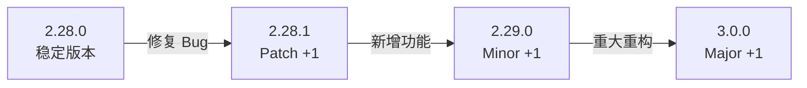
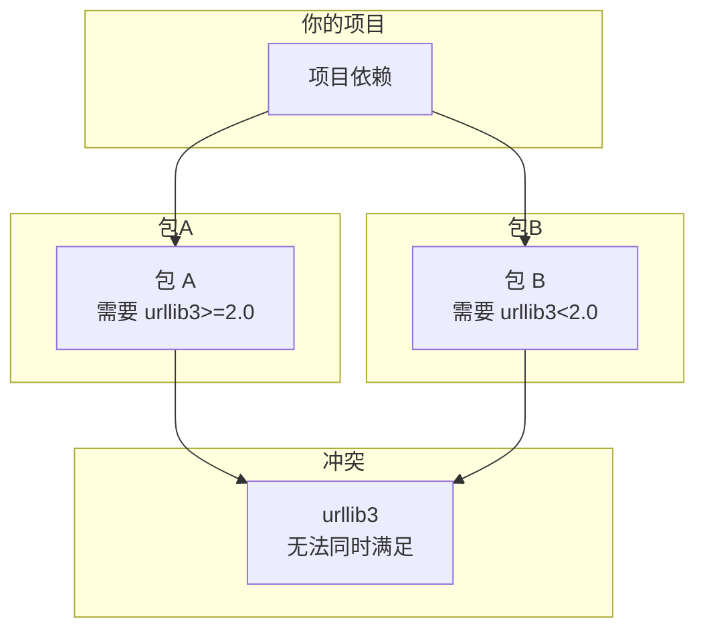

# 版本约束

> **所属路径**：`01_基础能力/01_开发环境与技术英语/14_包管理/02_版本约束`
> **预计学习时间**：35 分钟
> **难度等级**：⭐⭐

---

## 前置知识

- [安装与卸载](../01_安装与卸载/01_安装与卸载.md)

> 如果以上内容还不熟悉，建议先完成对应课程再继续。

---

## 学习目标

完成本节后，你将能够：

1. 解释语义版本号的三个组成部分及其含义
2. 使用 pip 的版本约束语法精确控制依赖版本
3. 理解 conda 的版本匹配语法
4. 诊断和解决常见的版本冲突问题
5. 区分预发布版本的不同阶段

---

## 正文讲解

### 1. 从一个真实的问题说起

想象这样一个场景：你在自己的电脑上开发了一个数据分析项目，用了 pandas 2.1.0，一切运行正常。你把代码交给同事，同事执行 `pip install pandas` ，安装了最新的 pandas 2.2.0，结果代码报错了——原来 pandas 2.2.0 废弃了你使用的某个方法。

这就是为什么仅仅说"需要安装 pandas"是不够的。你需要告诉别人：我需要的是 **哪个版本范围** 的 pandas。这就是**版本约束（Version Constraint）** 要解决的问题。

而要理解版本约束，我们首先需要了解版本号是怎么编的。

### 2. 语义版本号

Python 生态中大多数包遵循 **语义版本号（Semantic Versioning, SemVer）** 规范。一个版本号由三部分组成：

```
主版本号.次版本号.修订号
 Major  . Minor  . Patch
```

每一部分的含义如下：

| 版本号部分 | 何时递增 | 含义 |
| ---------- | -------- | ---- |
| 主版本号（Major） | 做了不兼容的 API 变更 | 升级可能导致现有代码报错 |
| 次版本号（Minor） | 添加了向后兼容的新功能 | 升级通常安全，可能有新功能可用 |
| 修订号（Patch） | 修复了向后兼容的 Bug | 升级安全，建议及时更新 |

举个例子，假设 requests 库的版本变化如下：



> 📌 **图解说明**：修订号的变化最安全（仅修复 Bug），主版本号的变化风险最高（API 可能不兼容）。

理解了这一点，你就能做出合理的版本约束决策了——比如"我愿意接受任何 2.x.x 版本，但不要 3.0.0"。

### 3. pip 版本约束语法

pip 提供了一套灵活的运算符来表达版本约束。下面逐一介绍：

#### 精确匹配 `==`

```bash
pip install requests==2.31.0
```

只接受这一个版本，不多不少。适合对版本极度敏感的场景，但会限制灵活性。

#### 不等于 `!=`

```bash
pip install "requests!=2.30.0"
```

排除某个已知有 Bug 的版本，接受其他所有版本。

#### 比较运算符 `>=` 、 `<=` 、 `>` 、 `<`

```bash
# 至少 2.28.0
pip install "requests>=2.28.0"

# 大于等于 2.28 且小于 3.0
pip install "requests>=2.28,<3.0"
```

可以组合多个条件，用逗号分隔，表示"且"的关系。

#### 兼容版本 `~=`

```bash
pip install "requests~=2.28.0"
```

这是一个非常实用但容易被忽略的运算符。 `~=2.28.0` 等价于 `>=2.28.0,<2.29.0` ——它允许修订号变化，但次版本号不能变。

类似地， `~=2.28` 等价于 `>=2.28,<3.0` ——允许次版本号变化，但主版本号不能变。

**兼容版本运算符的规则**：将版本号最后一位去掉作为上界的递增位。这恰好符合语义版本号的兼容性保证——同一个次版本内的修订通常是安全的。

下面这张表总结了各运算符的含义：

| 约束表达式 | 等价范围 | 含义 |
| ---------- | -------- | ---- |
| `==2.31.0` | 精确 2.31.0 | 锁定精确版本 |
| `!=2.30.0` | 除 2.30.0 外 | 排除已知问题版本 |
| `>=2.28,<3.0` | 2.28.0 ≤ v < 3.0.0 | 限定在 2.x 范围 |
| `~=2.28.0` | 2.28.0 ≤ v < 2.29.0 | 兼容当前次版本的补丁更新 |
| `~=2.28` | 2.28.0 ≤ v < 3.0.0 | 兼容当前主版本的功能更新 |

### 4. conda 的版本匹配语法

如果你使用 conda，它的版本约束语法与 pip 略有不同：

```bash
# 精确版本
conda install numpy=1.26.4

# 模糊匹配（通配符）
conda install "numpy=1.26.*"

# 范围约束
conda install "numpy>=1.24,<1.27"
```

注意 conda 使用单等号 `=` 表示精确版本，而 pip 使用双等号 `==` 。conda 还支持通配符 `*` 进行模糊匹配，这在 pip 中没有直接对应的语法。

| pip 语法 | conda 语法 | 说明 |
| -------- | ---------- | ---- |
| `==1.26.4` | `=1.26.4` | 精确匹配 |
| `~=1.26.0` | `=1.26.*` | 兼容补丁更新 |
| `>=1.24,<1.27` | `>=1.24,<1.27` | 范围约束（语法一致） |

### 5. 版本冲突的诊断与解决

当你安装一个新包时，它可能需要某个依赖的特定版本范围，而你环境中已有的另一个包也依赖同一个库但要求不同的版本范围。当两个范围不重叠时，就产生了**版本冲突（Version Conflict）** 。



> 📌 **图解说明**：包 A 要求 urllib3 >= 2.0，包 B 要求 urllib3 < 2.0，两个范围没有交集，产生冲突。

当 pip 遇到版本冲突时，它会输出类似这样的错误信息：

```
ERROR: pip's dependency resolver does not currently take into account
all the packages that are installed. This behaviour is the source of
the following dependency conflicts.
package-a 1.0.0 requires urllib3>=2.0, but you have urllib3 1.26.18
which is incompatible.
```

**解决版本冲突的步骤**：

1. **阅读错误信息**：pip 会明确告诉你是哪两个包的版本要求产生了矛盾
2. **查看各包的兼容版本**：在 PyPI 上查看这些包的历史版本和各自的依赖要求
3. **尝试升级或降级**：有时升级其中一个包到更新版本就能解决冲突
4. **使用 `pip check` 验证**：安装完成后运行 `pip check` ，确认没有遗留的不兼容问题

```bash
# 检查当前环境中是否有不兼容的依赖
pip check
```

如果一切正常，输出为 `No broken requirements found.` ；否则会列出具体的冲突信息。

### 6. 预发布版本

在正式发布之前，包的开发者通常会发布几个预发布版本供测试。预发布版本的命名有固定的约定：

| 阶段 | 后缀示例 | 含义 |
| ---- | -------- | ---- |
| Alpha | `1.0.0a1` | 内部测试版，功能不完整，可能有严重 Bug |
| Beta | `1.0.0b1` | 公开测试版，功能基本完整，可能有 Bug |
| Release Candidate | `1.0.0rc1` | 候选版本，如果没发现问题就直接作为正式版 |

默认情况下， `pip install` 不会安装预发布版本。如果你想安装预发布版本，需要加 `--pre` 参数：

```bash
# 安装包括预发布版本在内的最新版
pip install --pre torch
```

或者在版本约束中显式指定预发布版本号：

```bash
pip install torch==2.3.0rc1
```

在日常开发中，通常不建议使用预发布版本。但在以下场景中，提前使用预发布版本是合理的：

- 你需要测试自己的代码是否兼容即将发布的新版本
- 预发布版本中包含了你急需的 Bug 修复
- 你是该库的贡献者，需要帮助测试

---

## 动手实践

让我们通过实际操作来巩固版本约束的用法：

```python
# 文件：code/version_demo.py
# 演示如何在 Python 中解析和比较版本号

from packaging.version import Version

# 创建版本对象
v1 = Version("2.28.0")
v2 = Version("2.31.0")
v3 = Version("3.0.0")
v_pre = Version("3.0.0a1")

# 版本比较
print(f"2.28.0 < 2.31.0 ? {v1 < v2}")        # True
print(f"2.31.0 < 3.0.0  ? {v2 < v3}")         # True
print(f"3.0.0a1 < 3.0.0 ? {v_pre < v3}")      # True（预发布 < 正式版）

# 版本号各部分
print(f"\n版本 {v2} 的组成:")
print(f"  Major: {v2.major}")
print(f"  Minor: {v2.minor}")
print(f"  Micro: {v2.micro}")

# 判断是否为预发布版本
print(f"\n{v3} 是预发布版本? {v3.is_prerelease}")
print(f"{v_pre} 是预发布版本? {v_pre.is_prerelease}")
print(f"{v_pre} 的预发布标签: {v_pre.pre}")
```

**运行说明**：
- 环境要求：Python 3.10+，packaging 库
- 安装依赖：`pip install packaging`
- 运行命令：`python code/version_demo.py`

**预期输出**：
```
2.28.0 < 2.31.0 ? True
2.31.0 < 3.0.0  ? True
3.0.0a1 < 3.0.0 ? True

版本 2.31.0 的组成:
  Major: 2
  Minor: 31
  Micro: 0

3.0.0 是预发布版本? False
3.0.0a1 是预发布版本? True
3.0.0a1 的预发布标签: ('a', 1)
```

从输出可以看到，`packaging` 库能正确解析版本号的各个组成部分，并且预发布版本在排序时总是小于同版本号的正式版。这与我们之前讲的语义版本号规则完全一致。

---

## 典型误区

| 误区 | 正确理解 |
| ---- | -------- |
| `~=2.28` 和 `~=2.28.0` 意思一样 | `~=2.28` 等价于 `>=2.28,<3.0` ，而 `~=2.28.0` 等价于 `>=2.28.0,<2.29.0` ，范围完全不同 |
| 总是用 `==` 精确锁死版本最安全 | 过度锁定会导致依赖冲突增多，且无法获得安全补丁。应根据场景选择合适的约束范围 |
| 版本冲突意味着某个包有 Bug | 版本冲突只是两个包对同一依赖的版本要求不兼容，通常通过调整版本约束即可解决 |
| 预发布版本的质量一定不行 | RC（候选版本）通常已接近正式版，在某些场景下使用是合理的 |
| conda 的 `=` 和 pip 的 `==` 完全一样 | 功能相同（精确匹配），但语法不同；注意不要在 pip 中用单等号 |

---

## 练习题

### 练习 1：版本约束表达式（难度：⭐）

请将以下自然语言描述转换为 pip 版本约束表达式：

1. 安装 numpy 的 1.24.0 到 1.26.x 的任意版本（不含 1.27.0）
2. 安装 pandas 2.1.0 及以上版本，但排除 2.1.3（已知有 Bug）
3. 安装 torch 2.2.x 的任意补丁版本

<details>
<summary>💡 提示</summary>

回顾各运算符的含义：`>=` 、 `<` 用于范围约束，`!=` 用于排除特定版本，`~=` 用于兼容版本匹配。

</details>

<details>
<summary>✅ 参考答案</summary>

```bash
# 1. numpy 1.24.0 到 1.26.x
pip install "numpy>=1.24.0,<1.27.0"

# 2. pandas 2.1.0 及以上，但排除 2.1.3
pip install "pandas>=2.1.0,!=2.1.3"

# 3. torch 2.2.x 的补丁版本
pip install "torch~=2.2.0"
# 等价于：pip install "torch>=2.2.0,<2.3.0"
```

</details>

### 练习 2：版本冲突诊断（难度：⭐⭐）

阅读以下 pip 错误信息，回答问题：

```
ERROR: pip's dependency resolver does not currently take into account
all the packages that are installed. This behaviour is the source of
the following dependency conflicts.
library-x 2.0.0 requires pydantic>=2.0, but you have pydantic 1.10.12
which is incompatible.
```

1. 哪个包引发了冲突？
2. 冲突的根本原因是什么？
3. 你会如何解决这个冲突？

<details>
<summary>💡 提示</summary>

仔细阅读错误信息中的包名和版本要求。思考是升级 pydantic 还是降级 library-x 来解决冲突。

</details>

<details>
<summary>✅ 参考答案</summary>

1. **冲突包**：pydantic。当前安装的是 1.10.12，但 library-x 2.0.0 要求 pydantic >= 2.0。

2. **根本原因**：环境中已安装了 pydantic 1.x（可能是另一个包的依赖），而新安装的 library-x 2.0.0 需要 pydantic 2.x。pydantic 从 1.x 到 2.x 是主版本升级，API 有不兼容变更。

3. **解决方案**（按优先级）：
   - 先确认环境中哪些包依赖 pydantic 1.x：`pip show pydantic` 查看 `Required-by` 字段
   - 如果那些包也兼容 pydantic 2.x，直接升级：`pip install "pydantic>=2.0"`
   - 如果存在不可调和的冲突，考虑使用 library-x 的旧版本（1.x）或在独立的虚拟环境中运行
   - 运行 `pip check` 验证最终结果

</details>

### 练习 3：SemVer 实践（难度：⭐⭐）

使用 `packaging` 库编写一个 Python 函数，判断给定的版本号是否在指定的约束范围内：

```python
from packaging.version import Version
from packaging.specifiers import SpecifierSet

def check_version(version_str: str, constraint: str) -> bool:
    """判断版本号是否满足约束条件"""
    # 请补全代码
    pass

# 测试
assert check_version("2.28.1", "~=2.28.0") == True
assert check_version("2.29.0", "~=2.28.0") == False
assert check_version("1.26.4", ">=1.24,<1.27") == True
print("所有测试通过！")
```

<details>
<summary>💡 提示</summary>

`packaging.specifiers.SpecifierSet` 可以将版本约束字符串解析为对象，然后使用 `in` 运算符判断版本是否满足约束。

</details>

<details>
<summary>✅ 参考答案</summary>

```python
from packaging.version import Version
from packaging.specifiers import SpecifierSet

def check_version(version_str: str, constraint: str) -> bool:
    """判断版本号是否满足约束条件"""
    version = Version(version_str)
    specifier = SpecifierSet(constraint)
    return version in specifier

# 测试
assert check_version("2.28.1", "~=2.28.0") == True
assert check_version("2.29.0", "~=2.28.0") == False
assert check_version("1.26.4", ">=1.24,<1.27") == True
assert check_version("3.0.0a1", ">=3.0.0") == False  # 预发布不匹配
print("所有测试通过！")
```

</details>

---

## 下一步学习

- 📖 下一个知识点：[依赖清单与锁定文件](../03_依赖清单与锁定文件/03_依赖清单与锁定文件.md)
- 🔗 相关知识点：[安装与卸载](../01_安装与卸载/01_安装与卸载.md)
- 📚 拓展阅读：[PEP 440 – Version Identification and Dependency Specification](https://peps.python.org/pep-0440/)

---

## 参考资料

1. [PEP 440 — Version Identification](https://peps.python.org/pep-0440/) — Python 版本号规范的官方标准（PEP 文档）
2. [Semantic Versioning 2.0.0](https://semver.org/) — 语义版本号的官方规范（开放标准）
3. [pip install 文档 — Requirement Specifiers](https://pip.pypa.io/en/stable/reference/requirement-specifiers/) — pip 版本约束语法的官方说明（官方文档）
4. [packaging 库文档](https://packaging.pypa.io/en/stable/) — Python 版本号解析库的使用指南（官方文档）
