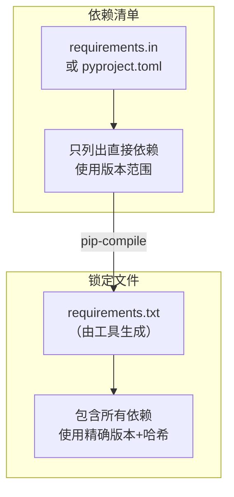
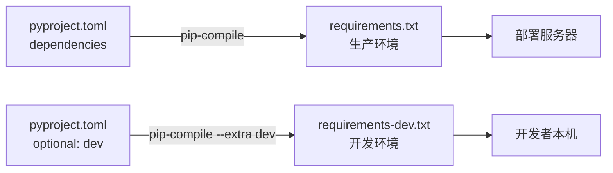

# 依赖清单与锁定文件

> **所属路径**：`01_基础能力/01_开发环境与技术英语/14_包管理/03_依赖清单与锁定文件`
> **预计学习时间**：40 分钟
> **难度等级**：⭐⭐

---

## 前置知识

- [版本约束](../02_版本约束/02_版本约束.md)
- [虚拟环境 · 依赖固定](../../13_虚拟环境/03_依赖固定/03_依赖固定.md)

> 如果以上内容还不熟悉，建议先完成对应课程再继续。

---

## 学习目标

完成本节后，你将能够：

1. 编写和维护 `requirements.txt` 文件
2. 区分依赖清单（抽象依赖）与锁定文件（精确快照）的用途
3. 使用 `pip-compile`（pip-tools）生成可复现的锁定文件
4. 编写 `conda environment.yml` 配置文件
5. 在 `pyproject.toml` 中声明项目依赖
6. 合理划分开发依赖与生产依赖

---

## 正文讲解

### 1. 一个协作中的真实难题

你独自开发时，依赖管理也许不是什么大问题——反正你的电脑上跑得好好的。但当你把项目交给同事、提交到 CI 服务器、或者半年后在新电脑上重新部署时，问题就来了："这个项目到底需要哪些包？每个包该用什么版本？"

如果只是口头告诉同事"装一下 pandas 和 scikit-learn"，那同事装的版本可能和你的完全不同，结果就是"在我机器上能跑"的经典困境。

解决这个问题的关键工具就是 **依赖清单（Dependency Specification）** 和 **锁定文件（Lock File）** 。它们把"项目需要什么"从你的脑子里搬到了一个可被版本控制追踪的文件中。

### 2. requirements.txt：最基本的依赖记录

**requirements.txt** 是 Python 生态中最广泛使用的依赖声明文件。它的格式非常简单——每行一个包名，可选附带版本约束：

```text
# requirements.txt
requests>=2.28,<3.0
pandas~=2.1.0
numpy>=1.24
scikit-learn>=1.3
matplotlib>=3.7
```

使用 `pip install -r` 可以一次性安装文件中列出的所有包：

```bash
pip install -r requirements.txt
```

#### pip freeze 生成快照

pip 提供了 `pip freeze` 命令，可以导出当前环境中所有已安装包的精确版本：

```bash
pip freeze > requirements.txt
```

输出的文件内容类似：

```text
certifi==2024.2.2
charset-normalizer==3.3.2
idna==3.6
numpy==1.26.4
pandas==2.1.4
python-dateutil==2.9.0
pytz==2024.1
requests==2.31.0
scikit-learn==1.4.0
scipy==1.12.0
urllib3==2.2.1
```

注意这里每个包都使用了 `==` 精确固定版本。这看起来很"完美"，但其实暗藏问题——我们稍后会讨论。

### 3. 依赖清单 vs 锁定文件

这是本节最核心的概念。让我们用一个类比来解释。

想象你要告诉朋友如何做一道菜。你可以这样说：

- **食谱**（依赖清单）：需要鸡蛋、面粉、牛奶、糖（不指定品牌和具体规格）
- **采购清单**（锁定文件）：光明纯牛奶 250ml × 1 盒、金龙鱼面粉 500g × 1 袋、正大鸡蛋 × 3 个、太古白砂糖 100g × 1 袋

**依赖清单（Dependency Specification）** 描述的是你的项目直接需要什么包、大致的版本范围，是一种"抽象依赖"。**锁定文件（Lock File）** 则精确记录了环境中每个包（包括间接依赖）的确切版本和来源哈希值，是一种"精确快照"。



> 📌 **图解说明**：依赖清单只声明直接依赖和版本范围；锁定文件由工具自动生成，包含所有直接和间接依赖的精确版本。

**为什么需要区分两者？**

| 维度 | 依赖清单 | 锁定文件 |
| ---- | -------- | -------- |
| 内容 | 只有直接依赖 | 包含所有直接和间接依赖 |
| 版本 | 使用版本范围（如 `>=2.1,<3`） | 使用精确版本（如 `==2.1.4`） |
| 维护方式 | 人工编写和维护 | 由工具自动生成 |
| 适用场景 | 描述项目需求 | 复现精确环境 |
| 灵活性 | 高（允许版本浮动） | 低（严格锁定） |
| 可复现性 | 低（不同时间安装可能得到不同版本） | 高（任何人任何时间都得到相同环境） |

### 4. pip-tools：专业的依赖管理工具

**pip-tools** 是一个专门用来管理这对"依赖清单 + 锁定文件"的工具。它提供了两个核心命令：

- `pip-compile` ：从依赖清单生成锁定文件
- `pip-sync` ：根据锁定文件同步环境（安装缺少的包、卸载多余的包）

#### 工作流程

首先，创建一个 `requirements.in` 文件（依赖清单），只写你的直接依赖：

```text
# requirements.in — 项目的直接依赖
requests>=2.28
pandas~=2.1.0
scikit-learn>=1.3
```

然后运行 `pip-compile` 生成锁定文件：

```bash
pip-compile requirements.in -o requirements.txt
```

生成的 `requirements.txt` 会包含所有直接和间接依赖，每个都用精确版本锁定，还附带来源注释：

```text
#
# This file is autogenerated by pip-compile with Python 3.12
# by the following command:
#
#    pip-compile --output-file=requirements.txt requirements.in
#
certifi==2024.2.2
    # via requests
charset-normalizer==3.3.2
    # via requests
idna==3.6
    # via requests
joblib==1.3.2
    # via scikit-learn
numpy==1.26.4
    # via
    #   pandas
    #   scikit-learn
    #   scipy
pandas==2.1.4
    # via -r requirements.in
python-dateutil==2.9.0
    # via pandas
pytz==2024.1
    # via pandas
requests==2.31.0
    # via -r requirements.in
scikit-learn==1.4.0
    # via -r requirements.in
scipy==1.12.0
    # via scikit-learn
six==1.16.0
    # via python-dateutil
threadpoolctl==3.2.0
    # via scikit-learn
tzdata==2024.1
    # via pandas
urllib3==2.2.1
    # via requests
```

注意每个间接依赖后面都有 `# via ...` 注释，清楚地标明它是被谁引入的。这在排查依赖问题时极其有用。

#### 更新依赖

当你想升级某个包时：

```bash
# 升级所有包到最新兼容版本
pip-compile --upgrade requirements.in -o requirements.txt

# 只升级特定包
pip-compile --upgrade-package requests requirements.in -o requirements.txt
```

### 5. conda environment.yml

如果你使用 conda 管理环境，对应的依赖文件是 `environment.yml` ：

```yaml
# environment.yml
name: myproject
channels:
  - conda-forge
  - defaults
dependencies:
  - python=3.12
  - numpy>=1.24
  - pandas~=2.1.0
  - scikit-learn>=1.3
  - pip:
    - requests>=2.28
    - some-pip-only-package
```

注意几个要点：

- `name` 指定环境名称
- `channels` 列出包的来源频道（优先级从上到下）
- `dependencies` 中可以同时列出 conda 包和 pip 包（pip 包放在 `pip:` 子项下）
- 从 `environment.yml` 创建环境：`conda env create -f environment.yml`
- 更新环境：`conda env update -f environment.yml`
- 导出当前环境：`conda env export > environment.yml`

### 6. pyproject.toml 中的依赖声明

**pyproject.toml** 是 Python 现代项目的标准配置文件（由 PEP 518 和 PEP 621 定义）。如果你正在开发一个可分发的 Python 包，应在此文件中声明依赖：

```toml
# pyproject.toml
[project]
name = "my-data-project"
version = "0.1.0"
requires-python = ">=3.10"

dependencies = [
    "requests>=2.28,<3.0",
    "pandas~=2.1.0",
    "scikit-learn>=1.3",
]

[project.optional-dependencies]
dev = [
    "pytest>=7.0",
    "black>=23.0",
    "mypy>=1.0",
]
```

这里的 `dependencies` 对应生产依赖， `[project.optional-dependencies]` 下可以定义可选的依赖组（如开发依赖、测试依赖）。安装时：

```bash
# 只安装生产依赖
pip install .

# 安装生产依赖 + 开发依赖
pip install ".[dev]"
```

pip-tools 同样支持从 `pyproject.toml` 生成锁定文件：

```bash
pip-compile pyproject.toml -o requirements.txt
pip-compile --extra dev pyproject.toml -o requirements-dev.txt
```

### 7. 开发依赖 vs 生产依赖

一个成熟的项目通常会区分两类依赖：

| 类别 | 包含内容 | 示例 | 部署到生产环境？ |
| ---- | -------- | ---- | ---------------- |
| **生产依赖** | 项目运行必需的包 | requests、pandas、numpy | ✅ 是 |
| **开发依赖** | 仅开发/测试时需要的包 | pytest、black、mypy、sphinx | ❌ 否 |

分离的好处是显而易见的：生产环境中不需要安装测试框架和代码格式化工具，这既减小了部署包的体积，也降低了安全风险（更少的包 = 更少的潜在漏洞）。

一个典型的文件组织方式：

```
项目根目录/
├── pyproject.toml              ← 依赖清单（抽象依赖声明）
├── requirements.txt            ← 生产锁定文件
├── requirements-dev.txt        ← 开发锁定文件
└── ...
```



> 📌 **图解说明**：从同一个 `pyproject.toml` 中分别生成生产和开发两份锁定文件，部署时只用生产锁定文件，开发时使用包含更多工具的开发锁定文件。

---

## 动手实践

让我们用 pip-tools 从零搭建一个规范的依赖管理流程：

```bash
# 文件：code/practice.sh
# 使用 pip-tools 管理依赖的完整流程

# 1. 创建并激活虚拟环境
python -m venv deps_demo
source deps_demo/bin/activate

# 2. 安装 pip-tools
pip install pip-tools

# 3. 创建依赖清单文件
cat > requirements.in << 'EOF'
# 项目直接依赖
requests>=2.28
click>=8.0
EOF

# 4. 生成锁定文件
pip-compile requirements.in -o requirements.txt

# 5. 查看生成的锁定文件
echo "=== 锁定文件内容 ==="
cat requirements.txt

# 6. 根据锁定文件安装依赖
pip-sync requirements.txt

# 7. 验证环境
pip check
echo "=== 已安装包列表 ==="
pip list

# 8. 清理
deactivate
rm -rf deps_demo
```

**运行说明**：
- 环境要求：Python 3.10+
- 逐条执行命令，观察 `pip-compile` 生成的锁定文件格式

**预期输出**（锁定文件关键内容）：
```
certifi==2024.2.2
    # via requests
charset-normalizer==3.3.2
    # via requests
click==8.1.7
    # via -r requirements.in
idna==3.6
    # via requests
requests==2.31.0
    # via -r requirements.in
urllib3==2.2.1
    # via requests
```

从输出可以看到，我们只声明了 2 个直接依赖（requests 和 click），但锁定文件中包含了 6 个包——其余 4 个是 requests 的间接依赖。每个包都标注了精确版本和引入来源。

---

## 典型误区

| 误区 | 正确理解 |
| ---- | -------- |
| 直接把 `pip freeze` 的输出当作依赖清单维护 | `pip freeze` 输出包含所有间接依赖，不应手动编辑；应维护只含直接依赖的清单文件，用工具生成锁定文件 |
| 不区分依赖清单和锁定文件，只用一个 `requirements.txt` | 两者用途不同：清单描述需求，锁定文件保证可复现性。混用会导致维护困难 |
| 锁定文件不需要提交到 Git 仓库 | 锁定文件是环境可复现的关键，**必须** 纳入版本控制 |
| 开发依赖和生产依赖不需要分开 | 生产环境安装不必要的包会增大体积和安全风险 |
| `environment.yml` 和 `requirements.txt` 功能完全一样 | `environment.yml` 是 conda 专用格式，可以包含非 Python 依赖和频道配置；`requirements.txt` 是 pip 格式 |

---

## 练习题

### 练习 1：编写依赖清单（难度：⭐）

假设你的数据分析项目直接使用了以下包：
- pandas（需要 2.x 版本）
- matplotlib（至少 3.7）
- seaborn（任意版本）
- jupyter（仅开发时需要）

请分别编写 `requirements.in`（生产依赖）和 `requirements-dev.in`（开发依赖）的内容。

<details>
<summary>💡 提示</summary>

生产依赖只包含项目运行必需的包，开发依赖则包含开发工具。开发依赖清单通常使用 `-c requirements.txt` 引用生产锁定文件来保持版本一致。

</details>

<details>
<summary>✅ 参考答案</summary>

```text
# requirements.in — 生产依赖
pandas>=2.0,<3.0
matplotlib>=3.7
seaborn
```

```text
# requirements-dev.in — 开发依赖
-c requirements.txt
jupyter
```

说明：
- `seaborn` 不加版本约束表示接受任意版本
- 开发依赖清单通过 `-c requirements.txt` 约束版本，确保开发环境和生产环境的公共依赖版本一致

</details>

### 练习 2：pyproject.toml 依赖声明（难度：⭐⭐）

将练习 1 中的依赖需求改写为 `pyproject.toml` 格式，包含生产依赖和可选的开发依赖组。

<details>
<summary>💡 提示</summary>

在 `[project]` 表中写 `dependencies` 列表，在 `[project.optional-dependencies]` 表中定义名为 `dev` 的可选依赖组。

</details>

<details>
<summary>✅ 参考答案</summary>

```toml
[project]
name = "data-analysis-project"
version = "0.1.0"
requires-python = ">=3.10"

dependencies = [
    "pandas>=2.0,<3.0",
    "matplotlib>=3.7",
    "seaborn",
]

[project.optional-dependencies]
dev = [
    "jupyter",
]
```

安装方式：
```bash
# 只安装生产依赖
pip install .

# 安装生产 + 开发依赖
pip install ".[dev]"
```

</details>

### 练习 3：依赖管理实操（难度：⭐⭐）

在虚拟环境中完成以下任务：
1. 安装 pip-tools
2. 创建一个 `requirements.in` ，包含 `flask>=3.0` 和 `gunicorn>=21.0`
3. 用 `pip-compile` 生成锁定文件
4. 查看锁定文件，找出 flask 一共引入了多少个间接依赖
5. 用 `pip-sync` 安装所有依赖，并用 `pip check` 验证

<details>
<summary>💡 提示</summary>

锁定文件中标注了 `# via flask` 的包就是 flask 的直接间接依赖。注意有些包可能同时被多个直接依赖引入。

</details>

<details>
<summary>✅ 参考答案</summary>

```bash
python -m venv lock_demo && source lock_demo/bin/activate
pip install pip-tools

# 创建依赖清单
echo "flask>=3.0" > requirements.in
echo "gunicorn>=21.0" >> requirements.in

# 生成锁定文件
pip-compile requirements.in -o requirements.txt

# 查看锁定文件
cat requirements.txt
# flask 的间接依赖（通过 # via flask 标注）通常包括：
# blinker, click, itsdangerous, Jinja2, MarkupSafe, Werkzeug
# 共约 6 个间接依赖（具体数量可能因版本而异）

# 安装并验证
pip-sync requirements.txt
pip check
# 预期输出：No broken requirements found.
```

</details>

---

## 下一步学习

- 📖 下一个知识点：[私有源与镜像配置](../04_私有源与镜像配置/04_私有源与镜像配置.md)
- 🔗 相关知识点：[版本控制](../../15_版本控制/)（将依赖文件纳入 Git 管理）
- 📚 拓展阅读：[pip-tools 官方文档](https://pip-tools.readthedocs.io/en/stable/)

---

## 参考资料

1. [pip-tools 官方文档](https://pip-tools.readthedocs.io/en/stable/) — 依赖管理工具 pip-compile/pip-sync 的使用指南（开源项目文档）
2. [PEP 621 — Storing project metadata in pyproject.toml](https://peps.python.org/pep-0621/) — pyproject.toml 中项目元数据格式的官方标准（PEP 文档）
3. [conda 环境管理文档](https://docs.conda.io/projects/conda/en/latest/user-guide/tasks/manage-environments.html) — conda environment.yml 的使用说明（官方文档）
4. [Python Packaging User Guide — Dependencies](https://packaging.python.org/en/latest/tutorials/managing-dependencies/) — Python 官方打包指南中的依赖管理章节（官方文档）
