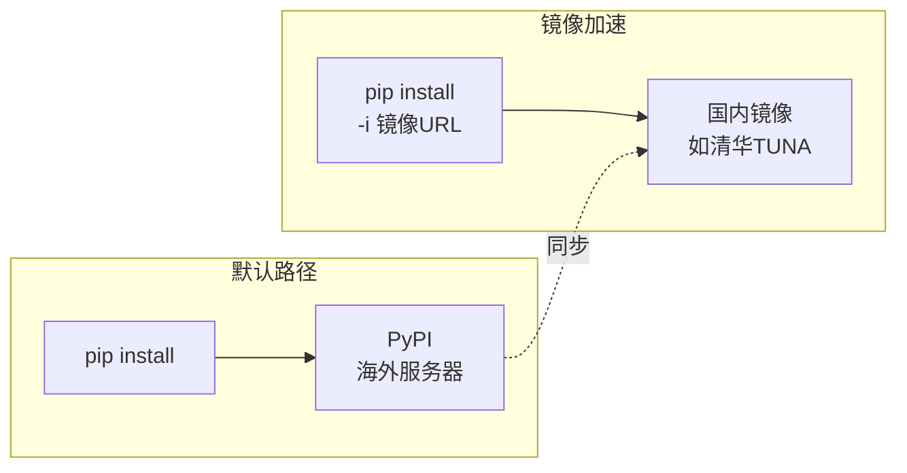
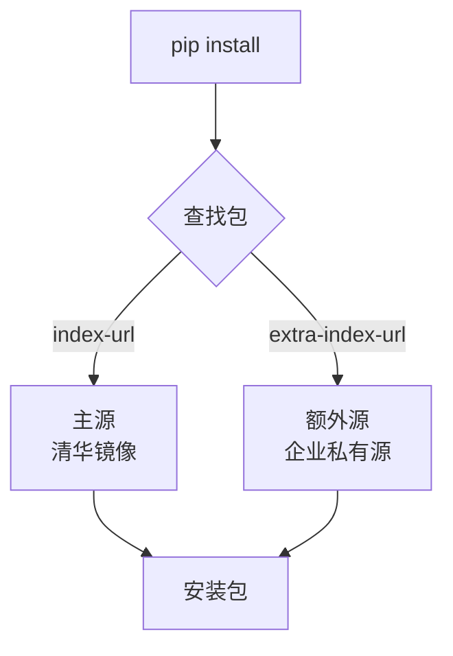

# 私有源与镜像配置

> **所属路径**：`01_基础能力/01_开发环境与技术英语/14_包管理/04_私有源与镜像配置`
> **预计学习时间**：35 分钟
> **难度等级**：⭐⭐

---

## 前置知识

- [安装与卸载](../01_安装与卸载/01_安装与卸载.md)

> 如果以上内容还不熟悉，建议先完成对应课程再继续。

---

## 学习目标

完成本节后，你将能够：

1. 解释为什么需要镜像源来加速包下载
2. 配置 pip 的全局镜像源（`pip.conf` / `pip.ini`）
3. 配置 conda 的镜像源（`.condarc`）
4. 列举常用的国内镜像源并选择合适的镜像
5. 使用 `--extra-index-url` 配置多包源
6. 了解企业内部 PyPI 服务器的基本概念

---

## 正文讲解

### 1. 为什么需要镜像

当你执行 `pip install numpy` 时，pip 默认从 **PyPI（Python Package Index）** 下载包。PyPI 的服务器主要位于海外，对于中国大陆的开发者来说，直接访问 PyPI 常常面临下载速度慢、连接超时甚至失败等问题。

**镜像源（Mirror）** 就是 PyPI 在国内（或企业内部网络中）的一份完整副本。使用镜像源，你的 pip 请求不再需要跨越大洋，而是直接从距离更近的服务器获取包，下载速度可以从几十 KB/s 提升到几 MB/s 甚至更快。



> 📌 **图解说明**：国内镜像是 PyPI 的同步副本。使用镜像后，pip 直接从国内服务器下载，速度显著提升。

除了网络加速，使用镜像还有以下好处：

- **稳定性**：避免因国际网络波动导致的安装失败
- **合规性**：某些企业环境限制外网访问，必须使用内部镜像
- **效率**：团队中多人同时安装时，内部镜像可以缓存包，减少重复下载

### 2. 常用国内镜像源

以下是几个主流的国内 PyPI 镜像源，它们都定期与 PyPI 官方同步：

| 镜像名称 | URL | 维护方 | 同步频率 |
| -------- | --- | ------ | -------- |
| 清华 TUNA | `https://pypi.tuna.tsinghua.edu.cn/simple/` | 清华大学 | 约 5 分钟 |
| 阿里云 | `https://mirrors.aliyun.com/pypi/simple/` | 阿里巴巴 | 约 10 分钟 |
| 中国科技大学 | `https://pypi.mirrors.ustc.edu.cn/simple/` | 中科大 |约 5 分钟 |
| 豆瓣 | `https://pypi.doubanio.com/simple/` | 豆瓣 | 不定期 |
| 华为云 | `https://repo.huaweicloud.com/repository/pypi/simple/` | 华为 | 约 10 分钟 |

**选择建议**：清华 TUNA 和阿里云是目前最稳定、同步最及时的两个镜像。如果你在高校网络中，清华 TUNA 通常是最佳选择；如果在企业环境或云服务器上，阿里云镜像通常速度更快。

### 3. pip 配置镜像源

pip 支持两种方式指定包源：命令行临时指定和配置文件永久设置。

#### 命令行临时指定

使用 `-i` 参数指定索引 URL，仅对当次命令生效：

```bash
pip install numpy -i https://pypi.tuna.tsinghua.edu.cn/simple/
```

这种方式适合偶尔需要切换源的场景，但每次都输入一长串 URL 显然不方便。

#### 全局配置文件

更推荐的方式是在 pip 配置文件中永久设置默认源。配置文件的位置因操作系统而异：

| 操作系统 | 配置文件路径 |
| -------- | ------------ |
| Linux / macOS | `~/.config/pip/pip.conf` 或 `~/.pip/pip.conf` |
| Windows | `%APPDATA%\pip\pip.ini` 或 `C:\Users\用户名\pip\pip.ini` |

配置文件内容如下：

```ini
# pip.conf（Linux/macOS）或 pip.ini（Windows）
[global]
index-url = https://pypi.tuna.tsinghua.edu.cn/simple/
trusted-host = pypi.tuna.tsinghua.edu.cn
```

- `index-url` ：设置默认的包索引 URL
- `trusted-host` ：将镜像域名标记为可信（某些环境下 HTTPS 证书验证可能失败）

配置完成后，所有的 `pip install` 命令都会自动使用配置的镜像源，无需再手动指定。

pip 也提供了便捷的命令来修改配置：

```bash
# 设置全局镜像源
pip config set global.index-url https://pypi.tuna.tsinghua.edu.cn/simple/

# 查看当前配置
pip config list

# 取消设置（恢复默认）
pip config unset global.index-url
```

#### 项目级配置

如果你想为某个特定项目设置镜像（而非全局），可以在项目根目录下创建 `pip.conf` 文件：

```bash
# 在项目根目录创建
mkdir -p .pip
cat > .pip/pip.conf << 'EOF'
[global]
index-url = https://pypi.tuna.tsinghua.edu.cn/simple/
EOF
```

然后设置环境变量让 pip 读取这个配置：

```bash
export PIP_CONFIG_FILE=.pip/pip.conf
```

### 4. conda 配置镜像源

conda 的镜像配置通过 `~/.condarc` 文件完成。这个文件使用 YAML 格式：

```yaml
# ~/.condarc
channels:
  - defaults
show_channel_urls: true
default_channels:
  - https://mirrors.tuna.tsinghua.edu.cn/anaconda/pkgs/main
  - https://mirrors.tuna.tsinghua.edu.cn/anaconda/pkgs/r
custom_channels:
  conda-forge: https://mirrors.tuna.tsinghua.edu.cn/anaconda/cloud
  pytorch: https://mirrors.tuna.tsinghua.edu.cn/anaconda/cloud
```

配置说明：

- `default_channels` ：替换 conda 默认频道的 URL
- `custom_channels` ：为特定频道（如 conda-forge、pytorch）配置镜像
- `show_channel_urls` ：安装时显示包的来源 URL，方便确认是否在使用镜像

同样可以用命令行配置：

```bash
# 添加清华镜像频道
conda config --add channels https://mirrors.tuna.tsinghua.edu.cn/anaconda/pkgs/main

# 设置显示频道 URL
conda config --set show_channel_urls yes

# 查看当前配置
conda config --show channels
```

### 5. --extra-index-url：多源配置

在某些场景下，你需要同时从多个包源安装包。例如：

- 大部分包从 PyPI（或镜像）安装
- 但某些内部开发的包只在企业私有源上
- 某些特殊版本的包（如 GPU 版 PyTorch）在专门的索引上

pip 的 `--extra-index-url` 参数允许你指定额外的包源：

```bash
pip install my-internal-package \
    --extra-index-url https://internal.company.com/pypi/simple/
```

也可以在配置文件中永久设置：

```ini
[global]
index-url = https://pypi.tuna.tsinghua.edu.cn/simple/
extra-index-url = https://internal.company.com/pypi/simple/
```

在 `requirements.txt` 中也可以指定额外源：

```text
--extra-index-url https://internal.company.com/pypi/simple/

requests>=2.28
my-internal-package>=1.0
```



> 📌 **图解说明**：pip 会同时在主源和额外源中查找包，从找到的源下载安装。如果同一个包在两个源中都存在，pip 会选择版本更高的那个。

> ⚠️ **安全提示**：使用 `--extra-index-url` 时要注意 **依赖混淆攻击（Dependency Confusion Attack）** 的风险。如果你的内部包名碰巧和 PyPI 上的某个公开包同名，pip 可能会从 PyPI 下载恶意包而非你的内部包。防御措施包括：使用唯一的包名前缀（如 `company-xxx`）、配置 `--index-url` 而非 `--extra-index-url` 来指向私有源、或使用 `--no-deps` 避免自动安装间接依赖。

### 6. 企业内部 PyPI 服务器

在企业环境中，通常需要搭建内部的 PyPI 服务器。常见的方案包括：

| 工具 | 特点 | 适用场景 |
| ---- | ---- | -------- |
| **devpi** | 开源、轻量、支持缓存代理 | 中小团队 |
| **Artifactory** | 企业级、支持多种包格式 | 大型企业 |
| **Nexus** | 企业级、支持 Maven/npm/PyPI 等 | 大型企业 |
| **pypiserver** | 极简、适合只托管几个内部包 | 个人或小团队 |

企业内部 PyPI 服务器通常同时扮演两个角色：

1. **缓存代理**：缓存从 PyPI 下载的公开包，加速团队内的安装
2. **私有仓库**：托管企业自行开发的内部包，不对外公开

以 devpi 为例，基本的工作流程如下：

```bash
# 使用 devpi（企业内部 PyPI 服务器）
pip install my-internal-tool \
    --index-url https://devpi.company.com/company/stable/+simple/
```

对于开发者来说，使用内部 PyPI 服务器和使用镜像没有本质区别——只是把 `index-url` 指向内部服务器的地址。

### 7. 最佳实践总结

不同场景下的配置推荐：

| 场景 | 推荐配置 |
| ---- | -------- |
| 个人开发（国内） | 全局设置清华或阿里云镜像 |
| 团队项目 | 在 `requirements.txt` 或 `pip.conf` 中统一指定镜像 |
| 企业环境 | 搭建内部 PyPI 服务器作为缓存代理 + 私有仓库 |
| CI/CD 流水线 | 在流水线配置中设置镜像，或使用企业内部源 |
| 开源项目 | 不在项目文件中硬编码镜像源（贡献者可能在全球各地） |

最后一条尤其重要——如果你在维护开源项目，不应在 `requirements.txt` 中写入镜像 URL。镜像配置应由每个开发者根据自身网络环境在本地设置。

---

## 动手实践

下面我们实际配置一下 pip 镜像源，并验证效果：

```bash
# 文件：code/practice.sh
# pip 镜像配置演练

# 1. 查看当前 pip 配置
echo "=== 当前配置 ==="
pip config list

# 2. 使用命令行临时指定镜像安装包，观察速度
echo "=== 从清华镜像安装 requests ==="
pip install requests -i https://pypi.tuna.tsinghua.edu.cn/simple/ --quiet

# 3. 设置全局镜像源
pip config set global.index-url https://pypi.tuna.tsinghua.edu.cn/simple/

# 4. 验证配置已生效
echo "=== 更新后的配置 ==="
pip config list

# 5. 现在安装不需要指定 -i 了
pip install httpx --quiet

# 6. 确认包来源（查看下载 URL）
pip install flask --quiet -v 2>&1 | grep "Downloading"

# 7.（可选）恢复默认配置
# pip config unset global.index-url
```

**运行说明**：
- 环境要求：Python 3.10+
- 在虚拟环境中执行以上操作（避免影响全局环境）
- 步骤 6 使用 `-v`（verbose）参数查看详细日志，确认包确实是从镜像下载的

**预期输出**（步骤 4）：
```
global.index-url='https://pypi.tuna.tsinghua.edu.cn/simple/'
```

---

## 典型误区

| 误区 | 正确理解 |
| ---- | -------- |
| 在开源项目的 `requirements.txt` 中硬编码镜像 URL | 镜像配置应由个人本地设置，不应提交到公共仓库 |
| 认为配置镜像后就不需要网络了 | 镜像仍然需要网络访问，只是服务器在国内，速度更快 |
| 混淆 `--index-url` 和 `--extra-index-url` | `--index-url` 替换默认源，`--extra-index-url` 是在默认源基础上追加额外源 |
| 认为所有镜像的内容完全一样 | 不同镜像的同步频率不同，极新的包可能还未同步到某些镜像 |
| 忽略 `--extra-index-url` 的安全风险 | 多源配置可能遭受依赖混淆攻击，应确保内部包名唯一 |

---

## 练习题

### 练习 1：配置 pip 镜像（难度：⭐）

完成以下任务：
1. 使用 `pip config` 命令将全局镜像设置为阿里云镜像
2. 验证配置是否生效
3. 安装一个包（如 `rich`），观察是否从阿里云下载
4. 最后恢复为默认 PyPI 源

<details>
<summary>💡 提示</summary>

阿里云镜像 URL 为 `https://mirrors.aliyun.com/pypi/simple/` 。使用 `pip config set` 设置，`pip config unset` 恢复。

</details>

<details>
<summary>✅ 参考答案</summary>

```bash
# 1. 设置阿里云镜像
pip config set global.index-url https://mirrors.aliyun.com/pypi/simple/

# 2. 验证
pip config list
# 输出应包含：global.index-url='https://mirrors.aliyun.com/pypi/simple/'

# 3. 安装并观察来源
pip install rich -v 2>&1 | grep -i "downloading\|looking"
# 输出中应能看到 mirrors.aliyun.com 的 URL

# 4. 恢复默认
pip config unset global.index-url
pip config list
# 应该不再显示 index-url 配置
```

</details>

### 练习 2：编写 .condarc 配置文件（难度：⭐⭐）

请编写一个 `.condarc` 文件，满足以下需求：
1. 默认频道使用中科大镜像
2. conda-forge 频道也使用中科大镜像
3. 安装时显示包的来源 URL

<details>
<summary>💡 提示</summary>

中科大的 conda 镜像 URL 为 `https://mirrors.ustc.edu.cn/anaconda/pkgs/main` 和 `https://mirrors.ustc.edu.cn/anaconda/cloud` 。

</details>

<details>
<summary>✅ 参考答案</summary>

```yaml
# ~/.condarc
channels:
  - defaults
show_channel_urls: true
default_channels:
  - https://mirrors.ustc.edu.cn/anaconda/pkgs/main
  - https://mirrors.ustc.edu.cn/anaconda/pkgs/r
custom_channels:
  conda-forge: https://mirrors.ustc.edu.cn/anaconda/cloud
```

验证方式：
```bash
conda config --show channels
conda config --show default_channels
conda config --show custom_channels
```

</details>

### 练习 3：多源配置场景分析（难度：⭐⭐）

假设你在一家公司工作，有以下需求：
- 公开包从清华镜像下载（加速）
- 公司内部开发了一个包叫 `company-utils` ，托管在内部 PyPI 服务器 `https://pypi.internal.company.com/simple/`
- 你需要在 `requirements.txt` 中同时安装 `requests` 和 `company-utils`

请写出：
1. `pip.conf` 的配置内容
2. `requirements.txt` 的内容
3. 解释为什么包名使用 `company-` 前缀是一个好的安全实践

<details>
<summary>💡 提示</summary>

思考 `--index-url` 和 `--extra-index-url` 分别应该指向哪个源。关于安全实践，回顾正文中提到的"依赖混淆攻击"。

</details>

<details>
<summary>✅ 参考答案</summary>

```ini
# pip.conf
[global]
index-url = https://pypi.tuna.tsinghua.edu.cn/simple/
extra-index-url = https://pypi.internal.company.com/simple/
trusted-host =
    pypi.tuna.tsinghua.edu.cn
    pypi.internal.company.com
```

```text
# requirements.txt
requests>=2.28
company-utils>=1.0
```

关于安全实践的解释：

使用 `company-` 前缀可以有效防范**依赖混淆攻击**。如果内部包叫 `utils`（常见名称），攻击者可能在 PyPI 上注册一个同名的 `utils` 包并植入恶意代码。当 pip 同时查询两个源时，可能会错误地从 PyPI 下载恶意版本。使用 `company-utils` 这样的唯一前缀，大大降低了和公开包重名的概率，从而避免了这种安全风险。

</details>

---

## 下一步学习

- 📖 本主题已全部完成！建议接下来学习：[版本控制](../../15_版本控制/)
- 🔗 相关知识点：[虚拟环境 · 创建与激活](../../13_虚拟环境/02_创建与激活/02_创建与激活.md)
- 📚 拓展阅读：[清华 TUNA 镜像使用帮助](https://mirrors.tuna.tsinghua.edu.cn/help/pypi/)

---

## 参考资料

1. [pip 配置文档](https://pip.pypa.io/en/stable/topics/configuration/) — pip 配置文件的完整说明（官方文档）
2. [清华 TUNA PyPI 镜像使用帮助](https://mirrors.tuna.tsinghua.edu.cn/help/pypi/) — 清华镜像的配置指南（公开服务文档）
3. [conda 配置文档](https://docs.conda.io/projects/conda/en/latest/user-guide/configuration/use-condarc.html) — .condarc 配置文件的使用说明（官方文档）
4. [devpi 官方文档](https://devpi.net/docs/devpi/devpi/stable/) — 轻量级 PyPI 服务器的使用指南（开源项目文档）
5. [Dependency Confusion 攻防](https://medium.com/@alex.birsan/dependency-confusion-4a5d60fec610) — Alex Birsan 关于依赖混淆攻击的原始文章（公开博客）
