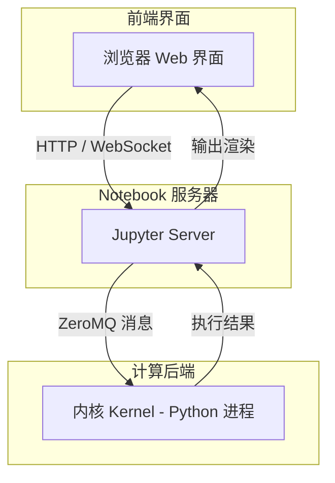

# 单元格与执行顺序

> **所属路径**：`01_基础能力/01_开发环境与技术英语/16_Jupyter Notebook与交互式开发/01_单元格与执行顺序`
> **预计学习时间**：35 分钟
> **难度等级**：⭐

---

## 前置知识

- [变量与数据类型](../../01_编程语言基础/01_变量与数据类型/01_变量与数据类型.md)

> 如果以上内容还不熟悉，建议先完成对应课程再继续。

---

## 学习目标

完成本节后，你将能够：

1. 解释 Jupyter Notebook 的架构组成（内核、服务器、前端）
2. 区分三种单元格类型（代码、Markdown、Raw）并熟练切换
3. 理解执行编号 `In[n]` 的含义，识别非线性执行带来的风险
4. 使用常用快捷键高效操作 Notebook
5. 正确重启内核以清除隐藏状态

---

## 正文讲解

### 1. 从脚本到 Notebook：为什么需要交互式开发

想象你正在分析一份销售数据。如果使用传统的 `.py` 脚本，你需要写完整个程序，然后从头运行——如果中间某一步出了问题，你可能要反复修改、反复从头执行。当数据加载就需要几分钟时，这种工作方式会让人崩溃。

**Jupyter Notebook**（以下简称 Notebook）提供了一种完全不同的工作方式：你可以把代码拆分成一个个小块（称为 **单元格（Cell）** ），每次只运行一个单元格，立刻看到结果。这就像是在和计算机"对话"——你说一句，它答一句，你根据它的回答决定下一步做什么。

这种 **交互式开发（Interactive Development）** 模式特别适合以下场景：

- **探索性数据分析（Exploratory Data Analysis, EDA）** ：逐步了解数据的结构和特征
- 模型实验：快速尝试不同的参数和方法
- 教学演示：代码和说明穿插呈现，像一本"可执行的教科书"
- 技术报告：将分析过程和结论组织在一个文档中

### 2. Jupyter 的架构：内核、服务器与前端

在开始操作之前，让我们先了解 Notebook 背后的工作原理。你看到的 Notebook 界面实际上由三个部分协作完成：



> 📌 **图解说明**：Jupyter 采用前后端分离架构。浏览器只负责展示界面和接收输入，真正执行代码的是后端的内核进程。这种设计让你甚至可以通过远程浏览器连接到服务器上的内核，进行远程开发。

- **前端界面（Frontend）** ：你在浏览器中看到的页面，负责编辑单元格、显示输出结果
- **Notebook 服务器（Jupyter Server）** ：负责管理 `.ipynb` 文件的读写，以及在前端和内核之间传递消息
- **内核（Kernel）** ：一个独立的 Python 进程（也可以是 R、Julia 等其他语言），负责实际执行代码并返回结果

理解这个架构很重要：当你在 Notebook 中定义了一个变量 `x = 10` ，这个变量实际上存储在 **内核** 的内存中。只要内核不重启，这个变量就一直存在——无论你是否关闭了浏览器标签页。

### 3. 三种单元格类型

Notebook 的基本组成单位是 **单元格（Cell）** 。每个单元格可以是以下三种类型之一：

**代码单元格（Code Cell）**

这是最常用的单元格类型，用于编写和执行 Python 代码。代码单元格的左侧会显示执行编号 `In[n]` ，执行后在下方显示输出：

```python
# 这是一个代码单元格
x = 42
print(f"x 的值是 {x}")
```

执行后，你会看到：
```
x 的值是 42
```

代码单元格还有一个便利功能：**最后一行表达式的值会自动显示**，不需要 `print()` ：

```python
# 最后一行的值会自动显示
x + 8
```

输出：
```
50
```

**Markdown 单元格**

用于编写格式化的文字说明，支持标题、列表、公式、图片等 Markdown 语法。在 Markdown 单元格中你可以使用 LaTeX 写数学公式，比如行内公式 $E = mc^2$ ，或独立行公式：

$$
\bar{x} = \frac{1}{n} \sum_{i=1}^{n} x_i
$$

> **直觉解读**：这个公式表示算术平均值——把所有数加起来再除以个数。

**Raw 单元格（Raw Cell）**

原始文本单元格，内容不会被执行也不会被渲染。它通常用于存放导出时需要原样保留的内容（如 LaTeX 源码），初学阶段很少用到。

### 4. 执行编号与非线性执行

每当你运行一个代码单元格，左侧的 `In[ ]` 就会变成 `In[n]` ，其中 $n$ 是一个递增的数字，表示这是你在本次会话中执行的第 $n$ 条代码。

这个编号揭示了 Notebook 最重要的特性，也是最容易踩坑的地方—— **非线性执行（Non-linear Execution）** 。

在传统 `.py` 脚本中，代码总是从上到下依次执行。但在 Notebook 中，你可以按任意顺序运行单元格。比如你可以先运行第 3 个单元格，再运行第 1 个，再回去运行第 2 个。这种灵活性在探索阶段非常方便，但也会带来 **隐藏状态（Hidden State）** 的问题。

来看一个典型的例子：

```python
# 单元格 A（先运行这个）
x = 10
```

```python
# 单元格 B（然后运行这个）
x = x + 5
print(x)  # 输出 15
```

```python
# 单元格 C（再运行这个）
print(x * 2)  # 输出 30
```

到目前为止一切正常。但如果你现在再次运行单元格 B：

```python
# 再次运行单元格 B
x = x + 5
print(x)  # 输出 20（不是 15！）
```

变量 $x$ 的值变成了 20，因为 $x$ 在内核中已经是 15 了，再加 5 就是 20。如果有人后来打开这个 Notebook，从上往下阅读，看到的 `In[n]` 编号可能是乱序的（比如 `In[1]`, `In[3]`, `In[2]`, `In[5]` ），完全无法重现你的结果。


> 📌 **图解说明**：非线性执行导致变量 $x$ 的值依赖于执行顺序而非代码位置。红色节点表示隐藏状态风险——Notebook 中显示的代码无法反映真实的执行历史。

**最佳实践**：在分享 Notebook 之前，务必执行"Kernel → Restart & Run All"（重启内核并从头运行所有单元格），确保从上到下顺序执行能得到正确结果。

### 5. 内核状态与管理

内核是 Notebook 的"大脑"。所有的变量、导入的库、定义的函数都存储在内核中。理解内核状态对于正确使用 Notebook 至关重要。

**内核的常用操作**：

| 操作 | 说明 | 使用场景 |
| ---- | ---- | -------- |
| Restart | 重启内核，清除所有变量和导入 | 遇到奇怪的状态问题时 |
| Restart & Clear Output | 重启并清除所有输出 | 准备分享前的清理 |
| Restart & Run All | 重启后从头到尾运行所有单元格 | 验证 Notebook 的可复现性 |
| Interrupt | 中断当前正在执行的代码 | 代码运行时间过长或陷入死循环时 |

**内核忙碌标识**：当内核正在执行代码时，Notebook 界面右上角的内核指示器会显示为实心圆（●），空闲时为空心圆（○）。如果你发现内核长时间处于忙碌状态，可能需要中断它。

### 6. 常用快捷键

Notebook 有两种模式：

- **命令模式（Command Mode）** ：按 `Esc` 进入，单元格边框为蓝色，可以操作单元格整体
- **编辑模式（Edit Mode）** ：按 `Enter` 进入，单元格边框为绿色，可以编辑单元格内容

以下是最常用的快捷键：

| 快捷键 | 模式 | 功能 |
| ------ | ---- | ---- |
| `Shift + Enter` | 通用 | 运行当前单元格并跳到下一个 |
| `Ctrl + Enter` | 通用 | 运行当前单元格但不跳转 |
| `Alt + Enter` | 通用 | 运行当前单元格并在下方插入新单元格 |
| `A` | 命令 | 在上方插入新单元格 |
| `B` | 命令 | 在下方插入新单元格 |
| `DD` | 命令 | 删除当前单元格 |
| `M` | 命令 | 将当前单元格切换为 Markdown 类型 |
| `Y` | 命令 | 将当前单元格切换为代码类型 |
| `Z` | 命令 | 撤销单元格操作 |
| `Ctrl + S` | 通用 | 保存 Notebook |
| `H` | 命令 | 显示所有快捷键帮助 |

> 💡 **提示**：不需要一次记住所有快捷键。先熟练使用 `Shift+Enter` 运行单元格和 `A` / `B` 插入单元格，其他快捷键随着使用自然就会记住。

---

## 动手实践

下面我们来实际操作一下。请打开终端，确保已安装 Jupyter：

```bash
# 安装 Jupyter Notebook（如果尚未安装）
pip install notebook

# 启动 Jupyter Notebook
jupyter notebook
```

启动后浏览器会自动打开。点击右上角的"New → Python 3"创建一个新 Notebook，然后依次在单元格中输入并运行以下代码：

```python
# 单元格 1：导入库并查看 Python 版本
import sys
print(f"Python 版本: {sys.version}")
print(f"当前工作目录:")

import os
print(os.getcwd())
```

**预期输出**：
```
Python 版本: 3.10.x (根据你的环境不同)
当前工作目录:
/home/your_username/...
```

```python
# 单元格 2：体验"最后一行自动显示"
data = [1, 2, 3, 4, 5]
sum(data) / len(data)
```

**预期输出**：
```
3.0
```

```python
# 单元格 3：验证变量在单元格间共享
print(f"data 变量仍然可用: {data}")
print(f"data 的长度: {len(data)}")
```

**预期输出**：
```
data 变量仍然可用: [1, 2, 3, 4, 5]
data 的长度: 5
```

```python
# 单元格 4：演示非线性执行的风险
counter = 0

# 每次运行这个单元格，counter 都会增加 1
counter += 1
print(f"这个单元格被运行了 {counter} 次")
```

**运行说明**：
- 环境要求：Python 3.10+，notebook>=7.0
- 多次运行单元格 4，观察 `counter` 的值如何变化。这就是非线性执行的直观演示。

---

## 典型误区

| 误区 | 正确理解 |
| ---- | -------- |
| "Notebook 中的代码总是从上到下执行的" | Notebook 允许按任意顺序执行单元格，因此代码的位置不等于执行顺序。`In[n]` 编号才反映真实的执行顺序 |
| "关闭浏览器标签页就关闭了 Notebook" | 关闭标签页只是断开了前端连接，内核仍在后台运行。需要在 Jupyter 首页手动 Shutdown 内核 |
| "Notebook 只能写 Python" | Jupyter 支持多种内核（R、Julia、Scala 等），"Jupyter"这个名字就来自 Julia + Python + R |
| "变量删了单元格就消失了" | 删除单元格不会清除内核中已经定义的变量。只有重启内核才能彻底清除所有状态 |

---

## 练习题

### 练习 1：识别执行顺序问题（难度：⭐）

在一个新的 Notebook 中，有三个单元格按以下顺序排列：

- 单元格 A：`x = 5`
- 单元格 B：`x = x * 2`
- 单元格 C：`print(x)`

按照以下顺序执行：A → B → C → B → C。请问最后单元格 C 的输出是什么？

<details>
<summary>💡 提示</summary>

注意每次运行单元格 B 时，$x$ 的值都会在当前基础上翻倍。

</details>

<details>
<summary>✅ 参考答案</summary>

最后输出是 `20` 。

执行过程：

- A：$x = 5$
- B（第 1 次）：$x = 5 \times 2 = 10$
- C（第 1 次）：输出 `10`
- B（第 2 次）：$x = 10 \times 2 = 20$
- C（第 2 次）：输出 `20`

这是非线性执行带来的典型问题——同一个单元格 B 两次执行的结果不同。

</details>

### 练习 2：Notebook 架构理解（难度：⭐）

请回答以下问题：

1. 如果你在 Notebook 中 `import numpy as np` ，然后删除了这个单元格，再在新的单元格中使用 `np.array([1,2,3])` ，会报错吗？
2. 如果你执行了 `import numpy as np` 后重启了内核（Restart），再在新的单元格中使用 `np.array([1,2,3])` ，会报错吗？

<details>
<summary>💡 提示</summary>

思考"删除单元格"和"重启内核"分别影响了什么。

</details>

<details>
<summary>✅ 参考答案</summary>

1. **不会报错**。删除单元格只是从 Notebook 文档中移除了那段代码，但 `import numpy as np` 已经在内核中执行过了，`np` 这个名字仍然存在于内核内存中。
2. **会报错**。重启内核会清除所有内存状态，包括所有已导入的模块、已定义的变量和函数。你需要重新运行 `import numpy as np` 。

这说明：Notebook 文档（`.ipynb` 文件）和内核状态（内存）是两个独立的东西。

</details>

### 练习 3：快捷键实践（难度：⭐）

在一个新的 Notebook 中，不使用鼠标，仅通过键盘快捷键完成以下操作：

1. 创建一个新的代码单元格
2. 输入 `print("Hello, Jupyter!")` 并运行
3. 在上方插入一个新单元格
4. 将它切换为 Markdown 类型
5. 输入 `# 我的第一个 Notebook` 并运行渲染

<details>
<summary>💡 提示</summary>

关键快捷键：`B` 在下方插入、`A` 在上方插入、`M` 切换为 Markdown、`Shift+Enter` 运行。记得先按 `Esc` 进入命令模式再使用这些快捷键。

</details>

<details>
<summary>✅ 参考答案</summary>

操作步骤：

1. 按 `B` 在下方插入新代码单元格
2. 按 `Enter` 进入编辑模式，输入 `print("Hello, Jupyter!")`，按 `Shift+Enter` 运行
3. 按 `Esc` 回到命令模式，按 `A` 在上方插入新单元格
4. 按 `M` 将它切换为 Markdown 类型
5. 按 `Enter` 进入编辑模式，输入 `# 我的第一个 Notebook`，按 `Shift+Enter` 运行渲染

完成后你会看到一个漂亮的大标题"我的第一个 Notebook"出现在 `print` 语句上方。

</details>

---

## 下一步学习

- 📖 下一个知识点：[可视化与展示](../02_可视化与展示/02_可视化与展示.md)
- 🔗 相关知识点：[魔法命令与扩展](../04_魔法命令与扩展/04_魔法命令与扩展.md)（学习更多 Notebook 高级功能）
- 📚 拓展阅读：[Jupyter 官方文档](https://jupyter-notebook.readthedocs.io/) — Jupyter Notebook 的完整官方文档（开源项目文档）

---

## 参考资料

1. [Jupyter Notebook 官方文档](https://jupyter-notebook.readthedocs.io/) — Jupyter 项目的完整使用文档（BSD 许可开源项目）
2. [IPython 官方文档](https://ipython.readthedocs.io/) — Jupyter 内核 IPython 的详细文档（BSD 许可开源项目）
3. [Jupyter 项目架构说明](https://docs.jupyter.org/en/latest/projects/architecture/content-architecture.html) — 官方的架构设计文档（开源文档）
4. [Real Python - Jupyter Notebook 入门](https://realpython.com/jupyter-notebook-introduction/) — 高质量的英文入门教程（公开免费博客）
