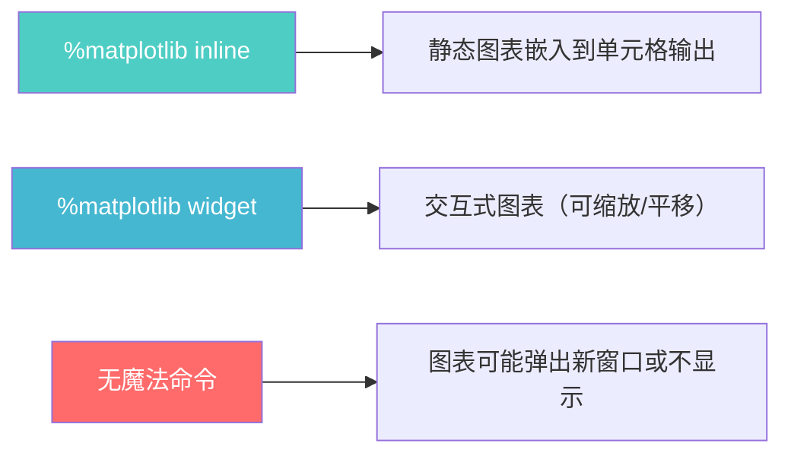

# 可视化与展示

> **所属路径**：`01_基础能力/01_开发环境与技术英语/16_Jupyter Notebook与交互式开发/02_可视化与展示`
> **预计学习时间**：45 分钟
> **难度等级**：⭐⭐

---

## 前置知识

- [单元格与执行顺序](../01_单元格与执行顺序/01_单元格与执行顺序.md)

> 如果以上内容还不熟悉，建议先完成对应课程再继续。

---

## 学习目标

完成本节后，你将能够：

1. 使用 `%matplotlib inline` 在 Notebook 中嵌入 matplotlib 图表
2. 用 Markdown 单元格编写包含标题、公式和图片的实验文档
3. 使用 `IPython.display` 展示图片、HTML 等富文本内容
4. 使用 ipywidgets 创建基础交互控件
5. 美化 DataFrame 输出并使用进度条

---

## 正文讲解

### 1. 为什么可视化是 Notebook 的核心优势

在上一节中我们学会了 Notebook 的基本操作。但如果 Notebook 只能运行代码和显示文字，那它和在终端里运行 Python 脚本也没什么本质区别。Notebook 真正的杀手级功能在于——它可以在代码的正下方直接展示 **图表、图片、HTML、甚至交互式控件** ，让"代码 → 结果"的反馈循环变得极其直观。

想象你正在分析一组温度数据，在传统脚本中你可能需要把图表保存为文件再打开查看；而在 Notebook 中，图表直接"长在"代码下面。这种即时的视觉反馈对于探索性数据分析和实验记录至关重要。

### 2. matplotlib 内嵌绑定：让图表"长"在代码下面

**matplotlib** 是 Python 最常用的绑图库。在 Notebook 中使用它之前，你需要告诉 Notebook 如何显示图表。这就是 **魔法命令（Magic Command）** `%matplotlib inline` 的作用——它让 matplotlib 的图表直接嵌入在单元格输出中，而不是弹出一个新窗口。

```python
# 在 Notebook 的第一个代码单元格中执行
%matplotlib inline
```

执行了这条魔法命令后，所有后续的 matplotlib 图表都会自动嵌入到 Notebook 中。

除了 `inline` 模式，还有一个更强大的选项—— `%matplotlib widget` ，它提供可交互的图表（可以缩放、平移），但需要额外安装 `ipympl` 包。对于初学阶段，`inline` 模式完全够用。



> 📌 **图解说明**：三种图表显示模式的对比。推荐初学者使用 `%matplotlib inline` ，它是最稳定的嵌入方式。

下面来看一个完整的绑图示例：

```python
%matplotlib inline
import matplotlib.pyplot as plt
import numpy as np

# 生成数据
x = np.linspace(0, 2 * np.pi, 100)
y_sin = np.sin(x)
y_cos = np.cos(x)

# 创建图表
fig, ax = plt.subplots(figsize=(8, 4))
ax.plot(x, y_sin, label='sin(x)', color='#4ecdc4', linewidth=2)
ax.plot(x, y_cos, label='cos(x)', color='#ff6b6b', linewidth=2, linestyle='--')
ax.set_xlabel('$x$')
ax.set_ylabel('$y$')
ax.set_title('Sine and Cosine Functions')
ax.legend()
ax.grid(alpha=0.3)
ax.spines['top'].set_visible(False)
ax.spines['right'].set_visible(False)
plt.tight_layout()
plt.show()
```

**预期输出**：一张嵌入在 Notebook 中的正弦和余弦函数图表。

### 3. Markdown 单元格：构建实验文档

Notebook 的 Markdown 单元格支持丰富的格式化语法，让你可以在代码之间穿插说明文字、公式和图片，构建一份完整的实验文档。

在 Markdown 单元格中，你可以使用以下语法：

**标题与层级**：
```markdown
# 一级标题
## 二级标题
### 三级标题
```

**列表**：
```markdown
- 无序列表项 1
- 无序列表项 2

1. 有序列表项 1
2. 有序列表项 2
```

**数学公式**：
```markdown
行内公式：$E = mc^2$

独立行公式：
$$
L(\theta) = -\frac{1}{N} \sum_{i=1}^{N} y_i \log \hat{y}_i
$$
```

**插入图片**：
```markdown

```

**表格**：
```markdown
| 列 1 | 列 2 | 列 3 |
| ---- | ---- | ---- |
| 数据 | 数据 | 数据 |
```

> 💡 **实用技巧**：在实验过程中，养成在代码单元格之间插入 Markdown 单元格的习惯，记录你的思路、假设和观察。这样做出来的 Notebook 不仅是代码，更是一份完整的实验记录。

### 4. IPython.display：富文本输出

Notebook 的代码单元格不仅能显示纯文本输出，还能通过 `IPython.display` 模块展示各种 **富文本（Rich Text）** 内容。

**显示 HTML 内容**：

```python
from IPython.display import HTML

HTML("""
<div style="background: linear-gradient(135deg, #667eea 0%, #764ba2 100%);
            padding: 20px; border-radius: 10px; color: white; text-align: center;">
    <h2>欢迎来到 Jupyter Notebook</h2>
    <p>这是一段用 HTML 渲染的富文本内容</p>
</div>
""")
```

**显示图片**：

```python
from IPython.display import Image

# 从 URL 加载图片
Image(url='https://jupyter.org/assets/logos/rectanglelogo-greytext-orangebody-greymoons.png',
      width=300)
```

**显示数学公式**：

```python
from IPython.display import Math, Latex

# 显示 LaTeX 公式
Math(r'\int_{-\infty}^{\infty} e^{-x^2} dx = \sqrt{\pi}')
```

**显示 Markdown**：

```python
from IPython.display import Markdown

Markdown("""
### 动态生成的报告

当前时间戳：**2024-01-01**

分析结论：
- 数据点数量：1000
- 平均值：42.5
""")
```

这些功能让你可以在代码中 **动态生成** 格式化的输出内容，非常适合构建自动化的分析报告。

### 5. 交互式控件：ipywidgets 基础

如果说静态图表让 Notebook 变成了"可执行的文档"，那 **交互式控件（Interactive Widgets）** 则让它变成了"迷你应用"。 **ipywidgets** 是 Jupyter 的官方控件库，可以让你用滑块、下拉菜单等 UI 元素控制代码的执行。

```python
# 安装 ipywidgets（如果尚未安装）
# pip install ipywidgets

import ipywidgets as widgets
from IPython.display import display

# 创建一个滑块
slider = widgets.IntSlider(
    value=5,
    min=0,
    max=10,
    step=1,
    description='数值:',
)
display(slider)
```

更强大的用法是使用 `interact` 装饰器，让函数自动生成交互控件：

```python
from ipywidgets import interact
import matplotlib.pyplot as plt
import numpy as np

%matplotlib inline

@interact(frequency=(1, 10, 0.5), amplitude=(0.1, 2.0, 0.1))
def plot_wave(frequency=2, amplitude=1.0):
    """交互式正弦波绘图"""
    x = np.linspace(0, 2 * np.pi, 200)
    y = amplitude * np.sin(frequency * x)

    fig, ax = plt.subplots(figsize=(8, 3))
    ax.plot(x, y, color='#4ecdc4', linewidth=2)
    ax.set_ylim(-2.5, 2.5)
    ax.set_xlabel('$x$')
    ax.set_ylabel('$y$')
    ax.set_title(f'$y = {amplitude} \\sin({frequency}x)$')
    ax.grid(alpha=0.3)
    plt.tight_layout()
    plt.show()
```

**预期效果**：出现两个滑块（频率和振幅），拖动滑块时图表会实时更新。

ipywidgets 提供了多种常用控件：

| 控件 | 用途 | 示例 |
| ---- | ---- | ---- |
| `IntSlider` / `FloatSlider` | 数值选择 | 调整超参数 |
| `Dropdown` | 下拉选择 | 选择模型类型 |
| `Checkbox` | 布尔开关 | 切换显示选项 |
| `Text` | 文本输入 | 输入文件路径 |
| `Button` | 按钮 | 触发操作 |

### 6. DataFrame 美化与进度条

在数据分析中，你会频繁和 pandas 的 **DataFrame** 打交道。Notebook 默认就会把 DataFrame 渲染成一个漂亮的 HTML 表格，但你还可以进一步美化它：

```python
import pandas as pd
import numpy as np

# 创建示例数据
np.random.seed(42)
df = pd.DataFrame({
    '模型': ['线性回归', '决策树', '随机森林', '神经网络'],
    '准确率': [0.82, 0.87, 0.91, 0.93],
    '训练时间(秒)': [0.1, 0.5, 2.3, 15.7],
    'F1 分数': [0.80, 0.85, 0.90, 0.92]
})

# 使用 Styler 高亮最佳值
df.style.highlight_max(
    subset=['准确率', 'F1 分数'],
    color='#4ecdc4'
).highlight_min(
    subset=['训练时间(秒)'],
    color='#ffe66d'
)
```

**预期输出**：一个美化过的表格，最高准确率和 F1 分数高亮为青色，最短训练时间高亮为黄色。

**进度条** 在长时间运行的任务中非常有用。 **tqdm** 库在 Notebook 中有专门的版本：

```python
from tqdm.notebook import tqdm
import time

# 模拟一个耗时任务
results = []
for i in tqdm(range(100), desc='训练进度'):
    time.sleep(0.02)  # 模拟计算
    results.append(i ** 2)

print(f"完成！共 {len(results)} 个结果")
```

**预期输出**：一个带有进度条的动画效果，显示当前进度百分比和预计剩余时间。

> ⚠️ **注意**：在 Notebook 中使用 tqdm 时，应导入 `tqdm.notebook` 而非 `tqdm.auto` 或 `tqdm` ，否则进度条可能显示为纯文本或出现重复输出。

---

## 动手实践

请在一个新的 Notebook 中完成以下完整的可视化练习：

```python
# 单元格 1：环境准备
%matplotlib inline
import matplotlib.pyplot as plt
import numpy as np
import pandas as pd
from IPython.display import Markdown, display
```

```python
# 单元格 2：生成模拟数据
np.random.seed(42)
n_samples = 200

# 模拟两个类别的数据
class_a = np.random.randn(n_samples, 2) + [2, 2]
class_b = np.random.randn(n_samples, 2) + [-2, -2]

# 合并数据
data = np.vstack([class_a, class_b])
labels = ['A'] * n_samples + ['B'] * n_samples
```

```python
# 单元格 3：绘制散点图
fig, axes = plt.subplots(1, 2, figsize=(12, 5))

# 左图：散点图
axes[0].scatter(class_a[:, 0], class_a[:, 1],
                alpha=0.5, label='Class A', color='#4ecdc4')
axes[0].scatter(class_b[:, 0], class_b[:, 1],
                alpha=0.5, label='Class B', color='#ff6b6b')
axes[0].set_xlabel('$x_1$')
axes[0].set_ylabel('$x_2$')
axes[0].set_title('Scatter Plot: Two Classes')
axes[0].legend()
axes[0].grid(alpha=0.3)

# 右图：直方图
axes[1].hist(class_a[:, 0], bins=20, alpha=0.5,
             label='Class A ($x_1$)', color='#4ecdc4')
axes[1].hist(class_b[:, 0], bins=20, alpha=0.5,
             label='Class B ($x_1$)', color='#ff6b6b')
axes[1].set_xlabel('$x_1$')
axes[1].set_ylabel('Frequency')
axes[1].set_title('Histogram: $x_1$ Distribution')
axes[1].legend()
axes[1].grid(alpha=0.3)

plt.tight_layout()
plt.show()
```

```python
# 单元格 4：用 DataFrame 展示统计摘要
df = pd.DataFrame(data, columns=['x1', 'x2'])
df['class'] = labels

summary = df.groupby('class').agg(['mean', 'std']).round(3)
display(Markdown("### 各类别统计摘要"))
summary
```

**运行说明**：
- 环境要求：Python 3.10+，matplotlib>=3.7，numpy>=1.24，pandas>=2.0
- 按顺序运行单元格 1 到 4，观察图表和表格的嵌入效果

---

## 典型误区

| 误区 | 正确理解 |
| ---- | -------- |
| "每次绑图前都要写 `plt.show()`" | 在 `%matplotlib inline` 模式下，单元格末尾的 `plt.show()` 不是必须的，但加上是好习惯——它可以抑制多余的文字输出（如 `<Figure ...>` ） |
| "ipywidgets 的交互图一定要在 JupyterLab 中用" | ipywidgets 在经典 Jupyter Notebook 和 JupyterLab 中都可以使用，但需要确保 `widgetsnbextension`（经典版）或 `jupyterlab-widgets`（Lab 版）已安装 |
| "Markdown 单元格只是给自己看的注释" | Markdown 单元格是 Notebook 作为实验文档的核心组成部分。好的 Markdown 注释让 Notebook 可以直接导出为报告 |
| "Notebook 里只能用 matplotlib 绑图" | Notebook 支持几乎所有 Python 可视化库，包括 seaborn、plotly、altair、bokeh 等 |

---

## 练习题

### 练习 1：基础绘图与展示（难度：⭐）

在 Notebook 中完成以下任务：

1. 用 Markdown 单元格写一个标题"我的第一个数据分析"
2. 在代码单元格中生成 50 个 1 到 100 之间的随机整数
3. 绘制这些数字的直方图（使用 `%matplotlib inline` ）
4. 在另一个 Markdown 单元格中用公式表示这组数据的均值计算方法

<details>
<summary>💡 提示</summary>

使用 `np.random.randint(1, 101, size=50)` 生成随机整数。直方图用 `plt.hist()` ，Markdown 中的公式用 `$$\bar{x} = \frac{1}{n}\sum_{i=1}^{n} x_i$$` 。

</details>

<details>
<summary>✅ 参考答案</summary>

Markdown 单元格 1：
```markdown
# 我的第一个数据分析
```

代码单元格：
```python
%matplotlib inline
import numpy as np
import matplotlib.pyplot as plt

data = np.random.randint(1, 101, size=50)
print(f"均值: {data.mean():.2f}, 标准差: {data.std():.2f}")

fig, ax = plt.subplots(figsize=(8, 4))
ax.hist(data, bins=15, color='#4ecdc4', edgecolor='white')
ax.set_xlabel('Value')
ax.set_ylabel('Frequency')
ax.set_title('Random Integer Distribution')
ax.grid(alpha=0.3)
plt.tight_layout()
plt.show()
```

Markdown 单元格 2：
```markdown
## 均值计算公式

$$
\bar{x} = \frac{1}{n}\sum_{i=1}^{n} x_i
$$
```

</details>

### 练习 2：IPython.display 实践（难度：⭐⭐）

使用 `IPython.display.Markdown` 动态生成一份分析摘要。要求：

1. 创建一个包含 100 个随机数的列表
2. 计算均值、标准差、最大值、最小值
3. 用 `Markdown()` 函数生成一段格式化的摘要文本，包含上述统计信息

<details>
<summary>💡 提示</summary>

可以用 f-string 构建 Markdown 文本，然后传给 `Markdown()` 。记得用 `display()` 来显示结果。

</details>

<details>
<summary>✅ 参考答案</summary>

```python
import numpy as np
from IPython.display import Markdown, display

np.random.seed(42)
data = np.random.randn(100)

summary_md = f"""
### 数据分析摘要

| 统计量 | 值 |
| ------ | -- |
| 样本数 | {len(data)} |
| 均值 | {data.mean():.4f} |
| 标准差 | {data.std():.4f} |
| 最大值 | {data.max():.4f} |
| 最小值 | {data.min():.4f} |

> 数据服从标准正态分布 $N(0, 1)$
"""

display(Markdown(summary_md))
```

这个技巧在自动化分析报告中非常实用——你可以根据数据动态生成格式化的报告内容。

</details>

### 练习 3：交互式控件（难度：⭐⭐）

使用 `ipywidgets.interact` 创建一个交互式的直方图，允许用户通过滑块调整：

1. 数据量（100 到 10000）
2. 直方图的箱数（5 到 50）

<details>
<summary>💡 提示</summary>

定义一个绑图函数，接收 `n_samples` 和 `n_bins` 两个参数，然后用 `@interact` 装饰器自动生成滑块。

</details>

<details>
<summary>✅ 参考答案</summary>

```python
%matplotlib inline
import numpy as np
import matplotlib.pyplot as plt
from ipywidgets import interact

@interact(n_samples=(100, 10000, 100), n_bins=(5, 50, 1))
def interactive_hist(n_samples=1000, n_bins=20):
    data = np.random.randn(n_samples)
    fig, ax = plt.subplots(figsize=(8, 4))
    ax.hist(data, bins=n_bins, color='#4ecdc4',
            edgecolor='white', density=True)
    ax.set_xlabel('Value')
    ax.set_ylabel('Density')
    ax.set_title(f'Normal Distribution (n={n_samples}, bins={n_bins})')
    ax.grid(alpha=0.3)
    plt.tight_layout()
    plt.show()
```

拖动滑块可以直观看到：数据量越大，直方图越接近钟形曲线；箱数越多，分布细节越丰富。

</details>

---

## 下一步学习

- 📖 下一个知识点：[实验记录与导出](../03_实验记录与导出/03_实验记录与导出.md)
- 🔗 相关知识点：[魔法命令与扩展](../04_魔法命令与扩展/04_魔法命令与扩展.md)（`%matplotlib` 是一个魔法命令）
- 📚 拓展阅读：[ipywidgets 官方文档](https://ipywidgets.readthedocs.io/) — 交互式控件库的完整文档（BSD 许可开源项目）

---

## 参考资料

1. [matplotlib 官方教程](https://matplotlib.org/stable/tutorials/index.html) — matplotlib 绑图库的官方教程（PSF 许可开源项目）
2. [IPython.display 模块文档](https://ipython.readthedocs.io/en/stable/api/generated/IPython.display.html) — 富文本显示功能的 API 文档（BSD 许可开源项目）
3. [ipywidgets 官方文档](https://ipywidgets.readthedocs.io/) — 交互式控件库的完整文档（BSD 许可开源项目）
4. [tqdm 官方文档](https://tqdm.github.io/) — 进度条库的使用指南（MIT/MPL 许可开源项目）
