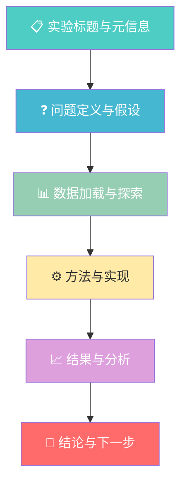
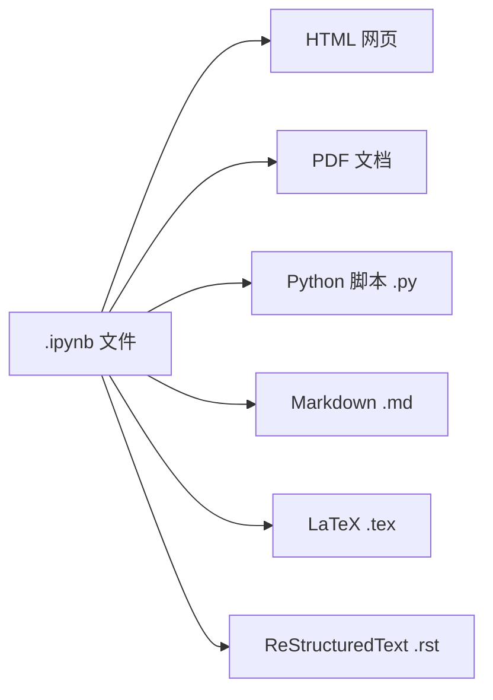

# 实验记录与导出

> **所属路径**：`01_基础能力/01_开发环境与技术英语/16_Jupyter Notebook与交互式开发/03_实验记录与导出`
> **预计学习时间**：40 分钟
> **难度等级**：⭐⭐

---

## 前置知识

- [可视化与展示](../02_可视化与展示/02_可视化与展示.md)
- [版本控制](../../15_版本控制/)

> 如果以上内容还不熟悉，建议先完成对应课程再继续。

---

## 学习目标

完成本节后，你将能够：

1. 按照规范的结构组织一份可复现的实验 Notebook
2. 使用 nbconvert 将 Notebook 导出为 HTML、PDF 和 Python 脚本
3. 解释 `.ipynb` 文件的 JSON 结构并理解其版本控制的困难
4. 使用 nbstripout 清理 Notebook 输出以便纳入版本管理
5. 区分 JupyterLab 和经典 Jupyter Notebook 的差异

---

## 正文讲解

### 1. Notebook 作为可复现的实验记录

在前两节中，我们学会了如何在 Notebook 中编写代码、绘制图表和展示富文本。但 Notebook 的价值远不止于此——它可以是一份 **完整的、可复现的实验记录** 。

科学研究和工程开发中的"实验"不只是"把代码跑通"，更需要记录清楚：你 **为什么** 做这个实验、你的 **假设** 是什么、你用了 **什么数据** 、得出了 **什么结论** 。传统上这些信息散落在代码注释、Word 文档和聊天记录中，而 Notebook 可以把它们统一在一个文件里。

一份优秀的实验 Notebook 应该像一篇科学论文一样有清晰的结构：



> 📌 **图解说明**：一份规范的实验 Notebook 应包含从标题到结论的完整流程。每个部分用 Markdown 单元格清晰标注，中间穿插代码单元格。

### 2. 实验文档的组织结构

下面是一份推荐的实验 Notebook 模板结构：

**第一部分：标题与元信息**（Markdown 单元格）

```markdown
# 实验：不同优化器对 MNIST 分类准确率的影响

- **日期**：2024-06-15
- **作者**：张三
- **环境**：Python 3.10, PyTorch 2.1, CUDA 12.0
- **数据集**：MNIST 手写数字数据集（60000 训练 / 10000 测试）
```

**第二部分：问题定义与假设**（Markdown 单元格）

```markdown
## 背景与假设

**问题**：在相同的网络架构下，SGD、Adam 和 AdamW 哪个优化器
能在最少的 epoch 内达到 98% 以上的测试准确率？

**假设**：Adam 类优化器由于自适应学习率，收敛速度应快于 SGD。
```

**第三部分：环境与数据**（代码 + Markdown 单元格）

```python
# 环境检查
import torch
import numpy as np
print(f"PyTorch: {torch.__version__}")
print(f"CUDA available: {torch.cuda.is_available()}")
np.random.seed(42)
torch.manual_seed(42)
```

**第四部分：方法与实现**（代码单元格，穿插说明）

**第五部分：结果与分析**（代码单元格 + 图表 + Markdown 分析）

**第六部分：结论与下一步**（Markdown 单元格）

```markdown
## 结论

1. Adam 在第 5 个 epoch 即达到 98.2%，SGD 需要 12 个 epoch
2. AdamW 的最终准确率最高（98.7%），但收敛速度与 Adam 相当
3. **假设部分成立**：Adam 类优化器收敛更快，但 SGD 最终也能达到相近水平

## 下一步

- 尝试学习率预热（warmup）对 SGD 的影响
- 测试更大的学习率范围
```

### 3. 导出格式与 nbconvert

当你完成了一份实验 Notebook，经常需要把它分享给不使用 Jupyter 的同事或导师。 **nbconvert** 是 Jupyter 官方提供的导出工具，支持将 `.ipynb` 文件转换为多种格式。



> 📌 **图解说明**：nbconvert 支持多种导出格式。HTML 和 PDF 最适合分享，Python 脚本适合将探索性代码整理为生产代码。

**导出为 HTML**（最常用，保留所有格式和图表）：

```bash
jupyter nbconvert --to html my_experiment.ipynb
```

**导出为 Python 脚本**（去除 Markdown，保留代码）：

```bash
jupyter nbconvert --to script my_experiment.ipynb
```

**导出为 PDF**（需要安装 LaTeX 环境，如 TeX Live）：

```bash
jupyter nbconvert --to pdf my_experiment.ipynb
```

> 💡 **提示**：如果不想安装 LaTeX 环境来生成 PDF，可以先导出为 HTML，然后在浏览器中打开并使用"打印 → 另存为 PDF"功能。

你也可以直接在 Notebook 的菜单中操作：File → Download as → 选择格式。

**通过 nbconvert 模板自定义导出样式**：

```bash
# 使用无代码模板导出（只保留输出和 Markdown）
jupyter nbconvert --to html --no-input my_experiment.ipynb
```

`--no-input` 选项会隐藏所有代码单元格，只保留输出和 Markdown 内容，非常适合生成面向非技术人员的报告。

### 4. `.ipynb` 文件的 JSON 结构

要理解为什么 Notebook 文件在版本控制中"不太友好"，我们需要先了解它的内部结构。 `.ipynb` 文件本质上是一个 **JSON（JavaScript Object Notation）** 格式的文本文件：

```json
{
  "cells": [
    {
      "cell_type": "markdown",
      "metadata": {},
      "source": ["# 我的实验\n", "这是一个示例。"]
    },
    {
      "cell_type": "code",
      "execution_count": 1,
      "metadata": {},
      "source": ["x = 42\n", "print(x)"],
      "outputs": [
        {
          "name": "stdout",
          "output_type": "stream",
          "text": ["42\n"]
        }
      ]
    }
  ],
  "metadata": {
    "kernelspec": {
      "display_name": "Python 3",
      "language": "python",
      "name": "python3"
    },
    "language_info": {
      "name": "python",
      "version": "3.10.0"
    }
  },
  "nbformat": 4,
  "nbformat_minor": 5
}
```

注意到了吗？文件中不仅包含你写的代码（`source` ），还包含：

- **执行编号**（`execution_count` ）：每次重新运行都会变化
- **输出内容**（`outputs` ）：包括文字输出、图片（以 base64 编码存储）等
- **元数据**（`metadata` ）：内核信息、单元格 ID 等

这意味着即使你只改了一行代码，重新运行后 `.ipynb` 文件中可能有数十行发生变化（因为执行编号、输出和元数据都变了），导致 `git diff` 的结果几乎不可读。

### 5. Notebook 与版本控制：nbstripout

为了让 Notebook 更好地与 **[版本控制](../../15_版本控制/)** 系统协作，社区开发了 **nbstripout** 这个工具。它的作用是在 `git commit` 之前自动清除 Notebook 中的输出和元数据，只保留源代码。

**安装与配置**：

```bash
# 安装 nbstripout
pip install nbstripout

# 在当前 Git 仓库中启用（自动配置 git filter）
nbstripout --install
```

配置好之后，每次 `git add` 一个 `.ipynb` 文件时，nbstripout 会自动清除输出。这样 `git diff` 只会显示你真正修改的代码部分。

**手动清除输出**：

```bash
# 手动清除指定 Notebook 的输出
nbstripout my_experiment.ipynb
```

**其他版本控制建议**：

- 在 `.gitignore` 中添加 `.ipynb_checkpoints/` 以忽略自动保存的检查点文件
- 重要的 Notebook 在提交前执行 "Restart & Run All" 确保可复现
- 考虑同时保留 `.ipynb` 和导出的 `.py` 脚本，方便代码审查

### 6. JupyterLab vs Jupyter Notebook

你可能听说过 **JupyterLab** 这个名字。它和经典 Jupyter Notebook 是什么关系？

| 特性 | 经典 Jupyter Notebook | JupyterLab |
| ---- | -------------------- | ---------- |
| 界面 | 单文档界面 | 多标签页、分栏布局 |
| 文件浏览 | 简单文件列表 | 完整的文件管理器 |
| 终端 | 不支持 | 内置终端 |
| 扩展 | nbextension | labextension（更现代） |
| 拖放 | 不支持 | 支持单元格拖放排序 |
| 状态 | 维护模式 | 活跃开发中（推荐） |

简而言之，JupyterLab 是 Jupyter Notebook 的 **下一代界面** ，功能更强大、体验更现代。如果你是新用户，建议直接使用 JupyterLab：

```bash
# 安装 JupyterLab
pip install jupyterlab

# 启动 JupyterLab
jupyter lab
```

两者使用完全相同的 `.ipynb` 文件格式，你在经典 Notebook 中创建的文件可以无缝地在 JupyterLab 中打开，反之亦然。

### 7. Google Colab 简介

如果你没有本地 GPU，或者想快速分享一个可运行的 Notebook 给别人， **Google Colaboratory（简称 Colab）** 是一个非常好的选择。它是 Google 提供的免费在线 Notebook 环境，基于 Jupyter 技术构建。

**Colab 的优势**：

- 免费提供 GPU 和 TPU 计算资源
- 无需本地安装任何软件，浏览器即可使用
- 与 Google Drive 深度集成，方便存储和分享
- 预装了大量常用数据科学库（numpy、pandas、sklearn、torch 等）

**Colab 的局限**：

- 免费版有使用时长和资源限制
- 网络连接不稳定时可能中断
- 运行环境由 Google 控制，可能与你的本地环境版本不同
- 不适合处理敏感或机密数据

**使用方式**：访问 [colab.research.google.com](https://colab.research.google.com) ，登录 Google 账号即可开始使用。你也可以直接在 Colab 中打开 GitHub 上的 Notebook 文件。

---

## 动手实践

让我们动手创建一份规范的实验 Notebook 并导出它。

```python
# 单元格 1：实验元信息（这是一个代码单元格，用于获取动态信息）
import datetime
import sys
import platform

print("=" * 50)
print("实验元信息")
print("=" * 50)
print(f"日期: {datetime.date.today()}")
print(f"Python: {sys.version}")
print(f"系统: {platform.system()} {platform.release()}")
```

**预期输出**：
```
==================================================
实验元信息
==================================================
日期: 2024-06-15
Python: 3.10.12 (main, ...)
系统: Linux 6.1.0
```

```python
# 单元格 2：模拟实验数据与分析
import numpy as np
import matplotlib.pyplot as plt
%matplotlib inline

np.random.seed(42)

# 模拟三种"优化器"的训练曲线
epochs = np.arange(1, 21)
sgd_acc = 1 - 0.8 * np.exp(-0.15 * epochs) + np.random.randn(20) * 0.01
adam_acc = 1 - 0.8 * np.exp(-0.3 * epochs) + np.random.randn(20) * 0.01
adamw_acc = 1 - 0.8 * np.exp(-0.28 * epochs) + np.random.randn(20) * 0.008

fig, ax = plt.subplots(figsize=(8, 5))
ax.plot(epochs, sgd_acc, 'o-', label='SGD', color='#ff6b6b', markersize=4)
ax.plot(epochs, adam_acc, 's-', label='Adam', color='#4ecdc4', markersize=4)
ax.plot(epochs, adamw_acc, '^-', label='AdamW', color='#45b7d1', markersize=4)
ax.axhline(y=0.98, color='gray', linestyle='--', alpha=0.5, label='Target (98%)')
ax.set_xlabel('Epoch')
ax.set_ylabel('Accuracy')
ax.set_title('Optimizer Comparison on MNIST')
ax.legend()
ax.grid(alpha=0.3)
ax.set_ylim(0.5, 1.02)
plt.tight_layout()
plt.show()
```

```python
# 单元格 3：查看 .ipynb 文件的 JSON 结构
import json

# 获取当前 Notebook 的文件名（如果有的话）
# 这里我们创建一个最小化的示例来展示结构
sample_notebook = {
    "cells": [
        {"cell_type": "markdown", "source": ["# Demo"], "metadata": {}},
        {"cell_type": "code", "source": ["print('hello')"],
         "execution_count": 1, "outputs": [], "metadata": {}}
    ],
    "metadata": {"kernelspec": {"display_name": "Python 3"}},
    "nbformat": 4, "nbformat_minor": 5
}

print(json.dumps(sample_notebook, indent=2, ensure_ascii=False))
```

**运行说明**：
- 环境要求：Python 3.10+，matplotlib>=3.7，numpy>=1.24
- 完成后尝试在菜单中选择 File → Download as → HTML 导出

---

## 典型误区

| 误区 | 正确理解 |
| ---- | -------- |
| "Notebook 直接用 git 管理就行，不需要额外处理" | `.ipynb` 文件包含输出和元数据，直接 diff 几乎不可读。建议使用 nbstripout 清理输出后再提交 |
| "导出为 Python 脚本后可以直接作为生产代码使用" | 导出的 `.py` 脚本通常包含大量探索性代码和可视化逻辑，需要重构后才能用于生产环境 |
| "JupyterLab 和 Jupyter Notebook 的文件格式不同" | 两者使用完全相同的 `.ipynb` 格式，文件可以互通 |
| "Colab 就是 Jupyter Notebook" | Colab 基于 Jupyter 技术但有自己的扩展和限制，某些 Jupyter 特性在 Colab 中不可用 |

---

## 练习题

### 练习 1：实验 Notebook 结构设计（难度：⭐）

假设你需要创建一份实验 Notebook，比较三种不同的数据缩放方法（标准化、归一化、最大绝对值缩放）对 K 近邻分类器准确率的影响。请写出这份 Notebook 应该包含哪些 Markdown 标题（即文档结构）。

<details>
<summary>💡 提示</summary>

参考本课中"实验文档的组织结构"部分，按照"标题→假设→数据→方法→结果→结论"的流程设计。

</details>

<details>
<summary>✅ 参考答案</summary>

推荐的文档结构：

```markdown
# 实验：数据缩放方法对 KNN 分类准确率的影响

## 实验信息
- 日期、作者、环境

## 背景与假设
- 为什么数据缩放对 KNN 重要（KNN 基于距离度量）
- 假设：标准化效果最好

## 数据加载与探索
- 加载数据集
- 查看特征分布和量纲差异

## 方法
- StandardScaler（标准化）
- MinMaxScaler（归一化）
- MaxAbsScaler（最大绝对值缩放）

## 实验实现
- 对每种缩放方法训练 KNN 模型
- 使用交叉验证评估

## 结果分析
- 准确率对比表格
- 可视化比较

## 结论与下一步
- 哪种方法最好
- 下一步实验计划
```

</details>

### 练习 2：nbconvert 实践（难度：⭐⭐）

完成以下操作：

1. 创建一个简单的 Notebook，包含至少一个 Markdown 单元格、一个代码单元格和一个图表
2. 使用 `jupyter nbconvert --to html` 导出为 HTML
3. 使用 `jupyter nbconvert --to script` 导出为 Python 脚本
4. 对比两种导出结果的差异

<details>
<summary>💡 提示</summary>

导出命令在终端中运行。对比时注意：HTML 保留了所有格式和图表，而 Python 脚本中 Markdown 变成了注释。

</details>

<details>
<summary>✅ 参考答案</summary>

1. 创建 `test_export.ipynb` ，内容包括一个 Markdown 标题、一段绘图代码。

2. 终端执行：
```bash
jupyter nbconvert --to html test_export.ipynb
jupyter nbconvert --to script test_export.ipynb
```

3. 对比结果：
   - `test_export.html` ：完整的网页，包含格式化的 Markdown 和嵌入的图表（base64 图片）
   - `test_export.py` ：纯 Python 文件，Markdown 内容变成 `# ` 开头的注释，魔法命令 `%matplotlib inline` 被注释为 `# get_ipython().run_line_magic(...)` ，图表代码保留但不包含输出图片

关键差异：HTML 适合分享和展示，Python 脚本适合提取代码逻辑。

</details>

### 练习 3：版本控制配置（难度：⭐⭐）

请解释以下 `.gitignore` 配置的作用，并说明为什么需要每一行：

```
.ipynb_checkpoints/
*.pyc
__pycache__/
```

然后请写出安装和启用 nbstripout 的完整步骤。

<details>
<summary>💡 提示</summary>

`.ipynb_checkpoints/` 是 Jupyter 的自动保存目录。`*.pyc` 和 `__pycache__/` 是 Python 的编译缓存。

</details>

<details>
<summary>✅ 参考答案</summary>

`.gitignore` 各行的作用：

- `.ipynb_checkpoints/` ：Jupyter 会自动在当前目录创建这个隐藏文件夹来存储 Notebook 的自动保存副本。这些文件不应该纳入版本控制，因为它们是临时的。
- `*.pyc` ：Python 编译后的字节码文件，由解释器自动生成，不需要版本控制。
- `__pycache__/` ：Python 3 存放 `.pyc` 文件的目录，同样是自动生成的。

nbstripout 的安装与启用步骤：

```bash
# 1. 安装 nbstripout
pip install nbstripout

# 2. 进入你的 Git 仓库目录
cd /path/to/your/repo

# 3. 启用 nbstripout（配置 git filter）
nbstripout --install

# 4. 验证配置
cat .git/config | grep -A 2 filter
# 应该能看到 nbstripout 的 filter 配置

# 5.（可选）在 .gitattributes 中确认配置
cat .gitattributes
# 应该包含：*.ipynb filter=nbstripout
```

配置完成后，每次 `git add *.ipynb` 时输出会被自动清除。

</details>

---

## 下一步学习

- 📖 下一个知识点：[魔法命令与扩展](../04_魔法命令与扩展/04_魔法命令与扩展.md)
- 🔗 相关知识点：[版本控制](../../15_版本控制/)（深入学习 Git 版本控制）
- 📚 拓展阅读：[nbconvert 官方文档](https://nbconvert.readthedocs.io/) — nbconvert 的完整使用指南（BSD 许可开源项目）

---

## 参考资料

1. [nbconvert 官方文档](https://nbconvert.readthedocs.io/) — Notebook 导出工具的完整文档（BSD 许可开源项目）
2. [nbstripout GitHub 仓库](https://github.com/kynan/nbstripout) — Notebook 输出清理工具（MIT 许可开源项目）
3. [JupyterLab 官方文档](https://jupyterlab.readthedocs.io/) — JupyterLab 的完整使用文档（BSD 许可开源项目）
4. [Google Colab 常见问题](https://research.google.com/colaboratory/faq.html) — Google Colab 的官方 FAQ 页面（公开文档）
5. [Jupyter Notebook 最佳实践](https://docs.jupyter.org/en/latest/) — Jupyter 官方文档中的最佳实践指南（开源文档）
