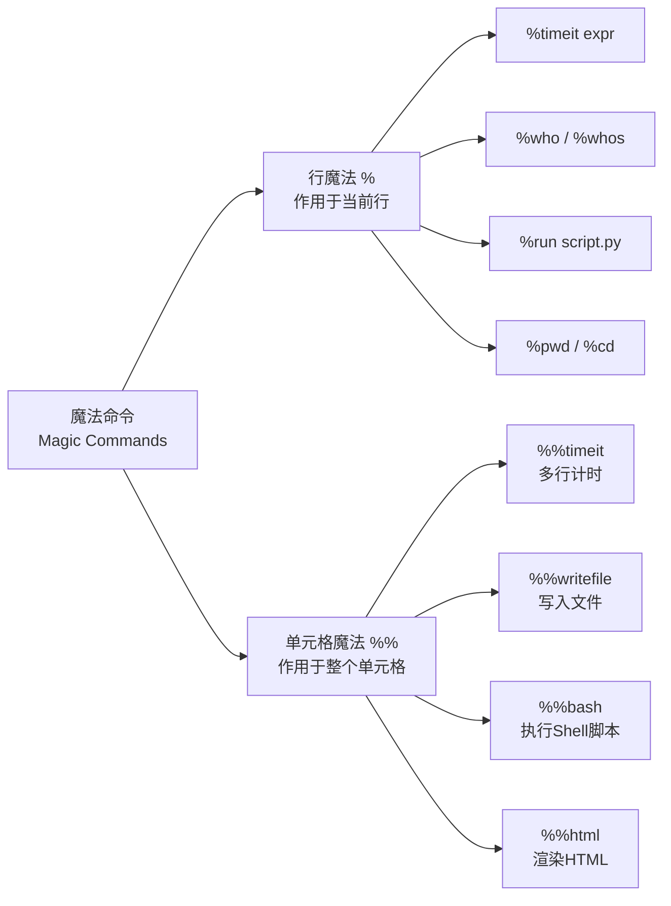

# 魔法命令与扩展

> **所属路径**：`01_基础能力/01_开发环境与技术英语/16_Jupyter Notebook与交互式开发/04_魔法命令与扩展`
> **预计学习时间**：35 分钟
> **难度等级**：⭐⭐

---

## 前置知识

- [单元格与执行顺序](../01_单元格与执行顺序/01_单元格与执行顺序.md)

> 如果以上内容还不熟悉，建议先完成对应课程再继续。

---

## 学习目标

完成本节后，你将能够：

1. 区分行魔法命令和单元格魔法命令的语法差异
2. 使用 `%timeit` 和 `%%timeit` 准确测量代码性能
3. 使用 `%%writefile` 和 `%run` 管理外部脚本
4. 使用 `!command` 在 Notebook 中执行 Shell 命令
5. 使用 `%pip` 在 Notebook 中安装和管理包

---

## 正文讲解

### 1. 什么是魔法命令

在前面的课程中，我们已经遇到过 `%matplotlib inline` 这个神奇的指令——它不是标准的 Python 代码，却能改变 Notebook 的行为。这类以 `%` 或 `%%` 开头的特殊指令，就是 Jupyter 的 **魔法命令（Magic Command）** 。

魔法命令是 **IPython**（Jupyter 默认的 Python 内核）提供的扩展功能。它们让你可以在不离开 Notebook 的情况下完成很多"非 Python"的任务——比如计时、运行 Shell 命令、写文件、切换目录等。掌握魔法命令可以显著提升你在 Notebook 中的开发效率。

魔法命令分为两类：

- **行魔法（Line Magic）** ：以单个 `%` 开头，只作用于当前行
- **单元格魔法（Cell Magic）** ：以双 `%%` 开头，作用于整个单元格



> 📌 **图解说明**：魔法命令的两大家族——行魔法（`%` ）操作当前行，单元格魔法（`%%` ）操作整个单元格。

### 2. 性能测量：%timeit 与 %%timeit

在数据科学和 AI 开发中，性能优化是一个重要话题。你可能想知道两种不同的实现方式哪个更快。 `%timeit` 是最常用的性能测量工具——它会多次运行代码并给出统计结果，比手动用 `time.time()` 计时要准确得多。

**行魔法 `%timeit`** ——测量单行代码的执行时间：

```python
import numpy as np

# 比较列表推导和 NumPy 操作
data = list(range(10000))

%timeit [x ** 2 for x in data]
%timeit np.array(data) ** 2
```

**预期输出**：
```
1.94 ms ± 31.2 µs per loop (mean ± std. dev. of 7 runs, 1,000 loops each)
24.3 µs ± 414 ns per loop (mean ± std. dev. of 7 runs, 10,000 loops each)
```

从输出可以看到，NumPy 向量化操作比纯 Python 列表推导快了大约 80 倍！

**单元格魔法 `%%timeit`** ——测量整个单元格的执行时间：

```python
%%timeit
# 测量多行代码的总执行时间
result = []
for i in range(1000):
    result.append(i ** 2)
total = sum(result)
```

还有一个兄弟命令 `%time` （注意没有 `it` ），它只运行代码一次，适合测量较长时间的任务：

```python
%time sum(range(10_000_000))
```

**预期输出**：
```
CPU times: user 187 ms, sys: 3.91 ms, total: 191 ms
Wall time: 191 ms
```

| 命令 | 运行次数 | 适用场景 |
| ---- | -------- | -------- |
| `%timeit` | 多次（自动选择） | 快速操作的精确计时 |
| `%time` | 1 次 | 耗时较长的操作 |
| `%%timeit` | 多次 | 多行代码的精确计时 |
| `%%time` | 1 次 | 多行耗时代码 |

### 3. 变量检查：%who 和 %whos

当你在 Notebook 中探索性地编写代码时，内核中可能积累了很多变量，有时你会忘记某个变量是什么类型、什么值。 `%who` 和 `%whos` 可以帮你快速查看当前内核中的所有变量。

```python
# 先定义一些变量
name = "Jupyter"
count = 42
data = [1, 2, 3]
pi = 3.14159

# 查看所有变量名
%who
```

**预期输出**：
```
count	 data	 name	 pi
```

```python
# 查看变量的详细信息（类型和值）
%whos
```

**预期输出**：
```
Variable   Type     Data/Info
-----------------------------
count      int      42
data       list     n=3
name       str      Jupyter
pi         float    3.14159
```

你还可以按类型筛选：

```python
# 只查看字符串类型的变量
%who str
```

### 4. 文件操作：%%writefile 和 %run

有时候你在 Notebook 中写好了一段代码，希望把它保存为一个独立的 `.py` 文件。 `%%writefile` 可以直接将单元格内容写入文件：

```python
%%writefile hello.py
"""一个简单的示例脚本"""

def greet(name):
    return f"Hello, {name}! Welcome to Jupyter."

if __name__ == "__main__":
    message = greet("World")
    print(message)
```

**预期输出**：
```
Writing hello.py
```

这会在当前工作目录下创建一个 `hello.py` 文件。然后你可以用 `%run` 来执行它：

```python
%run hello.py
```

**预期输出**：
```
Hello, World! Welcome to Jupyter.
```

`%run` 执行脚本后，脚本中定义的变量和函数也会被加载到当前内核中——这意味着你可以直接使用脚本中定义的 `greet` 函数：

```python
# 脚本中定义的函数现在可以直接使用了
greet("Jupyter")
```

**预期输出**：
```
'Hello, Jupyter! Welcome to Jupyter.'
```

这种 `%%writefile` + `%run` 的工作流非常适合将 Notebook 中的探索性代码逐步整理为可复用的模块。

### 5. 目录与环境：%pwd、%cd 和 %env

这组命令让你在不离开 Notebook 的情况下管理文件系统和环境变量：

```python
# 查看当前工作目录
%pwd
```

```python
# 切换目录
%cd /path/to/project
```

```python
# 查看所有环境变量
%env
```

```python
# 设置环境变量
%env MY_API_KEY=abc123
```

### 6. Shell 命令：! 前缀

在任何代码单元格中，你可以用 `!` 前缀直接执行 **Shell 命令** ：

```python
# 查看当前目录下的文件
!ls -la
```

```python
# 查看系统信息
!uname -a
```

```python
# 查看 Python 包列表
!pip list | head -10
```

你甚至可以将 Shell 命令的输出赋值给 Python 变量：

```python
# 将 shell 命令的输出捕获到 Python 变量中
files = !ls *.py
print(f"找到 {len(files)} 个 Python 文件:")
for f in files:
    print(f"  - {f}")
```

还有一个更强大的 `%%bash` 单元格魔法，可以让你在一个单元格中编写完整的 Bash 脚本：

```python
%%bash
echo "=== 系统信息 ==="
echo "用户: $(whoami)"
echo "日期: $(date)"
echo "Python: $(python --version)"
echo "磁盘使用:"
df -h | head -3
```

### 7. 包管理：%pip 和 %conda

在 Notebook 中安装 Python 包是一个常见需求。虽然你可以用 `!pip install` ，但更推荐使用 **`%pip` 魔法命令** ——它能确保包安装到当前内核对应的 Python 环境中，而 `!pip` 有时可能安装到系统默认 Python 中。

```python
# 推荐方式：使用 %pip 魔法命令
%pip install seaborn

# 不推荐：使用 ! 前缀
# !pip install seaborn  # 可能安装到错误的环境
```

同样地，如果你使用 conda 环境：

```python
%conda install scipy
```

安装完成后通常需要重启内核才能使用新安装的包。

### 8. 加载扩展：%load_ext

Jupyter 支持通过扩展机制增加新功能。 `%load_ext` 命令用于加载已安装的 IPython 扩展。

**autoreload 扩展** ——自动重新加载被修改的模块：

```python
%load_ext autoreload
%autoreload 2
```

这个扩展在开发过程中极其有用。正常情况下，当你在 Notebook 中 `import` 了一个模块后，即使修改了模块的源码，Notebook 中使用的仍然是旧版本（因为 Python 会缓存已导入的模块）。开启 `autoreload 2` 后，每次执行单元格时都会自动检查模块是否被修改，如果修改了就自动重新加载。

### 9. 常用扩展概览

除了 IPython 内置的魔法命令，Jupyter 社区还开发了大量扩展来增强 Notebook 的功能。

**经典 Jupyter Notebook 扩展（nbextensions）** ：

```bash
# 安装 nbextensions 扩展集合
pip install jupyter_contrib_nbextensions
jupyter contrib nbextension install --user
```

常用扩展一览：

| 扩展 | 功能 | 推荐指数 |
| ---- | ---- | -------- |
| Table of Contents | 自动生成目录侧边栏 | ⭐⭐⭐⭐⭐ |
| Variable Inspector | 可视化查看所有变量 | ⭐⭐⭐⭐ |
| ExecuteTime | 显示每个单元格的执行时间 | ⭐⭐⭐⭐ |
| Autopep8 | 自动格式化代码（PEP 8） | ⭐⭐⭐ |
| Collapsible Headings | 按标题折叠单元格 | ⭐⭐⭐ |
| Notify | 长时间任务完成后发送通知 | ⭐⭐⭐ |

**JupyterLab 扩展** ：

JupyterLab 使用独立的扩展系统，许多常用功能已经内置（如目录、变量查看器），额外的扩展通过 `pip` 安装即可：

```bash
# JupyterLab 的 Git 扩展
pip install jupyterlab-git

# JupyterLab 的代码格式化扩展
pip install jupyterlab-code-formatter
```

> 💡 **建议**：对于初学者，最推荐的两个扩展是 Table of Contents（方便导航长 Notebook）和 autoreload（方便开发调试）。其他扩展根据实际需求逐步添加即可。

---

## 动手实践

下面通过一个完整的例子，综合运用本节学到的魔法命令：

```python
# 单元格 1：使用 %whos 查看初始状态
%whos
```

**预期输出**：
```
Interactive namespace is empty.
```

```python
# 单元格 2：使用 %%writefile 创建一个工具模块
%%writefile utils.py
"""简单的数据处理工具模块"""

import random

def generate_data(n, seed=42):
    """生成 n 个随机整数"""
    random.seed(seed)
    return [random.randint(1, 100) for _ in range(n)]

def statistics(data):
    """计算基本统计量"""
    n = len(data)
    mean = sum(data) / n
    variance = sum((x - mean) ** 2 for x in data) / n
    return {
        'count': n,
        'mean': round(mean, 2),
        'std': round(variance ** 0.5, 2),
        'min': min(data),
        'max': max(data)
    }
```

**预期输出**：
```
Writing utils.py
```

```python
# 单元格 3：加载 autoreload 并运行脚本
%load_ext autoreload
%autoreload 2

%run -n utils.py  # -n 表示不执行 __main__ 块

# 现在可以使用 utils.py 中的函数
data = generate_data(1000)
stats = statistics(data)
print("统计结果:")
for key, value in stats.items():
    print(f"  {key}: {value}")
```

**预期输出**：
```
统计结果:
  count: 1000
  mean: 50.73
  std: 28.77
  min: 1
  max: 100
```

```python
# 单元格 4：性能对比
import numpy as np

data_list = list(range(100000))
data_array = np.array(data_list)

print("=== 求和性能对比 ===")
print("Python sum():")
%timeit sum(data_list)

print("\nnp.sum():")
%timeit np.sum(data_array)

print("\n内置 sum() 对 NumPy 数组:")
%timeit sum(data_array)
```

```python
# 单元格 5：查看当前所有变量
%whos
```

```python
# 单元格 6：清理临时文件
!rm -f utils.py hello.py
!ls *.py 2>/dev/null || echo "已清理完毕，无 .py 文件残留"
```

**运行说明**：
- 环境要求：Python 3.10+，numpy>=1.24
- 按顺序运行所有单元格，体验魔法命令的工作流

---

## 典型误区

| 误区 | 正确理解 |
| ---- | -------- |
| "`%timeit` 和 `time.time()` 计时效果一样" | `%timeit` 会自动多次运行并取统计平均值，消除了单次运行的随机波动，结果更准确 |
| "`!pip install` 和 `%pip install` 完全一样" | `%pip` 确保安装到当前 Notebook 使用的 Python 环境中，`!pip` 可能安装到系统默认 Python |
| "魔法命令是标准 Python 语法" | 魔法命令是 IPython 的扩展，不能在普通 `.py` 脚本中使用。将 Notebook 导出为 `.py` 时，魔法命令会被转换为 `get_ipython()` 调用 |
| "`%run` 只是执行脚本，不影响当前环境" | `%run` 默认会将脚本中的变量和函数注入到当前内核的命名空间中。使用 `%run -i` 还可以让脚本访问当前 Notebook 中的变量 |

---

## 练习题

### 练习 1：性能测量实践（难度：⭐）

请使用 `%timeit` 比较以下两种创建列表的方式的性能差异：

1. 列表推导：`[i ** 2 for i in range(10000)]`
2. map 函数：`list(map(lambda i: i ** 2, range(10000)))`

哪种方式更快？快多少？

<details>
<summary>💡 提示</summary>

直接使用 `%timeit` 行魔法命令即可。注意观察输出中的时间单位（ms、µs）和循环次数。

</details>

<details>
<summary>✅ 参考答案</summary>

```python
%timeit [i ** 2 for i in range(10000)]
%timeit list(map(lambda i: i ** 2, range(10000)))
```

典型结果（具体数值因机器而异）：
```
1.5 ms ± 20 µs per loop (列表推导)
1.8 ms ± 25 µs per loop (map + lambda)
```

通常列表推导会稍快一些（快 10%~20%），因为列表推导是 Python 的内置优化语法，而 `map + lambda` 需要额外的函数调用开销。

不过如果使用已有的内置函数（而非 lambda），`map` 可能会更快：

```python
# 使用已有函数的 map 可能更快
import math
%timeit [math.sqrt(i) for i in range(10000)]
%timeit list(map(math.sqrt, range(10000)))
```

</details>

### 练习 2：%%writefile + %run 工作流（难度：⭐⭐）

请完成以下任务：

1. 使用 `%%writefile` 创建一个 `calculator.py` 文件，包含 `add` 、 `multiply` 和 `power` 三个函数
2. 使用 `%run` 加载这个文件
3. 在 Notebook 中调用这三个函数并验证结果
4. 使用 `!rm` 清理创建的文件

<details>
<summary>💡 提示</summary>

使用 `%run -n calculator.py` 可以只加载函数定义而不执行 `if __name__ == "__main__"` 块。

</details>

<details>
<summary>✅ 参考答案</summary>

```python
%%writefile calculator.py
"""简单计算器模块"""

def add(a, b):
    """加法"""
    return a + b

def multiply(a, b):
    """乘法"""
    return a * b

def power(base, exp):
    """幂运算"""
    return base ** exp

if __name__ == "__main__":
    print(f"2 + 3 = {add(2, 3)}")
    print(f"4 * 5 = {multiply(4, 5)}")
    print(f"2^10 = {power(2, 10)}")
```

```python
# 加载模块
%run -n calculator.py

# 验证函数
assert add(2, 3) == 5, "add 函数错误"
assert multiply(4, 5) == 20, "multiply 函数错误"
assert power(2, 10) == 1024, "power 函数错误"

print("所有测试通过！")
print(f"add(10, 20) = {add(10, 20)}")
print(f"multiply(7, 8) = {multiply(7, 8)}")
print(f"power(3, 4) = {power(3, 4)}")
```

```python
# 清理
!rm -f calculator.py
print("已清理 calculator.py")
```

</details>

### 练习 3：魔法命令分类（难度：⭐）

请判断以下每条命令是行魔法、单元格魔法还是 Shell 命令，并说明其作用：

1. `%who int`
2. `%%bash`
3. `!cat requirements.txt`
4. `%load_ext autoreload`
5. `%%writefile config.yaml`

<details>
<summary>💡 提示</summary>

看前缀：`%` 是行魔法，`%%` 是单元格魔法，`!` 是 Shell 命令。

</details>

<details>
<summary>✅ 参考答案</summary>

| 命令 | 类型 | 作用 |
| ---- | ---- | ---- |
| `%who int` | 行魔法 | 列出当前内核中所有 `int` 类型的变量名 |
| `%%bash` | 单元格魔法 | 将整个单元格内容作为 Bash 脚本执行 |
| `!cat requirements.txt` | Shell 命令 | 在系统 Shell 中执行 `cat` 命令，显示文件内容 |
| `%load_ext autoreload` | 行魔法 | 加载 `autoreload` IPython 扩展 |
| `%%writefile config.yaml` | 单元格魔法 | 将单元格内容写入 `config.yaml` 文件 |

</details>

---

## 下一步学习

- 📖 后续主题：[阅读英文文档与技术资料](../../17_阅读英文文档与技术资料/)
- 🔗 相关知识点：[实验记录与导出](../03_实验记录与导出/03_实验记录与导出.md)（将 Notebook 导出为其他格式）
- 🔗 相关知识点：[包管理](../../14_包管理/01_安装与卸载/01_安装与卸载.md)（深入了解 `pip` 包管理的原理）
- 📚 拓展阅读：[IPython 内置魔法命令列表](https://ipython.readthedocs.io/en/stable/interactive/magics.html) — 完整的魔法命令参考手册（BSD 许可开源项目）

---

## 参考资料

1. [IPython 魔法命令文档](https://ipython.readthedocs.io/en/stable/interactive/magics.html) — 所有内置魔法命令的完整参考（BSD 许可开源项目）
2. [jupyter_contrib_nbextensions](https://github.com/ipython-contrib/jupyter_contrib_nbextensions) — 经典 Notebook 扩展集合（BSD 许可开源项目）
3. [JupyterLab 扩展列表](https://jupyterlab-contrib.github.io/) — JupyterLab 社区扩展索引（开源项目集合）
4. [IPython 官方文档 - Shell 命令](https://ipython.readthedocs.io/en/stable/interactive/shell.html) — IPython 中执行 Shell 命令的详细说明（BSD 许可开源项目）
