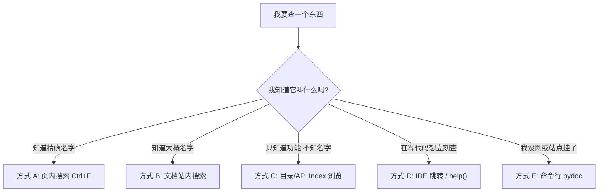

# 快速定位信息

> **所属路径**：`01_基础能力/01_开发环境与技术英语/17_阅读英文文档与技术资料/01_快速定位信息`
> **预计学习时间**：50 分钟
> **难度等级**：⭐⭐

---

## 前置知识

- [阅读文档 · 抓取文档结构](../../../../00_高中复习/02_英语基础/03_阅读文档/01_抓取文档结构/01_抓取文档结构.md)
- [搜索与资料检索 · 关键词设计](../../../../00_高中复习/03_信息素养/02_搜索与资料检索/01_关键词设计/01_关键词设计.md)

> 如果以上内容还不熟悉,建议先完成对应课程再继续。

---

## 学习目标

完成本节后,你将能够:

1. 在 30 秒内用文档内搜索与 URL 跳转定位任一 Python/AI 库的具体 API
2. 熟练使用 `Ctrl+F`、Sphinx 搜索、IDE 跳转、`help()` 与 `pydoc` 五种定位方式
3. 根据问题类型(查 API、查示例、查错误、查教程)选择合适的搜索路径
4. 识别并使用英文文档中的导航元素(侧边栏、面包屑、版本切换、交叉引用)
5. 在英文关键词不确定时,使用近义词与词根推理快速迂回

---

## 正文讲解

### 1. 为什么"定位"比"阅读"更重要

想象一下你在修一辆自行车,只需要拧一颗螺丝。如果你把整本《自行车维修大全》从头读到尾才开始动手,那你连晚饭都赶不上。技术文档恰恰就是这种"工具书",它不是给你"读完"的,而是给你"查阅"的。

一份成熟项目(例如 NumPy、PyTorch)的文档通常有数千个页面、数万个 API 条目。真正的专业能力不是"读得多",而是**知道从哪里下手**。本节要训练的就是一种"搜索反射":面对任何问题,不到 30 秒就能跳到答案附近的一页。这种能力在你日后查 [接口文档阅读](../02_接口文档阅读/02_接口文档阅读.md) 时会反复用到。

### 2. 五种定位方式及其适用场景

下面这张图概括了本节的全部核心内容——五种定位方式,以及它们分别最擅长解决什么问题:



> 📌 **图解说明**:不同场景对应不同工具。**先判断你对目标的"已知度"**,再选择最省力的路径。把这张图记下来,下次查文档之前先在脑中走一遍决策。

下面逐个展开。

### 3. 方式 A:页内搜索 Ctrl+F

这是最基础也最被低估的技巧。**Ctrl+F(Mac 上是 Cmd+F)** 是浏览器的**页内查找(In-Page Search)** 功能,可以在当前打开的文档页中高亮所有匹配文本。

使用它的关键在于**选对关键词**。英文文档对术语拼写要求严格,一字之差可能就搜不到。几个实用技巧:

- 函数参数名通常都是小写加下划线(例如 `random_state`),直接粘贴代码中看到的变量名搜索最准。
- 类名和异常通常首字母大写(例如 `ValueError`、`DataFrame`),别搜成 `dataframe`。
- 参数可接受的"值"也值得搜(例如想查 `random_state` 对应哪些取值,可以搜 `None, int, numpy.random.Generator`)。

### 4. 方式 B:文档站内搜索

几乎所有专业文档网站都内置全站搜索框,底层通常由 **Sphinx** 或 **MkDocs** 这类工具自动生成。它的搜索逻辑和 Google 略有不同:

- 它按 **token(词元)** 精确匹配,不做太复杂的近义词扩展。所以搜 `pd.read_csv` 不如搜 `read_csv` 命中率高——前面的模块前缀会干扰分词。
- 它优先返回 **API 参考条目**,然后才是教程和博文。这正是你 80% 的时候想要的。
- 搜索结果页通常会显示所在章节(Tutorial/Reference/How-to),快速扫一眼就能判断要不要点进去。

下面这张图展示一个典型的 Sphinx 搜索流程:


> 📌 **图解说明**:站内搜索完全在前端运行(纯 JS),不需要联网到搜索引擎,这就是它为什么比 Google 还快的原因。

### 5. 方式 C:目录浏览与 API Index

当你只知道"我要找某种分布的随机采样"却叫不出精确函数名时,直接搜索就不好使了。这时要用到文档的两类导航结构:

- **侧边栏目录(TOC,Table of Contents)**:按主题组织。你可以从 "Random sampling" 一级目录下找到 "Distributions" 子目录,再从中找到 `numpy.random.normal`。
- **API Index(按字母排序的全体 API 列表)**:很多大型项目会在 `genindex.html` 或 `py-modindex.html` 提供。它像一本字典,适合你只记得开头几个字母的情况。

一个常被忽略的捷径是 **URL 手写跳转**。Sphinx 生成的文档 URL 通常遵循 `<域名>/<版本>/reference/generated/<模块>.<函数>.html` 的固定模式。例如你想查 `numpy.mean`,直接在地址栏手写 `https://numpy.org/doc/stable/reference/generated/numpy.mean.html` 就能到达,比点三层导航快得多。

### 6. 方式 D:在 IDE 与交互环境中就地查

写代码写到一半时,最快的"查文档"是根本不离开编辑器:

- **VS Code/PyCharm**:把光标停在函数名上,按 `F12`(跳转到定义)或 `Ctrl+K Ctrl+I`(VS Code,查看签名)、`Ctrl+Q`(PyCharm,查看 docstring)。
- **Jupyter/IPython**:在函数名后加一个问号(`pd.read_csv?`)立即弹出 docstring;加两个问号(`pd.read_csv??`)连源码都能看到。
- **Python REPL**:`help(pd.read_csv)` 等价于把 docstring 打印出来。

这类就地查阅的信息来源都是 **docstring**——也就是函数里那段三引号字符串。官方文档网站的大部分 API 页面,本质上就是 docstring 的自动渲染。因此,看懂 docstring 和看懂官方文档是同一件事。

### 7. 方式 E:pydoc 命令行兜底

在没有网的情况下(飞机上、隔离网环境、服务器上),你还可以用 **pydoc** 命令行工具翻文档:

```bash
# 查看已安装模块的文档
python -m pydoc numpy.mean

# 启动本地 HTTP 文档服务器
python -m pydoc -p 8000
# 然后访问 http://localhost:8000 浏览所有已安装库的文档
```

这个内置工具把每个已安装包的 docstring 直接渲染成网页,连网速都不用消耗。

### 8. 英文关键词不确定时怎么办

你经常会遇到一个尴尬:中文说"我要随机打乱一个列表",但你不知道英文叫什么。几个解法:

- **近义词投网**:`shuffle`、`random order`、`permute`、`randomize` 轮流试一遍,总有一个命中。
- **词根推理**:"打乱"在英文里常用前缀 `re-`(重新)或 `shuffle`、`scramble` 系列词根。记住几个高频词根(见下面的语块表)后,你甚至能"猜"出函数名。
- **用例反查**:先在 Stack Overflow 搜中文问题,拿到别人用过的英文函数名,再回官方文档精读。

---

## 文档定位常用语块

| 语块 | 中文含义 | 使用场景 |
| ---- | -------- | -------- |
| Go to definition | 跳转到定义 | IDE 菜单、F12 |
| Table of contents | 目录 | 文档侧边栏 |
| Breadcrumbs | 面包屑导航 | 页面顶部显示层级路径 |
| API reference | API 参考 | 查精确接口定义 |
| See also | 另请参阅 | API 页底部相关链接 |
| Previous / Next | 上一页 / 下一页 | 文档底部翻页按钮 |
| Edit on GitHub | 在 GitHub 上编辑 | 文档右上角,通向源码 |
| Deprecated since version X | 自 X 版本起已废弃 | 查看是否还能用 |
| Changed in version X | 在 X 版本中有变更 | 查兼容性 |
| Cross reference | 交叉引用 | 术语之间的超链接 |

> 💡 **语块记忆法**:这些短语在任何 Sphinx 生成的文档中都会原样复用。记住它们整体,就能在任何新文档中一眼找到导航元素。

---

## 动手实践

这个练习模拟一个真实的查文档场景,请严格计时。

**任务**:在 30 秒内,在 NumPy 官方文档中找出 `numpy.random.default_rng` 的以下信息:

1. 它的**返回值类型**是什么?
2. 它从 NumPy 哪个版本开始引入?
3. 它的 `seed` 参数接受哪些类型?

**建议操作路径**:

```
1. 直接在浏览器地址栏输入或访问: https://numpy.org/doc/stable/
2. 右上角搜索框输入 "default_rng",回车
3. 点击第一个结果(应该是 numpy.random.default_rng)
4. 页面内用 Ctrl+F 搜 "Returns" 定位返回值
5. 页面内用 Ctrl+F 搜 "versionadded" 定位首次引入版本
6. 查看参数表中 seed 一行的 Type 列
```

**预期答案**:

- 返回值:`Generator`(一个 `numpy.random.Generator` 实例)
- 引入版本:1.17
- `seed` 可接受:`None`、`int`、array-like of ints、`SeedSequence`、`BitGenerator`、`Generator` 等

如果你完成整个任务用时超过 2 分钟,说明路径选择不够高效——请回到第 2-7 节复盘。

---

## 典型误区

| 误区 | 正确理解 |
| ---- | -------- |
| 必须先读 Tutorial 再查 API | Tutorial 适合初学,日常查问题应直接跳到 API Reference |
| 搜索关键词越长越精确 | 反而越难命中,优先搜短词元(如 `read_csv`) |
| 看不懂就换一篇文章 | 先用 Ctrl+F 在同页面找近义表述,通常能相互解释 |
| 每个版本的文档都一样 | 务必确认左下角"版本切换"选中的是你实际使用的版本 |

---

## 练习题

### 练习 1:路径最短化(难度:⭐)

你在写一段 pandas 代码,想查 `DataFrame.merge` 的 `how` 参数可取哪些值。描述**你能想到的最快路径**(不允许用 Google)。

<details>
<summary>💡 提示</summary>

考虑 IDE 就地查 vs. 官方网站 vs. REPL。你现在手边通常有哪个?

</details>

<details>
<summary>✅ 参考答案</summary>

最快路径(假设你已经在 IDE 里写代码):光标停在 `merge` 上 → `Ctrl+Q`(PyCharm)或鼠标悬停(VS Code)→ 弹出 docstring → Ctrl+F 搜 "how"。全过程不到 5 秒。

次快路径(Jupyter):`df.merge?` 一键弹出 docstring。

最慢但最全路径:访问 pandas 官方文档 → 搜 `DataFrame.merge` → 跳转到参数表。

</details>

### 练习 2:英文关键词不确定(难度:⭐⭐)

你想在 NumPy 中"把一个数组按某列排序",但不知道对应函数叫什么。请列出至少三种可能的英文关键词,并用文档搜索验证哪一个命中。

<details>
<summary>💡 提示</summary>

排序的英文词根可能是 sort、order、arrange、rank 等。

</details>

<details>
<summary>✅ 参考答案</summary>

可能关键词:`sort`、`argsort`、`sort_by`、`order`、`rank`、`lexsort`。

实际命中:NumPy 中相关函数是 `numpy.sort`(排序)和 `numpy.argsort`(返回排序索引)、`numpy.lexsort`(多键排序)。

用文档搜索验证:`sort` 命中最多且最相关,其次是 `lexsort`。`order` 在 NumPy 中多指"内存顺序(C order/F order)",不是你要的。这个例子说明**同一个中文词可能对应多个英文函数,要看具体场景**。

</details>

### 练习 3:定位历史版本(难度:⭐⭐)

你在读一段老代码,看到 `np.bool` 被使用,但在最新版 NumPy 中它被移除了。请找出:它是从哪个版本被标记为 deprecated 的?又是从哪个版本开始被完全移除的?

<details>
<summary>💡 提示</summary>

查 NumPy 的 **Release Notes / Changelog**,而不是 API 页面。

</details>

<details>
<summary>✅ 参考答案</summary>

路径:NumPy 官方文档 → Release Notes → 按 Ctrl+F 搜 `np.bool`。

答案:从 NumPy 1.20(2021 年)起 `np.bool` 被标记为 deprecated(发出 `DeprecationWarning`),从 NumPy 1.24(2022 年)起被**完全移除**,访问时会抛 `AttributeError`。

推荐替代:使用 Python 内置的 `bool` 或 NumPy 的 `np.bool_`(带下划线)。

</details>

---

## 记忆策略

### 核心策略:搜索反射训练

每次查文档,都在心里走一遍"**定位决策树**":

```
Q1. 我知道精确名字吗? → 是 → 直接 URL 跳转或搜索
Q2. 我在写代码吗?     → 是 → IDE 就地查(F12/Ctrl+Q/?)
Q3. 只知道功能?       → 是 → 侧边栏目录 / 近义词搜索
Q4. 查历史或兼容性?   → 是 → Release Notes
```

养成习惯后,你的查询时间将从平均 2-3 分钟降到 30 秒以内。

### 间隔复习建议

| 复习时间 | 建议方式 |
| -------- | -------- |
| 当天 | 把 5 种定位方式在一个真实项目文档中各用一遍 |
| 第 2 天 | 限时挑战:在 NumPy、Pandas、PyTorch 三个文档各完成 1 个"30 秒查询"任务 |
| 第 7 天 | 脱稿默写"定位决策树",并在自己的下一次查询中刻意使用 |
| 第 21 天 | 向同学演示一次"如何 10 秒查到某 API" |
| 第 60 天 | 此时搜索反射应已形成,无需刻意复习 |

---

## 下一步学习

- 📖 下一个知识点:[接口文档阅读](../02_接口文档阅读/02_接口文档阅读.md)
- 🔗 相关知识点:[调试 · 日志与异常](../../11_调试/02_日志与异常/02_日志与异常.md)(读懂报错里指向的文档链接)
- 📚 拓展阅读:[Sphinx 官方文档](https://www.sphinx-doc.org/)

---

## 参考资料

1. [Python Language Reference](https://docs.python.org/3/reference/) — Python 官方文档(官方文档,权威性最高)
2. [NumPy Documentation](https://numpy.org/doc/stable/) — NumPy 官方文档(BSD 许可开源项目)
3. [Sphinx: Python Documentation Generator](https://www.sphinx-doc.org/) — 主流文档生成器 Sphinx 官方站(BSD 许可)
4. [Write the Docs: Documentation Guide](https://www.writethedocs.org/guide/) — 文档写作社区指南(CC BY-SA 许可)
