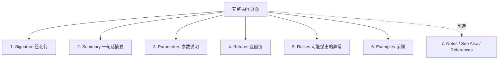
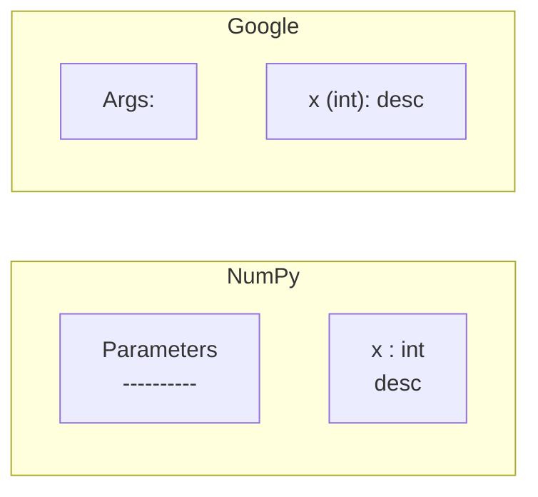

# 接口文档阅读

> **所属路径**：`01_基础能力/01_开发环境与技术英语/17_阅读英文文档与技术资料/02_接口文档阅读`
> **预计学习时间**：60 分钟
> **难度等级**：⭐⭐

---

## 前置知识

- [快速定位信息](../01_快速定位信息/01_快速定位信息.md)
- [函数与模块](../../01_编程语言基础/03_函数与模块/03_函数与模块.md)
- [类型提示与静态检查](../../01_编程语言基础/08_类型提示与静态检查/08_类型提示与静态检查.md)

> 如果以上内容还不熟悉，建议先完成对应课程再继续。

---

## 学习目标

完成本节后，你将能够：

1. 完整拆解一个 Python API 页面的六大区块（签名、摘要、参数、返回值、异常、示例）
2. 读懂函数签名中的类型注解、默认值、关键字参数、可变参数等记号
3. 理解 NumPy 风格与 Google 风格 docstring 的典型结构与差异
4. 判断一个参数是必选、可选、位置、关键字还是仅关键字
5. 从文档中识别"悄悄修改全局状态"和"可能抛出的异常"等隐藏陷阱

---

## 正文讲解

### 1. 为什么要专门学"接口文档阅读"

写 Python 代码时，最高频的动作是**调用别人写好的函数**——`pd.read_csv()`、`torch.nn.Linear()`、`requests.get()`……每一次调用背后，你都在"读合同":你给这个函数什么，它承诺返回什么。而这份"合同"就写在 API 文档里。

很多人以为看文档就是"知道这个函数是干什么的"，于是只读开头那两行摘要就去写代码，结果经常踩坑——比如某个参数默认值变了，或者某种输入会触发异常，或者函数会修改你传入的对象。**专业水平的差距，很大程度来自于能否精读一个 API 页面的每一个细节**。本节就来做这件事。

### 2. 一个典型 API 页面的六大区块

下面这张图展示绝大多数 Python 项目 API 页面的通用结构:



> 📌 **图解说明**:这六块几乎是 NumPy/SciPy/pandas/scikit-learn/PyTorch 共通的模板。看任何 API 页面,先扫一遍有没有这六块;缺哪块就意味着那一维度的信息可能藏在别处(例如 Raises 缺失时,异常往往要去源码里找)。

接下来逐块拆解,我们以 pandas 的 `pd.read_csv` 为贯穿例子。

### 3. 签名行:一行浓缩全部接口

签名是 API 页面第一行,通常显示为:

```python
pandas.read_csv(filepath_or_buffer, *, sep=',', header='infer',
                names=None, index_col=None, usecols=None,
                dtype=None, engine=None, ..., low_memory=True,
                storage_options=None)
```

这一行有五种你必须认识的记号:

| 记号 | 名字 | 含义 |
| ---- | ---- | ---- |
| `filepath_or_buffer` | **位置参数(Positional)** | 必选,可按顺序传 |
| `sep=','` | **带默认值的关键字参数** | 可省略,默认 `','` |
| `*` | **仅关键字参数分隔符(Keyword-only Separator)** | 它之后的参数**必须用 `key=value` 形式**传 |
| `*args` | **可变位置参数** | 接收任意多个位置参数,打包成元组 |
| `**kwargs` | **可变关键字参数** | 接收任意多个 `key=value`,打包成字典 |

> **直觉解读**:签名行像一张"函数的名片",浓缩了所有调用规则。**最重要的信息是 `*` 的位置**——在它之后的参数,哪怕你记得顺序,也必须写参数名。

### 4. 摘要与参数:最核心的两块

签名之下是一句话摘要(Summary),通常用第三人称现在时:"Read a comma-separated values (csv) file into DataFrame." 这句摘要回答"做什么"三个字,不讲怎么做。

紧接着是 **Parameters** 区块——整份文档中信息密度最高的部分。它通常以"参数名 : 类型"的格式列出,像这样:

```
filepath_or_buffer : str, path object or file-like object
    Any valid string path is acceptable. ...

sep : str, default ','
    Delimiter to use. If sep is None, the C engine cannot automatically
    detect the separator, but the Python parsing engine can. ...

dtype : Type name or dict of column -> type, optional
    Data type for data or columns. ...
```

读参数说明要抓三点:

1. **类型(Type)** :冒号后面的部分。`str`、`int`、`array-like`、`callable`、`dict`、`file-like object` 是最高频的描述。
2. **默认值(Default)**:"default 'X'"或"optional"。没有默认值的就是必选参数。
3. **接受的值域(Accepted values)**:有些参数只接受特定字符串,例如 `engine` 只能是 `'c'`、`'python'` 或 `'pyarrow'`。

一个专业习惯是:**把 Parameters 区块看成一张表**,而不是一段文字。遇到陌生参数,先看类型、再看默认值、最后看一句话说明——很多情况下这就足够你做出决定。

### 5. 返回值与异常:两块"契约承诺"

**Returns** 区块描述函数的"产出"。最常见的陷阱是:返回值的类型随输入而变。例如 `pd.read_csv` 的 Returns 写:

```
DataFrame or TextFileReader
    A comma-separated values (csv) file is returned as two-dimensional
    data structure with labeled axes.
```

"DataFrame or TextFileReader"暗示着:如果你传了 `chunksize` 参数,返回的就不是 DataFrame,而是一个可迭代的 TextFileReader 对象。不读这一行你可能会困惑很久为什么不能直接 `.head()`。

**Raises** 区块描述函数可能抛出的异常。许多函数会在此列出:

```
Raises
------
ValueError
    If some parameter is inconsistent.
ParserError
    If the CSV is malformed.
FileNotFoundError
    If the file does not exist.
```

这意味着**调用此函数时应该考虑的 try-except 范围**。你在 [异常处理](../../01_编程语言基础/05_异常处理/) 中学到的异常捕获,最终都要靠文档里的 Raises 来指导。

### 6. 示例区块:最快的上手方式

Examples 区块通常由多个代码片段组成,用 `>>>` 开头的是 **doctest 风格**,模拟 Python 交互式 shell:

```python
>>> pd.read_csv('data.csv')
   a  b
0  1  2
1  3  4
```

读示例的诀窍是:

- **从简单到复杂读**:第一个示例通常是最简调用,只用必选参数。
- **注意 "Setup" 代码**:如 `from io import StringIO` 等准备步骤往往藏在前几行,复制示例时别漏。
- **输出也是文档的一部分**:`>>>` 下面那行不是代码,是预期输出——它告诉你函数返回长什么样。

一个高级技巧:看示例时反推"**这个示例想演示哪个参数**"。API 文档的示例通常是刻意设计的,每段都聚焦一个特性。

### 7. NumPy 风格 vs. Google 风格

Python 社区主流的两种 docstring 风格:

**NumPy 风格**(NumPy、SciPy、pandas、scikit-learn 都用):

```python
def my_func(x, y=0):
    """Compute something.

    Parameters
    ----------
    x : int
        Description.
    y : int, optional
        Description. Default is 0.

    Returns
    -------
    int
        The result.
    """
```

**Google 风格**(Google 内部、TensorFlow、多数现代开源项目):

```python
def my_func(x, y=0):
    """Compute something.

    Args:
        x (int): Description.
        y (int, optional): Description. Default is 0.

    Returns:
        int: The result.
    """
```

两者**信息结构完全一致**,只是排版不同。识别出风格之后,你读任何一种都能秒定位到要找的信息。

下面这张对比图也许最直观:



> 📌 **图解说明**:NumPy 用"下划线分隔"的章节标题,Google 用"冒号结尾"的章节标题。信息维度相同。

### 8. 文档里的隐藏陷阱

即使文档写得很详细,专业工程师还会特别留意几种"隐藏信息":

- **是否原地修改(in-place)**:文档中 "Modifies X in place" 或参数里有 `inplace=False` 默认值——默认不改,但你传 `True` 会。
- **线程/进程安全性**:大型文档会在 Notes 中提及"not thread-safe"。
- **副作用**:有些函数会改全局配置(例如 `matplotlib.pyplot.rc`),文档里会以 "This function affects global state" 描述。
- **版本差异**:`versionadded::`、`versionchanged::`、`deprecated::` 是 Sphinx 的特殊指令,务必扫一眼。

---

## 高频语块

| 语块 | 中文含义 | 使用场景 |
| ---- | -------- | -------- |
| Parameters / Args | 参数 | docstring 章节标题 |
| Returns | 返回值 | docstring 章节标题 |
| Raises | 抛出的异常 | docstring 章节标题 |
| See also | 另请参阅 | 相关函数链接 |
| default is X | 默认值为 X | 参数说明 |
| optional | 可选参数 | 参数类型后的标注 |
| keyword-only | 仅关键字传入 | 签名中 `*` 后的参数 |
| array-like | 类数组对象 | 表示"可以被 NumPy 接受的东西" |
| path-like | 类路径对象 | 表示 `str` 或 `pathlib.Path` |
| file-like object | 类文件对象 | 带 `.read()` 方法的对象 |
| in place | 原地修改 | 会直接修改传入对象 |
| thread-safe | 线程安全 | 多线程下行为是否可靠 |

> 💡 **语块记忆法**:这些表达在 99% 的 Python API 文档中原样复用。记住整体,不必拆词。

## 词根词缀解码表

| 词根/词缀 | 含义 | 典型单词 |
| --------- | ---- | -------- |
| `-able`、`-ible` | 可...的 | callable(可调用的)、iterable(可迭代的) |
| `de-` | 撤销、解开 | deprecate(弃用)、decode(解码) |
| `en-` | 使...成为 | encode(编码)、encapsulate(封装) |
| `pre-` | 预先 | preprocess(预处理)、prefetch(预取) |
| `post-` | 之后 | postprocess(后处理) |
| `-ize` | 使...化 | normalize(归一化)、serialize(序列化) |

> 💡 **解码训练**:看到陌生单词先拆前缀/后缀。比如第一次见到 `iterable`——`iter`(迭代)+`-able`(可...的)=可迭代的。八成正确。

---

## 动手实践

> 以下任务要求打开真实文档,动手查验。

**任务**:完整拆解 `numpy.random.default_rng` 的 API 页面。

请打开 <https://numpy.org/doc/stable/reference/random/generator.html#numpy.random.default_rng>,回答下列问题:

1. 该函数有几个参数?哪些是位置参数、哪些是关键字参数?
2. `seed` 的类型标注是什么?接受哪些具体类型?
3. 返回值是什么类型?
4. 文档中有没有 Raises 区块?如果没有,说明了什么?
5. 示例中第一段代码演示的是什么特性?

**预期答案**:

1. 只有一个参数 `seed`,它是位置参数但也支持关键字传入。
2. 类型为 `{None, int, array_like[ints], SeedSequence, BitGenerator, Generator}, optional`,即五种之一或 None。
3. 返回 `Generator`(`numpy.random.Generator` 实例)。
4. 没有显式 Raises 区块——意味着**正常调用不会抛异常**,无效输入也会被转成 `SeedSequence`。
5. 第一段示例演示**同一个 seed 生成可复现结果**。

做完后,把该页的"签名 → 一句话摘要 → 参数类型 → 返回值 → 示例"五块在心里默背一遍。

---

## 典型误区

| 误区 | 正确理解 |
| ---- | -------- |
| 参数顺序可以随便 | `*` 之后的参数必须按关键字传 |
| 不看 Returns 也能写 | 返回类型随输入变化的函数会坑你很久 |
| Raises 越短越好 | 反过来,Raises 完整意味着函数边界清晰 |
| 示例照抄就能用 | 示例通常省略 import 和前置变量,要补上 |
| 看懂签名 = 会用 | 签名只说形式,用法要靠 Parameters + Examples 结合 |

---

## 练习题

### 练习 1:签名解剖(难度:⭐)

下面是某函数签名:

```python
def train(model, dataset, *, epochs=10, lr=1e-3, device='cpu', **kwargs):
    ...
```

回答:

1. 必选参数有几个?
2. `epochs` 是否可以用位置参数传?
3. `**kwargs` 会接收什么?

<details>
<summary>✅ 参考答案</summary>

1. 2 个(`model`、`dataset`),其余都有默认值。
2. 不能。`*` 之后的参数都是 keyword-only,必须写成 `epochs=20`。
3. 接收调用者传入的任意额外关键字参数,存到一个字典里。常用于向下游函数透传配置。

</details>

### 练习 2:类型标注解读(难度:⭐⭐)

scikit-learn 文档中某参数标注为 `random_state : int, RandomState instance or None, default=None`。请用中文描述:

1. 这个参数可以接受哪几种类型?
2. 默认值是什么?
3. 如果你希望结果可复现,你会传什么?

<details>
<summary>✅ 参考答案</summary>

1. 三种:整数、`RandomState` 实例、`None`。
2. `None`(每次结果不同)。
3. 传一个固定的整数(例如 `random_state=42`),这样多次运行得到完全相同的结果。

</details>

### 练习 3:隐藏陷阱识别(难度:⭐⭐⭐)

pandas 的 `DataFrame.drop(labels, axis=0, index=None, columns=None, level=None, inplace=False, errors='raise')` 里,哪些细节暗示了易踩的坑?至少列出三点。

<details>
<summary>💡 提示</summary>

注意 `inplace`、`axis`、`errors` 三个参数。

</details>

<details>
<summary>✅ 参考答案</summary>

1. `inplace=False`:默认返回新 DataFrame,不改原 DataFrame。初学者常忘记赋值回去,以为 drop 了却没效果。
2. `axis=0`:默认按行删除。想删列时必须显式写 `axis=1` 或用 `columns=...`。
3. `errors='raise'`:默认标签不存在会报错。批处理时可以设 `errors='ignore'` 容错。

</details>

---

## 记忆策略

### 核心策略:六区块默写法

每次看到一个新 API 页面,强制自己在心中填六个槽:签名 / 摘要 / 参数 / 返回 / 异常 / 示例。只要六块都看完才算"读过文档"。这个习惯养成后,你读 API 的速度会下降 50%,但踩坑率会下降 90%。

### 间隔复习建议

| 复习时间 | 建议方式 |
| -------- | -------- |
| 当天 | 选 3 个常用函数(`np.arange`、`pd.merge`、`torch.optim.Adam`)各拆解一次 |
| 第 2 天 | 比较 NumPy 风格和 Google 风格的实际例子各一段 |
| 第 7 天 | 给自己写的函数添加 NumPy 风格 docstring,用 Sphinx 编译看效果 |
| 第 21 天 | 阅读 3 份陌生库的 API,无障碍完成六区块拆解 |
| 第 60 天 | 成为同伴中"最会查文档"的那个人 |

---

## 下一步学习

- 📖 下一个知识点:[技术文章摘要](../03_技术文章摘要/03_技术文章摘要.md)
- 🔗 相关知识点:[类型提示与静态检查](../../01_编程语言基础/08_类型提示与静态检查/08_类型提示与静态检查.md)(类型标注的语法)
- 📚 拓展阅读:[NumPy docstring 规范](https://numpydoc.readthedocs.io/en/latest/format.html)、[Google Python Style Guide](https://google.github.io/styleguide/pyguide.html#38-comments-and-docstrings)

---

## 参考资料

1. [NumPy docstring 规范](https://numpydoc.readthedocs.io/en/latest/format.html) — NumPy 风格官方说明(BSD 许可开源)
2. [Google Python Style Guide](https://google.github.io/styleguide/pyguide.html) — Google 风格官方说明(Apache 2.0 许可)
3. [PEP 257 – Docstring Conventions](https://peps.python.org/pep-0257/) — Python 官方 docstring 约定(Python 官方标准)
4. [pandas API Reference](https://pandas.pydata.org/docs/reference/index.html) — pandas 官方文档(BSD 许可)
