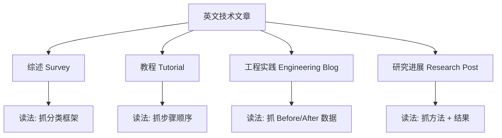
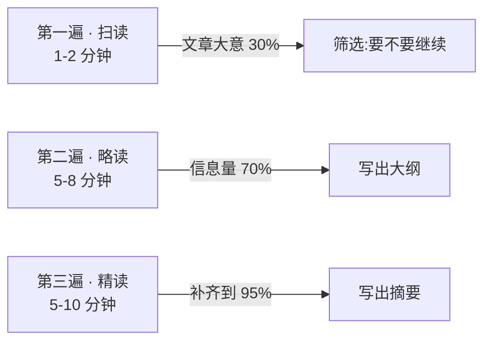

# 技术文章摘要

> **所属路径**：`01_基础能力/01_开发环境与技术英语/17_阅读英文文档与技术资料/03_技术文章摘要`
> **预计学习时间**：55 分钟
> **难度等级**：⭐⭐⭐

---

## 前置知识

- [接口文档阅读](../02_接口文档阅读/02_接口文档阅读.md)
- [技术文章摘要（00 阶段）](../../../../00_高中复习/03_信息素养/02_搜索与资料检索/)
- [总结与记笔记 · 章节摘要](../../../../00_高中复习/02_英语基础/04_总结与记笔记/02_章节摘要/02_章节摘要.md)

> 如果以上内容还不熟悉，建议先完成对应课程再继续。

---

## 学习目标

完成本节后，你将能够：

1. 用"三遍法"（扫读 → 略读 → 精读）在 10–15 分钟内读懂一篇中等长度英文技术博文
2. 识别技术文章的典型叙事骨架（Problem → Approach → Result → Insight）
3. 用"三句话摘要"模板把一篇博文压缩成可以分享给同事的微总结
4. 判断文章类型（综述、教程、工程实践、研究进展）并采用不同阅读策略
5. 用批判性思维分辨"营销文"和"干货文"

---

## 正文讲解

### 1. 为什么要专门学"摘要"

你可能已经习惯了这样的场景:刷到一篇英文技术博文,点开,读了两段,发现自己"好像懂了又好像没懂"。关上网页后,如果让你一句话讲讲这篇写了什么,你大概只能说"讲了 xxx 新技术",——具体说了啥,反而讲不出来。

这是一种**输入型阅读的幻觉**:眼睛过了一遍不等于脑子过了一遍。专业工程师读英文技术博文,不是为了"读过",而是为了"**能复述给别人,能在需要时用上**"。要做到这一点,输入必须伴随输出——写摘要就是最有效的输出形式。本节教你一套可以反复使用的摘要方法。

### 2. 技术文章的四种典型类型

并不是所有文章都用同一种方法读。先判断类型,再选择策略:



> 📌 **图解说明**:四类文章的读法完全不同。综述重在"看全景",教程重在"按步骤",工程实践看"问题 → 解法 → 收益"三段式,研究进展聚焦"贡献点"。

怎么快速判断类型?标题与首段给出最强信号:

- 含 "A survey of / An overview of" → 综述
- 含 "How to / Tutorial / Getting started" → 教程
- 含 "How we scaled / Lessons learned / At <公司名>" → 工程实践
- 含 "We present / We propose / Introducing <模型名>" → 研究进展

### 3. 三遍法:扫读 → 略读 → 精读

现在进入本节核心方法。对任何一篇中等长度(1000–3000 词)的英文技术博文,都按三遍来读:

**第一遍 · 扫读(Scan),目标 1–2 分钟**:

只看**标题、首段、各级小标题、图表标题、最后一段**。目标是回答一个问题:"这篇文章和我有关吗?"如果不相关,立即关掉——这是最有价值的一步。

**第二遍 · 略读(Skim),目标 5–8 分钟**:

逐段读每段的**第一句话**(topic sentence,主题句),必要时再看最后一句。英文技术写作非常遵循"段首陈述观点,段中展开论证,段尾总结"的结构,所以主题句集中了 70% 的信息。在这一遍,你应该已经能复述文章的**大纲**。

**第三遍 · 精读(Read Deeply),目标 5–10 分钟**:

仅挑选第二遍标记过的关键段落精读。精读时带着问题:"作者的证据是什么?我是否被说服?哪些细节对我的工作有用?"

下面这张图总结了三遍的信息获取量:



> 📌 **图解说明**:不是所有文章都值得进入第三遍。二八定律在这里体现得非常明显——绝大多数文章在第一遍就会被筛掉。

### 4. 文章叙事骨架:PARI 四段式

大多数高质量英文技术博文遵循 **PARI 骨架**:

| 缩写 | 全称 | 中文含义 | 在文章中的信号词 |
| ---- | ---- | -------- | ---------------- |
| **P** | Problem | 问题是什么,为什么重要 | "However", "The challenge is", "Unfortunately" |
| **A** | Approach | 我们的方法是什么 | "In this post", "We propose", "Our approach" |
| **R** | Result | 实验结果或上线效果 | "We observed", "Experiments show", "X% improvement" |
| **I** | Insight | 我们学到了什么,给读者的启示 | "Takeaways", "Lessons learned", "In summary" |

读文章时心里默写这四个格子,每读到信号词就往对应格里填一句话。读完后你会发现:这四句话就是这篇文章的浓缩。

### 5. 三句话摘要模板

把 PARI 再压缩一步,就得到一个可以在聊天群里分享给同事的**三句话摘要**:

```
【一句话背景】:__________(问题 + 场景,30 字内)
【一句话做法】:__________(关键方法或技术,30 字内)
【一句话结果/启示】:__________(核心数字 or 核心观点,30 字内)
```

例子——假设你读了 OpenAI 关于 GPT-4 的技术博文:

- 背景:大模型通用能力虽强,但多模态和复杂推理仍有瓶颈。
- 做法:GPT-4 引入视觉输入与更强的 RLHF 对齐流程。
- 结果:在专业考试(如律师资格)上超过人类平均水平,多模态基准大幅提升。

短短三句话,朋友问你"最近大模型有啥新的"时,足够撑起一段对话。

### 6. 批判性阅读:区分干货与营销

不是所有看起来"专业"的文章都值得读。几个快速判别干货的信号:

**干货文通常具备**:

- 具体数字(10% 提升,P99 从 500ms 降到 80ms)
- 失败案例坦陈("第一版方案上线后崩溃了")
- 源码/图表/日志(可验证性)
- 具名作者 + 发布日期 + 机构背景

**营销文常见特征**:

- 夸大形容词多("revolutionary", "game-changing")
- 无具体实验数据
- 结论早于论证("Our X beats all baselines")
- 文末强推课程/产品

读英文内容时的一个实用习惯是:**先滚到文末**。看看作者是谁、有没有署名、有没有 bio,很多时候这一眼就能帮你省下 20 分钟。

### 7. 把摘要变成"可复用知识"

摘要写完后,别让它烂在本地 Markdown 里。按下面三层存储:

- **短期记忆** :在你的笔记应用中开一个"本周读过"列表,带文章链接 + 三句话摘要。
- **中期记忆** :把真正高价值的文章总结归类到知识主题文件夹(例如"RAG 相关""分布式训练相关")。
- **长期记忆** :对反复引用的文章做**引用卡片**——作者、年份、核心贡献、我的一句话评价,格式固定。

这与 [总结与记笔记 · 双语术语卡片](../../../../00_高中复习/02_英语基础/04_总结与记笔记/01_双语术语卡片/01_双语术语卡片.md) 中学到的卡片管理法一脉相承。

---

## 高频语块

| 语块 | 中文含义 | 使用场景 |
| ---- | -------- | -------- |
| TL;DR | 太长不看,一句话总结 | 文章开头的摘要段落 |
| In this post | 本文将... | 引出主题 |
| We propose / We introduce | 我们提出 / 我们引入 | 介绍新方法 |
| State of the art (SOTA) | 当前最优 | 性能对比 |
| Under the hood | 底层原理 | 深入技术细节前的提示 |
| At a glance | 一瞥之下 / 概览 | 文章前部的快速总览 |
| Takeaway | 要点 / 启示 | 总结段落 |
| Stay tuned | 敬请期待 | 文末预告后续文章 |
| Behind the scenes | 幕后 / 内部细节 | 讲述实现过程 |
| Out of the box | 开箱即用 | 描述工具无需配置 |

> 💡 **语块记忆法**:这些表达在技术博文中反复出现,背熟它们后你的阅读速度至少提升 30%。

---

## 动手实践

### 任务:对一篇真实博文做三遍法 + 三句话摘要

**阅读材料**(任选一篇当前可访问的):

- 任意一篇 OpenAI / Anthropic / DeepMind / Meta AI 官方博客的研究公告
- 任意一篇 Google Research Blog 的方法介绍
- 任意一篇 Hugging Face 博客的教程型文章

**操作流程**:

```
Step 1 · 扫读(计时 2 分钟)
  - 记录: 标题 / 作者 / 日期 / 类型(综述/教程/工程/研究)
  - 判断: 是否继续读下去?

Step 2 · 略读(计时 8 分钟)
  - 列出: 每个一级小标题一句话大意
  - 填充 PARI: Problem / Approach / Result / Insight 各一句

Step 3 · 精读(计时 8 分钟)
  - 精读: 只读 PARI 中最不确定的一项对应的原文段落
  - 提炼: 三句话摘要

Step 4 · 输出(计时 2 分钟)
  - 用微信/Slack 风格把三句话摘要发给"假想同事"
```

完成后,请对照以下自检表:

- 三句话摘要是否都在 30 字以内?
- 是否包含至少一个具体数字?
- 能否在不看原文的情况下讲给另一个人听,并回答其 1-2 个追问?

如果三项都能做到,你已经完成了一次高质量输入。

---

## 典型误区

| 误区 | 正确理解 |
| ---- | -------- |
| 读完才能摘要 | 正确做法是**读的过程中就在写摘要** |
| 摘要越长越完整 | 压缩感本身就是理解深度的体现,三句话是硬指标 |
| 翻译就是摘要 | 翻译是逐句转换,摘要是压缩重构,两者不同 |
| 好文章必须精读 | 没有时间全部精读,筛选比精读更重要 |
| 英文原文总比中文翻译好 | 不一定,很多翻译版保留了关键图表且节省时间 |

---

## 练习题

### 练习 1:判断文章类型(难度:⭐)

下列四个标题分别属于哪种类型?

1. "A Survey of Efficient Transformers"
2. "How We Reduced Our Training Cost by 60%"
3. "Getting Started with PyTorch Lightning"
4. "Introducing Claude 3: A New Family of Models"

<details>
<summary>✅ 参考答案</summary>

1. 综述(Survey)→ 读法:抓分类框架、对比维度
2. 工程实践(Engineering Blog)→ 读法:看 Before/After、看使用的具体技术
3. 教程(Tutorial)→ 读法:按步骤跟着动手
4. 研究进展(Research Post)→ 读法:抓"与上一代的关键差异"、benchmark 数字

</details>

### 练习 2:PARI 填空(难度:⭐⭐)

下面这段摘自某博文,请把它拆进 PARI 四格:

> *"Fine-tuning large language models is expensive in memory. In this post, we introduce LoRA, a method that freezes the base model and trains only low-rank updates. On GPT-3 175B, LoRA reduces trainable parameters by 10,000x and GPU memory by 3x, while matching full fine-tuning quality. The lesson: most of the adaptation signal lives in a low-dimensional subspace."*

<details>
<summary>✅ 参考答案</summary>

- **P** Problem: 全参数微调大模型显存开销巨大
- **A** Approach: LoRA 冻结原模型,只训练注入的低秩矩阵
- **R** Result: 可训练参数缩小 10000 倍,显存缩小 3 倍,效果不降
- **I** Insight: 模型适配所需的信号其实位于低维子空间

</details>

### 练习 3:三句话摘要(难度:⭐⭐⭐)

自选一篇 Hugging Face 博客文章,完整走一遍三遍法,然后写出三句话摘要(每句不超过 30 字),并附上自己的一句话评价(是否值得同事读)。

<details>
<summary>💡 提示</summary>

- 自评时问自己:同事在 3 秒内就能判断要不要点链接吗?

</details>

<details>
<summary>✅ 参考答案</summary>

参考格式:

> 【背景】RAG 场景下,重排模型显著影响最终召回质量。
> 【做法】HF 新开源 cross-encoder 模型 bge-reranker-v2,支持多语言。
> 【结果】中文基准超越商业 API,推理成本降 40%。
> 【评价】推荐给正在做中文 RAG 项目的同事,优先替换现有 reranker。

关键是:是否压缩到位、是否有数字、是否给出了明确行动建议。

</details>

---

## 记忆策略

### 核心策略:每周"三句话挑战"

承诺每周读 5 篇英文技术博文,每篇写三句话摘要。坚持一个月后,你会发现:

- 阅读速度提升约 50%
- 能在每周例会上自然分享"最近看到什么好文章"
- 在同事中逐渐成为"信息节点"

### 间隔复习建议

| 复习时间 | 建议方式 |
| -------- | -------- |
| 当天 | 对本节动手实践写的摘要复盘,改写一遍 |
| 第 2 天 | 换一种类型的文章(例如上次读综述,这次读工程实践) |
| 第 7 天 | 挑战读一篇 3000+ 词的长文,严格计时三遍法 |
| 第 21 天 | 建立个人阅读列表,回顾本月的摘要,找出 top 3 有价值文章 |
| 第 60 天 | 摘要写作成为肌肉记忆,在没有模板提示下自然使用 |

---

## 下一步学习

- 📖 下一个知识点:[论文阅读基础](../04_论文阅读基础/04_论文阅读基础.md)
- 🔗 相关知识点:[技术写作与知识输出(04 阶段)](../../../../04_持续研究/01_研究与持续学习/12_技术写作与知识输出/)
- 📚 拓展阅读:[The Art of Reading Technical Blogs](https://martinfowler.com/bliki/) — Martin Fowler 的技术博客(公开博客,授权转载)

---

## 参考资料

1. [Diátaxis Documentation Framework](https://diataxis.fr/) — 技术文档四类型分类(CC BY-SA 许可)
2. [Hugging Face Blog](https://huggingface.co/blog) — 高质量技术博文来源(公开博客)
3. [Google Research Blog](https://blog.research.google/) — 研究进展公开博客
4. [OpenAI Blog](https://openai.com/blog) — 研究进展公开博客
